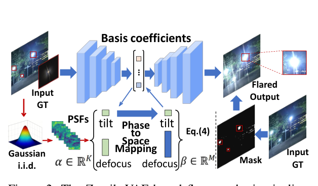
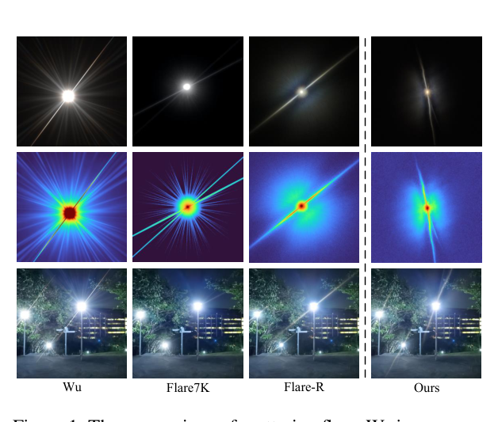
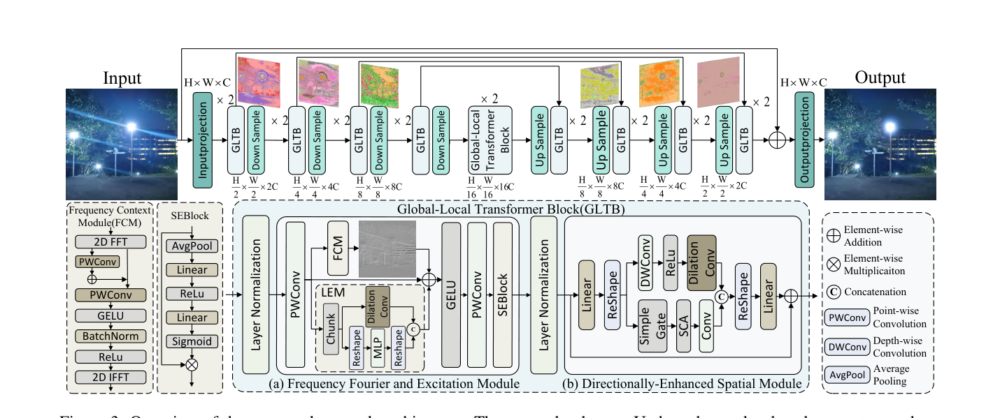
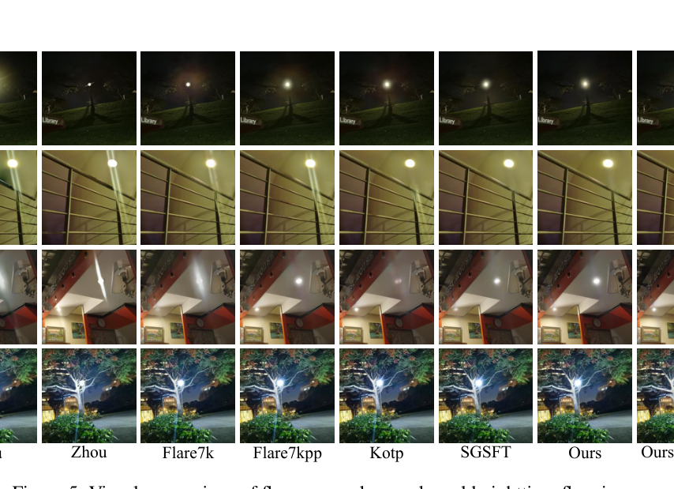

# SLCFormer: Spectral-Local Context Transformer with Physics-Grounded Flare Synthesis for Nighttime Flare Removal

> **发表**：AAAI 2026　|　**作者**：Xiyu Zhu et al.（武汉科技大学）
> **论文**：https://arxiv.org/abs/2512.15221　|　**代码**：未开源

## 一、解决的问题

夜间镜头眩光（lens flare）由强光源（路灯、车灯等）在镜头内部多次散射/反射产生，表现为雾状条纹（streak）、光晕（halo）与炫光（glare），不仅破坏视觉质量，还会拖累目标检测、自动驾驶、深度估计等下游任务。自 Wu et al. (ICCV 2021) 提出半合成数据集、Flare7K/Flare7K++ 进一步丰富散射与反射眩光类别以来，主流路线是"合成数据 + 端到端修复网络"。

本文针对两个具体痛点：（1）**数据侧**——Flare7K 等数据集的散射眩光基于单一、中心对称的标量 PSF（点扩散函数）简单叠加合成，过于"锐利干净"，缺乏真实镜头像差、衍射和微尺度散射带来的空间非均匀畸变，尤其无法刻画两光源之间相互作用产生的局部辉光模糊，导致模型在真实复杂光照场景中泛化不佳；（2）**模型侧**——现有方法多把眩光去除当作普通图像修复，不显式区分眩光与场景内容；基于全局自注意力的 Transformer 计算开销大（O(N²)），多分支架构又带来训练不稳定。作者希望用更高效的频域全局建模替代昂贵的自注意力，同时强化局部方向性结构的恢复。

## 二、核心创新点

1. **ZernikeVAE 物理眩光合成管线**：用 Zernike 多项式（tilt、defocus、像散、彗差等像差模式）参数化逐像素相位函数，构建**空间可变 PSF**，并经 Phase-to-Space 分解 + VAE 编解码器（重参数化采样潜码）生成随机光学畸变，合成非中心对称、强度与方向均不均匀的散射眩光。作者声称这是首个刻画"无中心对称性"非均匀眩光的合成方法。
2. **FFEM（Frequency Fourier and Excitation Module）**：以 FFT（O(N log N)）替代多头自注意力（O(N²)）做全局上下文建模，内部含频域上下文模块 FCM、局部增强模块 LEM 与 SE 通道注意力三个子件，频域-空域双分支拆分处理后融合。
3. **DESM（Directionally-Enhanced Spatial Module）**：改造 FFN，注入深度卷积 + 膨胀卷积的方向性分支与 SimpleGate + 通道注意力（SCA）的门控分支，弥补传统 FFN 缺乏空间结构与方向感知的问题——针对眩光的条纹具有强方向性这一特点。
4. **高频损失 L_hf**：Laplacian 与 Sobel 梯度各占一半的高频监督项，强化细小眩光条纹（shimmer）的去除与细节锐度。

## 三、模型结构与方案

**数据合成**。整体遵循 Flare7K++ 的"背景 + 眩光"加性合成范式（背景取自 Flickr-24K），但散射眩光改由 ZernikeVAE 管线生成：将干净图像经一组空间可变 PSF {h_x(u)} 局部卷积退化（式 3-4），相位函数 φ_x(ρ)=Σ a_i Z_i(ρ) 由 Zernike 基线性组合；再用 Phase-to-Space 映射把 PSF 分解到空间基函数上（h_x(u)=Σ β_i φ_i(u)），获得逐像素系数；最后编码器把 Zernike 系数与核尺寸图编码为潜分布 (μ, log σ²)，采样潜码后由解码器重建出最终眩光图。训练时再叠加逆 gamma、RGB 缩放、旋转/平移/剪切/缩放、颜色抖动、高斯模糊等增广。

> 图 2：ZernikeVAE 眩光合成管线——以 Zernike 多项式与傅里叶光学建模多维空间可变 PSF（来源：原论文）

> 图 1：与 Wu / Flare7K / Flare-R 的散射眩光强度分布热图对比，本文合成的眩光呈空间非均匀分布（来源：原论文）

**网络结构**。SLCFormer 是 4 级 U 形编解码器，每级由 Global-Local Transformer Block（GLTB）堆叠，GLTB = FFEM + DESM（各带 LayerNorm 与残差）。下/上采样用 pixel unshuffle/shuffle，编解码间长程跳连，输出端与输入做残差后过 sigmoid。

- **FFEM**：点卷积后按通道一分为二，F_local 走 LEM（再分两半：一半 token-wise MLP，一半膨胀卷积），F_global 走 FCM（2D FFT → 实虚部拼接 → 两个 1×1 卷积 + 残差 + GELU/ReLU/BN → IFFT），拼接融合后过 SE Block 通道重标定。
- **DESM**：线性升维 reshape 成 2D 后分两支：方向支用 DWConv + 膨胀卷积编码方向特征；门控支 SimpleGate（X₁⊙X₂）后接 SCA（AvgPool+Conv 生成注意力权重再缩放），两支拼接线性投影输出。

> 图 3：SLCFormer 整体 U 形结构及 FFEM（a）、DESM（b）模块细节（来源：原论文）

**损失函数**：L = 0.5·L1 + 0.5·L_vgg + 1.0·L_rec + 1.0·L_hf，其中 L_rec 沿用 Flare7K++ 的重建损失，L_hf 为 Laplacian/Sobel 高频损失。

**训练设置**：基于 Flare7K++（5000 张 Flare7K 散射眩光 + 964 张 Flare-R），512×512 裁剪，batch size 2，Adam（β1=0.9, β2=0.99），初始学习率 1e-4，200K 迭代后减半，共 400K 迭代，单卡 RTX 3090。

## 四、实验与结果

**基准与指标**：Flare7K++ 真实/合成测试集；PSNR、SSIM、LPIPS 及 Flare7K++ 提出的 G-PSNR（炫光区域）、S-PSNR（条纹区域）。

**主结果（真实测试集）**：SLCFormer 取得 PSNR 28.092 / SSIM 0.905 / LPIPS 0.0400 / G-PSNR 24.497 / S-PSNR 23.287，对比 Flare7K++ baseline（27.633/0.894/0.0428）与最强对比方法 SGSFT（28.077/0.904/0.0416）。注意：S-PSNR 上 SGSFT（23.305）反超本文（23.287）。**合成测试集**：PSNR 29.798 / SSIM 0.968 / LPIPS 0.0195 居首，但 G-PSNR（24.792）低于 Flare-Free 的 24.879，S-PSNR（24.578）低于 SGSFT 的 24.914。

**消融**（真实测试集）：去掉 FFEM 降至 27.888 dB，去掉 DESM 降至 27.804 dB，两者均去（即 Flare7K++ baseline Uformer）为 27.633 dB；高频损失带来 +0.27 dB（27.824→28.092）。定性消融显示完整模型才能既去除 shimmer 又完整保留光源区域。

> 图 5：真实夜景眩光去除的视觉对比，"Ours+VAE" 为使用 ZernikeVAE 增广数据训练的版本（来源：原论文）

## 五、专家锐评

**价值**：本文最有辨识度的贡献是把大气湍流仿真社区的 Zernike 相位分解 + Phase-to-Space 变换思想搬到眩光合成上，让散射眩光具有空间可变 PSF——这确实戳中了 Flare7K 系合成数据"过于对称、过于干净"的真实短板，方向值得肯定。网络侧 FFT 换自注意力 + 方向性 FFN 的组合工程上合理，消融也显示两个模块各有约 0.2~0.45 dB 贡献。

**不足与质疑**：

1. **提升幅度处于噪声边缘，且未对最强 baseline 全面胜出**。相对 SGSFT（TASE 2025），真实测试集 PSNR 仅 +0.015 dB、G-PSNR +0.020 dB，S-PSNR 反而落后；合成集的 G-PSNR/S-PSNR 也分别输给 Flare-Free 与 SGSFT。这种量级的差距没有方差/多次运行统计支撑，很难令人信服"state-of-the-art"的表述。更关键的是，表 1 主结果似乎并非"Ours+VAE"版本——正文只在定性图里出现 "Ours + VAE"，**ZernikeVAE 数据增广对五项指标的定量收益从头到尾没有出现在任何表格里**，作为三大贡献之首的合成管线缺少最核心的消融证据，这是硬伤。
2. **物理建模的严谨性可疑**。论文把"大气湍流"一节直接放进 Dataset 部分，但镜头眩光的成因是镜组内散射/反射，与大气湍流的随机相位扰动在物理上并不是一回事，作者只是借用了 Zernike 工具链却没有论证该先验对镜头像差的适配性；公式 5 中 "a_i denotes the number of PSF basis" 等表述混乱（a_i 应为系数而非数量），正文还有 "Flare 7K cite is" 这类未清理的占位文字，暴露了写作与建模推敲的粗糙。VAE 部分如何训练、用什么监督、"经验光学数据预计算基字典"从何而来，均无任何细节，可复现性几乎为零（且无代码发布）。
3. **新颖性是边际的组合式创新**。FFT 替代 MSA 早有 FFC、FF-Former（同样用于眩光去除）等先例；SE Block、SimpleGate、SCA 直接取自 SENet 与 NAFNet；膨胀卷积编码"方向性"的说法也偏宽泛——DWConv+dilated conv 并无显式方向算子（如可变形/条形卷积），把它称为 "Directionally-Enhanced" 名不副实。模块层面真正新的东西有限。
4. **实验覆盖不足**。没有参数量/FLOPs/推理时延对比，而"效率优于注意力"恰是其核心卖点之一，O(N log N) 的理论论述需要实测支撑；缺少在 Flare7K++ 之外真实基准（如 WiderFlare、FlareReal600）上的泛化验证；batch size 仅为 2 的训练设置也让人怀疑结果对超参的敏感性。

总体而言，这是一篇"数据合成想法不错但验证不闭环、网络改进稳妥但边际"的会议论文，物理合成部分若能补上定量消融与开源实现，价值会显著提升。
