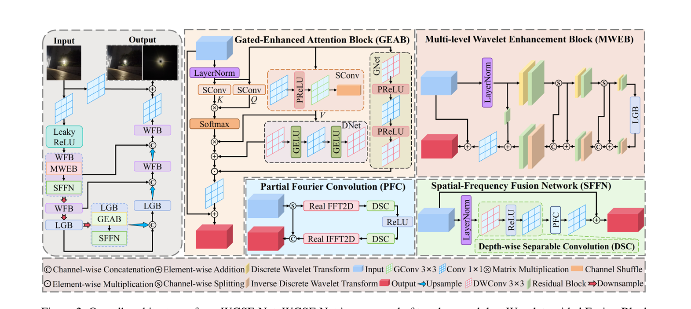
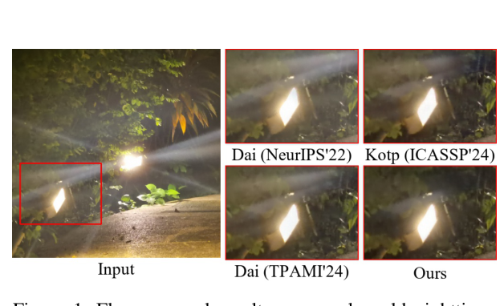
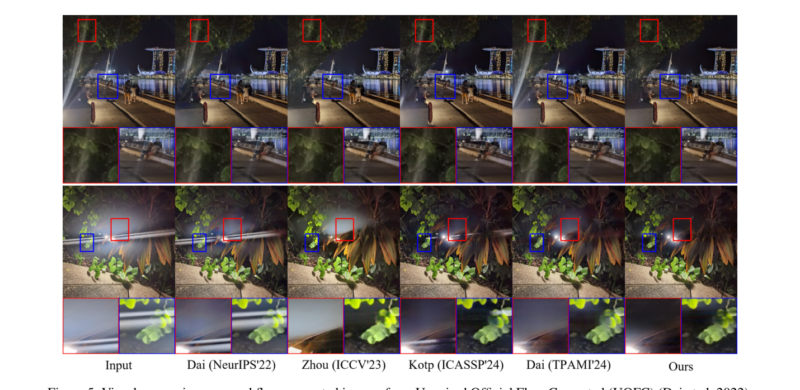

# Nighttime Flare Removal via Wavelet-Guided and Gated-Enhanced Spatial-Frequency Fusion Network（WGSF-Net）

> **发表**：AAAI 2026　|　**作者**：Yun Liu, Guang Yang et al.（西南大学 & 南洋理工大学）
> **论文**：https://gyang666.github.io/papers/AAAI26_WGSF_NighttimeFlare.pdf　|　**代码**：https://github.com/gyang666/WGSF-Net

## 一、解决的问题

夜间强人工光源（车灯、路灯）在镜头内部的散射与多次反射会形成条纹、光晕与辉光，遮挡场景细节并损害下游检测/识别/导航任务。深度学习时代的主流做法是在 Flare7K/Flare7K++ 合成数据上训练修复网络（U-Net、HINet、Restormer、Uformer 等 baseline，及 Kotp & Torki 的深度引导两阶段法、FBNet、SGLFR-Net 等）。

作者指出现有方法的两个缺口：其一，多数空域网络**忽视频域线索**，而频域信息对捕捉长程依赖与周期性眩光模式至关重要，导致残留伪影或去除不彻底；其二，已经引入频域的工作（FF-Former 的 FFC、SFSNiD、SGSFT、LPFSformer）也只在**单一尺度**上提取频域特征，没有利用层级（多分辨率）频率结构，且缺乏显式的"区域选择"机制来区分被眩光污染区域与正常区域。WGSF-Net 的出发点就是补上这两块：多级小波分解提供层级化的频率表征，门控注意力提供眩光区域的选择性强调。

## 二、核心创新点

1. **MWEB（Multi-level Wavelet Enhancement Block）**：3 级离散小波变换（DWT）逐级分解特征，只把低频 LL 子带向下层传递，形成 coarse-to-fine 的层级频率提取；每级分解后接轻量 ResBlock 补偿下采样信息损失，并提出**混合子带策略**——把 LL/LH/HL/HH 各拆四份重组成四个"混血"子带再做残差学习，促进跨频带信息互补。
2. **GEAB（Gated-Enhanced Attention Block）**：在多头注意力上做两点改动——（a）通道扩张的 Q/K（每个头分到完整 C 维而非 C/h 维），缓解子空间瓶颈；（b）双辅助分支：DNet 补偿 V 分支的空间细节损失（GELU 激活），GNet 作为自适应空间门控（PReLU 激活）把注意力导向眩光区域，输出为 (Attn+DNet(V))·GNet(LN(F))。
3. **SFFN（Spatial-Frequency Fusion Network）**：用深度可分离卷积 + **部分傅里叶卷积（PFC）**做空频融合——通道劈成空间支（C 通道）与频域支（C/2 通道，过 Real FFT → 双 DSC → IFFT），借鉴 FasterNet 的"部分卷积"思想降低冗余。SFFN 同时嵌入 WFB 与 LGB 两大块中复用。
4. 整体上以 WFB（=MWEB+SFFN）与 LGB（=GEAB+SFFN）两类块组装 U 形网络，并在损失中加入傅里叶域约束 L_fft。

## 三、模型结构与方案

**整体 pipeline**：U 形端到端编解码器，下/上采样为 1×1 卷积 + PixelUnshuffle/PixelShuffle。编码器阶段布置 WFB（小波引导融合块），瓶颈与解码阶段布置 LGB（局部-全局块）。基础通道数 C=32。

> 图 2：WGSF-Net 整体架构，含 GEAB、MWEB、PFC、SFFN 各子模块细节（来源：原论文）

**MWEB 细节**：输入特征 LayerNorm 后做 L=3 级 DWT，每级得到 {LL, LH, HL, HH} 四个子带；混合子带重组后过 ResBlock（3×3 DWConv→ReLU→1×1 PWConv→ReLU→3×3 DWConv + 残差）；仅 LL 传入下一级。最深层（i=3）的四个子带各自经 LGB 的门控注意力处理后，自底向上逐级 IDWT 重建（式 2），每级重建后再接 ResBlock 精修。最终重建特征与 F₀ 的残差分支融合（1×1 卷积）并与输入残差相加输出。

**GEAB 细节**：LayerNorm 后用三个 Shuffle Convolution（1×1 conv → PReLU → 3×3 组卷积 → channel shuffle）生成通道扩张的 Q、K（H×W×C·h）与 V（H×W×C），按子空间切分后做多头注意力；DNet/GNet 均为两个 3×3 DWConv + 1×1 conv 的结构，仅激活函数不同（GELU vs PReLU）。

**损失函数**：L = 1.0·L1 + 1.0·L_vgg + 2.0·L_rec + 0.1·L_fft，前三项沿用 Flare7K++，L_fft 为频域重建约束（引自 Qi et al. 2025）。

**训练设置**：完全沿用 Flare7K++ 的动态合成管线（23,949 张 Flickr 背景 + Flare7K++ 眩光模板在线合成配对数据），512×512 随机裁剪，batch size 2，Adam（β1=0.9, β2=0.99），固定学习率 1e-4，600K 迭代，单卡 RTX 4090。

> 图 1：真实夜景眩光图像上 WGSF-Net 与 Dai/Kotp 等方法的去除效果对比（来源：原论文）

## 四、实验与结果

**基准与指标**：Flare7K 真实测试集（100 对）与合成测试集（100 对）；PSNR / SSIM / LPIPS / G-PSNR / S-PSNR。

**真实测试集**：WGSF-Net 取得 PSNR 28.52 / SSIM 0.907 / LPIPS 0.0383 / G-PSNR 24.984 / S-PSNR 24.084，五项全部第一；相对次优方法 LPIPS 下降 7.93%，G-PSNR、S-PSNR 分别 +0.191 dB、+0.208 dB（对比 LPFSformer 的 28.24/0.905/0.0422/24.793/23.876）。**合成测试集**：PSNR 30.91 / SSIM 0.969 / G-PSNR 26.264 / S-PSNR 25.988 四项最佳（G-PSNR/S-PSNR 较次优 +0.529/+0.709 dB），LPIPS 0.018 与 Flare7K 管线下 Dai 的 0.017 相当。

**消融**（表 3）：损失方面，四项损失齐全最优；网络方面，去掉 SFFN 真实集 PSNR 掉至 28.15、去掉 GEAB 掉至 28.33、去掉 MWEB 掉至 28.42、去掉 ResBlock 掉至 28.44；整块去掉 WFB/LGB 分别掉至 28.25/28.09。LGB 对 S-PSNR 影响最大（24.084→23.008），印证门控注意力对条纹眩光区域的针对性。

> 图 5：无配对真实眩光图像（UOFC）上的泛化视觉对比（来源：原论文）

## 五、专家锐评

**价值**：这是一篇执行得相当扎实的"架构改良"论文。它把小波多分辨率分析、门控注意力与部分傅里叶卷积三件武器组织进同一框架，在 Flare7K++ 这个领域标准基准上做到了真实测试集五项指标全面第一，且相对 LPFSformer（TCSVT 2025）这样的近期强 baseline 仍有 0.28 dB PSNR 优势。消融做得规整：损失、单模块、整块三个粒度都有数字，"仅 LL 下传"的 coarse-to-fine 设计与混合子带重组是文中相对最有新意的细节。代码开源也加分。

**不足与质疑**：

1. **新颖性是组装式的**。小波分解进修复网络（MWNN、Wavelet-CNN、WTConv——文中 DWT 直接引用 Finder et al. 2024）、FFT 分支融合（FFC/FF-Former/SGSFT）、门控调制注意力（Restormer 的 gated FFN、NAFNet 的 SimpleGate）都是成熟构件。GEAB 的"通道扩张 Q/K 缓解子空间瓶颈"声称缺乏单独消融支撑——消融只做了"整个 GEAB 去/留"，无法区分收益来自通道扩张、DNet 还是 GNet；GNet 与 DNet 结构完全相同只差激活函数，却被赋予"眩光感知门控"与"细节补偿"两种截然不同的语义解释，这种功能归因没有任何可视化或实验证据（如 GNet 输出门控图与眩光 mask 的相关性）。
2. **消融数据存在不一致的疑点**。表 3 中 "L1+Lvgg+Lfft（无 Lrec）" 在合成集上反而比 "L1+Lvgg" 更差（30.01 vs 30.22），说明 L_fft 在无 L_rec 时为负贡献，文中对此只字未提就宣称"每个损失都有贡献"；另外正文表 2 中完整模型合成集 LPIPS 写 0.018，表 3 同一配置写 0.0182 而文字又引用"21.21% 降低"等百分比，数字粒度混乱。同类问题还有：合成测试集对比表（表 2）缺失 SGSFT、LPFSformer、FBNet 等 Flare7K++ 管线下的最强对手，只与 Dai++ 和 Kotp 比，"四项最佳"的含金量打了折扣。
3. **效率维度完全缺席**。论文反复强调 DSC、PFC、"lightweight"，却没有给出任何参数量/FLOPs/推理时间对比；3 级 DWT + 每子带 LGB 注意力 + 通道扩张 Q/K（C·h 维）的设计直觉上并不便宜，与"高效"的自我定位是否相符无从判断。
4. **泛化验证浅**。训练-测试都在 Flare7K++ 体系内，唯一的域外证据是 UOFC 无配对图的定性图（图 5），没有 FlareReal600、WiderFlare 等其他真实基准的定量结果，也没有下游任务（检测等）验证。对一个声称面向"challenging real-world flare scenarios"的方法，这块证据偏单薄。

总体：工程完成度高、基准成绩硬，但属于"在标准赛道上把已知组件调到极致"的工作，机制层面的主张（门控=眩光定位）证据不足，效率与跨域泛化是两块明显的留白。
