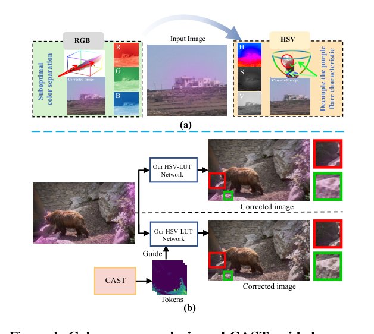
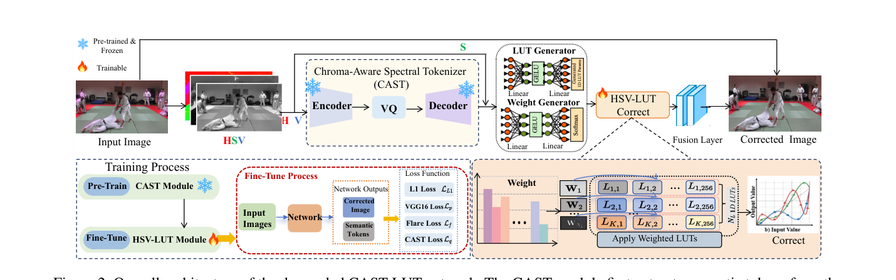
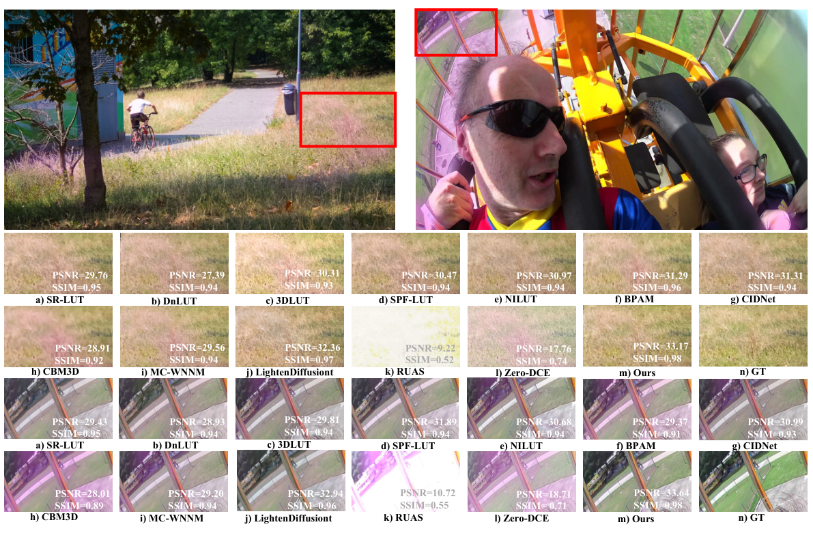
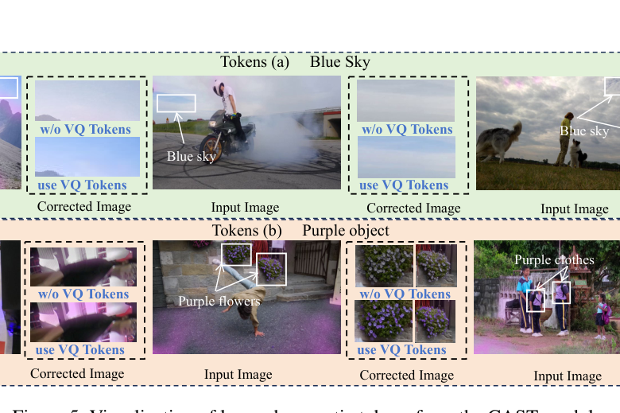

# CAST-LUT: Tokenizer-Guided HSV Look-Up Tables for Purple Flare Removal

> **发表**：AAAI 2026　|　**作者**：Pu Wang et al.（山东大学、国科大、湖北大学、中科大等多单位）
> **论文**：https://arxiv.org/abs/2511.06764　|　**代码**：https://github.com/Pu-Wang-alt/Reduce-Purple-Flare/　|　**数据集**：https://huggingface.co/datasets/PuWang0/purple_flare

## 一、解决的问题

紫边/紫色眩光（purple flare）是高光区域周围出现的弥散性色差伪影，常见于手机摄影、消费级相机与低成本光学系统，成因包括镜内反射、传感器饱和与色散。它不同于噪声或模糊：弥散、颜色特异（紫色谱段）、且与高光区域强空间相关，严重破坏色调过渡与色彩保真。

该问题长期缺乏系统研究。传统方法（Chung 2009 的 RGB 通道比较、Kim 2010 的 CIExy、Ju 2013 的 YCbCr）依赖手工设计的固定阈值，跨相机/场景泛化差；通用 deep flare removal 方法（Wu 2021、Deng 2024 等）在耦合的 RGB 空间做像素到像素修复，对特定色差缺乏精准的颜色解耦控制；高效的 LUT 系方法（3DLUT、SR-LUT、DnLUT、DPLUT）也都绑定 RGB 空间，对局部紫色伪影不敏感。作者观察到 HSV 空间能把紫色眩光的特征（色相异常 + 高光位置）解耦放大，但朴素的 RGB→HSV 非线性转换会放大局部色彩噪声、引入新伪影。此外，该任务**没有任何成对训练数据**，全图平均的全局指标也会掩盖小区域的残留伪影。

## 二、核心创新点

1. **"感知-校正"两阶段范式 + HSV 解耦 1D-LUT**：不直接在不稳定的 HSV 像素域上操作，而是用语义 token 引导生成 H、S、V 三通道**各自独立的 1D-LUT**，避开 RGB 通道耦合与 HSV 转换噪声两个坑。
2. **CAST（Chroma-Aware Spectral Tokenizer）**：共享权重 CNN 编码器对 H（色相特征）与 V（高光空间上下文）通道独立编码（S 通道保持原样），经 VQ 向量量化（4096 词表、128 维嵌入）离散为描述紫色眩光状态的语义 token——token 能基于上下文区分"紫色眩光"与"合法紫色物体/蓝天"。
3. **Token 引导的动态 LUT 生成与加权融合**：token 聚合为全局特征后，并行驱动 LUT 生成器（MLP 输出 N_L=16 组 × 3 通道 1D-LUT 参数）与权重生成器（Softmax 融合权重），加权融合后施加校正；残差分支 + 全局跳连保细节。
4. **PFSD 数据集**：首个大规模紫色眩光成对数据集（4,987 训练 / 608 验证 / 618 测试），基于 DAVIS 高清帧用参数化管线合成（高光百分位检测 ∩ Sobel 边缘 → 形态学膨胀 → 高斯软化 → 径向衰减 mask → 紫色 alpha 混合），按场景级划分防泄漏。
5. **任务专用指标与损失**：PSNR-F / PSNR-NF（眩光区/非眩光区分别评估）、HAE（饱和度加权的圆周色相误差）；训练用紫色眩光抑制损失 L_f——以"紫色 ∩ 边缘"的惩罚 mask 放大目标区域误差。

## 三、模型结构与方案

> 图 1：(a) RGB vs HSV——HSV 空间更清晰地解耦紫色眩光特征；(b) CAST token 引导对校正效果的提升（来源：原论文）

**Pipeline**：分两阶段训练。第一阶段预训练 CAST：输入图转 HSV，H/V 通道经 4× 下采样编码器得到 F_H, F_V ∈ R^(8×256×H'×W')，VQ 模块把每个特征向量映射到最近码本项，产生离散 token 索引与量化特征，解码器重建 Ĥ、V̂，与原 S 通道合成 HSV 再转回 RGB 得 I_recon，以重建误差监督。第二阶段冻结 CAST，微调 HSV-LUT 模块：T_combined=[T_H, T_V] 经嵌入聚合为 f_token，分别过 LUT 生成器（Linear→GELU→Linear，输出 N_L×3×S_LUT 个控制点）与权重生成器（Linear→GELU→Linear→Softmax）；I_recon 转 HSV 拆三通道，每组 LUT 独立查表后按权重 W 加权求和得到校正通道，再合成转回 RGB 得 I_fused；与原图残差分支特征拼接融合，加全局跳连输出。

> 图 2：CAST-LUT 整体架构——CAST 编码 H/V 通道为语义 token，引导多组解耦 1D-LUT 的动态生成与加权融合（来源：原论文）

**损失函数**：L = 1.0·L1 + 0.1·L_p(VGG16) + 2.0·L_f + 0.1·L_q（VQ 承诺损失）。L_f = ||M⊙(I_out−I_GT)||₁，M = M_flare（紫色高饱和像素图）⊙ M_edge（Sobel 边缘图），只在"紫色且在边缘"的区域放大惩罚。

**训练设置**：RTX 4090，AdamW，batch size 8，初始 lr 1e-4 余弦退火，100 epoch，输入 256×256，随机翻转 + 颜色抖动。

**数据合成关键参数**：高光取第 99 百分位，梯度阈值 25，眩光带宽 80px，混合强度 0.7，径向 gamma 2.2（角落更强以模拟镜头几何）；紫色取 BGR [255,100,255]。

## 四、实验与结果

**主结果（PFSD 测试集，256² 输入）**：CAST-LUT 取得 PSNR 34.96 / SSIM 0.99 / LPIPS 0.03 / ΔE 2.71 / PSNR-F 30.74 / PSNR-NF 34.35 / HAE 4.10，全部指标第一，同时 FLOPs（23.32G）与运行时（6.09ms）也是最低。对比项：LUT 系最强的 NILUT 为 32.31/24.86/4.87（PSNR/PSNR-F/HAE），修复系最强的 HVI-CIDNet PSNR 32.17 但 HAE 高达 17.39——说明通用增强方法做不好针对性色相校正。PSNR-F 领先次优约 3.5 dB 是最大的差距点。

> 图 4：PFSD 上与 13 个方法的定性对比，本文方法去紫边的同时不误伤绿草、天空等正常颜色（来源：原论文）

**消融**（表 2）：改用 RGB 1D-LUT（M1）PSNR-F 从 30.74 暴跌至 24.15、HAE 恶化到 8.81；改用 3D RGB-LUT（M2）也明显更差，验证 HSV 解耦的必要性。CAST 换简单 CNN 编码器（M3）PSNR-F 降至 29.01，去掉 VQ（M4）进一步降至 28.45；去残差分支（M5）整体 PSNR 跌到 25.82。LUT 组数 N_L=16 最优（PSNR 34.96 vs N_L=32 的 32.43）；码本 4096 最优平衡（8192 仅 +0.07 dB 但 FLOPs +12%）；编解码深度 4 层最优。去掉 L_f 后 HAE 从 4.1 恶化到 7.2。

> 图 5：CAST 学到的语义 token 可视化——能区分蓝天、紫色物体与紫色眩光，避免误校正（来源：原论文）

**移动端部署**：iPhone 14（A15）上 4K 图像推理 82ms，论文还展示了真机应用界面与成功/失败案例。

## 五、专家锐评

**价值**：这篇论文做了一件"开荒"的事——紫边去除此前确实没有系统的深度学习研究、没有成对数据集、没有合理的评估协议，本文把数据集（PFSD）、指标（PSNR-F/NF、HAE）、方法（CAST-LUT）一次配齐，且数据和代码都公开，对后续工作有基础设施价值。方法设计也有清晰的任务针对性：HSV 解耦 + 1D-LUT 的选择直接对应"色相异常"这一伪影本质，VQ token 解决"紫色眩光 vs 合法紫色物体"的语义歧义，6ms/23G FLOPs 的效率与 iPhone 实测是 LUT 路线的诚意体现。消融覆盖颜色空间、引导模块、架构、损失权重、码本大小、网络深度六个维度，相当完整。

**不足与质疑**：

1. **数据集是"自己出题自己答"，合成与评估存在循环依赖**。PFSD 的合成规则（高光∩Sobel边缘→膨胀→紫色混合）与 L_f 惩罚 mask 的构造（紫色∩Sobel边缘）、乃至 HAE/PSNR-F 的评估 mask（直接用合成时的 ĜT mask）共享同一套先验。模型在训练与评测中都被这套规则"对齐"，34.96 dB 的领先有多少来自方法、多少来自对合成分布的过拟合，无法判断。真正的检验应是在**真实紫边照片**上的定量评估，但论文只给了真机定性图（且自己承认有失败案例），没有任何真实数据的数字。固定紫色 C_p=[255,100,255] 的单色合成更加重了这一疑虑——真实紫边的色相随光谱与 CFA 排列变化。
2. **对比实验的公平性存疑**。13 个 baseline 里没有一个是针对紫边/色差任务训练适配的方法（Zero-DCE、RUAS 是低光增强，CBM3D 是去噪），它们在 PFSD 上表现差是预期之内；而通用 flare removal 的近期强方法（论文自己在相关工作里引用的 Deng et al. 2024 知识驱动方法、Wu et al. 2021）反而没有进入对比表。"SOTA on all metrics"的声明建立在一个对手集合错位的赛场上。
3. **方法叙事与实现之间有裂缝**。论文反复强调"避免 RGB→HSV 转换噪声"，但 pipeline 里输入图仍然要转 HSV 给 CAST 编码、I_recon 也要转 HSV 查 LUT 再转回——转换并没有被避免，只是希望 VQ 的离散化"稳定"了表征，这一因果声称没有专门实验验证（比如对比在转换处加噪/不加噪的鲁棒性）。另外 1D-LUT 是全局映射，按理无法处理"同一色相在眩光区要校正、在正常物体上要保留"的空间选择性矛盾，论文把这归功于 token 引导的多 LUT 加权，但权重也是全局标量——空间自适应从何而来，机制上没说清；若靠的是残差分支兜底，那主分支的贡献叙事就要打折。
4. **写作与细节质量粗糙**。正文 "Disscuss"、"succcessful" 等拼写错误；表 6 标题写成 "Visualization of..."；M3（去 CAST）的 PSNR-NF 29.42 反而低于 M4 等数字反直觉处无解释；arXiv 摘要页的 "Formal version —" 后面是空的。对一篇 AAAI 论文而言，这些细节让人对实验执行的严谨度多一分保留。

总体：问题选得好、基础设施贡献实、效率亮眼，但"合成数据上的大幅领先"与"真实世界有效性"之间的鸿沟没有用定量证据填上，是这项工作从"开荒"走向"立得住"必须补的课。
