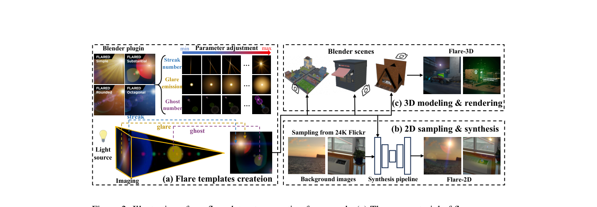
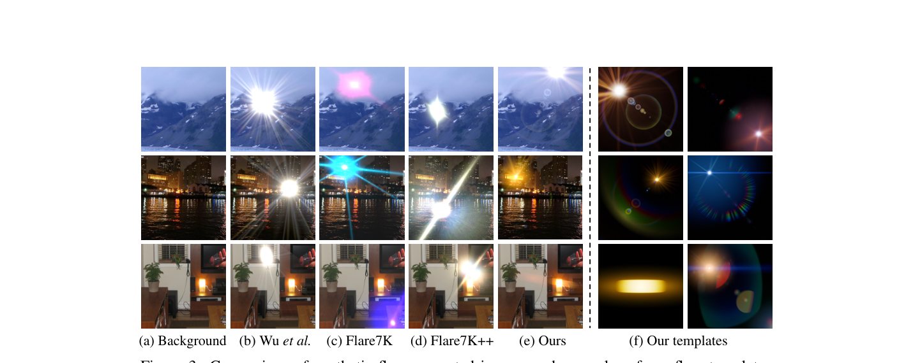
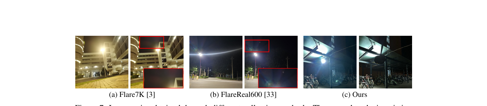
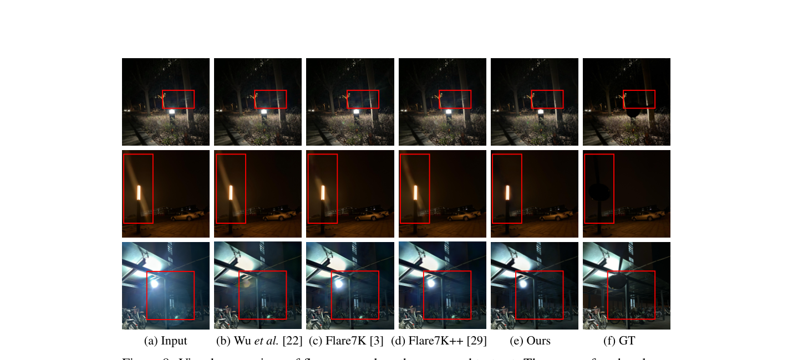

# FlareX: A Physics-Informed Dataset for Lens Flare Removal via 2D Synthesis and 3D Rendering

> **发表**：NeurIPS 2025 Datasets & Benchmarks Track　|　**作者**：Lishen Qu et al.（南开大学、鹏城实验室、南京理工大学等）
> **论文**：https://arxiv.org/abs/2510.09995　|　**数据集/代码**：https://github.com/qulishen/FlareX

## 一、解决的问题

镜头眩光去除是典型的"数据瓶颈"任务：真实世界几乎无法拍到严格配对的眩光/无眩光图像，现有数据集（Wu et al. 的半合成数据、Flare7K/Flare7K++、FlareReal600、SDFRD）均依赖 2D 叠加合成——把眩光模板随机仿射变换后直接加到背景图上。作者指出这条路线的三大缺陷：

1. **模板多样性不足**：Wu 仅 3 类（且只有白天）、Flare7K 35 类（只有夜间），都来自点光源，缺少多次反射眩光与非球形光源（如长条灯管）产生的图案；
2. **合成过程违背物理**：随机加模板忽略了眩光强度与光源空间位置（距离、入射角）的物理关系，造成亮度失真、尺寸失真；
3. **测试集 GT 不干净**：Flare7K/FlareReal600 用"擦镜头"方式拍 GT，只能消除镜面污染引起的散射眩光，**无法消除镜组内部反射眩光与强眩光**，导致 GT 残留眩光——模型去得更干净反而得分更低，定量评估被系统性扭曲。

## 二、核心创新点

1. **参数化模板创建（Flare-2D 素材）**：用 Blender 的 Flared 插件搭建含光源、streak、iris、glare 等组件的眩光，绑定光源到空间点并启用组件间物理约束，手工调节焦距/位置/颜色/尺寸/形状等参数，共 95 种眩光类型 × 各 100 个参数变体 = **9,500 个模板**，且能自动生成各组件（含光源）的标注；覆盖白天+夜间、多次反射、非球形光源。
2. **光照定律驱动的 2D 合成**：引入照度定律 E = I·cosθ/d²，用预训练单目深度估计取光源区域平均深度 d_i、用水平视场角几何推算入射角 θ_i，通过亮度调整模块（BAM）按物理规律缩放每个仿射变换后的眩光亮度，替代"随机加"；还可按指定相机视场角 φ 定制数据集。
3. **物理引擎 3D 渲染（Flare-3D）**：在 Blender 中构建 60 个 3D 场景，把眩光放在物理上合理的位置（光源旁、天空、窗外），关键帧驱动相机沿轨迹运动渲染，去掉眩光组件后重渲染得到严格配对的 GT，共 **3,000 对**；眩光外观随视角/位置自然变化，且避免 2D 加法的数值溢出失真。
4. **遮挡式真实测试集**：用验光遮眼板直接挡住强光源再拍同场景照片，散射与反射眩光同时消失，得到真正无眩光的 GT；标注遮挡区域并在指标计算中剔除。共 100 对 3024×3024 测试图（多款手机+专业相机），另从网络收集 63 张旗舰手机"屏下宽带状眩光"（off-screen flare）图像作无参考评估。

## 三、数据集构建与方案

> 图 2：FlareX 三阶段生成框架——(a) Blender 插件参数化创建模板；(b) 光照定律引导的 2D 采样合成（背景取自 24K Flickr）；(c) 3D 场景建模与多视角渲染（来源：原论文）

**Flare-2D 合成管线**：对模板做多次随机仿射变换 T_i，对背景图做单目深度估计（DPT）；BAM 内部先做空间位置估计（SPE）——光源区域像素平均深度作为 d_i，r_i（光源到图心平均距离）结合视场角 φ 经相似三角形得 θ_i = arctan(2r_i/W · tan(φ/2))；再以入射角 0°、平均深度 d̄ 的光源为参考归一化各眩光亮度（式 6），最后逐项相加并 Clip 到 [0,1]。

> 图 3：与 Wu/Flare7K/Flare7K++ 的合成图对比及本文模板示例——可模拟白天日晕与非球形光源眩光（来源：原论文）

**与现有数据集对比**（表 1）：FlareX 95 类 / 9500+3000 张，是唯一同时具备"多次反射 ✓、光源标注 ✓、白天 ✓、夜间 ✓"的数据集（Flare7K：35 类、仅夜间；Wu：3 类、仅白天）。

> 图 7：不同采集方式的图像对——Flare7K/FlareReal600 用擦镜头法的 GT 仍残留眩光（红框），本文遮挡法 GT 干净（来源：原论文）

**测试集有效性验证**（表 2）：用 Flare7K 与 Flare7K++ 训练的同一模型做两两比较，在旧测试集上 PSNR 判 Flare7K++ 胜的样本只有 66~67%，而用户研究为 92~96%；在本文测试集上 PSNR 判胜率 93%，与用户研究 95% 高度一致——说明旧测试集近三分之一样本的定量结论与人眼感知相悖，新测试集更可信。

**训练协议**：沿用 Flare7K 系的聚合方式与损失（L1 + VGG-19 感知损失 + 重建损失），训练 HINet、MPRNet、Uformer、Restormer、AST 五个模型，512×512、batch size 2、30K 迭代、双卡 RTX 3090。

## 四、实验与结果

**主结果（本文真实测试集，表 3）**：同一模型换训练集对比，FlareX 全面领先。Uformer：FlareX 25.459 / 0.692 / 0.133（PSNR/SSIM/LPIPS），比次优的 FlareReal600（24.079）高约 1.38 dB，比 Flare7K++（23.615）高 1.84 dB；Restormer：25.096 vs Flare7K++ 的 24.495；HINet：25.388 vs 25.172。**Off-screen flare（表 4，无参考指标）**：FlareX 训练的 Uformer 取得最低 NIQE 3.967 与 BRISQUE 28.354（输入为 4.144/31.894）。

**消融**：（1）光照定律（表 5）——FlareX 上加入后 25.122→25.459，且移植到 Flare7K 合成管线同样有效（23.386→23.711），证明 BAM 是可迁移的通用改进；（2）数据构成（表 6）——仅 Flare-2D 训 Uformer 24.853，仅 Flare-3D 23.647（量少所致），二者混合 25.459 最佳，Restormer 同趋势。下游验证：眩光去除后目标检测能找回被遮挡的自行车/摩托车并纠正类别混淆。**失败案例**：极强光源 + 大面积眩光时仍留明显伪影（图 11），作者坦承为局限。

> 图 8：同一 Uformer 在不同训练集下于本文测试集上的去除效果对比（来源：原论文）

## 五、专家锐评

**价值**：在 Flare7K++ 几乎垄断该领域训练数据的背景下，FlareX 是近年最有"基建"意义的工作之一。它的贡献其实是三件独立有用的事：(a) 把眩光强度与空间位置的物理关系（cos⁴ 律的近亲）做成可插拔的合成模块，且实验证明对旧数据集也有效；(b) 用 3D 渲染绕开 2D 加法的溢出与摆放随机性问题；(c) **遮挡式 GT 采集**——这是对领域评估方法论的实质修正，表 2 用"PSNR 判胜率 vs 用户研究"的对齐度来论证测试集质量，论证方式聪明且有说服力。NeurIPS D&B 赛道要的就是这种数据+协议双贡献。

**不足与质疑**：

1. **模板源头仍是图形插件，"physics-informed" 名实之间有距离**。9,500 个模板来自 Flared 插件的艺术化眩光预设（本质是为影视特效设计的程序化贴图），并非光学仿真（如波动光学 PSF 或镜组光线追迹）；"95 类"中有多少是参数微调出的近亲、类间多样性如何量化，论文没有给出分布层面的分析。3D 渲染部分的"物理约束"同样是 Blender 插件层面的几何约束，而非镜内散射/反射的物理成像。叫 physics-informed 成立，叫 physically-accurate 则言过其实。
2. **测试集既是贡献也是裁判，存在分布偏置风险**。核心定量结论（表 3 领先 1.38 dB）是在**作者自建测试集**上得出的，而 FlareX 训练数据与该测试集天然共享构建者对"眩光应长什么样"的先验（比如非球形光源、多次反射图案恰是 FlareX 模板特有的）。在 Flare7K/FlareReal600 等第三方测试集上的交叉定量结果论文未给出（只有图 12 的几张定性图），这使"泛化更好"的主张缺少中立场地的验证。另外遮挡板会挡掉光源及周边区域，被剔除的恰是眩光最强、最难恢复的像素，指标可能系统性偏乐观。
3. **实验规模与统计严谨度一般**。30K 迭代明显短于领域惯例（Flare7K++ 基线通常 600K 迭代量级），不同数据集规模（FlareX 12,500 vs Flare7K 7,000）下用同样迭代数比较，训练充分性与数据量的影响纠缠在一起；表 2 的用户研究没有报告参与人数、样本协议与显著性；AST 出现在实验设置里但表 3 只有四列模型，叙述与表格不一致。
4. **Flare-3D 的资产多样性存疑**：60 个场景产 3,000 对图像，平均每场景 50 帧来自同一相机轨迹，帧间冗余度高，有效样本量远小于名义数字；消融中"仅 Flare-3D 训练较差"被归因于数量少，但同源冗余可能才是主因，论文未做控制实验区分。

总体：方向正确、工程量大、对评估协议的批判切中要害，是值得社区采用的数据集；但"自建测试集上自证优越"的闭环和模板的图形学血统，意味着它对真实光学眩光分布的覆盖仍需第三方检验。
