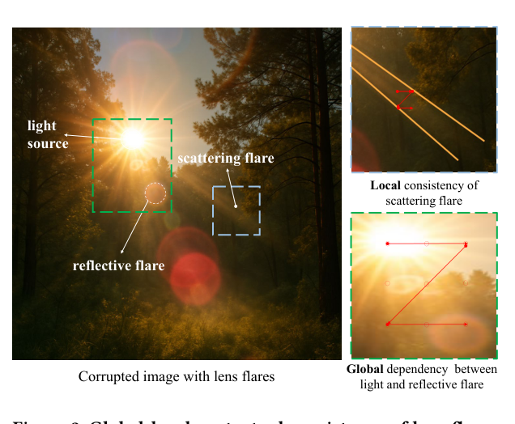
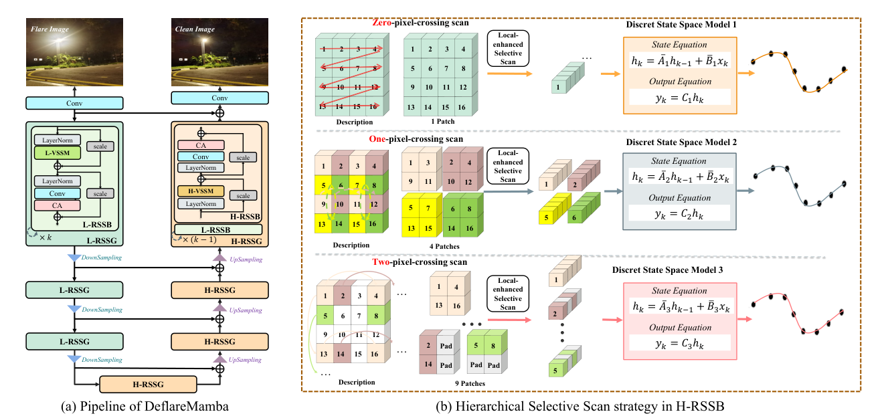
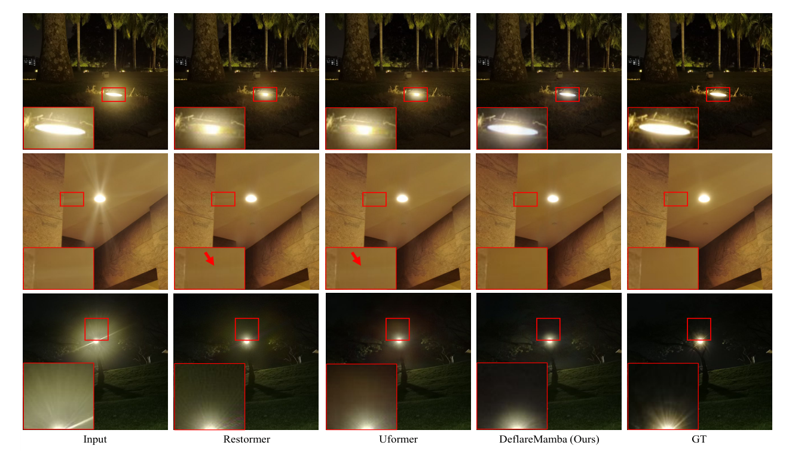
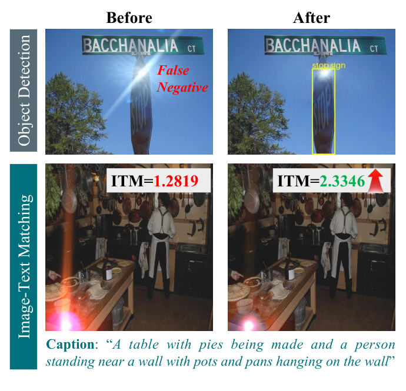

# DeflareMamba: Hierarchical Vision Mamba for Contextually Consistent Lens Flare Removal

> **发表**：ACM MM 2025　|　**作者**：Yihang Huang, Yuanfei Huang et al.（北京师范大学）
> **论文**：https://arxiv.org/abs/2508.02113　|　**代码**：https://github.com/BNU-ERC-ITEA/DeflareMamba

## 一、解决的问题

镜头眩光是与场景内容非线性耦合的"寄生信号"，分为两类：散射眩光（光与镜片微观瑕疵作用形成的弥散条纹，**局部性强**）与反射眩光（镜组间内反射产生的同心环/多边形亮斑，与光源保持特定空间关系，**全局依赖性强**）。作者把眩光去除的关键归结为"上下文一致性"：散射眩光需要局部一致性（修复区与周边在饱和度、纹理、边缘上无缝衔接），反射眩光需要全局一致性（光源与远处眩光斑的长程关系要被联动处理）。

现有架构难以兼顾：CNN 受限于局部感受野；Transformer 全局建模强但自注意力 O(N²) 复杂度难以处理 512×512 以上的高分辨率输入，窗口化注意力（Swin/Uformer）又牺牲全局依赖。Mamba/SSM 以线性复杂度建模长序列是天然候选，但直接搬用 MambaIR 有两个问题：(1) 常规选择性扫描偏向粗粒度模式，忽视近邻像素的精细关系；(2) SSM 的**长程衰减特性**——序列中元素相关性随距离指数衰减（学到的 ΔA 通常为负），而常规扫描会把空间上相邻的像素映射到序列中相距很远的位置，对"光源-反射眩光"这种本就跨越大空间距离的依赖更是雪上加霜；且离散 SSM 的因果性导致信息只能单向流动。

## 二、核心创新点

1. **首个把 Mamba/SSM 引入眩光去除任务的工作**（作者声明），把"上下文一致性"这一任务特性与 SSM 的扫描顺序设计显式挂钩。
2. **U 形层级架构对抗长程衰减**：下采样既聚合邻域信息扩大每个序列元素的感受野，又缩短序列长度、提升原图中远距像素在序列中的相关性；消融显示 U 形 MambaIR 比原版 MambaIR 收敛更快（前 20K 迭代领先近 3 dB），最终高约 1 dB。
3. **Local-enhanced Selective Scan（编码端 L-RSSG）**：继承 LocalMamba 的窗口化局部扫描（窗口内光栅序扫描保持邻域关系），再叠加 VMamba 式四方向变体（转置/翻转组合），四个独立参数的 SSM 分别处理后相加，最大化保留局部空间结构。
4. **Hierarchical Selective Scan（解码端 H-RSSG）**：以 2^i 步长跨像素采样把特征图拆成多组子图（零/一/二像素交叉扫描，对应 1/4/9 patch），令原图中相距远的像素在子序列中变近、借 SSM 的距离衰减特性反向建立长程关联；子图各自经 Local-enhanced SSM 处理后逆映射回原分辨率、多尺度平均融合——以"分治"方式获得层级感受野而**不损失分辨率**。

## 三、模型结构与方案

> 图 2：眩光的全局-局部上下文一致性——散射眩光要求局部一致，反射眩光与光源存在全局依赖（来源：原论文）

**整体 pipeline**：输入 512×512 眩光图先经卷积投影到 C 维特征，进入 U 形网络：编码阶段堆叠 L-RSSG（第 l 组含 l 个 L-RSSB + 尾部卷积 + 残差），解码阶段用 H-RSSG（l−1 个 L-RSSB + 最后一个换成 H-RSSB）。每个 L/H-RSSB 沿用 MambaIR 的 RSSB 骨架（LayerNorm → VSSM → scale 残差 → LayerNorm → Conv → 通道注意力 CA → scale 残差），把自注意力位置换成 L-VSSM / H-VSSM。VSSM 内部双分支：主分支 DWConv → SiLU → 改进的 2D SSM → 投影；跳跃分支 SiLU → 线性投影；相加后 LayerNorm + 投影输出。网络最终输出 6 通道：前 3 通道为去眩光图、后 3 通道为预测的眩光层（用于辅助损失），与 Flare7K++ 管线一致。

> 图 3：DeflareMamba 框架——U 形结构，编码端 Local-enhanced RSSG，解码端 Hierarchical RSSG 及其分级跨像素扫描策略（来源：原论文）

**损失函数**：L_total = w₁·L(Î₀,I₀) + w₂·L(F̂,F) + w₃·L_rec，其中 L = L1 + L_vgg，L_rec = |I − Clip(Î₀⊕F̂)|，w₁=w₂=w₃=1，完全沿用 Flare7K++ 设置。

**训练设置**：Flare7K++ 在线合成（24K Flickr 背景），数据增广与 Flare7K++ 完全一致；512×512 中心裁剪，batch size 2，Adam，lr 1e-4，300K 迭代。

## 四、实验与结果

**主结果（Flare7K++ 真实测试集，表 2）**：DeflareMamba PSNR 27.78 / SSIM 0.899，超过此前最好的 Kotp el al.（27.66/0.897）与 Uformer（27.63/0.894）；对比 Restormer* 27.60/0.897、HINet 27.55、U-Net 27.19、Difflare 26.06。相对 Uformer 提升 0.145 dB。

**消融**：U 形结构（图 4）使 MambaIR 收敛显著加快、最终高约 1 dB；以 U 形 MambaIR 为 baseline（27.354/0.894），加 Local-enhanced SS2D 升至 27.627（+0.273 dB），再加 Hierarchical Selective Scan 升至 27.778（+0.151 dB），合计 +0.424 dB。

> 图 5：与 Restormer、Uformer 的定性对比，本文在光源附近细节保留与条纹去除上更干净（来源：原论文）

**下游任务**（把 Flare7K++ 眩光合成到 COCO 验证集）：目标检测 mAP——Faster R-CNN 28.15（带眩光）→ 29.35（本文去除后，Uformer 为 29.13）；Deformable DETR 36.20→37.59；YOLOv8x 38.15→39.36。视觉-语言对齐——CLIP 相似度 28.57→29.22，BLIP ITM 117.56→128.45，文本检索 TR@1 72.2→73.4，均优于 Uformer 处理结果。

> 图 6：去眩光前后的目标检测与图文匹配对比——消除路牌的漏检、提升 ITM 分数（来源：原论文）

**局限（作者自述）**：长条纹散射眩光仍无法完全去除；层级特征处理目前集中在每组最后一个 block，分散到多个 block 或可降低计算复杂度。

## 五、专家锐评

**价值**：作为"第一篇 Mamba 做眩光去除"的工作，本文的可取之处在于没有停留在简单换骨干，而是把任务特性（散射眩光的局部性 vs 反射眩光的长程光源依赖）与 SSM 的核心弱点（长程衰减 + 扫描序破坏空间邻接）做了正面的对应分析；Hierarchical Selective Scan 用跨步采样把"远像素拉近"来对冲衰减、同时保持全分辨率，是对 EfficientVMamba 区间扫描思想在修复任务上一次有动机的改造。下游任务评估（检测 + CLIP/BLIP 图文对齐）超出该领域常规论文的验证范围，契合 ACM MM 的多媒体叙事。代码开源。

**不足与质疑**：

1. **提升幅度太小，且指标维度残缺**。对 Uformer 仅 +0.145 dB PSNR、+0.005 SSIM——这个量级在 batch size 2、单次训练、无方差报告的设定下基本处于随机波动区间。更要紧的是，论文**只报了 PSNR/SSIM**，而 Flare7K++ 官方基准明确使用 LPIPS、G-PSNR、S-PSNR 来评估眩光区域的修复质量；同期工作（SGSFT 28.08、LPFSformer 28.24、WGSF-Net 28.52）在同一测试集上都显著更高且五项指标齐全。回避区域性指标使"contextually consistent"这一核心卖点恰恰缺少最能验证它的证据——反射眩光区的 G-PSNR 提升与否，论文没有回答。
2. **核心机制声称与实验验证之间断链**。全文反复论证"长程衰减伤害光源-反射眩光的全局依赖"，但实验中没有任何针对反射眩光的分项评估、没有有效感受野（ERF）或相关性随距离变化的可视化、没有"反射眩光样本子集"上的对比。Hierarchical Scan 是否真的改善了远距依赖，只能从总体 +0.151 dB 间接猜测，这对一篇以机制叙事为主的论文是明显短板。
3. **效率优势只字未提数字**。选择 Mamba 的首要理由是线性复杂度，但论文没有给出参数量、FLOPs、推理时延与 Uformer/Restormer 的对比；Local-enhanced SS2D 用 4 个独立 SSM、Hierarchical Scan 又对多组子图分别处理并补零对齐，实际开销可能不低。"高效"停留在引言层面。
4. **比较对象偏弱、引用粗疏**。表 2 的对手停留在 Flare7K++ 原始基准（2023 年水平）加 Difflare、Kotp 两个，未与 2024-2025 年的 SGSFT、LPFSformer、MFDNet 等频域系强方法对比；HINet 引用错成 "Hinet: Deep image hiding by invertible network"（图像隐写的同名网络），U-Net 的引用编号在表 2 中与 Uformer 混用 [38]，公式 8 中 M-SSM/H-SSM 名称不一致——这些细节错误降低了论文的可信观感。

总体：选题卡位（首个 Mamba 眩光去除）和机制叙事都不错，但实验完成度撑不起叙事——指标残缺、提升微弱、效率未证，更像一篇"占坑"性质的会议论文；它的真正价值可能要靠后续工作在其开源代码上补全验证。
