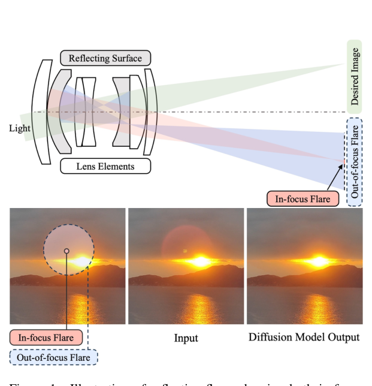
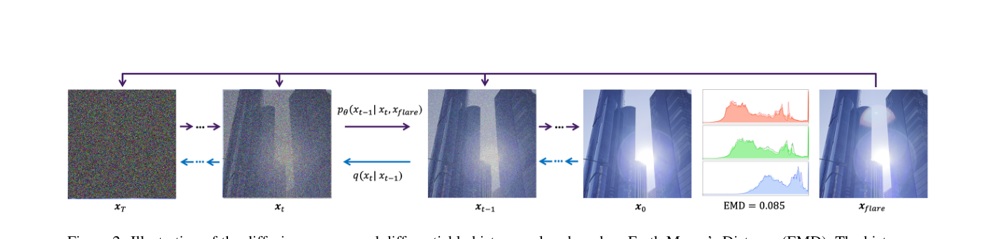
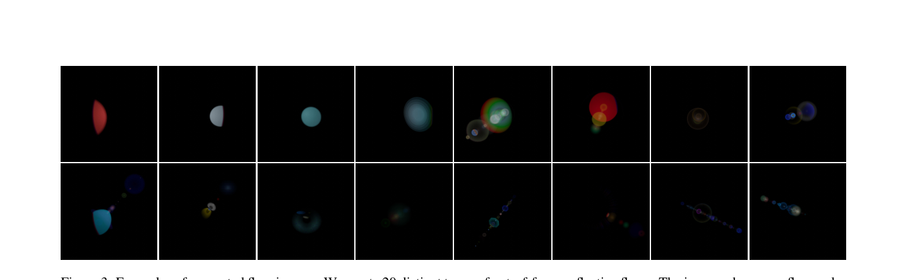
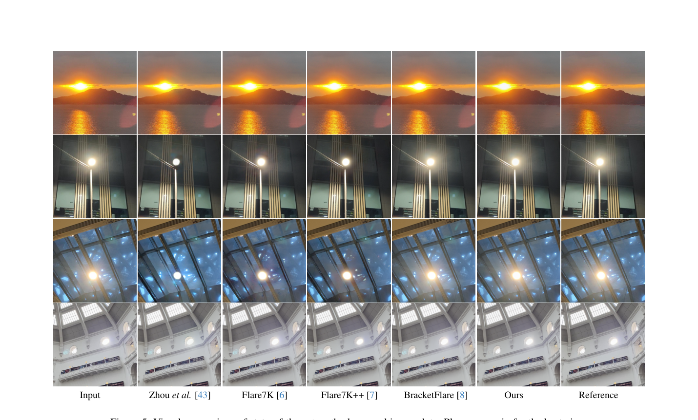

# Removing Out-of-Focus Reflective Flares via Color Alignment

> **发表**：ICCV 2025　|　**作者**：Fengbo Lan, Chang Wen Chen（香港理工大学）
> **论文**：https://openaccess.thecvf.com/content/ICCV2025/papers/Lan_Removing_Out-of-Focus_Reflective_Flares_via_Color_Alignment_ICCV_2025_paper.pdf　|　**代码**：未开源

## 一、解决的问题

反射眩光（reflective flare）是多片镜组之间光线内部反射造成的常见摄影伪影。按照反射路径不同，它分为两类：**in-focus（在焦）反射眩光**，表现为明亮、规则的光斑（如鬼影光点）；以及 **out-of-focus（离焦）反射眩光**，表现为弥散、半透明、覆盖大面积区域并与背景内容融合的"雾状"伪影。手机摄像头由于采用塑料镜片、缺少昂贵的 AR 抗反射镀膜，这一问题尤为突出——即便旗舰机型在强光源（太阳、人造灯）附近也会出现明显眩光。

已有方法（Wu et al.、Flare7K/7K++、BracketFlare 等）主要针对结构清晰的在焦眩光，本质上把眩光去除当作"检测+重建/inpainting"问题。但离焦眩光是半透明的，眩光区域下面仍保留了大量场景细节，**全盘重建反而会破坏这些内容**；它真正需要的只是亮度和颜色分布上的细微校正。此外，领域内一直缺少离焦反射眩光的数据集（BracketFlare 只覆盖夜间在焦眩光，Flare7K 的反射子集只有 10 种用 After Effects 做的模板），这进一步阻碍了相关模型的发展。

本文针对的两个具体痛点：(1) 没有离焦反射眩光数据集；(2) 现有重建式/inpainting 式方法无法处理半透明、弥散、大面积的离焦眩光。

## 二、核心创新点

1. **把眩光去除重新表述为"颜色分布对齐"问题**：不做结构重建或 inpainting，而是让扩散模型调整眩光区域的颜色分布，使其与底层内容对齐，从而在去除伪影的同时保留场景细节。这是对离焦眩光半透明物理特性的针对性建模。
2. **可微分直方图 EMD 损失**：沿用 Avi-Aharon et al. 的可微直方图构造（基于 logistic 核的 KDE，256 bins），用 Earth Mover's Distance（以 CDF 差的平方和形式）作为颜色分布对齐损失，叠加在条件 DDIM 的标准噪声预测 L1 损失上联合训练。
3. **首个大规模离焦反射眩光合成数据集**：用 Blender（Flared 插件）建 20 种 3D 镜头模型，通过改变拍摄角度与光源位置渲染 5,000 个独立眩光图案，叠加到背景图后合成 5 万余张训练图；并刻意定制了贴近真实手机的眩光样式（如 iPhone 的偏红眩光、其他品牌的偏绿眩光）。
4. 纯合成数据训练，在合成与真实数据（自采 142 对 + ISPRGB 50 对）上均超过现有方法。

## 三、模型结构与方案

**整体框架**：条件扩散模型（DDIM）。前向过程对干净图 x_clean 逐步加噪得到 x_t；反向网络 ε_θ(x_t, t, x_flare) 以眩光图 x_flare 为条件预测噪声。采样时从纯噪声出发，按 DDIM 确定性更新逐步去噪，得到无眩光图像。模型本身没有特殊的网络结构创新，关键在于损失设计与数据。

> 图 1：反射眩光成因示意。绿色为入射光，红色路径形成在焦眩光（亮斑），蓝色路径形成离焦眩光（弥散半透明雾状区域）。（来源：原论文）

**损失函数**：总损失 L = α·L_Diff + β·L_EMD。
- L_Diff：标准条件扩散噪声预测 L1 损失。
- L_EMD：先用 KDE 构造可微直方图——核函数取 logistic 函数的导数 σ'(z)=σ(z)(1−σ(z))，把强度区间 [−1,1] 分为 256 个 bin，每个 bin 的概率由两个 sigmoid 之差的可微 bin 指示函数 Π_n 给出；然后 EMD 损失定义为预测图与干净图直方图 CDF 逐 bin 差的平方和。相比逐 bin 的 MSE，EMD 考虑相邻 bin 之间的相似性，颜色对齐在感知上更连贯。

> 图 2：扩散过程与基于 EMD 的可微直方图损失示意。离焦眩光在 R/G 通道直方图上产生尖峰，拉大与参考图的 EMD 距离；采样过程以眩光图 x_flare 为条件。（来源：原论文）

**数据集构建**：使用 Blender + Flared 插件精确控制镜组、镀膜、光源位置与拍摄角度，制作 20 种离焦反射眩光类型，渲染 5,000 个 flare-only 图案，与多样背景图合成 5 万+ 训练图。测试集含 427 张合成图、142 张自采真实图（手机拍摄、手工标注眩光区域 mask）和 ISPRGB 的 50 张真实图。

> 图 3：Blender 生成的 20 类离焦反射眩光（flare-only）示例，共渲染 5,000 个独立图案。（来源：原论文）

## 四、实验与结果

**设置**：评测指标为 Mask-PSNR（只在眩光 mask 区域算 PSNR）、PSNR、SSIM、LPIPS。两组实验：(1) 数据集有效性——把 UNet、UFormer、MPRNet、Difflare 和本文 DM 分别在 Flare7K 反射子集（F7K-Ref）与本文数据集上重训；(2) 方法有效性——与 Wu et al.、Zhou et al.、Flare7K、Flare7K++、BracketFlare 的预训练模型对比。

**关键数字**（本文 DM + 本文数据集）：
- 合成测试集：Mask-PSNR 36.47 / PSNR 40.58 / SSIM 0.9842 / LPIPS 0.0136（输入基线为 23.83/29.09/0.9611/0.0666；同数据集训练的 MPRNet 为 32.85/38.83）。
- 自采真实集：Mask-PSNR 30.45 / PSNR 32.98（输入 27.10/31.73）。
- ISPRGB：Mask-PSNR 29.88 / PSNR 33.72（最强对手 BracketFlare 为 29.01/33.05）。
- 同一模型换数据集训练增益显著：如 UNet 在合成集上 Mask-PSNR 从 24.04（F7K-Ref）提升到 32.74（本文数据）。

**消融**：去掉 EMD 损失后合成集 Mask-PSNR 从 36.47 降至 35.39，LPIPS 从 0.0136 升至 0.0294，EMD 距离从 0.0441 升至 0.1612，FID 从 5.02 升至 7.61；只用 L_Diff 训练会出现明显的红通道色偏，EMD 损失起到了稳定颜色分布的作用。

> 图 5：真实图像上与 Zhou et al.、Flare7K、Flare7K++、BracketFlare 的视觉对比，本文方法对在焦+离焦混合眩光去除更干净。（来源：原论文）

## 五、专家锐评

**价值**：这篇文章的真正贡献在"问题定义 + 数据"而非模型。它指出了一个被社区忽视的细分问题——半透明离焦反射眩光不适合用 inpainting 范式处理——并给出了与之匹配的"颜色分布对齐"视角，这个洞察是对的，也确实补上了 Flare7K/BracketFlare 体系覆盖不到的空白。Blender 物理渲染的 5,000 个眩光图案数据集对后续工作有复用价值（交叉训练实验证明各类基线模型换上该数据集都涨点明显，说明数据贡献是实打实的）。

**不足与质疑**：
1. **方法新颖性相当边际**。模型就是标准条件 DDIM，EMD 可微直方图损失整体搬运自 Avi-Aharon et al.（TPAMI 2023，文中 [2]），"应用到眩光去除"是唯一增量。两条贡献里更硬的是数据集，而方法层面其实是"老损失 + 老模型 + 新任务"，作为 ICCV 正会论文方法贡献偏薄。
2. **直方图损失是全局统计量，与"局部眩光区域对齐"的叙事存在逻辑缝隙**。EMD 在整图直方图上计算，并不显式区分眩光区域与干净区域；当眩光只占画面一小部分时，全局直方图对齐的梯度信号会被大面积干净区域稀释。论文没有讨论 mask 加权或局部直方图的变体，消融也只有"有/无 EMD"一组，粒度太粗。
3. **对比设置对己方有利**。主要对手（Flare7K++、BracketFlare）用的是面向夜间/在焦眩光的预训练模型，直接在本文构造的离焦眩光测试分布上评测，属于 out-of-distribution 打 in-distribution，赢是预期内的；真正公平的对照（把对手方法在本文数据集上重训）只覆盖了 UNet/UFormer/MPRNet/Difflare 这类通用骨干，而 Difflare 还是作者自己从零训的（官方未放预训练权重），其 22.57 dB 的离谱低分很难排除复现不充分的嫌疑。
4. **真实数据上的优势其实很小**。在自采真实集上，本文 DM 相比同样用本文数据训练的 UNet，Mask-PSNR 仅高 0.89 dB（30.45 vs 29.56），PSNR 仅高 0.46 dB；在 ISPRGB 上 LPIPS（0.0337）甚至不如输入基线（0.0362）好太多、SSIM（0.9667）低于输入（0.9680）。考虑到扩散模型几十步采样的推理开销远高于单次前向的 UNet，这个性价比值得怀疑，论文也完全没有报告推理时间/算力对比。
5. **数据集真实性验证不足**。Blender + Flared 插件渲染的眩光是否覆盖真实手机镜组的眩光分布，文中只靠"定制了 iPhone 偏红/其他品牌偏绿"一句话带过，没有任何分布层面的统计验证（如真实 vs 合成眩光的 FID/颜色统计对比）；142 张自采真实图的设备、场景多样性也未详细说明，"用手机拍摄"的成对 GT 如何获得（遮挡光源？换机位？）论文未交代，复现性和评测可信度打折扣。
