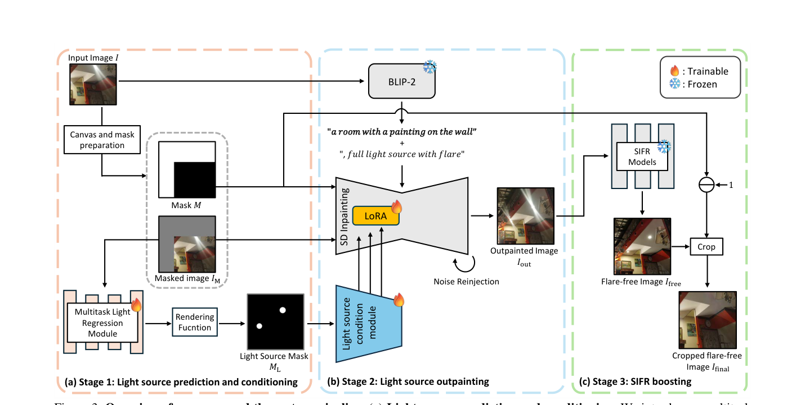
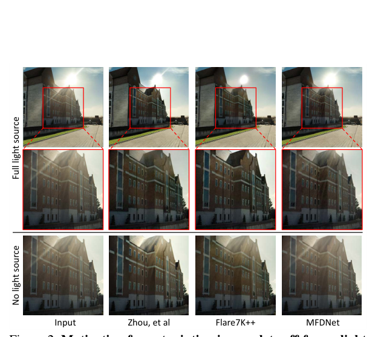
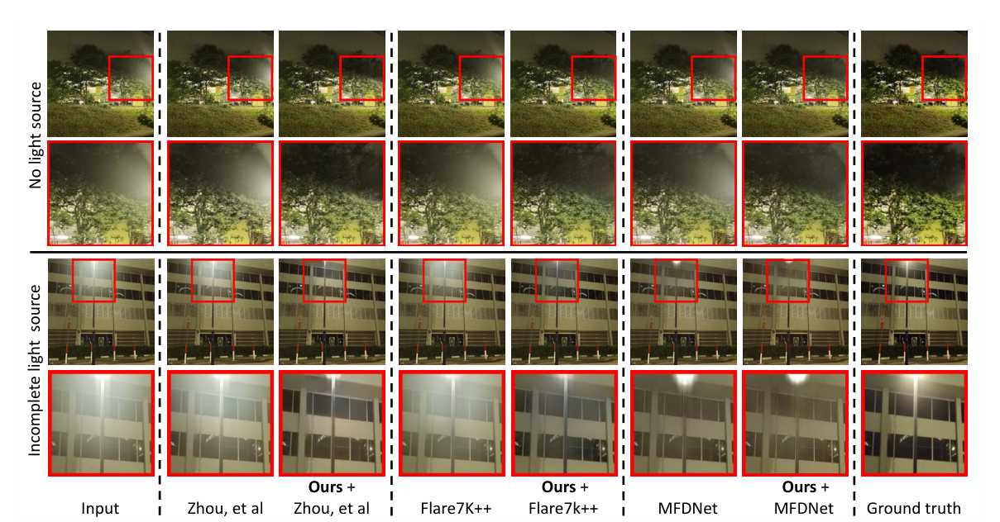

# LightsOut: Diffusion-based Outpainting for Enhanced Lens Flare Removal

> **发表**：ICCV 2025　|　**作者**：Shr-Ruei Tsai et al.（阳明交通大学，通讯 Yu-Lun Liu）
> **论文**：https://arxiv.org/abs/2510.15868　|　**代码**：https://github.com/Ray-1026/LightsOut-official

## 一、解决的问题

单图眩光去除（SIFR）近年靠数据集（Flare7K/7K++）与网络结构（MFDNet、Difflare 等）取得了长足进步，但这些方法有一个隐含假设：**造成眩光的光源在画面内且完整可见**。现实拍摄中光源经常在画框外或只露出一部分（路灯在取景框上沿外、太阳被裁掉一半等），此时眩光仍然存在于画面中，而模型却失去了"光源位置/强度"这一关键上下文。

论文用实验（图 2）量化了这一现象：同一场景，当画面包含完整光源时，Zhou et al.、Flare7K++、MFDNet 等 SOTA 方法都能有效去除眩光；一旦光源不完整或缺失，这些方法的输出残留大量眩光伪影，PSNR/LPIPS 显著恶化。也就是说，"off-frame light source" 是当前所有 SIFR 模型的一个共性失效模式，而此前没有工作显式处理它。

本文的思路是反直觉但合理的：与其重训 SIFR 模型去适应"无光源"输入，不如先用生成模型**把画框外的光源外推（outpaint）回来**，把"困难输入"变成"容易输入"，再交给任意现成 SIFR 模型处理——即一个即插即用、无需重训下游模型的预处理框架。

## 二、核心创新点

1. **首次指出并系统量化 SIFR 的 off-frame 光源失效模式**，并提出"先外推光源、再去眩光"的任务分解策略，而不是端到端硬扛。
2. **多任务回归光源预测模块**：不走 U-Net 出整张 mask 的老路，而是把光源参数化为 N 个圆 (x, y, r) + 置信度 c，用 CNN 特征 + 双 MLP 回归，配 DETR 式二分图匹配的 smooth-L1 位置损失与 BCE 置信度损失，并用不确定性加权（可学习 σ1/σ2）自动平衡两个损失。
3. **光源条件化的 LoRA 微调外推模型**：在 Stable Diffusion v2 inpainting 模型上注入 LoRA，配合一个轻量"光源条件模块"（以渲染出的光源 mask M_L 为约束，L2 损失监督），使外推内容在物理上与真实眩光/光照分布一致。
4. **两个工程细节**：(a) RGB 空间 alpha 合成代替 latent 空间混合，避免保留区域失真；(b) 噪声重注入（noise reinjection，重复 4 次），缓解 masked/unmasked 区域分别去噪导致的不一致。
5. **即插即用**：对 Zhou et al.、Flare7K++、MFDNet 三个下游模型一律涨点，无需任何重训。

## 三、模型结构与方案

> 图 3：LightsOut 三阶段管线。(a) 光源预测与条件化：多任务回归模块预测光源 (x,y,r) 与置信度，经渲染函数生成光源 mask；(b) 光源外推：BLIP-2 生成文本提示，LoRA 微调的 SD inpainting 模型在光源条件约束下外推画框外内容；(c) SIFR 增强：外推图送入冻结的现成 SIFR 模型去眩光，最后裁回原图区域。（来源：原论文）

**Stage 1（光源预测与条件化）**：输入眩光图 I，先做画布扩展与 mask 准备得到 I_M 和二值 mask M。多任务回归模块 F_θ（CNN）+ G_φ/H_ψ（双 MLP）输出 N=4 组光源参数 P=(x,y,r) 和置信度 c。训练用二分图匹配（参照 DETR）保证排列不变性，位置损失只对 c_gt=1 的配对计算；总损失按 1/(2σ²) 不确定性加权。推理时经 sigmoid 阈值化的渲染函数 M_L(x,y)=Σ c̃_i·σ(r_i−√((x−x_i)²+(y−y_i)²)) 生成软光源 mask。

**Stage 2（光源外推）**：在 SD v2 inpainting 模型上做 LoRA 微调（学习率 1e-4，batch 8，25k 步），文本提示由 BLIP-2 自动生成并附加 ", full light source with flare"。光源条件模块用 L_light=||M̃_L−M_L||² 训练，推理时作为约束引导生成位置正确的光源。采样 50 步、guidance scale 7.0、噪声重注入 4 次；最终用 mask M 在 **RGB 空间**做 alpha 合成，保证原图区域零失真、边界平滑。

**Stage 3（SIFR boosting）**：外推图 I_out 输入冻结的任意 SIFR 模型得到 I_free，再裁剪回原图范围得 I_final。

**训练数据**：完全基于 Flare7K 合成管线（Flickr24K 背景 + 散射/反射眩光），用 YCbCr 亮度 mask + 最大矩形算法自动构造"裁掉光源"的不完整输入。评测集为 Flare7K 测试集（100 真实 + 100 合成），构造两种场景：无光源、不完整光源（边界外移 15 像素）。

> 图 2：动机实验。上排（完整光源）SOTA 方法去眩光正常；下排（光源被裁掉）同样方法全部退化，残留明显伪影。（来源：原论文）

## 四、实验与结果

**主结果（表 1）**：在 Flare7K Real / Synthetic 两个测试集、无光源与不完整光源两种设定、三个下游 SIFR 模型上全面对比 Direct input、SD-Inpainting、SDXL-Inpainting、PowerPaint 与本文方法。代表性数字（无光源、Flare7K Real）：
- Flare7K++ 直接输入 26.29 dB → +LightsOut **28.41 dB**（SSIM 0.8337→0.8956，LPIPS 0.0442→0.0397，G-PSNR 21.35→24.15，S-PSNR 18.71→22.83）；
- Zhou et al. 26.42 → 27.09 dB；MFDNet 27.04 → 27.43 dB；
- 通用外推模型不可靠：SD-Inpainting 接 MFDNet 反而掉点（27.04→26.82），SDXL/PowerPaint 多数设定下为负收益。

**光源预测（表 2/6）**：多任务回归 mIoU 0.6310（real）/0.6619（synthetic），优于 U-Net 基线（0.6216/0.6563）与可微渲染优化（0.5212/0.5077）。

**关键消融**：
- 表 3：把 Flare7K++ 直接用不完整/无光源数据**重训**，也只到 27.03 dB，仍低于"不重训 + LightsOut"的 28.41 dB——这是支撑"分解优于端到端"主张的最重要实验。
- 表 4：噪声重注入 +0.13~0.36 dB，LPIPS 改善明显。
- 表 5：RGB 合成 vs latent 合成，在合成集上差距巨大（31.55 vs 24.13 dB）。
- 表 7：LoRA 与条件模块各贡献约 +0.3/+0.24 dB，叠加最优（27.43 dB）。

下游任务（YOLOv11 检测）也验证了对被眩光淹没目标的检测置信度提升。失败模式：整图亮度高（眩光对比弱）或眩光占比过大时仍难以精确界定眩光区域。

> 图 5：无光源（上）与不完整光源（下）两种场景下，三个 SIFR 方法加/不加 LightsOut 的对比，加上外推预处理后结果明显更接近 GT。（来源：原论文）

## 五、专家锐评

**价值**：这篇论文最值钱的是问题发现——"off-frame 光源导致 SIFR 集体失效"是一个真实、可量化、此前无人显式处理的盲区；表 3 的重训对照实验也相当聪明，预先堵住了"你为什么不直接重训"的审稿质疑，证明了任务分解的必要性。作为即插即用预处理，它对社区现有模型的兼容性好，工程上（RGB 合成、噪声重注入、参数化光源回归）的取舍都有消融背书，是一篇完成度很高的"问题驱动"论文。

**不足与质疑**：
1. **绝对增益与开销不成比例**。除 Flare7K++ 一行（+2.12 dB）外，对 Zhou et al.（+0.67 dB）和 MFDNet（+0.39 dB）的提升相当有限；而代价是每张图跑一次 BLIP-2 + 50 步 SD 采样 + 4 次噪声重注入 + 一次光源回归。论文自己也承认计算开销问题，但全文没有给出任何推理延时数字——对一个标榜"即插即用预处理"的方法，这是不可原谅的缺失。最大受益者 Flare7K++ 恰好是其直接输入基线最弱（SSIM 0.8337 异常偏低）的那个，平均增益被单点拉高的嫌疑存在。
2. **评测场景是人工构造的**。"无光源/不完整光源"测试集靠裁剪 Flare7K 图像 + 边界外移 15 像素生成，光源被裁掉的方式、外推区域大小都由作者算法（亮度 mask + 最大矩形）决定，与训练数据构造完全同源。真实 off-frame 场景的光源距画框可以任意远、眩光与光源几何关系更复杂，而 in-the-wild 验证只有补充材料里少量无 GT 的视觉示例，没有任何定量。
3. **圆形光源参数化过强**。把光源建模为 N=4 个圆，对路灯、太阳尚可，对条状灯带、车灯阵列、橱窗等非圆光源必然失效；mIoU 只有 0.63 左右，说明光源定位本身远谈不上精确，而 Stage 2 的条件约束恰恰建立在这个不精确的 mask 上。误差如何沿三阶段级联放大，论文没有分析（例如光源预测错误时外推出"幻觉光源"，反而可能诱导 SIFR 错误去除）。
4. **外推内容是"编造"的，评测却只在原图区域算指标**。最终裁剪回原图意味着外推区域只是中间产物，但 SIFR 模型在外推图上的行为受幻觉内容影响——如果 SD 外推出与真实场景不符的光源颜色/强度，去眩光的残差会留在原图区域内。这种幻觉敏感性没有专门实验（如对同一输入多次采样的方差分析）。
5. **对比不完整**。Difflare 因无公开实现被排除可以理解，但同期的扩散式 SIFR 方法仅以脚注带过；外推基线也没有把"GT 完整光源图"作为 oracle 上界列出来，读者无法判断 LightsOut 距离"光源信息完全恢复"还有多远。
