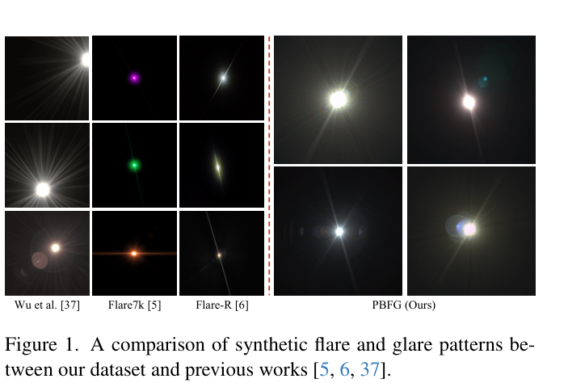
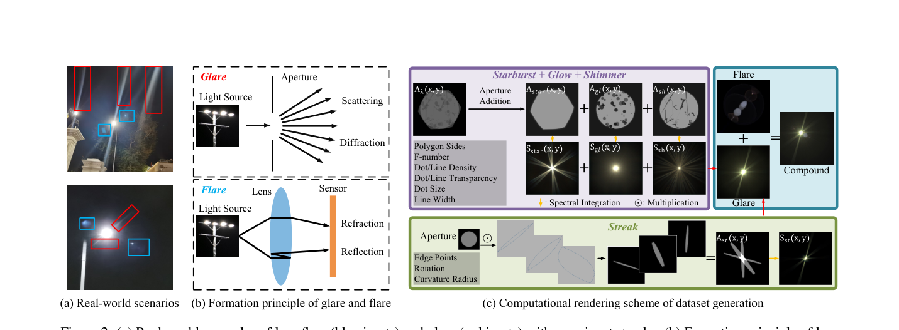
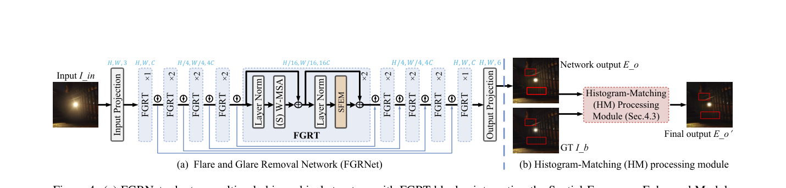
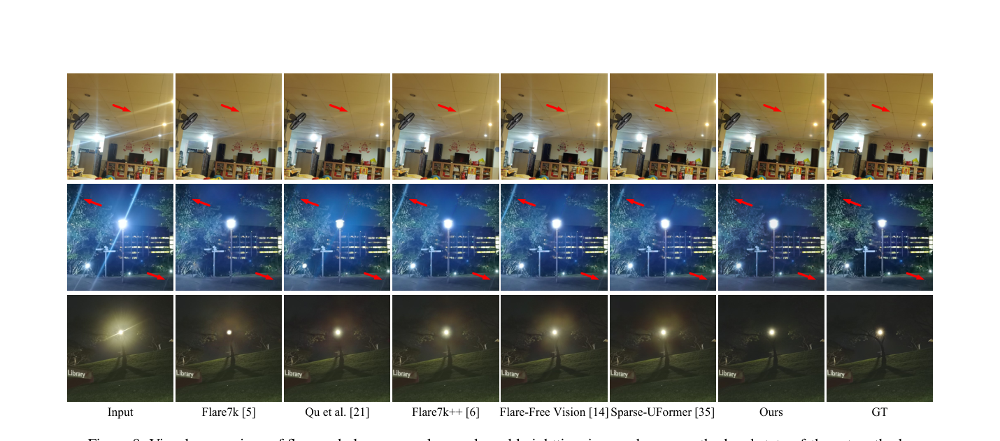

# PBFG: A New Physically-Based Dataset and Removal of Lens Flares and Glares

> **发表**：ICCV 2025　|　**作者**：Jie Zhu, Sungkil Lee（成均馆大学，通讯 Sungkil Lee）
> **论文**：https://cg.skku.edu/pub/papers/2025-zhu-iccv-pbfg-cam.pdf　|　**代码/数据集**：https://github.com/cgskku/pbfg

## 一、解决的问题

夜间镜头伪影按物理成因可分两类：**flare（眩光/鬼影）**来自镜组内部 Fresnel 反射，呈对称的光圈形"ghost"；**glare（炫光）**来自光圈与指纹的衍射以及表面污染/镜片缺陷的散射，包含 starburst（星芒）、glow（光晕）、shimmer（微光）、streak（条纹）四种子类型。这些伪影在夜间尤其严重，影响自动驾驶、车牌识别、目标检测等任务。

数据侧的痛点是：现有合成数据集物理真实性不足——Wu et al. 的半合成数据缺少夜间最显著的 streak；Flare7K 用 Adobe After Effects 手工制作，存在过饱和颜色、形状失真和不自然的条纹边缘；真实数据集（Flare-R 962 个、FlareReal600 500 个等）则图案单一、缺乏标注。方法侧的痛点是：现有去除网络（以 Uformer 为代表）全局特征提取不足，对大面积 glow、多条纹/画外光源引起的条纹常留残影；而单纯加大卷积核会带来计算开销。此外作者还指出一个被忽视的评测问题：Flare7K++ 公开测试集的 GT 本身在光源附近残留 glow/flare，会反过来惩罚"恢复得太干净"的方法，损害基准可信度。

## 二、核心创新点

1. **PBFG 数据集**：用基于波动光学/光线追踪的计算渲染方案物理生成 120 种 flare 图案 + 168 种 glare 类型，扩充为 2,600 个 flare 与 4,000 个 glare 模板，并带全套标注（光源、streak、glow、shimmer、starburst 等），是首个带 starburst 标注的合成数据集（对照表 1）。
2. **改进的 streak 合成**：把条纹纹理建模为"双侧弯曲边缘"（double-sided curved edge），通过旋转角 U(0,90°)、弧曲率半径 U(3,16)、1~4 条多 streak 随机加权组合，比 Lee et al. 的多边形分解更可控、更逼真，直接提升弱条纹去除精度。
3. **PBStar 数据集**：额外提供 1,000 张、42 种配置的物理星芒数据（光圈叶片数 5–11、F 数 f/4–f/22），面向专业相机风格的艺术化夜景渲染。
4. **FGRNet**：在 Uformer 骨干上用 SFEM（空间-频率增强模块）替换 FFN——SRU（空间重建单元）做带冗余抑制的多尺度空间特征，FEU（频率增强单元）用 channel-wise real FFT 获得全图感受野；二者通道拆分并行、求和融合。
5. **直方图匹配（HM）后处理模块**：按通道对齐输出与 GT 的概率密度函数，解决大面积 glare 去除后整体色调/对比度偏移的问题。
6. **修正评测基准**：手工修复 Flare7K++ 测试集中残留伪影的低质量 GT，给出更公平的评测（图 7 显示 GT 修复前后 ΔPSNR 可差 3 dB 以上）。

## 三、模型结构与方案

**数据生成（物理渲染）**：
- *Glare*：根据 Huygens 原理，光经"脏光圈"（dirty aperture）衍射；采用远场 Fraunhofer 近似，对光圈几何 A_λ(x,y) 取傅里叶变换的平方得功率谱 F(u,v)。脏光圈由 starburst（多边形光圈）、glow（随机圆点模拟灰尘，n_d~N(20,intensity²)）、shimmer（随机折线模拟镜片缺陷）、streak（弯曲双边缘）四个分量叠加构成。色彩通过 380–780 nm（5 nm 步长）的光谱积分获得，模拟色差与镀膜引起的颜色过渡。
- *Flare*：基于 Hullin et al. (SIGGRAPH 2011) 的物理光线追踪，对 15 种光学系统配置枚举 n(n−1)/2 个双反射面对，结合 8 个常用 F 数、多波长光源与随机光学参数，生成 120 种 flare 图案。
- *光源标注*：合成 glow mask + 从 0.9999 逐步递减 0.0002 的亮度阈值法 + 形态学开运算。

> 图 1：PBFG 与 Wu et al.、Flare7K、Flare-R 合成/采集眩光图案的对比，PBFG 在星芒、色彩过渡上明显更接近真实相机。（来源：原论文）

> 图 2：(a) 真实场景中的 flare（蓝框）与 glare（红框）；(b) 二者物理成因（衍射/散射 vs 反射）；(c) 计算渲染管线：紫框为脏光圈合成（starburst+glow+shimmer），绿框为可控 streak 合成，蓝框为 flare 与 glare 整合。（来源：原论文）

**FGRNet**：Uformer 式多尺度 U 形结构，编码/解码各阶段堆叠 FGRT 块（[1,2,2,2] 配置，瓶颈 2 块）。FGRT = LayerNorm + (Shifted) W-MSA + LayerNorm + SFEM。SFEM 内部：特征经两层线性 + GeLU 后按通道一分为二，分别走 SRU 与 FEU，输出求和。SRU 用 GroupNorm 可训练参数衡量通道空间信息量，经 sigmoid 阈值分成信息丰富/贫乏两支，再交叉重建抑制冗余；FEU 用 2D real FFT 把特征变换到频域，经三层 1×1 卷积 + LeakyReLU 后逆变换回空间域（频域逐点操作等价于空间域全局卷积），残差连接输出。

> 图 4：(a) FGRNet 多尺度层级结构与 FGRT 块（内含 SFEM）；(b) 直方图匹配（HM）后处理模块。（来源：原论文）

**损失函数**：L = 0.5·L1 + 0.5·L_vgg + 1.0·L_rec + 0.6·L_neg-ssim（L_rec 为 Flare7K++ 的重建损失）。训练遵循 Flare7K++ 管线：512×512 随机裁剪、Adam、40K 迭代、初始 lr 1e-4 在 20K 减半，单卡 RTX 3090。

## 四、实验与结果

**数据集有效性**：同一模型（Flare7K++ 管线）分别在 Wu et al.、Flare7K、Flare7K++、PBFG 上训练后测真实夜景图——表 2 中**每一个**方法换用 PBFG 训练都全面涨点，例如 Flare7K++ 模型：PSNR 27.316→27.920，G-PSNR 23.543→24.330，S-PSNR 22.181→23.115；Wu et al. 模型 S-PSNR 从 16.762→18.213。证明物理渲染模板对真实分布的覆盖确实更好。

**方法对比**（共 9 个对手：Wu et al.、Flare7K、Zhou et al.、FF-Former、Qu et al.、Flare7K++、Zou et al.、Flare-Free Vision、Sparse-UFormer）：在 PBFG 训练集上，FGRNet 达 PSNR 28.659 / SSIM 0.898 / LPIPS 0.0426 / G-PSNR 25.444 / S-PSNR 24.385，已超全部对手（最强对手 Sparse-UFormer 为 28.075/24.407/23.613）；加 HM 后进一步到 **PSNR 30.366 / SSIM 0.927 / LPIPS 0.0403 / G-PSNR 27.549 / S-PSNR 25.706**。摘要所称"最高 2.3 dB（整图）与 3.14 dB（glare 区域）增益"即由此而来。

**消融**：
- SFEM（表 3，PBFG 训练）：Uformer 基线 29.124 → +SRU 29.508 → +FEU 29.932 → FGRNet 30.366（G-PSNR 25.444→27.549）。视觉消融（图 9）显示 FEU 单独使用会把高频弱光源误判为伪影删掉，SRU 单独使用则去不掉弱条纹，两者互补。
- HM 模块：glare 区域 PSNR 最高 +2.1 dB；直方图可视化（图 10）显示无 HM 时输出强度分布向暗端偏移、对比度差。
- 损失（表 4）：L1→+vgg→+rec→+neg-ssim 逐项有效（29.330→29.666→30.053→30.366）。

> 图 8：真实夜景上与 Flare7K、Flare7K++、Qu et al.、Flare-Free Vision、Sparse-UFormer 的视觉对比，FGRNet 对多光源、大面积 glow 与多条纹场景去除更彻底。（来源：原论文）

## 五、专家锐评

**价值**：这是 Flare7K 之后数据侧最扎实的一次升级——把"After Effects 手绘模板"换成 Fraunhofer 衍射 + 光谱积分 + 物理光线追踪的可解释渲染管线，且用"同一模型换数据集训练全面涨点"的对照实验干净地证明了数据贡献。作者团队（Sungkil Lee 是 SIGGRAPH 2011 物理眩光渲染的原作者之一）把图形学的正向渲染积累反哺到视觉的逆问题，路线天然合理。指出并修复 Flare7K++ 测试集 GT 残留伪影的问题，对整个 benchmark 生态也是实在的贡献。

**不足与质疑**：
1. **HM 模块在评测中的角色严重存疑**。HM 在推理时需要 GT 图像来做直方图对齐（图 4(b) 明确以 GT I_b 为输入），而表 2 的最优行 "FGRNet + HM" 正是用了 GT 信息后的成绩（30.366 vs 不用 HM 的 28.659）——拿测试集 GT 参与推理再与不使用 GT 的对手比 PSNR，这接近 oracle 设置，+1.7 dB 的增益不应计入公平对比。论文用图 11"无 GT 时 FGRNet 也能去除伪影"轻描淡写带过，但没有给出无 GT 替代方案（如用网络估计目标直方图）的任何定量结果。
2. **修改 GT 后既当运动员又当裁判**。作者手工"增强"了 Flare7K++ 测试集的 GT 再在其上评测，而图 7 显示 GT 修改对不同方法的 ΔPSNR 影响不对称（对自己方法 +1.3 dB，对 Flare7K++ 是 -3.3 dB 到 +0.8 dB 不等）。手工修复的标准、数量、是否公开都未充分交代，存在向有利于自己方法方向修 GT 的系统性风险；严谨做法是新旧 GT 两套数字都完整报告。
3. **网络模块新颖性有限**。SRU 基本是 SCConv（CVPR 2023）的空间重建单元思路，FEU 的 real FFT + 频域 1×1 卷积在 DeepRFT、FF-Former 等去模糊/去眩光工作中已是成熟套路；"频率全局 + 空间局部"的二分叙事在 2025 年已无新意。消融里 Uformer+FEU（29.932）与完整 FGRNet（30.366）只差 0.43 dB，说明真正干活的是 FEU，SFEM 的"组合创新"增量很薄。
4. **缺少效率对比**。论文以"大卷积核增加计算成本"批评他法引出 SFEM，却没有报告 FGRNet 自身的参数量、FLOPs 或推理时延与 Uformer/Sparse-UFormer 的对比，频域分支和逐块 FFT 的开销不明，立论与证据脱节。
5. **评测只覆盖夜间真实集，且依赖 Flare7K++ 的 100 张级别小测试集**；PBStar 数据集只服务于"艺术星芒合成"这一与去除任务无关的副产品，对核心任务的贡献未被验证（没有任何"加/不加 starburst 模板训练"的消融），更像凑数据集数量的附赠品。
