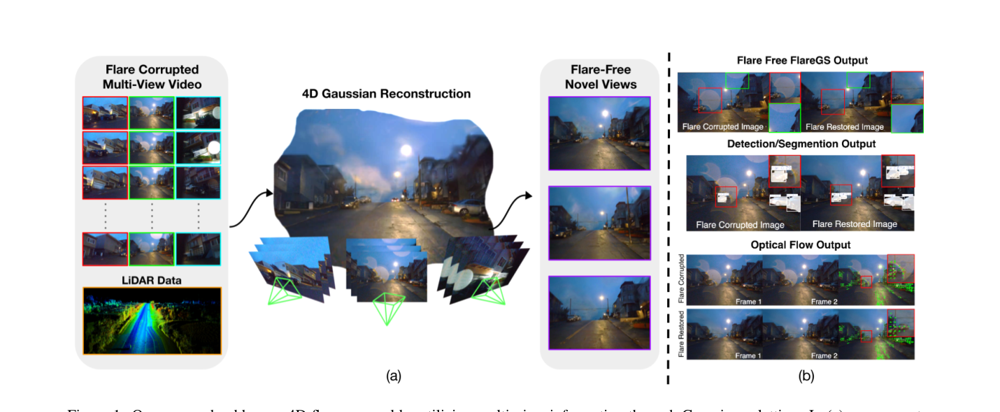
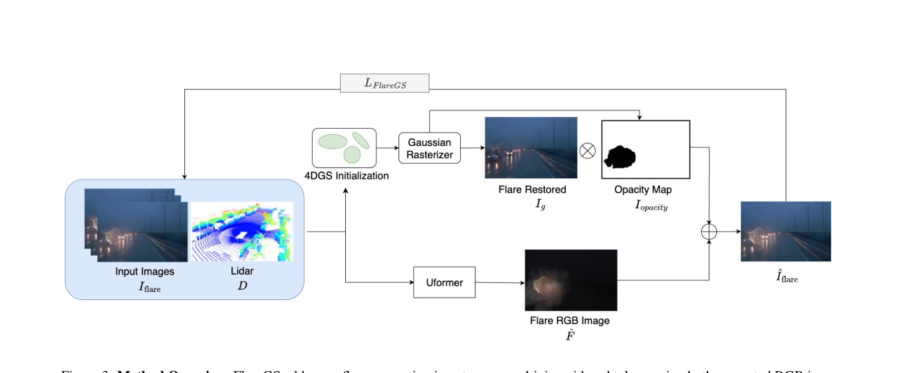
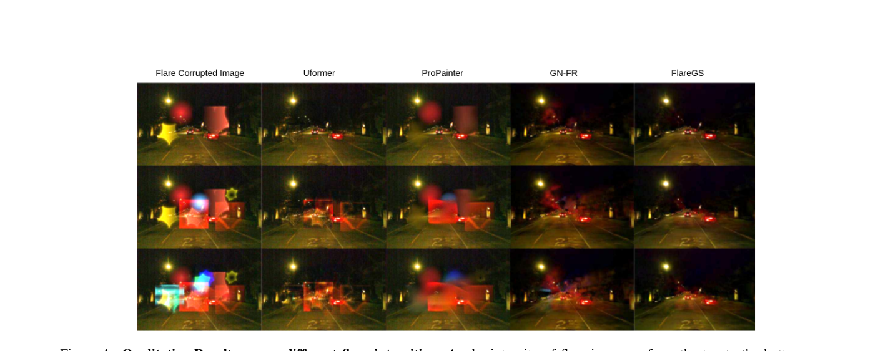

# FlareGS: 4D Flare Removal using Gaussian Splatting for Urban Scenes

> **发表**：ICCV Workshop 2025　|　**作者**：Mayank Chandak et al.（印度理工学院马德拉斯分校，通讯 Kaushik Mitra）
> **论文**：CVF Open Access (ICCVW 2025)　|　**代码**：未开源

## 一、解决的问题

自动驾驶相机在夜间/雨天等恶劣条件下经常被眩光伪影污染：光晕（halo）、鬼影（ghosting）、内反射，以及水滴、挡风玻璃冷凝/内反射造成的散射型眩光。这些伪影与传统意义上的"镜头眩光"成因不同（涉及挡风玻璃、雨滴的 Mie 散射等），且在视频中随运动、光照和环境动态变化，时间上高度不一致，是此前文献基本没有系统处理过的问题。

现有方法的不足：单图方法（Uformer 系、Flare7K 系）逐帧处理，无法保证时间一致性，且当眩光覆盖画面大部分（极端情况超过 50%）时只能"凭空"修补；基于 NeRF 的 GN-FR 通过 mask 掉眩光区域不计算梯度来避免把眩光重建进场景，但 mask 一大就会留下大块信息空洞，重建不完整，且依赖精确眩光 mask、在真实驾驶数据上泛化差。同时，现有方法都没有利用自动驾驶平台（Waymo、nuScenes）天然具备的多相机视角与 LiDAR 深度信息。

本文提出 FlareGS：第一个面向自动驾驶视频的系统性 4D 眩光去除框架，把"单帧去眩光先验 + LiDAR 深度先验 + 多视角高斯泼溅重建"组合起来，同时实现去眩光与任意视点/时刻的新视角合成。

## 二、核心创新点

1. **问题设定新**：首次把眩光去除放到"多视角视频 + LiDAR"的 4D 城市场景重建框架里做，可输出任意视点与时间戳的无眩光新视角，并直接服务于检测/分割/光流等下游任务。
2. **物理启发的合成眩光管线**：基于 Fraunhofer 衍射（光圈函数的傅里叶变换，偶数叶片 N 条芒、奇数叶片 2N 条芒）、时变 PSF 模拟雨滴 Mie 散射、二次 Bézier 曲线构造弯曲多边形光圈叶片产生鬼影、分通道分数阶傅里叶变换（FrFT）模拟色散拖尾，生成贴近 Waymo 夜间分布的动态眩光。
3. **深度作为眩光不变先验**：LiDAR 时间飞行测距不受光学眩光影响；将稀疏 LiDAR 投影用逆距离加权插值成稠密深度图，与 RGB 拼成 4 通道输入 Uformer，帮助定位眩光区域、保持结构。
4. **"重建眩光"而非"丢弃眩光"的监督方式**：与 GN-FR 的 mask-out 策略相反，FlareGS 让 4DGS 渲染干净图像 I_g 与不透明度图 I_opacity，再与冻结 Uformer 预测的眩光分量 F̂ 在线性光空间（γ=2.2）合成回带眩光图像，用原始眩光帧直接监督——眩光区域不再是监督盲区，大面积眩光下也能利用全部像素的梯度。

## 三、模型结构与方案

**整体管线**（图 3）：三个组件——(1) 合成数据生成；(2) 深度引导的 Uformer 去眩光网络（先训好、之后冻结）；(3) 以 Uformer 输出为引导训练的 4D Gaussian Splatting 场景模型。

> 图 1：(a) 从眩光污染的多视角视频 + LiDAR 重建 4D 场景表示，渲染任意视点/时刻的无眩光新视角；(b) 去眩光后检测、分割、光流等下游任务表现提升。（来源：原论文）

**合成眩光**：几何眩光用光圈函数 A(x',y') 的 Fraunhofer 衍射积分建模；圆形眩光为半径随时间衰减的半透明圆盘 r_t=max(r_0−t, r_min)，按固定角度间隔加角向遮挡模拟部分遮蔽；星芒用二次 Bézier 曲线弯曲多边形叶片（控制点内偏移量 β 诱导鬼影）；色散用分通道 FrFT（chirp 调制核，每通道不同分数阶 α_c）合成方向性彩色拖尾。三种污染强度模式：m1（每图约 3–5 个眩光）、m2（8–10 个）、m3（13–15 个），并按夜间驾驶常见光源设计 RGB 颜色预设。

**深度引导 Uformer**：输入 [I_flare; D] ∈ R^{H×W×4}，双分支输出无眩光图 Î_clean 和眩光分量 F̂，满足 Î_flare ≈ Γ^{-1}(Γ(Î_clean)+Γ(F̂))（γ 校正模拟线性成像）。损失：双分支 L1 + 输入重建 L1 + VGG 感知损失 + 对抗损失 + 判别器特征匹配损失。

**FlareGS 4D 重建**：4DGS（借鉴 OmniRe 的动态城市场景建模）渲染 I_g 与 I_opacity，与冻结 Uformer 的 F̂ 在线性空间合成：I_flare^lin = I_g^lin·I_opacity + F^lin，再映回 sRGB 与真实眩光帧比对。损失共 8 项：L1 重建 + SSIM + 随训练指数衰减的 LiDAR 深度一致性损失 + 不透明度熵正则（前景/背景分离）+ 逆深度平滑 + 仿射正则 + 动态区域重建 + 类别相关高斯正则。

> 图 3：FlareGS 训练流程。RGB+LiDAR 输入冻结的 Uformer 估计眩光图；4DGS 渲染干净图与不透明度图，与眩光图线性合成回污染图像，用真实眩光帧监督。（来源：原论文）

**训练数据**：共 1,000 对图像——500 对来自 Flare7K，500 对用本文管线合成；背景取自 Waymo Open Dataset 的 6 段傍晚 + 6 段夜间序列，训练时在线叠加眩光增广。

## 四、实验与结果

**对比方法**：Uformer（RGB+深度）、ProPainter（视频 inpainting）、GN-FR（NeRF 系 4D 去眩光）、FlareGS。所有基于 mask 的方法（GN-FR、ProPainter、FlareGS）使用同一套由 Uformer 预测生成的眩光 mask，以隔离重建质量变量。指标：PSNR、SSIM、LPIPS、Masked PSNR（眩光区域）。

**主结果（表 1）**：
- m1（轻度眩光）：Uformer 最佳（PSNR 42.47 / Masked PSNR 25.64），FlareGS 第二（41.68 / 24.86）；
- m2：FlareGS PSNR 37.87 / Masked PSNR **24.83**，超过 Uformer（36.61 / 23.57）、GN-FR（36.05 / 23.00）、ProPainter（34.44 / 21.39）；
- m3（重度眩光）：FlareGS PSNR 35.73 / Masked PSNR **24.46**，全面领先（Uformer 33.88/22.61，GN-FR 34.18/22.92）。
- 趋势明确：眩光越重，多视角信息的价值越大；FlareGS 的 Masked PSNR 在三个强度档上都是第一，且方差更小（±2.38~3.27）。

**定性结果**：图 4 显示随眩光强度增加，对比方法出现明显残影/伪影而 FlareGS 保持稳定；图 5 展示真实驾驶场景中圆形眩光、雨滴眩光被去除且路灯可见性保留。**下游任务**：YOLOv12 分割在去眩光后恢复了被强眩光完全遮蔽的车辆检测，部分遮挡下的分割 mask 也更准确。

**局限**（作者自述）：眩光覆盖超过约 90% 画面时，Uformer 可能把大片区域误判为缺失、mask 失准，多视角模块也因结构信息不足而重建失败。

> 图 4：m1→m3 眩光强度递增时各方法的定性对比，FlareGS 在重度眩光下仍能输出干净、细节完整的重建。（来源：原论文）

## 五、专家锐评

**价值**：选题站在了一个合理的交叉点上——自动驾驶平台天然有多相机 + LiDAR，而眩光恰恰是单视角病态、多视角可解的退化类型；"用 4DGS 重建眩光分量并以原始污染帧自监督"的设计相比 GN-FR 的 mask-out 策略是实质性改进，把大面积眩光从"监督盲区"变成了可利用信号。深度作为眩光不变先验的观察简单但站得住。作为 workshop 论文，把问题定义、数据管线、双阶段框架和下游任务验证都跑通了，完成度合格。

**不足与质疑**：
1. **主表数字反而削弱叙事**：表 1 中 Uformer 在 m1 的所有全局指标（PSNR 42.47 vs 41.68、SSIM、LPIPS）都优于 FlareGS，m2/m3 的 SSIM/LPIPS 也互有胜负，FlareGS 真正稳赢的只有 Masked PSNR 一项。论文用"UFormer 是纯 2D 方法、我们还做了视图合成"来辩护，但这恰恰说明 4DGS 重建对非眩光区域引入了保真度损失——做了更多事不是指标变差的豁免理由，至少应该报告新视角合成质量（held-out 视角）来兑现"4D"的卖点，然而全文没有任何 novel view 的定量评测。
2. **评测在自己构造的合成分布上进行**，m1/m2/m3 由本文管线生成，训练与测试同源；真实雨夜数据只有无 GT 的视觉展示（图 5），连 no-reference 指标都没有。对一个声称面向"real-world driving videos"的工作，缺乏任何真实数据的定量验证是硬伤。
3. **级联误差与公平性问题**：FlareGS 的眩光分量 F̂ 来自冻结的 Uformer，等于把对手（Uformer）当作自己的前置模块——其 mask 也喂给了 GN-FR/ProPainter，但 F̂ 的 RGB 眩光估计只有 FlareGS 用到。Uformer 估错眩光时 4DGS 如何受影响，没有敏感性分析；作者自己承认 >90% 覆盖时全线崩溃，但崩溃边界在哪、何时开始劣于单帧方法，没有实验刻画。
4. **消融严重不足**：深度先验的作用只在补充材料给了定性结果，正文无定量消融；8 项损失（熵正则、仿射正则、动态区域、类别高斯正则等）一项都没消融，权重"经验选取"且未公布，方法的可复现性与各组件必要性无从判断。论文也未报告训练/渲染时间——逐场景优化的 GS 在自动驾驶在线场景中如何落地，只字未提。
5. **写作与严谨性瑕疵**：合成管线声称"physics-informed"，但圆盘半径线性衰减、固定角度遮挡等设计实为启发式动画而非物理仿真，与 Fraunhofer/Mie 的论述之间存在包装痕迹；训练数据仅 1,000 对、12 段 Waymo 序列，规模与"systematic effort"的自我定位不相称。
