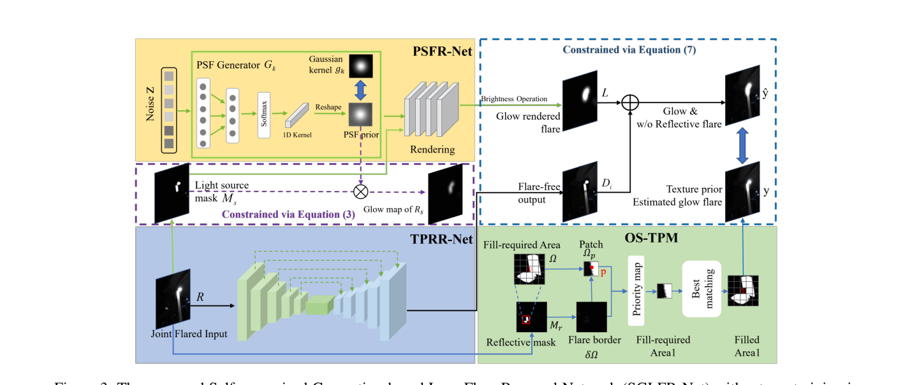
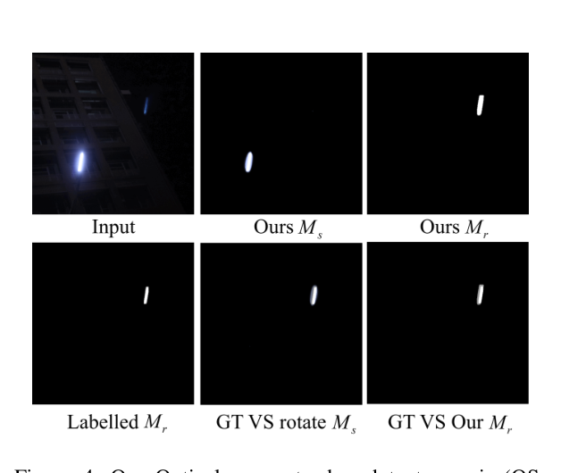
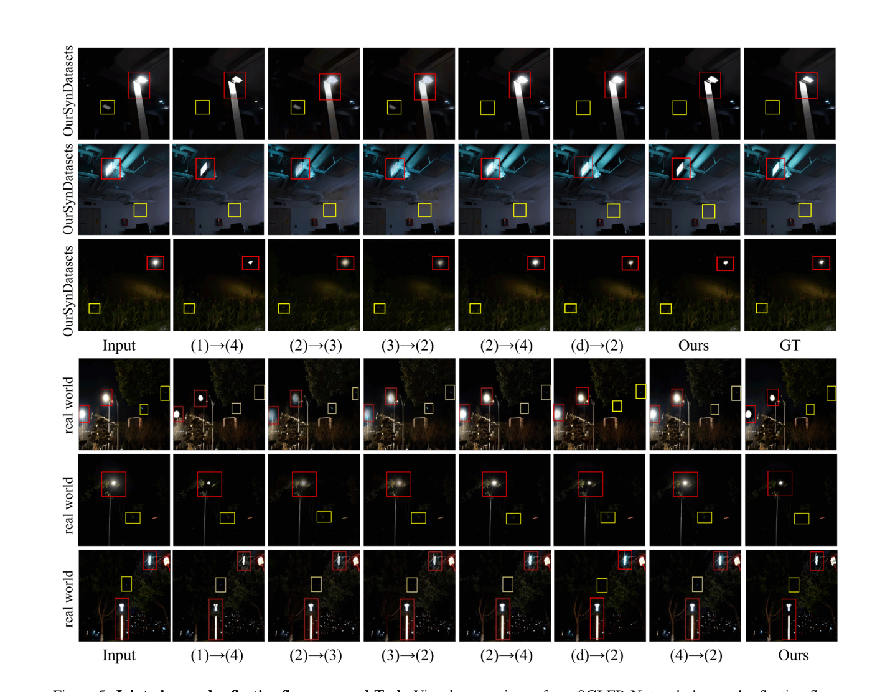
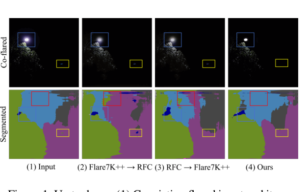

# Disentangle Nighttime Lens Flares: Self-supervised Generation-based Lens Flare Removal

> **发表**：AAAI 2025　|　**作者**：Yuwen He, Wei Wang*, Wanyu Wu, Kui Jiang（武汉科技大学、哈尔滨工业大学）
> **论文**：https://arxiv.org/abs/2502.10714　|　**代码**：https://github.com/xhnshui/Flare-Removal

## 一、解决的问题

夜间镜头眩光类型繁多：glow（光晕）、veiling glare（雾化炫光）、reflective flare/ghost（反射鬼影）等。现有方法都是"专科医生"——Flare7K++ 系列治 glow/散射眩光，BracketFlare（CVPR 2023）治反射鬼影——但**真实夜景中同一光源会同时产生 glow 和鬼影**，二者来自同一光源、在同一传感器阵列内同时成像，存在复杂的相互依赖关系，而非简单可加。

论文用图 1 的实验展示：把去 glow 方法与去鬼影方法级联（无论先后顺序），都无法干净处理共存眩光——glow 残留（蓝框）、鬼影残留（黄框），且级联结果还会误导下游语义分割（天空区域被错分，红框）。另一个根本性痛点：合成配对数据无法精确建模镜组内复杂的成像光路，监督方法依赖训练数据导致泛化受限。

本文提出夜间镜头眩光形成模型（Nighttime Lens Flare Formation Model），统一描述 glow 与鬼影的联合物理形成过程，并据此设计了**无需任何训练数据、无需预训练、逐图自监督优化**的 SGLFR-Net，一次性联合去除 glow 与反射鬼影。

## 二、核心创新点

1. **联合眩光形成物理模型**：首次把同一光源同时产生的 glow（散射路径，GTF_s）与反射鬼影（镜间折反射路径，GTF_r）统一到一个成像方程 R = I_0 + I*ĜTF_s + I*ĜTF_r 中，显式建模二者的相互依赖，而不是当作两个独立退化级联处理。
2. **首个"联合去 glow+去鬼影"任务及解决方案**：此前文献只各管一种；本文同时定义任务、构造数据（OurSynDatasets）并给出方法。
3. **零训练数据的自监督范式**：类似 Deep Image Prior 的逐图优化（3000 次迭代），不依赖任何配对/非配对训练集，天然回避合成数据真实性与泛化问题。
4. **两个物理先验**：(a) PSF 渲染先验——glow 由与图像内容无关的散射 PSF 卷积光源形成，可由小网络从噪声生成模糊核来模拟；(b) 光学对称纹理先验（OS-TPM）——沿用 BracketFlare 的光学中心对称规律，把光源 mask M_s 绕光心旋转即得反射鬼影 mask M_r，再用经典 Criminisi exemplar-based inpainting（优先级图 + 最佳匹配块填充）构造无鬼影的伪标签 y 来监督网络。
5. **亮度操作层（BOL）**：通过全局/局部/百分位亮度统计的三个自适应系数（Ad_σ、Ad_φ、Ad_β）把渲染 glow 的亮度对齐到输入图像，稳定自监督优化。

## 三、模型结构与方案

**物理模型**：将无眩光图 I 到带眩光图 R 的变换写成逐像素 2D 眩光扩散函数 ĜTF 的卷积。glow 部分 GTF_s = (1−α)δ(r−r_i) + α(c+b)，即中心峰（PSF）+ 散射展宽，得 R_s = Σ(I_i×M_s)⊗PSF_i；鬼影部分基于折射定律（Snell 公式显式给出）做光线采样，R_r = Σ(I_j×M_r)⊗(2N²−1)。联合形成式 R = I_0 + G(R,M_s) + D(R)：G 由 PSFR-Net 估计 glow，D 由 TPRR-Net 估计去眩光结果。

> 图 3：SGLFR-Net 双流结构。上：PSFR-Net 从均匀噪声 z 经 FCN 生成模糊核 k，与光源 mask 卷积渲染 glow，亮度操作层对齐亮度；下：TPRR-Net（5 层 U 形编解码器）输出去眩光图 D_i；右：OS-TPM 用光心对称 + exemplar inpainting 生成伪标签 y 进行自监督。（来源：原论文）

**PSFR-Net（glow 流）**：用一个简单 FCN G_k 从均匀分布噪声 z（固定种子 0）经 SoftMax 输出 1D 向量、reshape 成 2D 模糊核 k，再经 4 层 CNN 与光源 mask 卷积模拟 glow B_l；亮度操作层 L = B_l × Ad_σ × Ad_φ × Ad_β 把渲染 glow 与输入 R 的亮度对齐。

**OS-TPM（伪标签构造）**：对输入 R 做阈值分割得光源 mask M_s，绕光学中心旋转得反射眩光 mask M_r（图 4 验证 M_r 能完整覆盖手工标注的 GT 鬼影区域）；然后在 M_r 区域执行 Criminisi 式纹理填充——以置信度项 C(p) × 数据项 T(p)（等照度线与边界法向的点积）定优先级，按 SSD + 欧氏距离 + 等照度线差 − cos(θ) 的匹配代价搜索最佳源块填充，得到"无鬼影但保留 glow"的伪标签 y。

**TPRR-Net（去眩光流）**：U-Net 式 5 层编解码器，输入 R 输出去眩光图 D_i；将 D_i 与 PSFR-Net 渲染的 glow L 合成出"有 glow 无鬼影"的 ŷ，用 L_MSE + (1−L_SSIM) 约束 ŷ ≈ y。前 1000 次迭代只用 MSE 拟合像素差，后 2000 次加 SSIM 损失拟合空间结构。光源区域用加权光源图补回，避免 glow 抑制破坏光源形状。

> 图 4：光学对称纹理先验示意。把光源 mask M_s 绕光心旋转得到的 M_r 与手工标注 GT 对齐且完整覆盖鬼影区域。（来源：原论文）

**数据**：联合任务无现成数据集，作者用 BracketFlare 训练图经 γ∼U(1.4,1.8) 处理合成 OurSynDatasets（带 GT），另采集无 GT 真实夜景；单项任务分别在 BracketFlare 基准与 ECCV2022 光效数据集上验证。

## 四、实验与结果

**联合任务（表 1，OurSynDatasets）**：与 5 个去 glow 方法（ICCV2023 Zhou et al.、Flare7K++、MM2023、ECCV2022、CVPR2024）× 4 个去反射方法（CVPR2018 Zhang、CVPR2020 Kim、ICCV2021 Dong、CVPR2023 BracketFlare）的两个方向级联组合对比。本文 **PSNR 29.65 / SSIM 0.974** 排名第一；最强级联组合为 ICCV2023→CVPR2023 的 29.23 / 0.959 与 ICCV2021→Flare7K++ 的 28.93 / 0.970（论文表述为相对 SOTA 有 1.4% / 0.4% 优势）。注意所有对手都是（半）监督方法，而本文零训练数据。

**单项反射鬼影任务（表 2，BracketFlare）**：本文 SSIM 0.967 / LPIPS 0.038，居第二，仅次于在同一数据集上全监督训练的 BracketFlare 原方法（0.994 / 0.004），但优于 Zhang CVPR2018（0.83/0.074）、Dong ICCV2021（0.907/0.041）、Kim CVPR2020（0.857/0.069）等监督反射去除方法。

**glow 抑制任务**：在 ECCV2022 光效数据集（无 GT）和真实夜景上做定性对比，本文能恢复光源形状、消除不规则 glow，而 ICCV2023、MM2023、ECCV2022、CVPR2024、Flare7K++ 仍有残留雾化眩光。

**消融（表 3）**：去掉 PSFR-Net：PSNR 29.65→27.78；去掉 TPRR-Net（换 10 层 CNN）：→29.61；去掉 1−L_SSIM：→28.18；去掉 L_MSE：→29.37。PSFR-Net 是最大贡献项；OS-TPM 与 BOL 的作用以图 8 定性验证。

> 图 5：联合 glow+鬼影去除任务上与各级联组合的视觉对比（上：合成集，下：真实夜景），仅本文方法同时去净 glow 与鬼影并保留光源形状。（来源：原论文）

> 图 1：共存眩光输入经两种级联方案处理仍残留 glow（蓝框）/鬼影（黄框）并误导语义分割（红框），本文方法（第 4 列）联合去除效果最佳。（来源：原论文）

## 五、专家锐评

**价值**：问题动机是真实的——glow 与鬼影共生于同一光源，级联处理互相牵制，这一观察以及"联合建模"的提法在夜间眩光去除文献里是新的。零训练数据的逐图自监督路线（DIP 式生成 glow + 光心对称构造伪标签）在数据稀缺的眩光领域有方法论意义：表 2 显示它在 BracketFlare 上能以无监督身份压过多个全监督反射去除方法，泛化性卖点立得住。把图形学的 PSF 渲染先验和经典 Criminisi inpainting 嫁接进自监督框架，组合方式有巧思。

**不足与质疑**：
1. **联合任务的"基准"是自家造的，且构造方式过于简陋**。OurSynDatasets 仅由 BracketFlare 训练图加一个 γ∼U(1.4,1.8) 的 gamma 变换得来——gamma 拉亮并不会产生物理意义上的 glow（散射 PSF 卷积），这与论文自己的形成模型直接矛盾：用"假 glow"验证"glow+鬼影联合物理建模"，逻辑上自我削弱。在这个分布上击败为真实 glow 设计的 Flare7K++ 等方法，说服力有限。
2. **性能优势在误差棒之内**。联合任务 PSNR 仅领先最佳级联 0.42 dB（29.65 vs 29.23），SSIM 领先 0.004~0.005；考虑到对手是在分布不匹配的数据上零样本测试的监督模型，这个差距并不能证明"联合建模"优于"级联"，更可能只反映了逐图优化对测试图的天然过拟合优势。论文也没报告多次运行方差（DIP 类方法对随机种子敏感，文中固定 seed=0）。
3. **OS-TPM 先验的适用范围被回避了**。光心对称先验继承自 BracketFlare，其成立条件是单一明亮光源 + 鬼影与光源关于光心对称；多光源、画外光源、非对称多次反射鬼影时旋转 mask 会完全失配，而真实夜景（论文自采数据）恰恰多光源居多。失效案例与多光源处理策略全文未讨论。Criminisi 块填充在大面积鬼影或纹理复杂区域（如建筑立面）也极易产生重复纹理伪影，伪标签 y 的质量上限直接封顶了网络输出。
4. **逐图优化 3000 次迭代的推理成本只字未提**。与前向一次的 Flare7K++ 相比，每张图都要在 RTX 3090 上跑数分钟级优化，这对论文宣称的下游应用（分割等）是不现实的；缺少运行时间对比是明显的选择性报告。
5. **物理模型的数学表述粗糙**，公式符号混乱（如 Eq.5 中 (2N²−1) 的来历无推导、4D 光场参数化引入后即弃用），"形成模型"实际只起到叙事作用，网络设计中真正用到的只有"PSF 卷积"和"光心对称"两个既有先验，所谓首个统一物理模型的贡献有夸大之嫌；写作（语法、表述）总体也低于 AAAI 平均水准。
