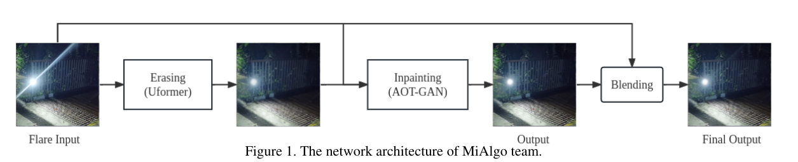
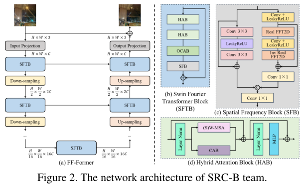
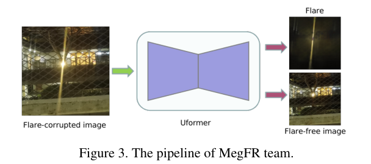

# MIPI 2023 Challenge on Nighttime Flare Removal: Methods and Results

> **发表**：CVPR Workshop (MIPI) 2023　|　**作者**：Yuekun Dai et al.（组织方：NTU S-Lab、SenseBrain、SenseTime/Tetras.AI 等）
> **论文**：https://mipi-challenge.org/MIPI2023/　|　**代码**：各队方案未统一开源（基线为 Flare7K 官方代码）

## 一、解决的问题

镜头眩光（lens flare）是强光在镜头组内散射/反射造成的退化，在手机、监控、无人机、自动驾驶等移动端相机上尤为严重——日常磨损、指纹和灰尘会像光栅一样加剧散射，使夜间拍摄出现明显的径向光斑与光条纹（streak）。眩光分为散射眩光、反射眩光与 lens orb 三类，本届挑战赛聚焦其中最普遍的**夜间散射眩光去除**。

在 MIPI 2023 之前，该方向的公开数据与统一评测稀缺：Wu et al. (ICCV 2021) 的物理合成数据在夜景下表现不佳，Dai et al. 的 Flare7K (NeurIPS 2022) 才首次提供了面向夜景的合成眩光数据。本届挑战赛（继 MIPI 2022 @ECCV 之后的第二届 MIPI，共四个赛道之一）基于 Flare7K 的子集构建统一训练/评测协议，目的是推动高效、高性能的夜间去眩光算法发展，并促成工业界与学术界的方案交流。共 120 人注册，最终 11 支队伍提交了完整结果、代码与 factsheet。

## 二、核心创新点

作为挑战赛综述，其贡献在于基准建设与方案汇总，而非单一方法创新：

1. **统一评测基准**：提供 5,000 张 1440×1440 合成散射眩光图（带 streak/glare/光源逐成分标注），可叠加到任意干净背景在线合成训练对；验证与测试各用 100 对**真实拍摄**的眩光/无眩光图像对，避免纯合成评测的失真。
2. **分区域指标设计**：除全局 PSNR 外引入 G-PSNR（glare 区域）与 S-PSNR（streak 区域），三者平均为最终得分；由于 GT 无法提供"无眩光的完美光源"，所有 PSNR 均在光源区域之外计算——这一细节后来被社区沿用。
3. **首次系统呈现 11 套去眩光方案的横向对比**（参数量、推理时间、是否用额外数据/ensemble），并以 20 人用户研究补充主观评价，颁发 Best Visualization Award，明确指出客观指标与主观质量并不一致。

## 三、方法谱系/赛况与代表性方案

**赛况总览**：11 队中绝大多数以 **Uformer 为骨干**（基线代码即 Flare7K 的 Uformer），差异主要体现在：(a) 两阶段"擦除+修补"流水线；(b) 频域模块增强全局感受野；(c) 数据合成与增广策略；(d) 损失函数的区域加权。最终 MiAlgo（小米）夺冠（Score 29.44），SRC-B（三星中国研究院北京）第二（29.16）并获最佳可视化奖，MegFR（旷视）第三（27.66）。仅 3 队使用额外数据，前两名均叠加 self-ensemble + model-ensemble。

**冠军 MiAlgo——擦除 + 修补两阶段**：第一阶段用 Uformer 尽量擦除眩光，第二阶段将原图与擦除结果拼接送入 AOT-GAN 修补眩光区细节。一个非常"刷榜"的发现是：修补输出视觉效果好但 PSNR 偏低，原因是 GT 本身并非完全无眩光，于是把输出与原始眩光输入做 blending，PSNR 直接提升 0.4 dB。数据上自采夜景底图、把眩光随机调成蓝/黄/白色，并加入灯光与局部雾霾模拟。8×V100 训练约 2 天，推理 2.2 s/张（含 X8 self-ensemble 与 X4 model-ensemble）。

> 图 1：冠军 MiAlgo 的"擦除 (Uformer) + 修补 (AOT-GAN) + Blending"两阶段架构（来源：原论文）

**亚军 SRC-B——FF-Former（频域全局建模）**：指出眩光可占据全图，窗口注意力感受野不足，且眩光会抬亮暗区、改变图像频率特性。其在 Swin Transformer 块后接基于 Fast Fourier Convolution 的 Spatial Frequency Block（SFB），构成 SFTB 基本单元，以纯卷积代价获得全局频域特征；4 级编解码 U 形结构，Charbonnier L1 损失训练 60 万迭代。该方案在用户研究中视觉效果最佳。

> 图 2：SRC-B 的 FF-Former：Swin Fourier Transformer Block（HAB+OCAB+SFB）实现空-频联合的全局建模（来源：原论文）

**季军 MegFR——更逼真的数据合成 + 信号分离**：合成端对背景与眩光分别做随机逆 gamma（θ∈[1.8,2.2]），对每个眩光做随机高斯模糊（核 5~21）模拟形态多样性，叠加 t=4 个带随机增益（0.8~1.0）、随机偏移的眩光再统一 gamma 回去；网络端用 Uformer 输出 6 通道，同时回归内容信号与眩光信号（信号分离式监督），L1 + AlexNet 感知损失。仅 20.4M 参数、0.168 s 推理，是前三名中最轻快的。

> 图 3：MegFR 的信号分离流水线：单个 Uformer 同时预测 flare 层与 flare-free 层（来源：原论文）

**其余方案要点**：AntIns 用 Uformer-B + "Night Data Aug"（四种夜景化增广随机选一）+ 眩光区域内 L1 权重 ×5；ActionBrain-ETRI 串联两个 Uformer 并引入 triplet loss（冻结的第一级输出作负样本）；USask-Flare 提出 LS-GAN，用饱和度阈值+开运算提取光源 mask 作硬注意力先验，并在输出端把光源区像素回贴；LVGroup_HFUT 用 NAFNet 预测 flare 图再经 refine 模块做"柔性减法"，推理仅 0.03 s（全场最快）；szzzzz01 设计三步递归的 flare 区域注意力网络（FDN 检测 + MGN 生成注意力 mask + Uformer 恢复）；CEVI Explorers 的 DeFlare-Net 用双 U-Net 分别做眩光去除与光源检测再融合；AI ISP 在 Uformer 上叠加全局/区域双路损失并用 SID 的 260 张 RAW2RGB 图补充夜景背景、合成多光源样本；Couger AI 用 1.64M 参数的多级 U-Net（CoordConv + DRCA + CBAM）但成绩垫底（20.76）。

## 四、实验与结果

- **数据**：训练为 Flare7K 子集 5,000 张散射眩光 + 自配背景在线合成；验证/测试各 100 对真实拍摄图像；测试图 512×512。
- **最终榜单（Score = 平均(PSNR, G-PSNR, S-PSNR)，均不含光源区）**：MiAlgo 29.44 / S-PSNR 28.59 / G-PSNR 28.89（65.56M 参数，2.2 s）；SRC-B 29.16 / 28.21 / 28.59（23.56M，2.0 s）；MegFR 27.66 / 26.56 / 27.05（20.4M，0.168 s）；第 4~10 名密集分布在 25.46~26.03；Couger AI 20.76 明显掉队。
- **关键观察**：(1) 前两名与第三名拉开约 1.5 dB，差距主要来自更强的数据合成与 ensemble；(2) S-PSNR 普遍低于 G-PSNR，说明细长 streak 比弥散 glare 更难恢复；(3) LVGroup_HFUT 以 0.03 s 推理取得第 7，效率/精度权衡突出；(4) 用户研究表明 PSNR 最高的 MiAlgo 并非视觉最优，SRC-B 获最佳可视化奖。
- 无统一消融，但 MiAlgo 报告了 blending 带来 +0.4 dB 的量化收益。

## 五、专家锐评

**价值**：这份报告的真正贡献是把 Flare7K 从"一篇数据集论文"推成"一个有真实测试集、统一指标和公开榜单的社区基准"。G-PSNR/S-PSNR 的分区域评测和"剔除光源区计算"的协议设计是务实且有洞察的，被后续 MIPI 2024 及多篇论文沿用。11 套方案集中暴露了 2023 年该领域的技术共识（Uformer 一统天下）与分歧点（端到端回归 vs. 两阶段擦除-修补 vs. 信号分离），MiAlgo 的 blending 技巧更是直接揭示了 GT 残留眩光这一基准缺陷，对后来者有真实参考价值。

**不足与质疑**：
1. **指标与目标错位被报告自己证实却未深究**：MiAlgo 靠把输出与含眩光输入混合提升 0.4 dB 夺冠，等于承认"往结果里掺回眩光能涨分"——这说明测试 GT 含残留眩光、PSNR 奖励欠拟合式的保守输出。报告仅以一个 20 人、只看 top-5 的用户研究轻描淡写带过，既没有公布主观分数细节，也没有讨论如何修正指标，错失了基准自我修正的机会。
2. **横向对比的科学性有限**：各队训练数据（是否自采底图、是否用 SID）、ensemble 强度、训练算力（8×V100 两天 vs. 单卡）完全不受控，榜单名次更多反映工程资源而非方法优劣；Runtime 在不同 GPU（2080Ti 到 A100）上测得却直接并列呈现，没有可比性。
3. **方案描述深度参差且无复现保证**：AntIns、Couger AI 等队的描述只有寥寥数行，关键超参缺失；报告未强制代码公开链接，多数方案事后不可复现，使"Methods and Results"的档案价值打折。
4. **任务设定偏窄**：只评散射眩光、只用 512×512 裁剪、光源区一律不评，回避了反射眩光、多光源大图、光源保真等真实痛点；而且验证/测试仅各 100 张真实图，统计置信度有限，前几名 0.2~0.3 dB 的差距很可能在噪声范围内。
