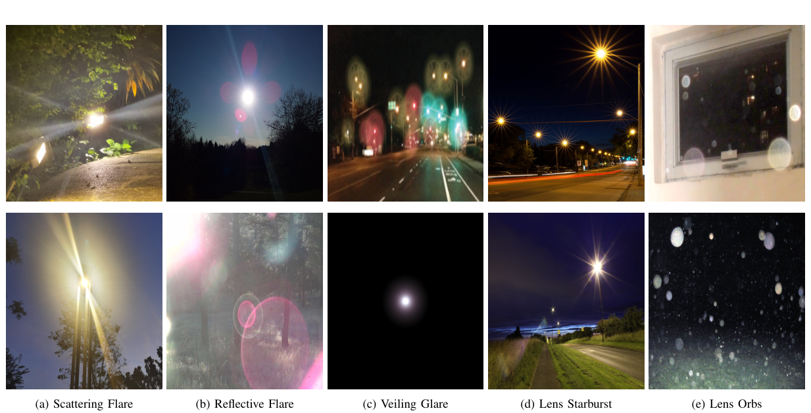
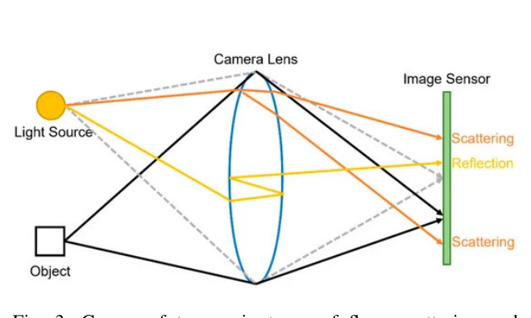
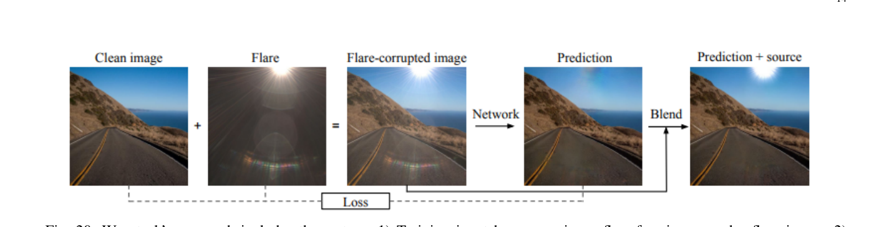
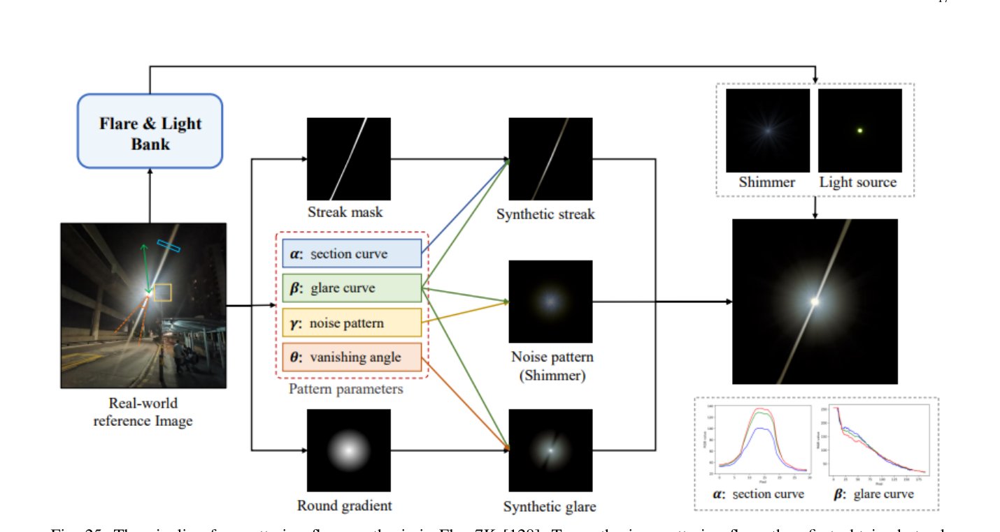

# Toward Flare-Free Images: A Survey

> **发表**：arXiv 2023（arXiv:2310.14354）　|　**作者**：Yousef Kotp, Marwan Torki（埃及亚历山大大学）
> **论文**：https://arxiv.org/abs/2310.14354　|　**代码**：无（综述类论文）

## 一、解决的问题

镜头眩光是强光直射相机时由镜组内部反射、散射、衍射与色散共同造成的常见伪影，表现为多彩光斑、光条纹、雾状 glare 等，既破坏照片观感，也会欺骗立体匹配、光流估计、语义分割、目标检测等下游视觉系统。截至 2023 年，去眩光研究已经从硬件防护、传统图像处理走到深度学习阶段，并涌现了 Wu et al.、Flare7K、Flare7K++、BracketFlare 等多个数据集，但**领域内一直缺少一篇系统性的综述**把眩光的物理成因、类型学、影响因素、去除方法、数据集构建方式与评测指标串成完整的知识图谱。

本文是该方向的第一篇（也是当时唯一一篇）综述：从镜头光学出发解释眩光的形成机理，给出五类眩光（散射、反射、veiling glare、starburst、lens orb）的统一分类，梳理硬件方案（AR 镀膜、遮光罩）→ 计算方案（去卷积、自动检测+修补）→ 学习方案（CNN/编解码器/GAN/U-Net/MPRNet/HINet/Restormer/Uformer）的方法谱系，详述四大数据集的制作流程，并在公开基准上做了横向定量比较，最后指出视频去眩光、实时处理等开放方向。

## 二、核心创新点

1. **首篇去眩光领域综述**：在 Flare7K++ 与 BracketFlare 刚发布的时间点，把分散在光学、计算摄影与底层视觉的知识统一组织，覆盖物理 → 硬件 → 经典算法 → 深度学习全链路。
2. **眩光类型学与影响因素的系统化**：将眩光归纳为散射、反射、veiling glare、starburst、lens orb 五类，并明确指出研究惯例——glare 与 starburst 归入散射眩光、lens orb 因位置固定易去除而被忽略，故现有论文实际只处理散射与反射两类；影响因素归为光源属性、镜头属性、相机参数、场景内容、拍摄条件五个维度。
3. **数据集"怎么造"的深度复盘**：不止罗列数据集，而是详细还原 Wu et al. 的波动光学合成（pupil function→PSF→SRF 投影）与暗室转台实拍、Flare7K 的 After Effects/Optical Flares 模板化合成（streak/glare/shimmer/光源四成分）、Flare-R 的真实污损采集、BracketFlare 的 ±3EV 包围曝光配对原理。
4. **跨基准定量横评**：在 Wu et al.、Flare7K++（真实/合成）、BracketFlare 四个测试集上汇总各方法的 PSNR/SSIM/LPIPS/G-PSNR/S-PSNR，揭示了"方法只在自家数据分布上有效"的交叉泛化失败现象。
5. **六个未来方向**：视频去眩光（当时尚无任何论文）、实时处理、更多样的数据采集、模块化方案、白天→夜间翻译扩充数据、多阶段处理残余伪影。

## 三、方法谱系/赛况与代表性方案

**物理与类型学**（Sec. II）：眩光的两条主因——入射光在光学系统内被灰尘/划痕散射折射到非预期位置（散射眩光，随相机移动与光源保持相对固定），以及强光在多片镜片间多次内反射（反射眩光，呈孔径形多边形串，移动方向与光源相反）。光圈叶片衍射造成 starburst，镜内前向散射造成 veiling glare。

> 图 2：五类眩光实例：散射眩光、反射眩光、veiling glare、starburst、lens orbs（来源：原论文）

> 图 3：散射（橙线）与反射（黄线）两类眩光的光路成因（来源：原论文，转引自文献 [19]）

**硬件路线**（Sec. III）：AR 镀膜利用 1/4 波长薄膜的相消干涉把单面 ~4% 的反射损失压低（现代镜头可达 20 片镜片，无镀膜损失巨大），但只能对特定波长/入射角优化且成本高；遮光罩物理遮挡离轴强光。共性局限：成本、笨重、不可适配多变场景。

**经典计算路线**（Sec. IV）：X 射线成像中的 PSF 去卷积（Seibert et al.，假设 PSF 圆对称、空间不变，对一般眩光不成立）；Chabert 的自动化流水线——多阈值二值化 + 轮廓检测 + blob 合并/过滤（圆度、凸度、惯量、面积）得到眩光 mask，再用 exemplar-based inpainting 修补，缺点是只能处理特定反射眩光、易把任何饱和 blob 误判为眩光。

**深度学习路线**（Sec. V）：先用相当篇幅铺垫通用架构（CNN、编解码器、GAN/CycleGAN、U-Net、MPRNet、HINet、Restormer、Uformer 的逐一拆解），再综述三个去眩光专用训练范式：
- **Wu et al. (ICCV 2021)**：眩光层线性叠加合成训练对；针对"网络会顺手抹掉光源、压暗全图"的问题，用亮度阈值+形态学得到光源饱和 mask，把 GT 光源区贴回输出再算 L1+VGG-19 感知损失；推理时用羽化 mask 融合输入输出。
- **Flare7K++ (Dai et al.)**：指出阈值法在光源不够亮或 streak 过曝时失效，改为端到端输出 6 通道（flare-free 图 + flare 图），利用 Flare7K 的光源标注构造监督，加上 Lrec = |I − Clip(Î0 ⊕ F̂)| 的重构一致性约束（权重 0.5/0.5/1.0），在 U-Net/MPRNet/HINet/Restormer/Uformer 上均验证。
- **BracketFlare 光学中心对称先验 (Dai et al.)**：反射眩光与光源关于光学中心对称；由于 CNN/Transformer 都难自发学到这种全局对称，干脆把输入做 γ=10 的 gamma 校正提取近饱和区、旋转 180° 作为先验图拼成 6 通道输入；损失上增加 mask loss（权重 20.0）强迫网络关注小面积反射眩光区。

> 图 20：Wu et al. 的三步法：线性合成训练对 → 网络去除眩光 → 光源贴回融合（来源：原论文，转引自 [117]）

**数据集**（Sec. VI）：Wu et al.（3,000 张波动光学合成散射眩光 + 2,000 张暗室转台实拍反射眩光，测试集仅 20 对真实图且光源都不在画面内）；Flare7K（25 类散射 + 10 类反射模板 × 各 200 张 = 7,000 张纯合成，带光源/streak/glare 逐成分标注，另配 100 对合成 + 100 对真实测试图）；Flare7K++ 增补 Flare-R——用水、油、酒精、碳酸饮料涂抹镜头再擦拭，3 款手机 9 颗后摄共采 962 张真实眩光，光源标注靠 Flare7K 训练的网络自动提取；BracketFlare 用 Sony A7 III 包围曝光（5 张、步长 3EV）取最低曝光帧作反射眩光 GT，440 对 4K 训练 + 40 对测试。

> 图 25：Flare7K 散射眩光合成：从真实参考图提取 streak 截面曲线 α、glare 下降曲线 β、噪声图样 γ、消失角 θ，再在 After Effects 中模板化生成（来源：原论文，转引自 [127]）

## 四、实验与结果

综述在四个基准上汇总了横向数字（均引自原文表 II~V）：

- **Flare7K++ 真实测试集**（100 对）：Input 22.561/0.857/0.0777（PSNR/SSIM/LPIPS）；Wu et al. (U-Net) 24.613/0.871/0.0598；Flare7K (U-Net) 26.978/0.890/0.0466；Flare7K++ (Uformer) 最佳 **27.633/0.894/0.0428**，G-PSNR 23.949、S-PSNR 22.603；HINet/Restormer 略低（27.548/27.597 PSNR）。
- **Wu et al. 测试集**：Wu et al. 自家方法占优（真实子集 25.551/0.849/0.0616），Flare7K++ (Uformer) 在其上明显退化（19.570/0.794/0.1016），BracketFlare (MPRNet) 几乎等于不处理（18.579≈输入 18.573）。
- **Flare7K++ 合成测试集**：Flare7K++ (Uformer) 29.498/0.962/0.0210，G-PSNR 26.685、S-PSNR 24.686；BracketFlare 方法仍接近输入。
- **BracketFlare 测试集**（40 张，纯反射眩光）：BracketFlare (MPRNet) 48.41/0.994/0.004、Masked PSNR 32.09 遥遥领先；而 Flare7K++ (Uformer) 把 PSNR 从输入的 37.30 **降到 28.29**——训练分布外的方法不仅无效甚至有害。

**核心结论**：各方法严重绑定自家训练分布——夜间散射眩光模型在白天数据/反射眩光上失效，反射眩光模型对散射眩光近乎恒等映射；测试集普遍偏小（20~100 对）且分布单一，量化数字须谨慎解读，这也是许多论文补做用户研究的原因。

## 五、专家锐评

**价值**：在 2023 年这个节点，这篇综述对入门者的实用价值是真实的：它是唯一一篇把眩光光学成因、五类形态、四大数据集制作细节与三个训练范式（光源 mask 贴回、6 通道分离、对称先验）放在同一坐标系里讲清楚的文献；尤其是 Sec. VI 对数据集"怎么造"的复盘（波动光学采样、After Effects 模板、包围曝光）比原论文写得更易读。跨基准交叉评测虽然简单，却用数字坐实了"去眩光模型不跨分布"这一领域要害——BracketFlare 模型在 Flare7K++ 上恒等映射、Flare7K++ 模型在 BracketFlare 上反而劣化 9 dB，这组对照至今仍值得引用。所提的视频去眩光、实时处理两个方向也确实在 2024-2025 年成为热点。

**不足与质疑**：
1. **"教科书化"内容占比过高，综述密度偏低**：Sec. V-A 用了约 5 页逐一讲解 CNN、GAN、U-Net、MPRNet、HINet、Restormer、Uformer 的通用结构（连 LeCun 手写识别、Neocognitron 都展开了），这些与去眩光无特异性关联；而真正的去眩光专用方法只覆盖了 Wu et al. 与 Dai et al. 系列三篇，Qiao et al. 的无配对方案仅在"未来方向"里一笔带过，遗漏了当时已存在的 MIPI 2023 挑战赛 11 套方案、UDC 眩光、RAW 域去眩光等工作——作为 survey，方法覆盖面是硬伤。
2. **定量分析是"搬运"而非"再实验"**：表 II~V 的数字基本转录自 Flare7K++/BracketFlare 原文，作者自己承认"部分 checkpoint 不可得故未评测"；没有统一重训/重测协议，没有效率（参数量/时延）维度的比较，所谓 Performance Review 实际是文献数字的汇编，交叉结论的归因（分布差异 vs. 架构差异）无法剥离。
3. **分类学贡献的边际性**：五类眩光的划分及"研究上只剩散射+反射两类"的收敛，本质上沿袭了 Wu et al. 与 Dai et al. 论文中已有的论述，综述自身未提出新的 taxonomy 维度（如按可见度/空间结构/与光源运动关系的正交划分），也未对 veiling glare 与 glare 标注混用的术语乱象做出裁决。
4. **写作与严谨性瑕疵**：公式编号在各小节内重复从 (1) 开始、Table III/IV 的表注与内容存在错位嫌疑、部分图直接截自原论文且个别引用编号（如 Fig 26 引用 [127] 实为 Flare7K 内容）粗糙；arXiv v1 至今未见送审痕迹，这些细节让其作为"领域参考文献"的权威性打折扣。
