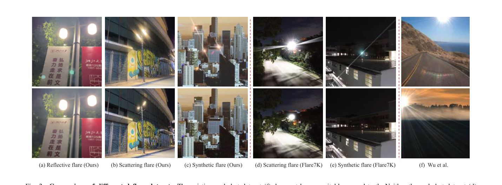
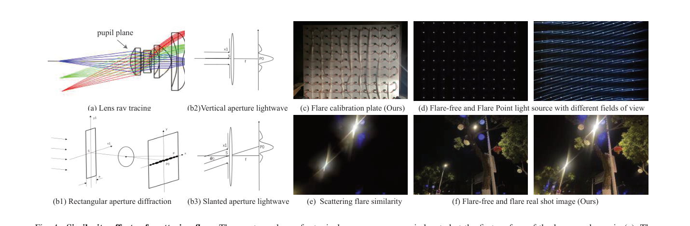
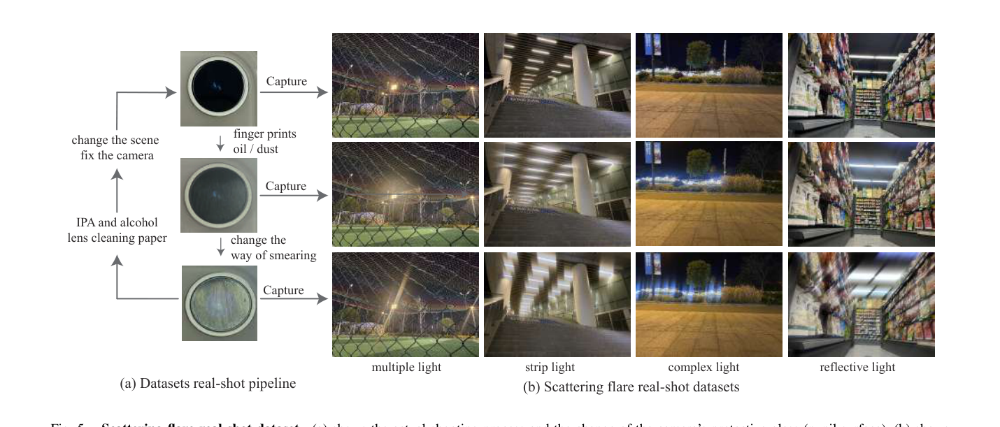
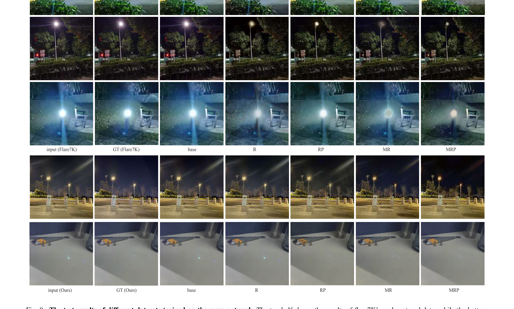

# Toward Real Flare Removal: A Comprehensive Pipeline and A New Benchmark

> **发表**：arXiv 2023（arXiv:2306.15884）　|　**作者**：Zheyan Jin, Shiqi Chen, Huajun Feng, Zhihai Xu, Yueting Chen
> **论文**：https://arxiv.org/abs/2306.15884　|　**代码/数据**：未见公开链接

## 一、解决的问题

夜间或高动态范围场景下，复杂光源的强度、光谱、反射与像差共同造成镜头眩光与鬼影（ghost），既毁画质也拖累下游视觉任务。数据驱动方法是当前主流，但作者认为现有数据集存在三大硬伤：(1) **缺少可靠的真实数据**——散射眩光的真实配对要靠"换镜头再配准"（Flare7K）或"手动遮挡光源"（Wu et al.）获得，前者贵且不可靠、后者费力且无法补偿画面中央的光源，而真实反射眩光配对数据干脆不存在（Flare7K 真实测试集 100 对全是散射眩光，反射眩光为 0）；(2) **镜头类型单一**——眩光高度依赖镜组，但已有数据多来自单一镜头；(3) **对成因理解不足**——散射眩光实际是全局性散射而非简单光斑，反射眩光不仅发生在镜片间，还发生在镜头保护玻璃与红外截止玻璃/CMOS 上，过往数据集均未覆盖。

本文从光学物理出发，提出一套"理论先验 + 仿真改进 + 真实拍摄"的完整数据生产流水线和新基准，分别处理散射与反射两类眩光。

## 二、核心创新点

1. **散射眩光相似性（协同）效应**：理论上证明消费级相机的光瞳面位于镜头第一面，不同视场角的光源经同一受污染入瞳产生的 Fraunhofer 衍射图样形状相似、仅发生平移（傅里叶相移定理），并用自制全视场点光源标定板实拍验证。据此改进仿真：同一画面内多光源的眩光应"同形不同位、不同尺度"，而非独立随机采样。
2. **免配准的真实散射眩光采集流程**：固定机位，先用 IPA 清洁保护玻璃拍 GT，再涂抹油污/灰尘拍眩光图，反复涂抹获得"一张 GT 对多张眩光图"的配对——无需换镜头、无需配准、保留中央光源、不受镜头参数限制。
3. **反射眩光中心对称先验**：基于镜组旋转对称性，反射眩光总分布在"光源—像面中心"连线上且与光源中心对称；将该先验注入仿真（强制眩光模板与光源置于对称线上再整体随机旋转），改掉了现有模板固定 45° 斜向的失真做法。
4. **用 NeRF 的视角一致性"自动"生成无反射眩光 GT**：相机移动时反射眩光的位移与真实 3D 场景不一致（光流明显异常），NeRF 拟合多视角时会自动丢弃这种低概率的视角不一致成分，从而由含眩光的多视角图像直接重建出无反射眩光图像（辅以参考超分恢复细节），借此构建了 2,000 张真实反射眩光基准——是首个可用于单独评测反射眩光去除能力的真实数据。
5. **多光源数据增广**与光源保留策略：在 GT 中保留光源训练效果更好，并支持把散射/反射眩光的评测分开进行。

## 三、模型结构与方案

本文不提出新网络，核心是**数据生产与基准构建的完整 pipeline**（用现成 Restormer/Uformer 验证数据价值）。

> 图 2：各数据集对比：Wu et al. 真实数据无合适 GT，Flare7K 真实/合成数据的光源颜色形状失真；本文仿真考虑多光源、同镜头眩光相似性与中心对称反射眩光（来源：原论文）

**散射支路**：理论上以 Fraunhofer 衍射公式刻画受损镜头（等效复杂衍射元件），斜入射平面波仅引入线性相位 → 衍射结果平移不变形（公式 (1)-(5)）；实验用可铺满全视场的点光源装置 + 多种受损镜头验证整个视场内眩光形状/光谱相似。仿真侧沿用 Adobe AE 的 Optical Flares 插件（同 Flare7K），但按"先随机生成多光源、再按光源位置/尺寸生成同形眩光"的方式落实相似性效应。真实侧按"清洁→拍 GT→涂污→拍眩光→重复"流程低成本采集，光源形态覆盖多光源、条状光源、复杂光源与反光物。

> 图 4：散射眩光相似性：光瞳面位于第一面，不同视场点光源经同一污染入瞳产生相似眩光；(c) 为自制全视场标定板装置（来源：原论文）

> 图 5：散射眩光真实采集流程：一张无眩光 GT 对应多张不同涂抹方式的眩光图（来源：原论文）

**反射支路**：实拍时绕场景多角度移动相机；NeRF 渲染方程中，反射眩光只在个别视角短暂遮挡采样光线（公式 (9)），其 σ 与 c 的"错误参数"在训练收敛时被大量无眩光视角淹没而自动丢弃，重建图即为无反射眩光 GT。作者特别指出：带图像编码特征的 NeRF 改进版（如 NGP 系）反而会去拟合反射眩光，效果更差。该方法在任意自然场景可用，不再局限于实验室单光源，还能覆盖夜间矩阵 LED 等复杂光源的反射光斑。

**数据规模**（表 I）：仿真散射 5000×5、反射 5000×3，沿用 25+10 类模板但带相似性与中心对称先验；真实基准散射 500 对（并与 Flare7K real 100 对合并使用）、反射 2,000 张，且支持光源保留与散射/反射分离评测。对照：Wu et al. 真实测试仅 20 对、Flare7K 真实反射为 0。

**消融用训练集变体**：base（=Flare7K 原版）、R（+随机反射眩光）、RP（+中心对称反射眩光）、MR（R+增加散射眩光数量）、MRP（RP+按相似性效应增加散射眩光），各再分"GT 含/不含光源"共 10 组。

## 四、实验与结果

- **设置**：Restormer 与 Uformer 各自在 10 组合成变体上等时长训练（5,000 对 512×512，背景图取自 Flickr 数据集，眩光素材来自 Flare7K）。
- **GT 保留光源更优**（表 II）：含光源组整体高于不含光源组；最优组合 MRP：Restormer 25.19 dB / SSIM 0.912（base 为 24.15/0.907），Uformer 25.04 / 0.928（base 24.85/0.910）。单加随机反射眩光（R）收益微小，按中心对称加（RP）与按相似性扩充散射（MRP）收益更明显。
- **跨基准验证**（表 III，Restormer，PSNR/SSIM）：Flare7K 合成测试 base 24.52 → MRP 26.29；Flare7K real base 24.15 → MRP 25.19；Wu real base 21.07 → MRP 23.76；自建散射真实集（ours+Flare7K）24.75 → 25.31；自建反射真实集 base 33.92 → MRP **35.10**（LPIPS 0.1412 → 0.1191），而 MR（随机多光源+随机反射）反而崩到 27.19，说明不带对称先验的反射增广有害。
- **定性**（图 8）：MRP 能同时压制散射与反射眩光并保留光源形状；并暴露 Flare7K real GT 自身仍残留明显眩光、其 GT 中反射眩光与输入完全相同（无法评测反射去除）。作者称部分结果主观上"优于真实拍摄的 GT"。
- **局限（作者自述）**：全图强散射/强反射时效果差，中央光源区易出现纹理错误；光源被完全过曝覆盖时信息缺失无法恢复；仿真光源样式仍偏简单点光源模板。

> 图 8：同一网络在不同训练数据变体下的结果（上半：Flare7K 真实数据；下半：自建真实数据），从左到右数据改进逐步生效（来源：原论文）

## 五、专家锐评

**价值**：这篇论文的两个物理先验都打在领域要害上。散射眩光相似性给出了"同一画面多光源应共享眩光形态"的可操作合成规则，纠正了 Flare7K 式独立采样的失真；"涂污—清洁"式免配准采集把真实散射配对的成本降到地板价，思路被后续工作（如 Flare7K++ 的 Flare-R 采集）印证为正确方向。最有想象力的是用 NeRF 的视角一致性当"免费的眩光过滤器"来制造真实反射眩光 GT——在反射眩光真实配对数据为零的 2023 年，这是第一个给出可行解的工作，且 MR vs. MRP 的对照（27.19 vs. 35.10 dB）干净地证明了"无先验的增广有害、有先验的增广有效"。

**不足与质疑**：
1. **写作与学术规范问题严重到影响可信度**：引用 [3] 把语音增强领域的 Uformer（dual-path conformer）当成图像恢复的 Uformer（Wang et al., CVPR 2022），属于张冠李戴；图 6 与图 7 的 caption 一字不差地重复；正文残留 LaTeX 模板占位文字（"This paper was produced by the IEEE Publication Technology Group"、"Manuscript received April 19, 2021"）；表 II/III 括号内百分比含义全文无定义（疑为相对最优值的差距），SSIM 一栏出现"(60.4%)"这类无法自洽的数字。这些瑕疵在 arXiv v1 一年后仍未修订。
2. **NeRF 方案的适用条件被系统性回避**：方法要求夜间静态场景的大量多视角图像，运动物体、闪烁 LED、车流都会破坏静态假设；"reference super-resolution"恢复细节只有一句话带过，无任何实现细节与消融；NeRF 重建本身的模糊/伪影会进入 GT，意味着"基准的 GT 质量"依赖另一个未评测的重建系统——用一个有损系统的输出当 ground truth，循环论证风险未讨论。
3. **数据与代码不可得，基准价值打折**：声称构建 500 对真实散射 + 2,000 张真实反射基准，但全文没有发布链接；"5000×5 / 5000×3"的仿真规模口径含糊（是 5 类变体各 5000 还是 25000 张独立样本）。一个不开放的 benchmark 无法被社区使用，"A New Benchmark"的标题承诺实际未兑现。
4. **实验对照偏弱、增益边际**：未与同期的 Flare7K++（2023.06，已含 962 张真实眩光）对比，而后者直接削弱本文"现有数据缺真实散射"的立论；Uformer 上 base→MRP 仅 +0.19 dB（24.85→25.04），无多次运行方差，难以排除噪声；作者自己也承认多项指标（PSNR/SSIM/LPIPS）在眩光占比小的图上对"是否去除眩光"不敏感，但除了主观图例并未引入 G-PSNR/S-PSNR 这类已有的区域指标来补强证明。
