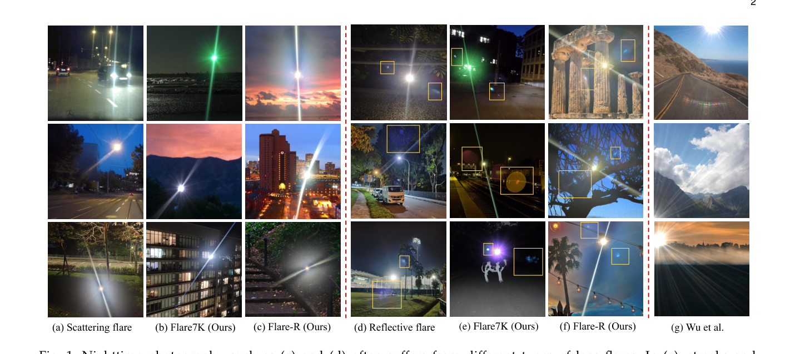
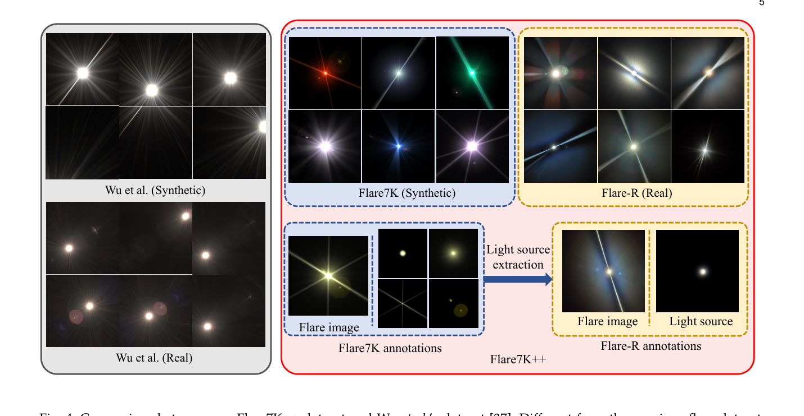
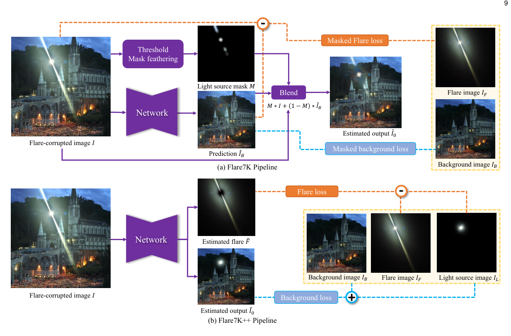
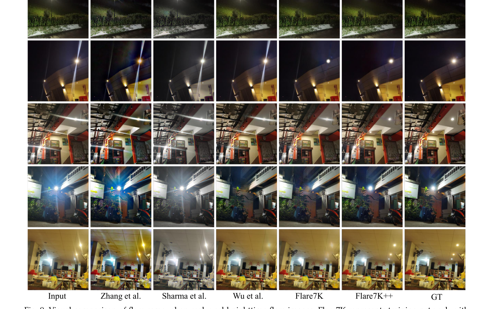

# Flare7K++: Mixing Synthetic and Real Datasets for Nighttime Flare Removal and Beyond

> **发表**：TPAMI 2024　|　**作者**：Yuekun Dai et al.（NTU S-Lab，通讯作者 Chen Change Loy）
> **论文**：https://arxiv.org/abs/2306.04236　|　**代码**：https://github.com/ykdai/Flare7K

## 一、解决的问题

夜间摄影中，人造光源在镜头内的散射与反射会留下严重的镜头眩光（lens flare）：散射眩光表现为光源周围的 glare、shimmer 和贯穿全图的 streak（条状光带），反射眩光则表现为一串圆形/多边形 iris 光斑。这些伪影不仅破坏视觉质量，还会误导下游视觉算法——立体匹配可能把散射光斑判成近距离障碍物，光流和语义分割也会出错，对夜间自动驾驶构成实际风险。

此前唯一可用的眩光数据集是 Wu et al. (ICCV 2021) 的半合成数据，主要面向日间场景，所有真实眩光都在同一相机、同一光源、同一距离下采集，模式单一，与真实夜间眩光存在明显域差。作为会议版 Flare7K（NeurIPS 2022）的扩展，本文针对两个遗留痛点：(1) 纯合成的 Flare7K 无法模拟镜头污染物衍射造成的光源周围复杂退化，导致训练出的网络在光源附近产生强伪影；(2) 旧推理管线依赖手工阈值 + 模糊核提取光源再贴回输出，当光源很小或未过曝时会把光源一并抹掉。

## 二、核心创新点

1. **混合数据集 Flare7K++**：在 7,000 张合成眩光（Flare7K）基础上新增 962 张真实拍摄眩光（Flare-R），首次证明"合成 + 真实"混合训练能消除纯合成数据搞不定的光源周围复杂退化。
2. **光源标注 + 端到端管线**：为全部眩光图提供光源层标注，网络直接输出 6 通道（3 通道去眩光图 + 3 通道眩光图），用"背景 + 光源"作为 GT，彻底抛弃手工阈值/羽化贴回光源的后处理。
3. **细粒度评测协议**：为 100 对真实测试图人工标注 glare/streak/光源掩码，提出 G-PSNR、S-PSNR 两个区域指标，弥补全局 PSNR 因 GT 残留轻微眩光而失真的问题。
4. **下游任务验证**：在立体匹配（LEAStereo）、光流（RAFT）、语义分割（DANNet）上定性展示去眩光对夜间自动驾驶相关任务的增益，并演示眩光分割（PSPNet）与光源提取两个扩展应用。

## 三、模型结构与方案

> 图 1：夜间真实眩光（a)(d）与 Flare7K/Flare-R 合成的眩光腐蚀图（b)(c)(e)(f）对比，最右为 Wu et al. 的合成结果，后者与真实夜景差距明显（来源：原论文）。

**数据集构成与构建方法**。Flare7K 合成部分：作者拍摄数百张不同镜头（手机/相机）、不同光源的夜间眩光参考图，归纳出 25 类散射眩光与 10 类反射眩光，每类用 Adobe After Effects 的 Optical Flares 插件按参数化方式生成 200 张，共 5,000 散射 + 2,000 反射。散射眩光分解为 glare（从参考图拟合"RGB-距离"glare 曲线后作用于圆形渐变）、streak（手绘 mask + 截面曲线着色，宽度可变）、shimmer（Optical Flares 模板 + 分形噪声径向模糊模拟光源附近退化）、光源（阈值提取过曝形状 + Real Glow 插件）四层独立合成；反射眩光从插件 51 种 iris 库中挑选与参考视频最接近的 iris，按比例距离排成一线，并显式建模 clipping（iris 互为掩码裁剪）、caustics（不透明度随 iris-光源距离变化）和矩阵 LED 栅格光斑。Flare-R 真实部分：用华为 P40、iPhone 13 Pro、中兴 Axon 20 三部手机共 9 颗后摄，在暗室中向镜头涂抹水、油、酒精、碳酸饮料并用手指/丝巾/尼龙布反复擦拭，每擦一次拍一张，关闭自动白平衡、改变色温与光源距离，共采 962 张。Flare-R 的光源标注由在 Flare7K 上训练的 U-Net 光源提取网络自动生成，少数失败样本人工修正。

> 图 4：Flare7K++ 与 Wu et al. 数据集的眩光模式对比；黄色区域（Flare-R 及其光源提取标注）为期刊版新增内容（来源：原论文）。

**训练管线**。训练时在线合成数据：从 24K Flickr 图像采样背景，以各 50% 概率从 Flare7K/Flare-R 采样眩光及配对光源图，经逆 gamma（γ∼U(1.8,2.2)）线性化后叠加，并施加随机旋转/平移/剪切/缩放/模糊/翻转、全局色偏、背景增益与高斯噪声等增广。损失为背景损失 L_B（L1 + VGG 感知）、眩光损失 L_F（同形式，GT 为"眩光−光源"）与重建损失 L_rec（输出两支线性域相加后与输入的 L1），权重 0.5/0.5/1.0。新管线不再做"输入 − 输出"的减法估计眩光，避免了饱和区减法引入的偏差伪影。

> 图 7：旧管线（上，阈值 + 羽化贴回光源）与新端到端管线（下，6 通道输出 + 光源标注监督）对比（来源：原论文）。

## 四、实验与结果

在 100 对真实夜间配对测试集上（Uformer 作 baseline）：输入 PSNR 22.561，Wu et al. 24.613，Flare7K 基线 26.978，而 Flare7K++ 训练的 Uformer 达 **PSNR 27.633 / SSIM 0.894 / LPIPS 0.0428 / G-PSNR 23.949 / S-PSNR 22.603**；同时给出 U-Net、HINet、MPRNet*、Restormer* 的基准（HINet 的 G-PSNR 24.081、S-PSNR 22.907 最高）。消融：仅用 Flare7K 训练 PSNR 27.257 / S-PSNR 21.294，加入 Flare-R 后 S-PSNR 提升 1.3 dB，证实真实数据对 streak 区域和光源周围退化的关键作用；去掉光源标注 PSNR 掉到 26.850；沿用 Wu et al. 旧管线 PSNR 27.166 / SSIM 0.861，新管线在 SSIM 上大幅领先（0.894）。

> 图 9：真实夜间眩光去除的视觉对比，Flare7K++ 在光源重建与 streak 消除上明显优于 Wu et al. 与 Flare7K（来源：原论文）。

## 五、专家锐评

**价值**：这是夜间眩光去除领域事实上的奠基性基础设施。Flare7K++ 及其评测协议（G-PSNR/S-PSNR、组件掩码）此后几乎被所有夜间去眩光论文（MIPI 挑战赛、DeflareMamba 等）直接采用，"合成模式多样性 + 真实退化保真度"的混合配方也成为后续数据构建的范式。光源标注驱动的端到端管线干净地解决了"去眩光顺带抹掉光源"这一长期痛点，工程价值实在。

**不足与质疑**：
1. **数据集构建的合理性存疑之处**：Flare-R 全部在暗室、单点光源、三部 2020-2021 年的手机上采集，"962 种污染物擦拭模式"覆盖的是污染物多样性，而非光源光谱（钠灯/LED 阵列/霓虹混合）、多光源相互作用与镜头光学结构的多样性；25+10 种合成类型由作者从自有参考图人工归纳，归纳过程无任何统计学验证（如真实眩光的聚类分析），"phenomenological"的代价是分类学的主观性。测试集仅 100 对，且 GT 来自"擦镜头后再拍"，作者自己承认 GT 残留轻微眩光、需手工对齐——用这样的 GT 算出的 0.4 dB 量级提升（27.257→27.633）说服力有限。
2. **线性化假设粗糙**：用 γ∼U(1.8,2.2) 的逆 gamma 近似 sRGB 图像的线性化，再做加性合成，完全忽略了真实 ISP 的色调映射、去噪、锐化等非线性不可逆操作。Zhou et al. (ICCV 2023) 和 raw 数据方向的工作已指出这种 gamma 域加性合成会在强光源附近产生不真实的对比度，这正是 Flare-R 被迫存在的根本原因——用真实数据补丁掩盖了合成模型的物理缺陷，而非修复它。
3. **基准公平性问题**：MPRNet 与 Restormer 因 24G 显存限制被砍参数（Restormer 特征维度从 48 砍到 16），却与完整版 Uformer/HINet 同表排名，作者也承认原始模型"应该会更好"，这削弱了"Uformer 最佳"这一结论及后续大量沿用该 baseline 的合理性。
4. **下游任务验证全是定性的**：立体匹配/光流/分割只展示了挑选的可视化样例，没有任何数据集级别的量化指标（如 EPE、mIoU 变化），"提升下游任务"的宣称缺乏统计支撑。
5. 消融显示混合训练对全局 PSNR 的增益其实很小（+0.38 dB），主要增益集中在 S-PSNR；而 50/50 的采样比例未做任何消融，混合策略本身停留在"有效"而未回答"为什么这样混、混多少"。
