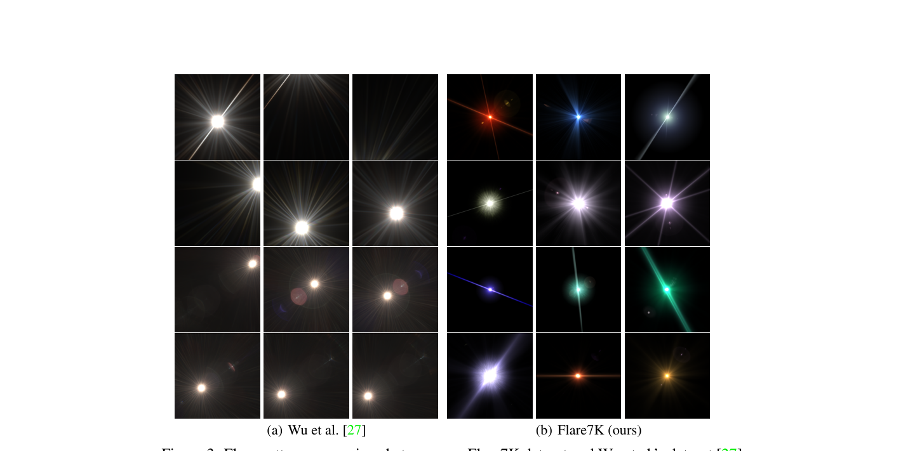
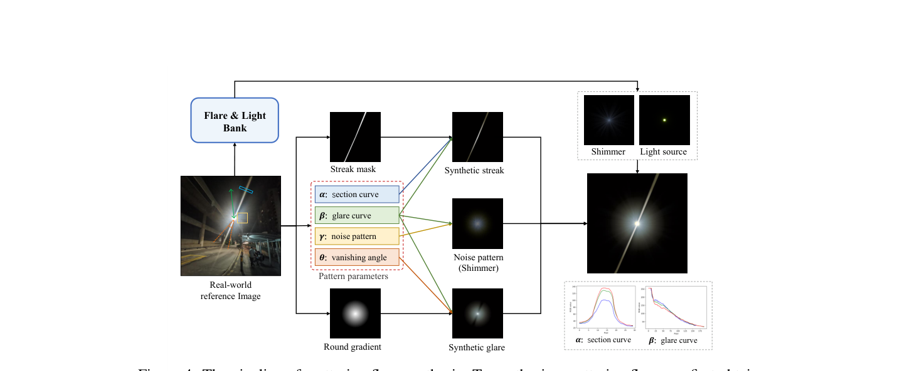
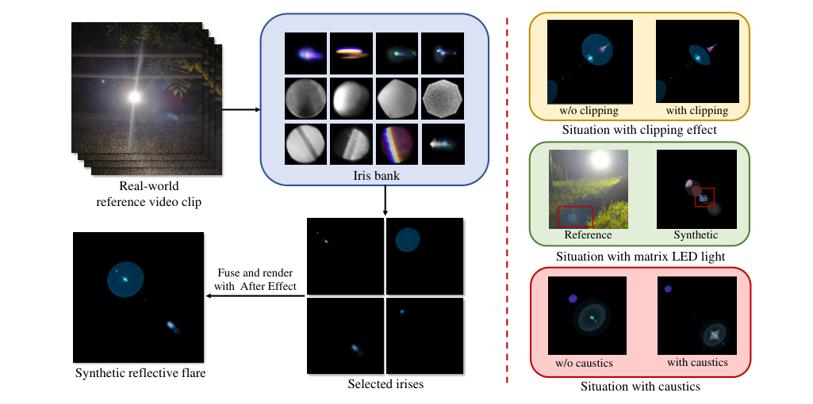
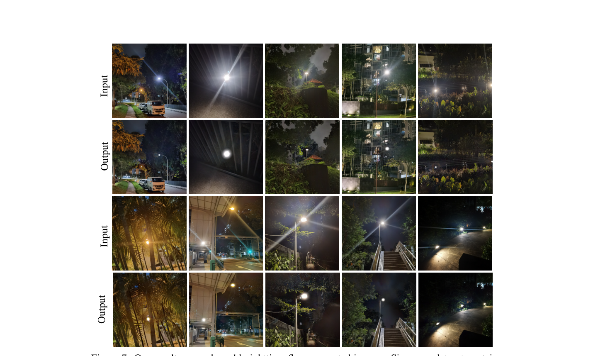

# Flare7K: A Phenomenological Nighttime Flare Removal Dataset

> **发表**：NeurIPS 2022 Datasets & Benchmarks Track　|　**作者**：Yuekun Dai et al.（NTU S-Lab）
> **论文**：https://proceedings.neurips.cc/paper_files/paper/2022 （arXiv:2210.06570）　|　**代码**：https://github.com/ykdai/Flare7K

## 一、解决的问题

夜间人造光源（路灯、车灯、室内灯）亮度和光谱与太阳截然不同，加上手机镜头上的指纹、油污、磨损会像光栅一样产生衍射，导致夜间照片出现日间罕见的强烈眩光：贯穿全屏的 streak、光源周围的 glare/shimmer，以及一串反射 iris 光斑。这些伪影既毁画质，也威胁夜间驾驶中的立体匹配、空中目标跟踪等视觉算法。

深度学习方法需要成对的"眩光腐蚀/干净"图像，但物理采集几乎不可行。当时文献中唯一的眩光数据集是 Wu et al. (ICCV 2021) 的半合成数据集：2,001 张真实眩光全部用同一相机、同一光源、同一距离拍摄，3,000 张模拟眩光基于波动光学渲染日光场景，二者都与真实夜间眩光存在显著域差——它根本没有建模夜间最显眼的 streak 和 glare。在夜间数据上，用 Wu et al. 数据训练的模型基本失效。本文要解决的就是"夜间眩光去除无数据可用"这一根本瓶颈。

## 二、核心创新点

1. **首个夜间眩光去除数据集**：5,000 张散射眩光 + 2,000 张反射眩光，覆盖 25 种散射类型与 10 种反射类型，规模和多样性远超 Wu et al. 的 2+1 种类型。
2. **"现象学"合成路线**：不走物理仿真（夜间污染物的瞳函数无法穷举），而是基于真实夜间眩光照片/视频的观察与统计，用 After Effects 的 Optical Flares 插件参数化复刻每类眩光的外观——以可控成本换取与真实夜景更小的域差。
3. **分层可分解标注**：每张散射眩光分离为光源、glare（含 shimmer）、streak 等独立图层，反射眩光单独成层、可与任意散射眩光自由组合；这种分层结构是 Wu et al. 数据集完全没有的，催生了眩光分割、光源提取等新任务。
4. **夜间评测基准**：提供 100 对合成 + 100 对真实（擦脏镜头拍摄→擦净再拍 GT，人工对齐）的配对测试集，并在其上建立了 U-Net/HINet/MPRNet/Restormer/Uformer 五个修复网络的基准。

## 三、模型结构与方案

本文是数据集论文，没有提出新网络，核心在数据构建管线。

> 图 3：Wu et al. 数据集（左）与 Flare7K（右）的眩光模式对比，Flare7K 在颜色与形态上明显更接近真实夜间眩光（来源：原论文）。

**散射眩光合成**。作者先用不同镜头与光源拍摄数百张参考图，归纳出 25 类典型散射眩光，每类生成 200 张参数随机化的图像。具体分四个组件：(1) **Glare**：从参考图统计像素 RGB 值随到光源距离的变化曲线（glare 曲线 β），作为颜色校正曲线作用在圆形渐变上，并人工测量 streak 周边亮度衰减的"消失角"θ，用羽化掩码压低该区域的 glare 不透明度；(2) **Streak**：针对 Sun et al. "2 点星 PSF"假设无法表达的非对称性，人工为每类 streak 绘制掩码、宽度设为变量，用截面曲线 α 着色并按半衰期值确定边缘模糊量；(3) **Shimmer**：用 Optical Flares 模板拟合，再叠加"分形噪声 + 径向模糊"的噪声补丁 γ，模拟光源附近难以建模的强退化；(4) **光源**：阈值提取过曝小形状后用 Real Glow 插件生成辉光，以 screen 混合模式叠加保证过曝区域不扩张。

> 图 4：散射眩光合成管线——从真实参考图提取 α/β/γ/θ 四组参数，分别合成 streak、glare、shimmer 与光源（来源：原论文）。

**反射眩光合成**。由于 clipping 和 caustics 在单帧中不可见，作者改用真实视频片段作参考：从 Optical Flares Pro 的 51 种实拍 iris 库中挑选最接近的 iris，手工调整大小颜色，按"到光源距离成比例"排成一线得到模板；并建模三种动态效果——clipping（iris-光源距离超过阈值时用另一 iris 作为掩码裁剪）、caustics（不透明度随距离变化的干涉图案）和矩阵 LED 灯的栅格状光斑。

> 图 5：反射眩光合成管线及 clipping/矩阵 LED/caustics 三种特殊情形（来源：原论文）。

**训练协议**沿用 Wu et al.：背景图来自 24K Flickr 数据集，逆 gamma 线性化后随机叠加眩光层构成训练对，以 U-Net 为基线，损失与增广细节见补充材料。

## 四、实验与结果

真实测试集上：输入 PSNR 22.56 / SSIM 0.857；Zhang et al.（夜间去雾）21.02、Sharma et al.（夜间增强）20.49 均低于输入，证明现有夜间增强方法对眩光无效；Wu et al.（U-Net + 其数据集）24.61 / 0.871 / LPIPS 0.060；同一 U-Net 换成 Flare7K 训练即达 **26.11 / 0.879 / 0.055**——训练数据是唯一变量，直接证明数据集的价值。基准中 Uformer 最佳：真实集 **26.98 / 0.890 / 0.047**，合成集 30.47 / 0.965 / 0.017（MPRNet、Restormer 因显存限制为缩减版）。定性结果显示模型可泛化到多种真实镜头与场景。局限：反射眩光光斑易与远处窗灯混淆而被误删；近距离强光源铺满全屏的 glare 仍无法去除。

> 图 7：Flare7K 训练模型在真实夜间眩光图上的去除效果（来源：原论文）。

## 五、专家锐评

**价值**：这篇论文的历史地位毋庸置疑——它定义了"夜间眩光去除"这一任务，提供了第一份训练数据、第一个评测基准和第一组 baseline 数字，此后整个方向（Flare7K++、MIPI 挑战赛、BracketFlare 及一系列网络结构论文）都建立在它之上。"现象学合成"是一个务实而聪明的工程决策：承认夜间污染物衍射在物理上不可穷举，转而在外观层面对齐真实分布。分层标注的设计眼光长远，光源层标注在期刊版中直接演化成端到端管线的监督信号。

**不足与质疑**：
1. **数据集构建方法的核心软肋是主观性与不可复现性**。25+10 种类型由作者目测归纳，没有给出参考图的采集协议（多少镜头、多少光源、何种分布）、没有聚类或统计检验支撑分类完备性；合成依赖商业软件 After Effects + Optical Flares 的手工调参（"调整参数直到大致匹配"），他人无法以同一流程复现或扩展该数据集——对一篇 Datasets & Benchmarks 论文，这是方法论层面的实质缺陷。
2. **合成物理假设粗糙**：所有合成都在 gamma 近似线性化的域内做加性叠加，忽略 ISP 色调映射的非线性与空间变化；shimmer 周边退化用"分形噪声 + 径向模糊"硬凑，作者自己在期刊版中承认这类退化"难以合成"并被迫补采真实数据 Flare-R——等于本文发表时就已知合成保真度不足。
3. **真实测试集的 GT 不干净**：擦镜头法获得的"干净"图仍残留镜头固有缺陷造成的轻微眩光，且擦拭引起错位需人工对齐；论文也承认该评测"只能作参考"。在这样一个仅 100 对、GT 有偏的测试集上，各网络间 ~1 dB 的差距很难说有多少统计意义。
4. **评测协议偏弱**：只报全局 PSNR/SSIM/LPIPS，眩光只占图像小部分区域，全局指标大量被无眩光背景稀释——这一缺陷要到期刊版补 G-PSNR/S-PSNR 才修复；MPRNet/Restormer 用缩减参数版本参与排名同样有失公允。
5. 反射眩光部分仅 10 种 iris 组合、全部来自插件自带 iris 库，与特定镜头组的真实对应关系只靠目测视频比对，其多样性宣称（"10 types"）实际覆盖面远小于散射部分。
