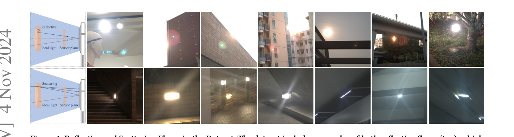
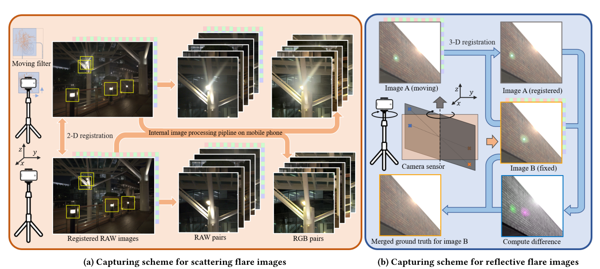
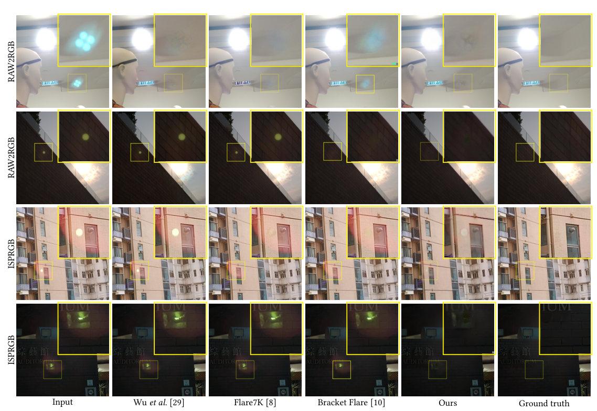
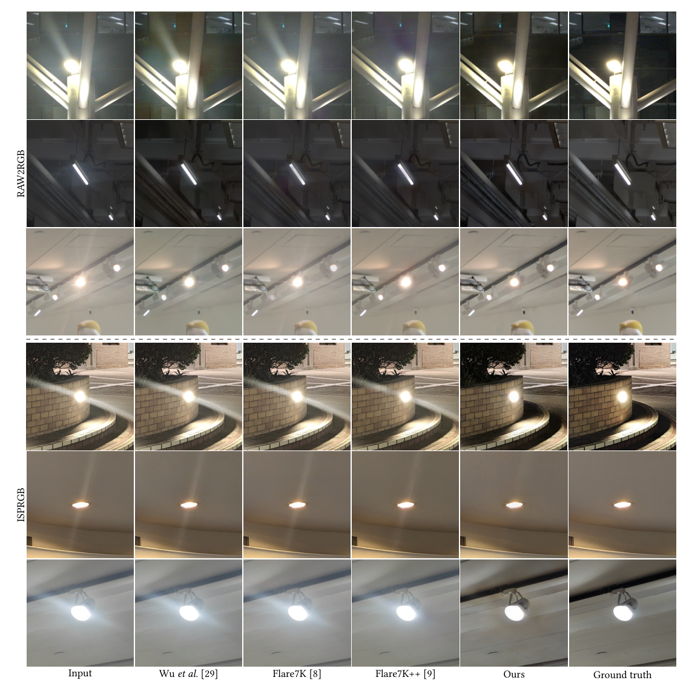

# Tackling Scattering and Reflective Flare in Mobile Camera Systems: A Raw Image Dataset for Enhanced Flare Removal

> **发表**：arXiv 2023（v2 于 2024-11 更新，题为 "Understanding and Tackling Scattering and Reflective Flare for Mobile Camera Systems"）　|　**作者**：Fengbo Lan, Chang Wen Chen（香港理工大学）
> **论文**：https://arxiv.org/abs/2307.14180　|　**代码**：未开源

## 一、解决的问题

手机摄影受塑料镜片和缺乏抗反射镀膜的限制，散射眩光与反射眩光问题比专业相机更严重。现有的眩光数据集（Wu et al.、Flare7K/Flare7K++、BracketFlare 等）全部建立在 8-bit sRGB 图像之上，而手机内置 ISP 在输出 sRGB 之前已经执行了去噪、色调映射、锐化、JPEG 压缩等一系列**非线性、不可逆**操作，高光细节大量丢失（论文图 2 显示从 ISP 输出恢复高光远不如从 raw 恢复）。已有工作（Zhou et al., ICCV 2023）只指出了色调映射这一个因素，并用基于像素亮度的加权方案去"模拟"色调映射效应——这恰恰反衬出社区缺少真实 raw 配对数据，只能靠模拟猜测 ISP 的影响。

具体的研究空白有二：(1) 除色调映射外，去噪、锐化、压缩等 ISP 操作究竟促进还是阻碍眩光去除，从未被系统量化；(2) 现有数据集中的散射眩光多为局部伪影，缺少影响全图对比度的"全局眩光"，反射眩光则缺少失焦（out-of-focus）样本，导致模型泛化受限。

## 二、核心创新点

1. **首个面向眩光去除的 raw 图像数据集**：2,027 对散射眩光 + 1,248 对反射眩光的全分辨率 raw 配对数据，每对同时提供 raw 与机内 ISP 输出（ISPRGB），覆盖 4 个品牌手机（iPhone 13、Pixel 7、iQoo Neo 7、OPPO Find X6 Pro）、室内/白天/夜间多种场景。
2. **免仿真的真实配对采集方案**：散射眩光用"污渍滤镜片 + 2D 亚像素配准"获得真实配对；反射眩光利用"反射眩光与光源关于光学中心对称、随相机转动反向移动"的性质，转动相机拍两帧、3D 配准作差定位眩光、互相填补，得到双向两对数据——两类数据均为真实拍摄而非合成叠加。
3. **数据覆盖面补强**：显式纳入局部 + 全局散射退化、合焦 + 失焦反射眩光，针对性解决现有模型对全局眩光和失焦反射斑的泛化失败。
4. **ISP 操作影响的系统性解剖**：借助 raw 数据把 ISP 拆解为可控步骤（NAFNet 去噪、USM 锐化、DiffJPEG 压缩），测试 4 种"眩光去除插入位置"的管线配置，给出"先去噪、后去眩光、再锐化压缩"的最优顺序结论。

## 三、模型结构与方案

本文重心是数据集与 ISP 分析，未提出新网络结构（实验用模型沿用 Wu et al. 与 Flare7K 系列的设置，在自建数据上训练）。

> 图 1：数据集中的反射眩光（上排）与散射眩光（下排）示例（来源：原论文）。

**散射眩光采集**。在固定三脚架的手机前加装一块带不同程度污渍的相机滤镜，移动滤镜相对相机的位置即可模拟不同污染程度；拍摄"有滤镜/无滤镜"配对后，用 SURF 特征做亚像素 2D 配准（只估计平移，先在 ISP 图上配准再换算到 raw 的整数像素网格），随后检测光源位置、以光源为中心裁出 512×512 的 raw/RGB 配对 patch，最后用预定义指标过滤低质量样本。

**反射眩光采集**。转动相机改变光源在画面中的位置，反射眩光随之反向移动；对两帧做 3D 配准与 warp 对齐后图像作差即可定位眩光区域，再用另一帧的对应区域填补该区域，得到无眩光 GT；角色互换可从一次拍摄得到两对数据（分辨率 1024×1024）。为避免在 raw 上插值引入色彩混叠、破坏噪声模型，配准与 warp 只在 RGB 域进行，raw 以原始形式提供。

> 图 4：散射眩光（a，污渍滤镜 + 2D 配准裁剪）与反射眩光（b，转动相机 + 3D 配准作差互补）的配对采集方案（来源：原论文）。

**ISP 解剖实验**。自建 MATLAB RAW2RGB 管线（黑电平校正、白平衡、去马赛克、色彩空间转换，不含去噪/锐化/压缩），与机内 ISPRGB 对照；再向 RAW2RGB 中逐步注入去噪（NAFNet，SIDD 预训练）、锐化（动态权重 USM）、压缩（DiffJPEG，中等质量因子），比较 4 种眩光去除插入位置的配置。

## 四、实验与结果

**数据集基准**（表 3）：RAW2RGB 域反射眩光上，本文模型 PSNR **35.742 / SSIM 0.950 / LPIPS 0.035**，对比 Wu et al. 25.810、Flare7K 30.356、BracketFlare 34.172（输入为 34.034——注意 Wu/Flare7K 处理后反而低于输入）；散射眩光上本文 **26.678 / 0.749 / 0.145**，对比 Wu et al. 22.673、Flare7K 21.400、Flare7K++ 22.881（输入 20.776）。ISPRGB 域全面低于 RAW2RGB 域（如散射：本文 20.556 vs 26.678），印证 ISP 处理损害修复性能。定性上，BracketFlare 因缺失焦数据无法处理透明失焦反射斑，Flare7K 系列模型对全局散射眩光（整体对比度下降型）基本失效，本文模型借助全局退化数据训练表现更稳。

> 图 5：反射眩光去除的视觉对比（上两行 RAW2RGB，下两行 ISPRGB）（来源：原论文）。

> 图 6：散射眩光去除对比，现有方法对影响全图对比度的全局眩光泛化失败（来源：原论文）。

**ISP 操作影响**（表 4/5）：先去噪带来稳定增益（反射 +1.388 dB、散射 +1.433 dB）；锐化与压缩无论顺序均造成退化，反射眩光因其局部性受损更重（最多 −2.93 dB），散射眩光损失约 1.75 dB；跳过去噪的配置 4 退化最严重。结论：最优顺序为"去噪 → 眩光去除 → 锐化 → 压缩"，即眩光去除应嵌入 ISP 内部紧跟去噪之后，而非如现行做法作用于 ISP 输出的最终 JPEG。

## 五、专家锐评

**价值**：本文抓住了被 Flare7K 系列绕开的根本问题——眩光合成与去除都发生在 ISP 重度加工后的 sRGB 域，这在物理上是错位的。两类采集方案设计都颇具巧思：反射眩光的"对称性 + 双帧互补"方案优雅地解决了"反射眩光是光学系统固有产物、无法靠擦镜头消除"的 GT 难题，这是擦拭法（Flare7K）和合成法都做不到的；3,000+ 对全真实配对数据的体量在该领域也属可观。ISP 解剖实验给出的"去眩光应置于去噪后、锐化压缩前"结论对手机厂商有直接工程指导意义。

**不足与质疑**：
1. **数据集构建仍有系统性偏置**。散射眩光全部来自"滤镜片上的污渍"，污渍在外置平面玻璃上与污渍在镜头第一面上的光学路径并不等价（入射角、与光阑的距离均不同），且滤镜本身会引入额外反射；该方案能否代表真实指纹/油污眩光，论文未做任何验证。反射眩光方案则隐含"两帧间场景静止、光照不变"的假设，户外（占 1,169 对）拍摄中云、车、行人移动都会污染作差结果，质检流程只有一句"预定义指标过滤"，过滤标准与废片率均未披露。
2. **"本文模型"语焉不详**。表 3 中 "Ours" 一栏性能大幅领先，但全文从未说明该模型的网络结构、训练细节——它究竟是在本数据集上重训的 Uformer 还是别的什么？而对比方法 Flare7K/Flare7K++ 用的是**预训练模型直接测试**（域外评测），本文模型却在自家数据上训练，这种 in-domain vs out-of-domain 的对比对基线明显不公平，"泛化更好"的结论实质上只证明了"训练域匹配测试域更好"这一句废话。
3. **ISP 分析的代理保真度有限**：用 NAFNet/USM/DiffJPEG 模拟机内 ISP 操作，与真实手机 ISP 的多帧融合、局部色调映射、厂商私有锐化差距很大；4 种管线配置也没有覆盖"先去眩光再去噪"等顺序，结论的外推性存疑。
4. 论文未提供官方代码与数据下载渠道（至本报告撰写时仍未见开源），一个以"数据集"为核心贡献的工作不放出数据，社区影响力必然大打折扣——这或许也是它停留在 arXiv 的原因之一。
5. 缺乏与 Flare7K++ 在反射眩光上的对比（表中为 "−"），且未报告任何在第三方测试集（如 Flare7K++ 真实测试集）上的交叉验证，数据集之间的互补性宣称缺少双向证据。
