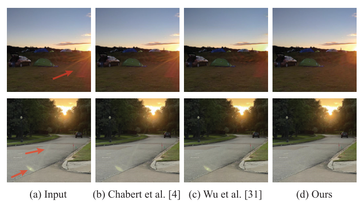
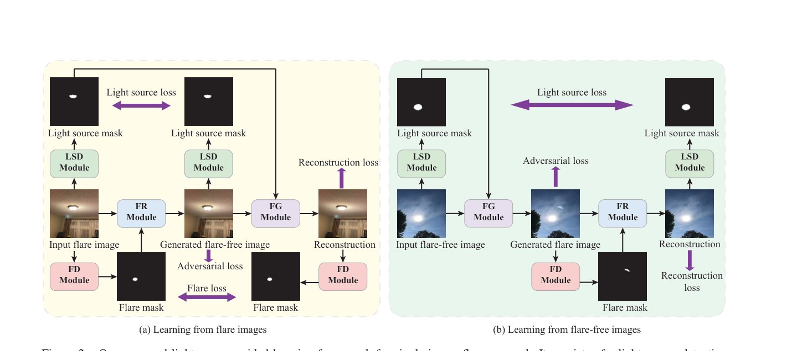
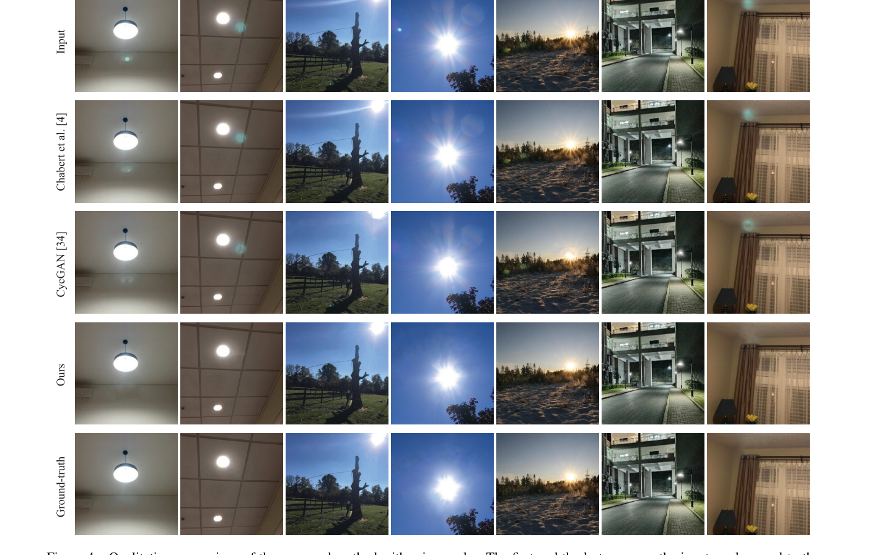
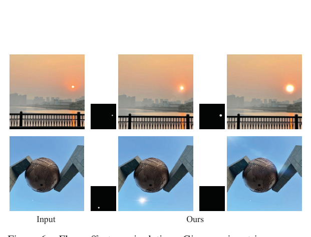

# Light Source Guided Single-Image Flare Removal From Unpaired Data

> **发表**：ICCV 2021　|　**作者**：Xiaotian Qiao, Gerhard P. Hancke, Rynson W.H. Lau（香港城市大学）
> **论文**：ICCV 2021 开放获取（openaccess.thecvf.com）　|　**代码**：官方未开源；非官方复现 https://github.com/tanmayj2020/LightSourceGuideSingleImageFlareRemoval-ICCV2021

> **领域定位说明**：在镜头眩光去除领域，本文是**无监督/非配对（unpaired）方向的唯一代表作**。同期及之后的主流路线（Wu et al. ICCV 2021、Flare7K 系列及其衍生网络）全部依赖合成或半合成的配对数据做监督训练；只有本文完全抛弃像素级配对监督，用 CycleGAN 式循环一致性 + 光源引导从真实非配对数据学习。此后该方向几乎无人跟进，本文因此成为讨论"无监督眩光去除可行性"时绕不开的孤本。

## 一、解决的问题

随手拍摄的照片常因相机内部的光线反射与散射出现眩光伪影。眩光形态、位置、颜色变化极大，传统方法依赖预定义的强度/几何先验（如只检测圆形亮斑），只能处理 flare spot 等有限类型；而当时唯一的深度学习方法 Wu et al. 基于合成配对数据训练，在真实多样场景上泛化不佳，还容易把云、灯等亮区误判为眩光。

更根本的困境在数据端：采集真实配对数据需要对同一场景反复调参拍出带眩光图，再用遮光罩等手段拍无眩光图，不仅极其费时，而且两次拍摄之间环境光照变化会导致颜色与曝光不一致，配对质量难以保证。本文的两个观察是：(1) 光源的形状、亮度、位置编码了眩光外观的关键线索（streak 从光源辐射、glare 围绕光源衰减、反射光斑沿光源-光心连线分布），显式建模"光源区域 vs 眩光区域"的关系可以避免把光源当眩光误删；(2) 非配对的眩光/无眩光图像在网上唾手可得，远比配对数据便宜。

## 二、核心创新点

1. **首次将光源信息引入 SIFR（单图眩光去除）**：同时预测光源掩码与眩光掩码两张二值图，显式区分"该保留的光源"与"该去除的眩光"——这是 shadow/rain removal 等单掩码 unpaired 框架没有的设计。
2. **首个非配对眩光去除框架**：四模块（LSD 光源检测、FD 眩光检测、FR 眩光去除、FG 眩光生成）+ 双判别器，以新的循环一致性约束（光源损失、眩光损失、重建损失）统一眩光去除与眩光生成两个任务。
3. **首个非配对眩光数据集 UFR**：996 张眩光图 + 672 张无眩光图（从约 3,000 张网络图像中由摄影师人工筛选），另建 102 对真实配对基准用于评测。
4. **附赠眩光效果编辑能力**：FG 模块可按用户给定的光源掩码（位置/大小/形状）向无眩光图中生成可控的眩光效果，监督式方法不具备这种双向能力。

## 三、模型结构与方案

> 图 1：现有方法（Chabert 只能去 flare spot，Wu et al. 误删云等区域）与本文方法的对比（来源：原论文）。

**整体框架**。LSD 与 FD 模块均为轻量 encoder-decoder（4 层卷积编码 + 2 层反卷积 3 层卷积解码），分别输出光源掩码与眩光掩码；FR 模块接收"眩光图 ⊕ 眩光掩码"4 通道输入，经 3 层卷积 + 9 个残差块 + 2 层反卷积输出无眩光图；FG 模块结构与 FR 相同，接收"无眩光图 ⊕ 光源掩码"生成眩光图。两个 PatchGAN 判别器分别约束生成的无眩光图与眩光图的真实感。推理时只需 FD + FR。

**从眩光图学习**（图 2a）：LSD/FD 先预测光源掩码 M^s_fl 与眩光掩码 M^f_fl，FR 生成无眩光图 Î_ff；**光源损失**要求输入图与生成图经 LSD 预测的光源掩码逐像素一致（L1），防止光源被当眩光删掉；再把 M^s_fl 与 Î_ff 送入 FG 重建输入眩光图，施加**眩光损失**（重建图的眩光掩码与原掩码一致）与**重建损失**（图像 L1 + VGG-19 conv5_3 感知损失）。**从无眩光图学习**（图 2b）：方向相反，FG 先生成眩光图、FD/FR 再循环重建，同样施加对抗、光源与重建损失。所有损失权重均设为 1。训练前先用随机生成的光源掩码对各模块做预训练；输入统一缩放到 512×512，Adam 优化，初始学习率 2e-4 每 100 epoch 衰减 0.1。

> 图 2：光源引导的非配对学习框架——LSD/FD/FR/FG 四模块在"眩光图方向"（a）与"无眩光图方向"（b）上循环复用（来源：原论文）。

**UFR 数据集构建**：按场景多样性（街道/花园/室内/开放空间）、光源多样性（太阳/吸顶灯/路灯，不同数量形状位置）、光照多样性（室内外、日夜、日出日落）三条准则从 Google/Flickr 收集约 3,000 张图，请一位摄影师逐张审核（特别是确认无眩光图确实无眩光），最终保留 996 张眩光图与 672 张无眩光图。统计显示 68% 的光源位于图像顶部区域。评测基准：用 SONY A6100 在三脚架上拍强光源图，再加遮光罩拍无眩光对照，辅以网络收集的图像对，共 102 对。

## 四、实验与结果

**定量**（自建 102 对基准）：本文 **PSNR 21.57 / SSIM 0.812**，显著优于 Chabert et al.（16.63 / 0.723）与用同样数据重训的 CycleGAN（18.68 / 0.775），输入为 16.35 / 0.718。**定性**：CycleGAN 删不掉大眩光斑、且在多光源场景把光源误删；本文借助光源引导能准确区分二者，对无光源入画的眩光图也有效。与 Wu et al.（代码与数据当时均未公开，无法定量比）的视觉对比中，本文非配对训练的结果不落下风。**用户研究**：19 人对 20 张基准图投票，本文获 74.3% 最佳票（CycleGAN 23.6%、Chabert 2.1%）；在 Wu et al. 的 48 张图上本文获 43.6% vs Wu et al. 39.5%。**消融**（表 2）：去掉 LSD+FD 模块跌至 18.71 / 0.778（最差），单去 LSD（19.12）比单去 FD（19.88）伤害更大，证明光源引导是最关键组件；去掉循环重建损失（18.95）、光源损失（19.37）等同样显著掉点。**失败案例**：光源极强、眩光铺满全图时模型无法区分光源与眩光（图 7）。

> 图 4：与 Chabert et al.、CycleGAN 的定性对比，首行为输入、末行为 GT（来源：原论文）。

> 图 6：眩光效果编辑——FG 模块按（用户可改的）光源掩码生成不同的眩光效果（来源：原论文）。

## 五、专家锐评

**价值**：本文的"光源-眩光关系"洞察是真正的概念贡献——光源是眩光去除任务中独有的强干扰项，把它显式建模为独立掩码并施加循环一致性约束，干净地解决了 unpaired 框架"把光源当伪影删掉"的通病。这一思想被后续配对路线吸收：Flare7K++ 的光源标注 + 端到端光源保留管线，本质上是同一洞察的监督版实现。作为无监督方向的孤本，它也为"配对合成数据是否必要"提供了对照系。

**不足与质疑**：
1. **评测基准自产自销且规模太小**：102 对基准中相当一部分来自网络收集的"配对"（如何保证像素对齐？论文未说明），自拍部分靠加遮光罩获得 GT——遮光罩只能挡入射角大的杂光，对光源在画面内的眩光基本无效，意味着基准里的"GT"很可能系统性偏向某类弱眩光场景。在这样的集合上报 PSNR 21.57，与后续 Flare7K 真实测试集上动辄 27 dB 的数字完全不可比。
2. **与唯一深度学习对手的比较是回避式的**：对 Wu et al. 只做了视觉对比与用户研究（43.6% vs 39.5%，接近五五开且仅 19 名参与者、48 张图），没有任何定量指标；考虑到用户研究的样本量与主观性，"favorably"的措辞站不住脚。
3. **二值掩码表征过于粗糙**：眩光本质是半透明的加性光层，用硬二值掩码 + inpainting 式重建丢弃了 alpha 混合信息，作者在失败案例一节也自认全图眩光时框架失效、并提出应改用 alpha matte——这等于承认核心表征选择有先天缺陷。
4. **方法可复现性差**：官方代码始终未发布（社区只有非官方复现），UFR 数据集的下载渠道也不明确；加之 GAN 训练对超参敏感（论文中所有损失权重简单设 1），后人难以在其基础上迭代——这是该方向后继无人的重要外部原因。
5. 从领域走向看，本文路线被监督路线全面碾压的根本原因值得点破：非配对学习只能从分布层面约束"看起来没眩光"，无法保证像素保真，夜间高频 streak 这类细结构在 GAN 框架下几乎必然被平滑掉。无监督方向若要复活，恐怕需要扩散先验或物理可微 ISP 这类更强的生成式约束，而非简单的循环一致性。
