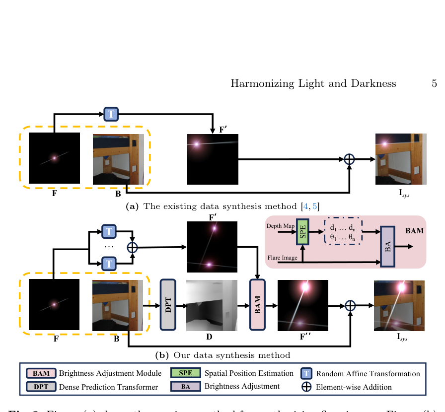
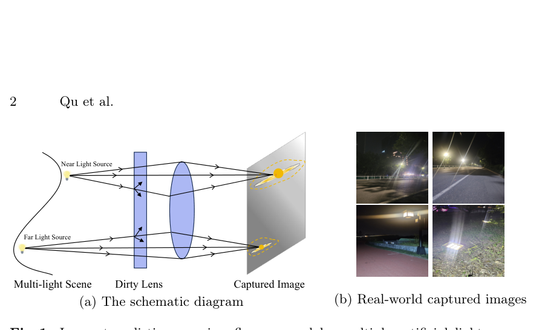
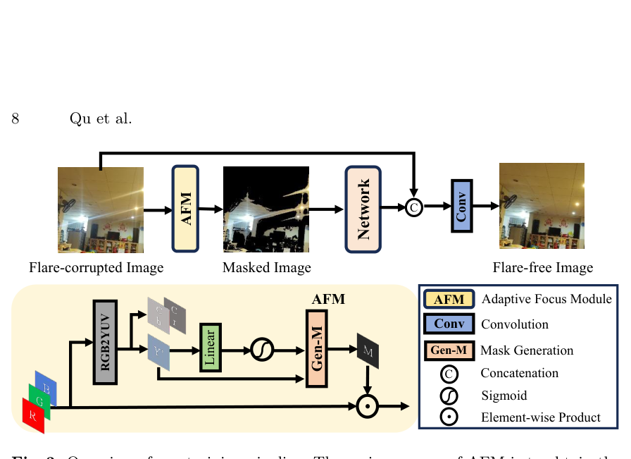
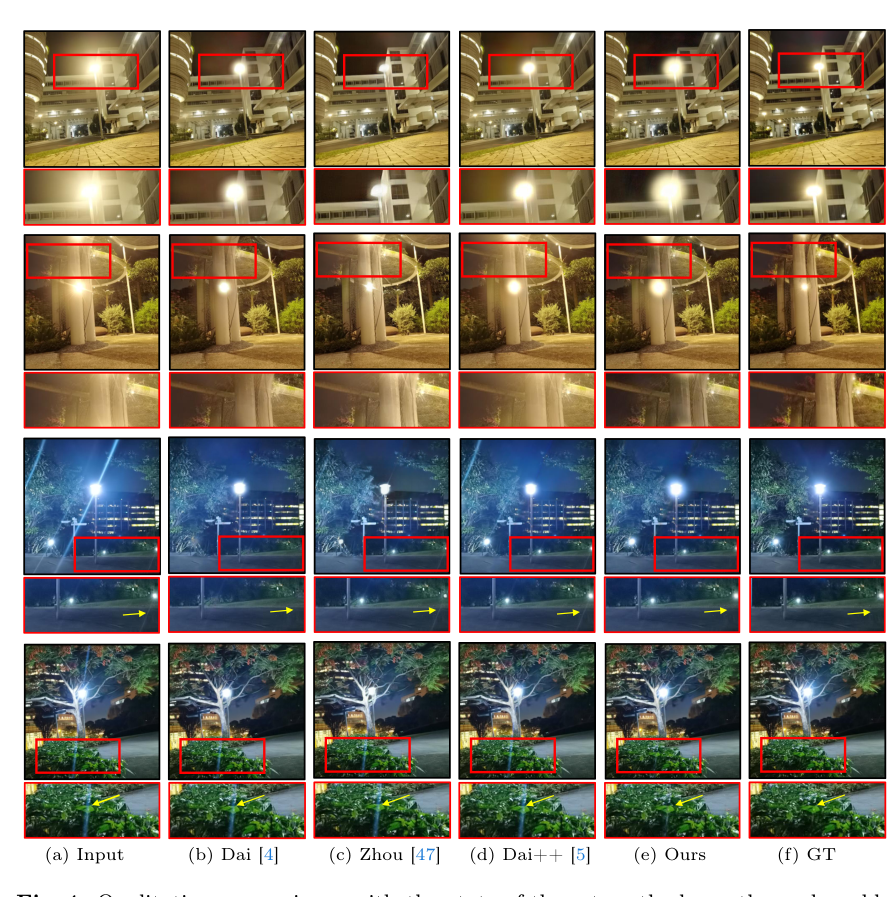

# Harmonizing Light and Darkness: A Symphony of Prior-guided Data Synthesis and Adaptive Focus for Nighttime Flare Removal

> **发表**：arXiv 2024（arXiv:2404.00313）　|　**作者**：Lishen Qu et al.（南开大学 VCIP，与南京理工大学合作）
> **论文**：https://arxiv.org/abs/2404.00313　|　**代码**：https://github.com/qulishen/Harmonizing-Light-and-Darkness

## 一、解决的问题

夜间强光源（路灯、车灯）经过沾染油污/划痕/灰尘的镜头时会在成像面上留下散射眩光（streak 状放射条纹）和反射眩光（ghost 状鬼影），既损害视觉质量，也影响夜间驾驶、目标跟踪等下游任务。主流训练数据是半合成的：把眩光图层直接加到干净背景上（Wu et al. ICCV 2021、Flare7K/Flare7K++）。但作者指出两个被忽视的现实问题：

其一，**数据侧**：真实夜景往往同时存在多个人造光源，每个光源都会产生自己的眩光，且眩光亮度与光源距离呈明显的物理相关——距离越近的光源眩光越亮（见论文图 1）。而现有合成方法（包括 Zhou et al. 的凸组合合成与 Jin et al. 的散射眩光相似性分析）只能合成单眩光图像，或者多眩光亮度随机、不符合照度规律，导致模型在真实多光源场景下对弱眩光、远光源眩光去除不彻底。

其二，**模型侧**：夜间眩光只占据图像的局部区域且通常比背景亮，但现有网络在整张图上做修复，常常错误地修改干净的暗背景（比如把墙上类似眩光形状的阴影一并"修掉"）；同时夜间图像低光区域的高频噪声也会干扰训练。

## 二、核心创新点

1. **基于照度定律（laws of illumination）的先验引导数据合成**：用 E = I·cosθ/d² 这一物理公式定量调节多个眩光的相对亮度，合成出物理上自洽的多眩光数据集 **Flare7K\***。这是首个让多眩光亮度服从"距离平方反比 + 入射角余弦"客观规律的合成管线。
2. **深度图驱动的空间位置估计（SPE）+ 亮度调整模块（BAM）**：借预训练 DPT 估计背景深度，取光源区域像素的平均深度作为光源距离 d_i，用水平视场角（FOV）与相似三角形估出入射角 θ_i，再按 (d̄/d_i)²·cosθ_i 缩放每个眩光的亮度。深度信息只用于造数据，不增加网络推理负担。
3. **即插即用的自适应聚焦模块（AFM）**：将输入转 Y′CbCr，用亮度通道经线性层 + sigmoid 自适应学出阈值 τ，生成二值掩码遮蔽低亮度背景区，让网络只在"含眩光的亮区"上工作，最后与原图拼接、过 1×1 卷积恢复背景。可无缝挂到 Uformer/Restormer/MPRNet/HINet 等任意修复网络前端。
4. **FOV 作为可调合成参数**：合成管线可针对特定相机的视场角定制数据集，提出了面向具体设备定制训练集的思路。

## 三、模型结构与方案

**数据合成管线**（Flare7K\*）：对同一张眩光图 F 做 n 次（1~3 次）随机仿射变换得到 F′_i；用 DPT 估计背景图 B 的深度图 D；SPE 由 (F′_i, D) 算出每个光源的深度 d_i（光源区域像素深度均值）与入射角 θ_i = arctan(2r_i/W · tan(φ/2))，其中 r_i 是光源到图像中心的平均距离、φ 是水平 FOV；BAM 以"入射角为 0°、深度为所有光源平均深度 d̄ 的光源"为基准，按照度定律缩放各眩光亮度 F″_i = F′_i · (d̄/d_i)²·cosθ_i；最后 I_sys = Clip(B + Σ F″_i)。

> 图 2：(a) 现有直接叠加式合成 vs (b) 本文先验引导合成管线（DPT 深度估计 + SPE 空间位置估计 + BAM 亮度调整）（来源：原论文）

> 图 1：多光源夜景中，不同距离光源产生亮度不同的眩光，且眩光只占据图像局部区域（来源：原论文）

**AFM 训练管线**：输入眩光图先经 AFM——RGB→Y′CbCr（ITU-R BT.601），Y′ 通道过线性层 + sigmoid 得到亮度阈值 τ（式 8），按 Y′ ≥ τ 生成单通道二值掩码 M（式 9），M⊙I 得到只保留亮区的掩码图送入主网络；网络输出与原输入拼接后过 1×1 卷积恢复背景细节（式 11）。

> 图 3：整体训练管线与 AFM 内部结构（Y′ 通道学习阈值 → 二值掩码 → 网络只处理亮区 → 拼接原图恢复背景）（来源：原论文）

**损失与训练**：与 Flare7K/Flare7K++ 一致，采用 L1 + VGG-19 感知损失 + 重建损失；主干沿用 Uformer 及同样的优化器/学习率以保证公平。数据聚合方式与前作相同，FOV 取 20/40/60/80/100/随机 六组实验，每图随机加 1~3 个眩光。

## 四、实验与结果

**主对比**（Flare7K 真实测试集，未用 Flare-R 训练以对齐前作设定）：Uformer + Flare7K\* + AFM 取得 PSNR 27.769 / SSIM 0.895 / LPIPS 0.0429 / G-PSNR 24.010 / S-PSNR 22.849，全面优于 Dai et al. Flare7K++（27.257/0.890/0.0471/23.762/21.294）、Flare7K（26.978）与 Zhou et al.（25.184），PSNR 提升约 0.51 dB，LPIPS 下降约 8%。

> 图 4：真实测试集上与 Dai (Flare7K)、Zhou、Dai++ (Flare7K++) 的定性对比，本文对雾状眩光和弱眩光去除更彻底、光源保留更好（来源：原论文）

**消融**：(1) 数据侧——只加多眩光不调亮度：27.419→27.478（<0.1 dB）；加上亮度调整：27.769（再 +0.3 dB），说明增益主要来自亮度调整而非简单堆多眩光；(2) AFM——Uformer 加 AFM 后 27.446→27.769（+0.323 dB）；(3) FOV 敏感性——不同 FOV 合成的数据训练，PSNR 最高最低相差不到 0.1 dB；(4) 推广性——在 Flare7K++ 上套用本文合成法 + AFM，四个 baseline 全部提升：Restormer 27.597→28.219（最佳，+0.62 dB）、Uformer 27.633→27.960、HINet 27.548→27.749、MPRNet 27.036→27.282。

## 五、专家锐评

**价值**：这篇论文的真正贡献在"数据物理性"这条线上又往前推了一步：从 Wu 的直接相加、Zhou 的凸组合、Dai 的光心对称先验，到本文把照度定律引入多眩光亮度建模，是合成管线物理化谱系中自然且合理的一环。AFM 把"眩光是局部亮区退化"这一任务先验做成了即插即用模块，并在四个主流 baseline 上都验证了正增益，工程实用性不错。深度信息只用于离线造数据、推理零开销的设计也比 ICASSP 2024 那篇双网络取深度的方案（Kotp & Torki）更轻巧。

**不足与质疑**：

1. **AFM 的二值掩码存在梯度断裂的逻辑疑点**。式 (9) 的硬阈值指示函数对 τ 不可导，论文未说明用了 straight-through 还是软化近似，那么"线性层 + sigmoid 学阈值"究竟靠什么信号更新参数？这是方法核心却完全没有交代，可复现性存疑。同时论文宣称 AFM "减轻网络计算负担"，但掩码后的图尺寸不变、网络 FLOPs 一点没少，这一表述名不副实。
2. **叙事与证据错位**：标题和卖点都压在"多眩光 + 照度定律"上，但消融显示加多眩光本身只带来 <0.1 dB，全部增益约 0.35 dB 来自亮度缩放；而总提升 0.51 dB 里还有 0.32 dB 是 AFM 贡献的。换言之，故事讲的是物理先验，分数主要靠的是一个与物理无关的注意力门控技巧，两条贡献的相对权重与论文叙述并不一致。
3. **FOV 实验自相矛盾**：作者把"不同 FOV 之间 PSNR 差异 <0.1 dB"解读为方法稳健，但这同时意味着 SPE 里精心推导的入射角公式（式 6）对结果几乎没有影响——θ 项的 cosθ 在常见 FOV 下本来就接近 1。"为特定相机定制数据集能带来更优结果"的工业价值主张没有任何实验支撑，纯属推测。
4. **深度先验的可靠性未验证**：DPT 是在白天数据上训练的单目深度模型，而背景图 Flickr24K 也以白天图为主（作者自己在 Limitations 承认），用白天图的相对深度去标定"夜间光源距离"，且 DPT 输出是相对深度而非米制深度，直接代入 1/d² 物理公式在量纲上并不严格——所谓"物理真实"更像是"物理启发"。
5. **评测面偏窄**：核心主张是多光源场景的改进，但定量评测仍只在 Flare7K 真实测试集整体指标上做，没有构建或标注一个"多眩光子集"来单独验证，多眩光优势只有图 4 的几个定性例子背书；也缺少与同期 MIPI 2024 冠军方案等更强方法的对比。
