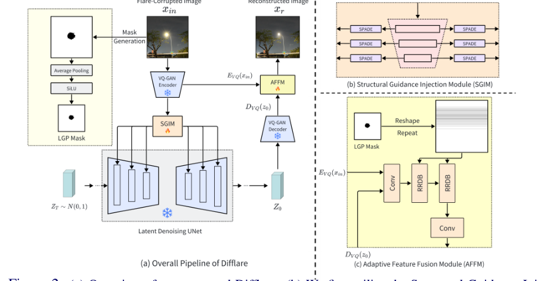
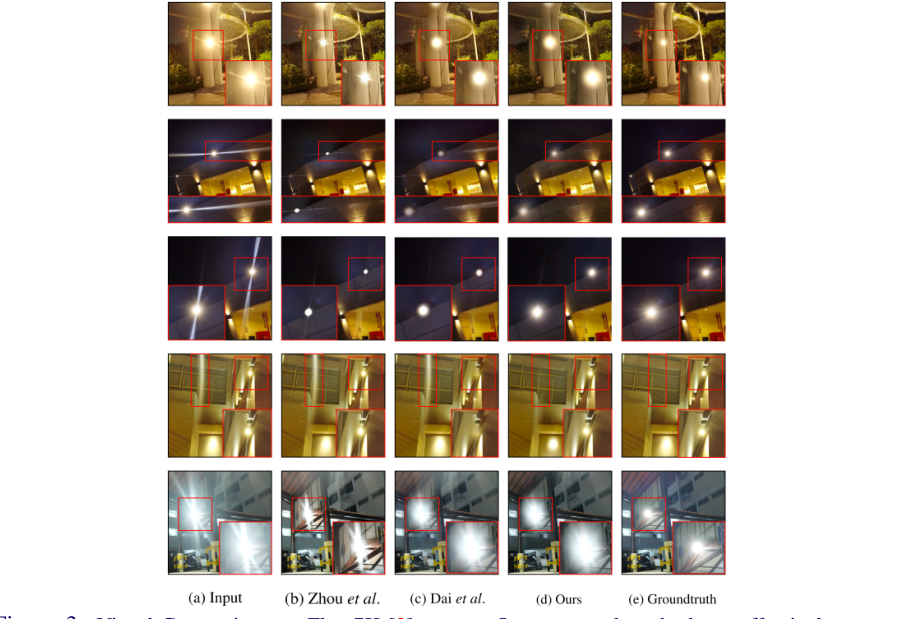
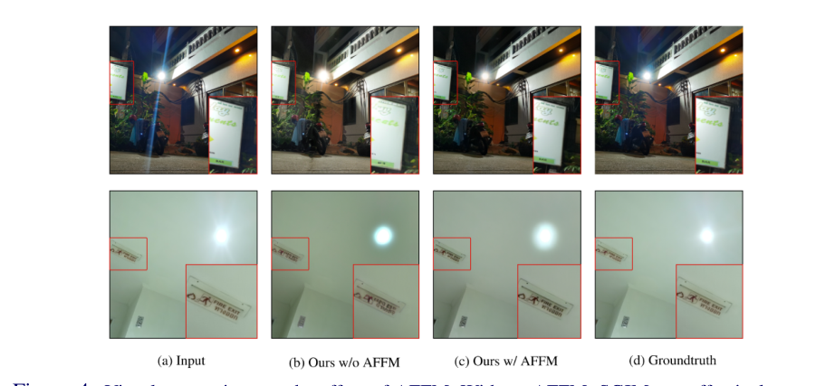

# Difflare: Removing Image Lens Flare with Latent Diffusion Model

> **发表**：BMVC 2024　|　**作者**：Tianwen Zhou et al.（大湾区大学）
> **论文**：https://arxiv.org/abs/2407.14746　|　**代码**：https://github.com/TianwenZhou/Difflare

## 一、解决的问题

镜头眩光（反射眩光 RF + 散射眩光 SF）是一种**局部**退化：光线在镜片气-玻界面反射形成多边形/圆形鬼影，在镜面灰尘划痕上散射形成放射状条纹，夜间多人造光源时尤为严重。现有深度学习去眩光方法（Flare7K 系的 Uformer/Restormer、FF-Former 等）全部从零训练，作者认为这有两个缺陷：一是完全没有利用预训练生成模型（尤其是 Stable Diffusion 这类预训练扩散模型 PTDM）中蕴含的自然图像生成先验，导致修复区域纹理真实感不足、结果"过锐"；二是从零训练计算开销大、对真实场景鲁棒性差。

另一方面，已有的"借扩散先验做修复"的工作（如 StableSR 做超分、RIDCP 用 VQ-GAN codebook 做去雾）针对的都是**全局**退化，直接搬到去眩光任务上会在非退化区域丢失保真度——潜空间压缩有信息损失、扩散采样又有随机性，干净区域会被无端改写。本文要解决的就是：如何把 PTDM 的生成先验用于眩光这种局部退化，同时守住眩光以外区域的保真度。

## 二、核心创新点

1. **首个在潜空间做镜头眩光去除的方法**：冻结 Stable Diffusion v2.1-base，把去眩光当作条件生成问题，宣称是第一个面向局部退化、基于潜空间扩散先验的眩光去除工作。
2. **结构引导注入模块（SGIM）**：训练一个轻量自编码器从 VQ-GAN 潜码中提取多尺度结构特征，经 SPADE（空间自适应归一化）注入冻结 PTDM 的残差块，只训练注入层，微调成本远低于从零训练（沿用 StableSR 的 time-aware encoder 微调策略）。
3. **亮度梯度先验（LGP）**：观察到眩光区域在 YCbCr 空间对应显著高亮度值、且边界存在高亮度梯度，据此生成二值亮度掩码 LM。
4. **自适应特征融合模块（AFFM）**：将 VQ-GAN 编码器特征（输入图）与解码器特征（生成结果）经 Conv + RRDB 融合，并把 LGP 掩码 resize/flatten 后乘进自注意力权重矩阵，引导融合聚焦于眩光外区域，补偿潜空间压缩与随机采样造成的保真度损失。
5. **推理端文本提示增强**：虽以空文本训练，推理时用 classifier-free guidance 配正向提示词（"flare free, glare free, (best quality:2), (haze free:2), (very clear:2)"）提升感知质量。

## 三、模型结构与方案

**整体管线**（图 2）：输入眩光图 x_in 经冻结 VQ-GAN 编码器得到潜码 z_in；SGIM 自编码器 E_SGIM 从 z_in 提取 L 层多尺度语义图 {Fea_i}，通过各分辨率的 SPADE 层（可学习仿射变换 Fea′_i = β_i ⊕ (γ_i+1) ⊗ Fea_i）注入冻结的潜空间去噪 UNet；从高斯噪声出发做 200 步 DDPM 采样得到 z_0；VQ-GAN 解码器解码时，AFFM 把 E_VQ(x_in) 与 D_VQ(z_0) 的特征做通道拼接，过 m 层卷积 + n 层 RRDB 得到融合特征，其中自注意力计算被改写为 Softmax[LM′·(Q·Kᵀ)·V]，LM′ 是由 LGP 亮度掩码经平均池化 + SiLU、flatten、堆叠成 (1, h_l×w_l, h_l×w_l) 的注意力掩码。

> 图 2：Difflare 总体管线：(a) VQ-GAN 潜空间 + 冻结去噪 UNet；(b) SGIM 经 SPADE 注入多尺度结构引导；(c) AFFM 在 LGP 掩码引导下融合编/解码器特征（来源：原论文）

**训练设置**：SGIM 与 AFFM 分开训练。训练集为 Flare7K（为公平不用 Flare7K++ 的 Flare-R），按 Flare7K 官方管线在线合成：背景 B 取自 Flickr24K，GT = B⊕L（保留光源），输入 = B⊕L⊕F_r⊕F_s，裁剪到 512×512。SGIM 在 4×RTX4090 上以总 batch 192 训练 85 epochs（空文本提示）；AFFM 训练 11 epochs、batch 48。测试用 Flare7K 真实测试集（100 对）。

## 四、实验与结果

**定量**（Flare7K 真实测试集）：Difflare PSNR 26.063 / SSIM 0.898 / MUSIQ 59.48 / CLIPIQA 0.341。对比：Dai et al.（Uformer）PSNR 最高 26.978 但 SSIM 0.890、MUSIQ 59.03、CLIPIQA 0.337；Zhou et al. 25.184/0.872；Wu et al. 24.613/0.871；Zhang et al.（夜间去雾）21.022/0.784。Difflare 在 SSIM 与两个无参考感知指标上居首，PSNR 居第二。

> 图 3：Flare7K 测试集定性对比：Zhou et al. 结果偏"过锐"，Dai et al. 偶尔误删光源，Difflare 的光源与背景过渡更和谐（来源：原论文）

**消融**：仅 SGIM（无 AFFM）PSNR 只有 18.773 / SSIM 0.671——扩散生成本身保真度严重不足；加无引导 AFFM 升到 25.772/0.896；加 LGP 掩码引导的完整版 26.063/0.898，MUSIQ 也从 58.94 升到 59.48。图 4 显示无 AFFM 时眩光虽被去掉，但干净区域出现明显失真。

> 图 4：AFFM 消融可视化——无 AFFM 时非眩光区域明显失真，加 AFFM 后保真度恢复（来源：原论文）

## 五、专家锐评

**价值**：把"扩散先验 + 保真度补偿"的 StableSR 范式首次引入眩光去除，并指出局部退化任务与全局退化任务对保真度要求的本质差异，这个问题定位是准确的。消融数字也诚实地暴露了扩散路线的软肋（裸扩散仅 18.77 dB），AFFM 用编码器特征 + 掩码注意力把保真度拉回 26 dB，验证了"生成先验负责眩光区、原图特征负责干净区"这一分工的必要性。SSIM 与无参考感知指标的领先说明扩散先验确实带来了更自然的纹理融合，对"修复结果过锐、光源生硬"这一行业痛点有实际改善。

**不足与质疑**：

1. **"SOTA"的成色不足**。PSNR 26.063 比 Dai et al. 的 26.978 低近 1 dB；所谓领先的 MUSIQ 59.48，与**未处理的输入图 59.34** 几乎持平（CLIPIQA 同样：0.341 vs 输入 0.332）——连带眩光的原图都能拿接近最优的感知分，只能说明 MUSIQ/CLIPIQA 对眩光这种退化根本不敏感，用它们来宣称感知质量第一说服力很弱。真正能区分方法的指标里本文并不占优，也没有报 LPIPS 这种眩光文献里标配的全参考感知指标。
2. **新颖性边际**。SGIM 就是 StableSR 的 time-aware encoder + SPADE 注入，AFFM 本质上是 StableSR 的 CFW（可控特征融合）加了一个掩码注意力，连论文自己都写"motivated by StableSR"。真正属于本文的增量只有 LGP 掩码，而它实际上就是亮度阈值二值化——与 Wu/Zhou 等用亮度阈值贴回光源的老技巧同源，所谓"梯度先验"在公式里完全没有出现梯度项，式 (2) 还把 LM_i 写成了自己定义自己的循环形式（LM_i = 1 if LM_i < s），且按文字描述"眩光对应高亮度"，掩码不等式方向疑似写反，写作粗糙到影响复现。
3. **计算开销与"高效"叙事矛盾**：推理要 200 步 DDPM 采样，对比方法 Uformer 单次前向即可，论文却只字不提推理时延、参数量对比；训练用 4×RTX4090、batch 192 跑 85 epochs，宣称"substantially reducing the computational cost"缺乏与从零训练的实际算力对照。扩散采样的随机性也意味着结果不可复现，论文未报多次采样的方差。
4. **实验面单薄**：只在 Flare7K 的 100 张真实测试图上评测，没有 Flare7K++ 测试协议（G-PSNR/S-PSNR），没有真实多设备泛化测试；推理端"正向提示词"这一影响结果的技巧没有任何消融，guidance scale s 的取值也未交代。
