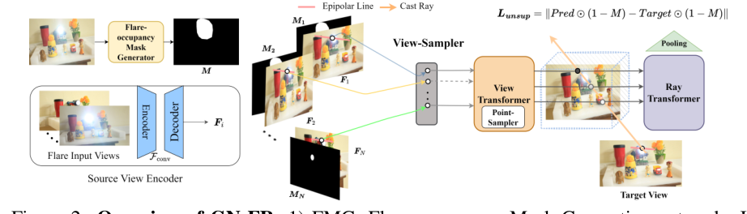
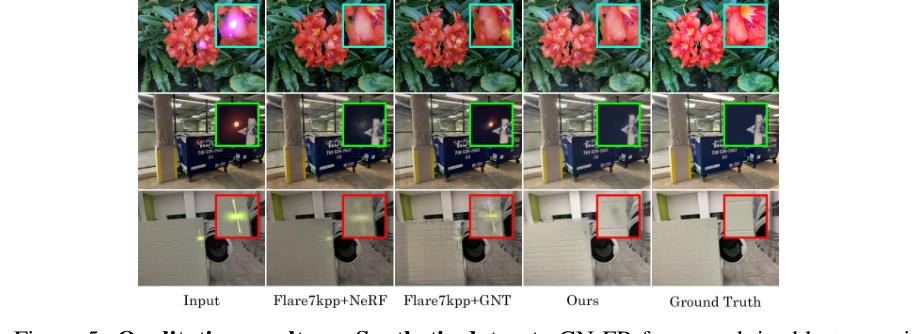
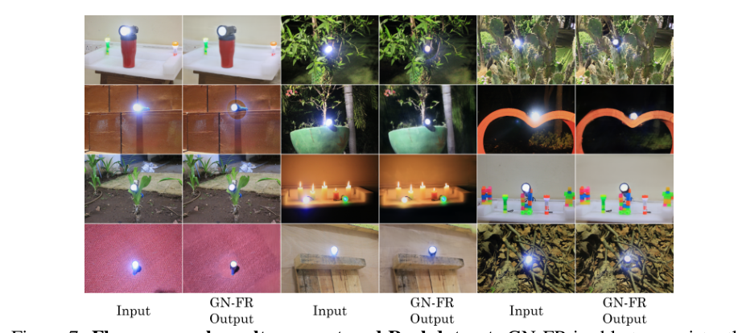

# GN-FR: Generalizable Neural Radiance Fields for Flare Removal

> **发表**：BMVC 2024　|　**作者**：Gopi Raju Matta et al.（IIT Madras 计算成像实验室）
> **论文**：https://arxiv.org/abs/2412.08200　|　**代码**：未开源

## 一、解决的问题

镜头眩光形态多样（光晕、条纹、色彩溢出、雾状光斑），单张图像去眩光本质上是高度病态的：被眩光遮蔽的场景内容在该图中已经丢失，网络只能"猜"。现有方法——无论 Wu et al. 的 UNet + 掩码、Flare7K/Flare7K++ 的 Uformer，还是 Qiao et al. 的非配对对抗学习、Kotp et al. 的深度引导——都是单图路线，没有利用眩光的一个关键物理性质：**眩光是视角相关的**（光源与相机相对位姿稍变，眩光的位置形态就大变），而场景内容是视角一致的。

本文把去眩光重新表述为多视角问题：某一视角下被眩光遮住的信息，可以从相邻视角中没被遮住的对应区域恢复。配套的现实困难是：同一场景"带眩光 + 无眩光"的成对多视角数据几乎不可能采集，所以监督信号必须以无监督方式构造。此外，逐场景优化的 vanilla NeRF 不能泛化到新场景，需要可泛化的神经渲染框架。这是第一个在 NeRF 框架内做眩光去除的工作。

## 二、核心创新点

1. **首次将眩光去除纳入可泛化神经辐射场框架**：基于 GNT（Generalizable NeRF Transformer，用 view transformer + ray transformer 替代体渲染积分），单一框架同时实现新视角合成与眩光去除，跨场景泛化。
2. **眩光占据掩码生成网络（FMG）**：用 PSPNet 做"眩光/非眩光"二类分割，以自采的 80 种真实眩光模板 + 人工标注掩码合成训练数据，并用 5:1 的类别权重处理眩光像素占比过小的类不平衡，合成集上达 0.81 mIoU / 0.94 mAcc。
3. **视角采样器（VS）+ 点采样器（PS）**：VS 在源视角池中剔除眩光占比 >10% 的视角并优先采样受眩光影响小的邻近视角；PS 在 view transformer 的注意力计算中把落在眩光区域的对极线采样点注意力置零（A′ = A·(1−M)），从源头阻断眩光信息进入聚合。
4. **掩码引导的无监督损失（Masking loss）**：L = ‖Pred⊙(1−M) − Target⊙(1−M)‖，只在目标视角的无眩光像素上算 MSE，被眩光遮住的区域当作"新视角的新区域"，靠跨视角信息渲染出来——无需任何无眩光 ground truth。
5. **首个 3D 多视角眩光数据集**：17 个真实场景、782 张图像，外加 80 张真实眩光模板及人工标注的占据掩码。

## 三、模型结构与方案

**整体管线**（图 2）：给定 N 个带眩光的已标定输入视角，先用带残差连接的 UNet 编码每张图得到特征图；FMG 为每个视角生成二值眩光掩码 M。渲染目标视角时：VS 依掩码信息从 k×N 候选池采样 N 个受眩光影响最小的源视角（训练时 k∈(1,3)、N∈(8,12) 均匀采样）；对每条目标光线，把 3D 点投影到各源视角的对极线上插值特征，PS 在 view transformer 聚合时将眩光区域点的注意力置零；聚合特征交替过 view/ray transformer，最后池化出光线特征并由 MLP 预测像素颜色。全程以 Masking loss 端到端无监督训练。

> 图 2：GN-FR 总览——FMG 生成眩光占据掩码，View Sampler 挑选低眩光源视角，Point Sampler 在 view transformer 中屏蔽眩光采样点，Masking loss 只在无眩光像素上监督（来源：原论文）

**FMG 训练数据**：在暗室中用手电筒以多方向照射采集 80 种真实眩光模板并人工标注掩码，按 Flare7K 的方法以随机仿射变换叠加到 Flickr24K 图像上，掩码同步变换得到分割 GT。

**训练细节**：GN-FR 以 GNT 权重初始化，在 IBRNet 数据集 44 个场景（合成叠加眩光）上训练 500k 次迭代、每次 256 条光线，Adam 优化器，单卡 RTX 3090（24GB）；测试真实场景时再微调 50k 次迭代。其余设置沿用 GNT。

## 四、实验与结果

**定量**（IBRNet 场景 + 合成眩光）：GN-FR 取得 PSNR 26.18 / SSIM 0.8815 / LPIPS 0.034，比第二名 GNT（22.44/0.867/0.0386）高约 4 dB；vanilla NeRF 为 21.92/0.827/0.045。值得注意的是"先用 Flare7K++ 去眩光再重建"的两个组合反而最差：Flare7K++ + NeRF 18.63、Flare7K++ + GNT 18.85——单图去眩光的跨视角不一致性会破坏多视角重建。

**定性**：在合成与真实数据上，对比方法要么残留眩光、要么在无眩光区域引入伪影；GN-FR 能跨视角一致地去除多种眩光并恢复被遮蔽的场景内容。消融（图 8）显示去掉 VS/PS 后强眩光区域去除明显变差；用 FMG 学出的掩码与人工标注掩码的渲染结果基本持平。

> 图 5：合成数据上与 Flare7K++ + NeRF / Flare7K++ + GNT 的对比，GN-FR 去除更彻底且不破坏无眩光区域（来源：原论文）

> 图 7：自采真实 3D 眩光数据集上的去除效果，被眩光覆盖的场景内容得到恢复（来源：原论文）

## 五、专家锐评

**价值**："眩光视角相关、场景视角一致"是一条被单图方法集体忽视的强物理先验，本文第一个把它做成了可运行的系统，并用"Flare7K++ 预处理 + NeRF/GNT 反而掉点"的实验侧面证明了单图去眩光在多视角场景下的根本缺陷（跨视角不一致）。Masking loss 的无监督构造干净利落，绕开了多视角成对数据不可采集的死结；17 场景的 3D 眩光数据集虽小，但属于从零到一的资源贡献。作为 NeRF×低层视觉的交叉首作，开题价值大于方法本身。

**不足与质疑**：

1. **核心假设的适用边界没有检验**。Masking loss 成立的前提是"目标区域至少在一个源视角中无眩光"，论文承认这是预设但未量化失效场景：光源本体及其周边在所有视角中都过曝/带光晕时（这是夜景常态），所有视角的掩码都为 1，该区域既无监督也无信息来源，方法会输出什么？论文对光源区域的处理只字未提——而单图路线的大量工作（光源贴回、6 通道输出）恰恰是围着这个问题转的。
2. **定量比较的公平性存疑**。4 dB 领先的对照组是"不做任何去眩光的 GNT/NeRF"和"用 Flare7K++（针对夜间训练的单图模型）预处理"的组合，前者根本不是去眩光方法，后者被用在了与其训练分布不符的日间/室内场景上。缺少更合理的基线，例如对单图去眩光结果做跨视角一致性后处理、或在本文合成数据上重训单图模型。消融也只有图 8 的定性展示，VS/PS/Masking loss 各自的定量贡献一个数字都没有。
3. **"可泛化"与"需要微调"自相矛盾**：真实场景要再微调 50k 次迭代（约为总训练量的 10%）才有好结果，这已经接近半个逐场景优化，跨场景零样本能力到底如何，论文没有给出不微调的真实场景定量数字（真实数据全程只有定性图）。
4. **系统性遗漏工程细节**：多视角位姿如何获得（COLMAP 在强眩光图上的标定鲁棒性如何）、渲染速度、FMG 在真实多视角图上的分割精度（0.81 mIoU 是合成集数字）均未报告；FMG 训练数据是叠加在 2D Flickr 图上的模板眩光，与真实 3D 场景的眩光存在明显域差。
5. **评测协议偏弱**：定量只在"合成叠加眩光"的 IBRNet 场景上做，眩光是后贴的、与场景几何/光源位置无物理关联，恰好回避了反射眩光随视角连续变化这一最难也最该验证的情形；自采的 782 张真实数据反而没有用于任何定量评测。
