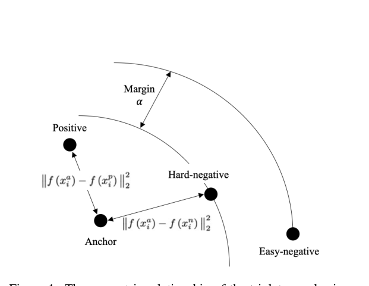
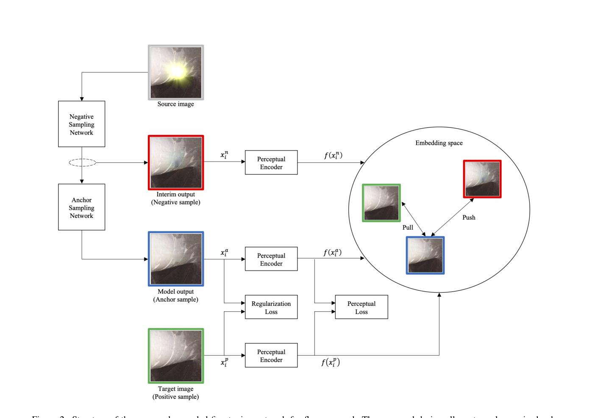
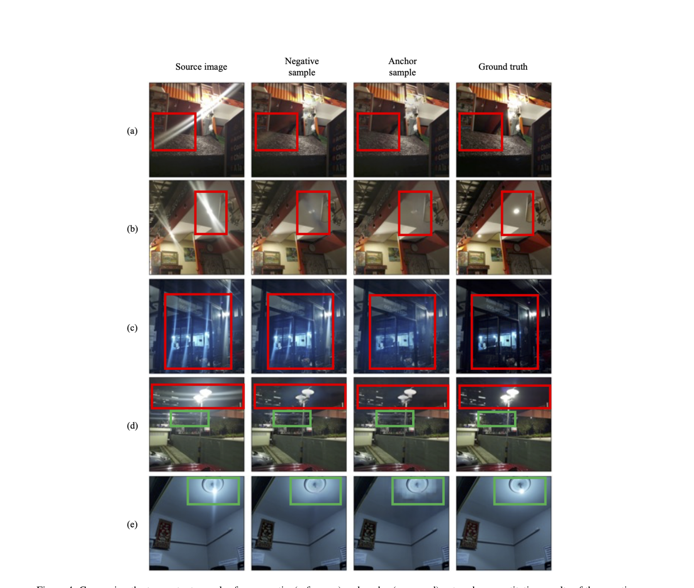
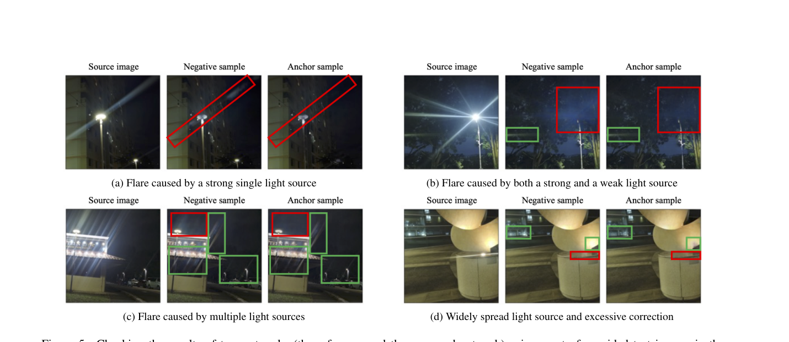

# Hard-Negative Sampling with Cascaded Fine-Tuning Network to Boost Flare Removal Performance in the Nighttime Images

> **发表**：CVPR Workshop (MIPI) 2023　|　**作者**：Soonyong Song, Heechul Bae（韩国电子通信研究院 ETRI）
> **论文**：CVF Open Access（CVPRW 2023, pp. 2843–2852）　|　**代码**：未开源

## 一、解决的问题

夜间拍摄时，画面内或画面边缘的多个人工光源（路灯、车灯、霓虹灯）经镜头内部玻璃组的散射/反射以及镜面污损的干扰，会在图像上形成条纹（streak）、光晕（glare）、光斑、鬼影等多种形态的眩光（flare），破坏光源周边的细节甚至遮挡关键内容。物理手段（遮光罩、滤镜、特殊镀膜）在夜间多光源场景下几乎失效，传统计算方法（线性变换、滤波、阈值化）泛化能力差，因此近年主流是基于 U-Net / Uformer 等自编码器结构的监督学习方法，并依赖 Flare7K 这类合成数据集提供成对训练样本。

本文针对的具体痛点是：现有去眩光模型（以 Flare7K 官方预训练 Uformer 为代表）是否已是最优？作者认为自编码器在 MSE 类逐像素重建损失下容易过度正则化、丢失图像细节；借鉴去雾领域将对比学习引入图像重建的思路，可以通过"锚点拉近正样本、推远负样本"来改善细节恢复。但对比学习要奏效，需要大量与锚点高度相似的难负样本（hard negative），而在图像重建任务中如何低成本、持续地获得难负样本是未解决的问题。本文的出发点是：设计一种网络结构让难负样本"自动产生"，从而用对比学习对已有去眩光模型做微调（fine-tune），提升其在夜间图像上的表现。

## 二、核心创新点

1. **级联微调结构自动生成三元组**：将两个结构相同的去眩光网络（Uformer）级联。第一个网络加载预训练权重并冻结梯度，作为"负样本采样网络"——其输出已大致去除眩光、与目标高度相似，天然就是难负样本；第二个网络作为"锚点采样网络"参与训练，输出即锚点；ground truth 为正样本。三元组在一次前向传播中免费获得，把难负样本挖掘从独立的采样问题变成了网络结构的副产品。
2. **将三元组对比学习用于去眩光微调**：用 triplet loss 在感知嵌入空间中把锚点输出推离冻结基线的输出、拉向目标图像，配合像素正则化损失与感知损失联合训练，等价于显式要求"新模型必须与旧模型可区分且更接近目标"。
3. **以大规模弱监督 ViT-Large 作感知编码器**：不沿用惯例的 VGG 感知特征，而采用弱监督预训练微调的 ViT-Large（SWAG）提取嵌入，依据是分类性能更强的骨干通常具有更好的感知相似度判别能力。

## 三、模型结构与方案

**整体 pipeline**：如图 2，含眩光的源图像先经负样本采样网络（冻结的预训练 Flare7K-Uformer）得到中间输出 x^n（负样本）；级联的锚点采样网络（同结构、同预训练初始化、可训练）给出最终输出 x^a（锚点）；无眩光目标图像为正样本 x^p。三者分别经感知编码器映射到嵌入空间，按"拉近 (anchor, positive)、推远 (anchor, negative)"训练。由于负样本网络已被优化得与目标高度相似，其输出对锚点而言是"足够难"的负样本（图 1 给出三元组与 margin α 的几何示意）。

> 图 1：嵌入空间中 anchor、positive 与 hard/easy negative 的几何关系——难负样本位于 margin 内侧、与 anchor 高度相似（来源：原论文）

> 图 2：级联微调网络整体结构。冻结的负样本采样网络产生难负样本，可训练的锚点采样网络输出锚点，与目标图（正样本）共同构成三元组，经感知编码器在嵌入空间做 push/pull（来源：原论文）

**损失函数**：总损失 L_prop = λ·L_REG + δ·L_PL + (1−λ)·L_triplet。其中：

- **正则化损失** L_REG：锚点与正样本之间的像素级 Lk 范数误差（k=1 为 L1，k=2 为 L2）；
- **感知损失** L_PL：两者在感知编码器特征图上的欧氏距离，权重 δ=0.001（沿用 SRGAN 设置）；
- **三元组损失** L_triplet：FaceNet 式带 margin α 的 triplet loss，在 ViT-Large 感知嵌入空间中以 L2 距离计算。

λ 通过网格实验在 {0, 0.2, …, 1.0} 中确定。

**训练设置与数据**：基于 Flare7K（5000 张散射眩光 + 2000 张反射眩光图案）与 23,949 张无眩光背景图（Zhang et al. 提供的子集，亦即 MIPI Nighttime Flare Removal 竞赛数据）合成训练对；增广含随机裁剪、水平/垂直翻转、随机擦除；定量评测用 128×128，可视化用 512×512；SGD 优化器、学习率 0.001，horovod 多卡训练（RTX A6000）。负样本网络设 requires_grad=False，仅训练锚点网络。

## 四、实验与结果

**定量评测**（100 张带 GT 与 flare mask 的真实验证图，按全图 / streak / glare 三个区域报告 PSNR/SSIM）：

- 基线 Uformer（Flare7K 预训练）：PSNR 23.74 / 30.28 / 27.79 dB，SSIM 0.8692 / 0.9646 / 0.9269；
- 本文方法 **streak 区 PSNR 最高提升 0.32 dB**（30.28→30.60，k=2 时），streak / glare 区 SSIM 最高分别提升 0.0019 / 0.0016；
- 但 **glare 区 PSNR 普遍劣于基线**，且 k=2 各配置下全图 PSNR 明显下降（最低跌至 23.09 dB）；
- 作者最终选用 k=2、λ=0.6 配置，理由是其 streak 区表现最好。

**可视化对比**：合成数据上结论分裂——平均 PSNR 基线更高（27.63 vs 26.59 dB），平均 SSIM 本文更高（0.9633 vs 0.9615）；真实数据均值上，本文 streak PSNR / streak SSIM / glare SSIM（34.30 dB / 0.9863 / 0.9482）优于基线（34.10 dB / 0.9843 / 0.9450），glare PSNR 则更差（28.41 vs 28.93 dB）。

> 图 4：真实眩光数据上负样本（基线）与锚点（本文）输出对比；(a)–(c) 锚点更优，(d)(e) 出现弱光源眩光残留与对反射区域的过度去除（来源：原论文）

> 图 5：MIPI 夜间去眩光竞赛测试图结果：强单光源 (a) 去除干净自然，弱光源 (b)、多光源重叠 (c) 表现较弱，大面积扩散光源 (d) 被误判为眩光而过度校正（来源：原论文）

**失败模式**：论文坦承所提模型存在系统性"过度校正"——倾向于把弱光源眩光、反射区域乃至大面积扩散光源也当作眩光去除（图 4(d)(e)、图 5(d)），导致这些场景下指标反而劣于基线。结论部分也自认"未进行多样的对比实验"。

## 五、专家锐评

**价值**：这篇论文的真正贡献是一个几乎零成本的难负样本构造技巧——"旧模型输出即难负样本"。这个观察是聪明的，与蒸馏/自训练思想形成有趣对照（旧模型在这里不是老师而是反面教材），对比学习所需三元组在一次前向中免费获得，不需要任何额外的挖掘或存储。作为 MIPI 竞赛衍生的 workshop 论文，它在"如何微调一个已有去眩光模型"这个工程问题上给出了可复用的配方，也是较早把对比正则项引入夜间去眩光任务的尝试之一，在 Flare7K 生态刚建立的 2023 年有一定探索意义。

**不足与质疑**：

1. **收益微弱且指标互相打架，选型有"挑指标"之嫌**。最好情形 streak PSNR +0.32 dB，但同一 k=2、λ=0.6 配置下全图 PSNR 从 23.74 跌到 23.18 dB，glare PSNR 也下降；合成集上平均 PSNR 倒退超过 1 dB（27.63→26.59），只赢 SSIM 0.0018。论文以"预期 streak 区有优势"为由在十几组超参里挑了对自己有利的局部指标，且 (k, λ) 的搜索与最终报告用的是同一批 100 张验证图——在评测集上调参，又无统计显著性检验，很难排除增益只是噪声水平的波动。
2. **没有任何针对方法本身的消融**。三个损失项的逐项贡献、ViT-Large 感知编码器换成 VGG 会怎样、margin α 取值（全文未报告）、负样本网络冻结与否——全部缺失。表 1 只是 λ 与 k 的网格扫描，无法回答最关键的问题："性能变化来自 triplet 损失，还是仅仅来自继续训练？"最低限度的对照——相同数据相同步数但去掉 triplet 项的微调——论文没有做；而 λ=1.0（triplet 权重为零）那一行的全图 PSNR 23.75 恰是所有配置中最高的，streak PSNR 30.42 也已拿到大部分增益，这反而暗示 triplet 项的净贡献可能接近于零甚至为负。
3. **方法逻辑存在自我削弱的结构性风险**。负样本是冻结旧模型的输出，每个锚点只有这一个静态负样本——与对比学习需要大量、动态难负样本的共识相悖，实际更接近"惩罚与旧模型输出相似"的正则项。更关键的是，当旧模型在某区域已接近 GT 时（glare、反射、大面积光源），"远离负样本"与"靠近正样本"方向冲突，推力必然把输出推离真值。论文观察到的系统性过度校正（图 4(e) 反射被抹掉、图 5(d) 扩散光源被误删）正是这一目标函数的必然产物，但作者只作现象描述，未做机制分析，也未引入任何缓解手段（如负样本筛选、自适应 margin）。
4. **对比范围过窄、开销未讨论**。唯一 baseline 是 Flare7K 官方 Uformer，没有与 Wu et al. (ICCV 2021)、Qiao et al. 等其他去眩光方法或同期竞赛方案比较；级联两个 Uformer 加上 ViT-Large 编码器同时在线的训练显存/时间开销、以及按"串联"结构推理时是否需要过两个网络（计算量近乎翻倍），论文均只字未提。"various comparative experiments have not been conducted"是作者结论部分的原话，诚实，但也坐实了实验单薄。
5. **写作粗糙**：式 (2) 下方"k is either 0 or 1"与随后"k=1 为 L1、k=2 为 L2"自相矛盾；用一篇海洋生态系统人工光影响综述（文献 [12]）来支撑夜间眩光问题的动机，引用选择令人费解。

总体而言，这是一篇想法有趣但验证薄弱的竞赛系 workshop 论文：机制简单可复用，但增益在噪声边缘、目标函数带有结构性副作用、关键消融与横向对比缺失，"优于参考模型"的结论只在精心挑选的区域指标上成立。
