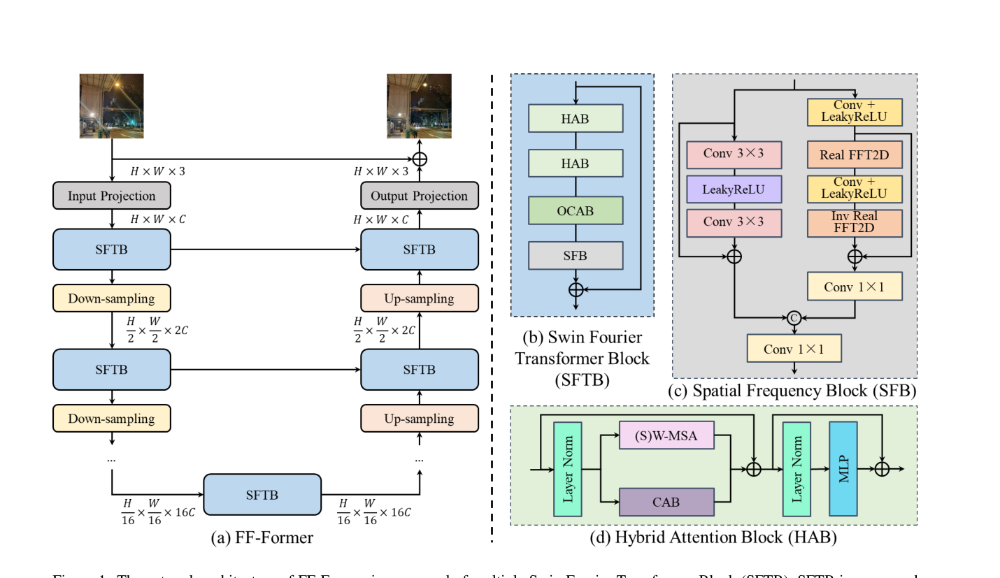
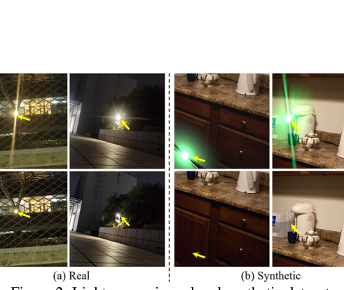
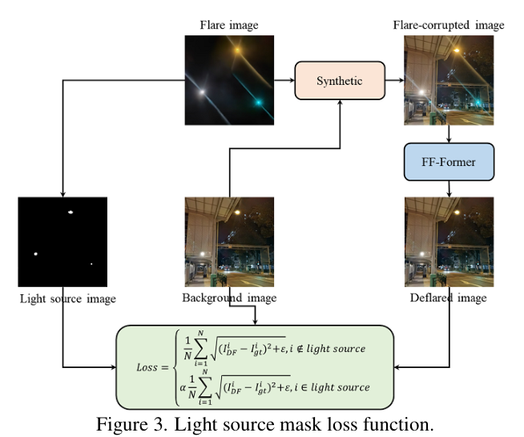
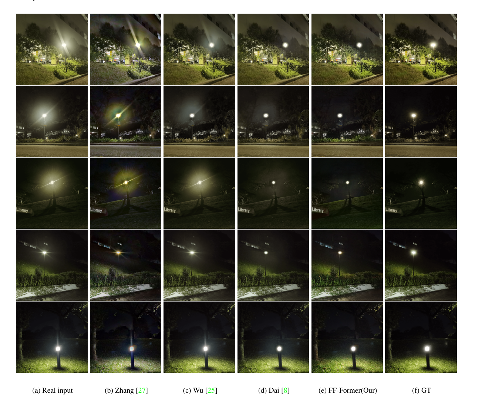

# FF-Former: Swin Fourier Transformer for Nighttime Flare Removal

> **发表**：CVPR Workshop (MIPI) 2023　|　**作者**：Dafeng Zhang, Jia Ouyang et al.（三星中国研究院 SRC-B）
> **论文**：CVF Open Access（CVPRW 2023, pp. 2824–2832）　|　**代码**：未开源

## 一、解决的问题

夜间炫光（flare）源于镜头对强光源的散射与内部反射：光线沿非预期路径传播，在画面中形成放射状光斑、光晕和横贯全图的长 streak。炫光不仅破坏观感，还会抬高暗部亮度、压缩对比度、改变图像的频率特性，并损害语义分割、深度估计等下游任务。硬件层面的 AR 镀膜等方案成本高、只对特定波长/入射角有效，且无法处理已拍摄图像；传统软件方案多为"先检测、后修补"的两阶段流程，仅适用于亮点等有限类型的炫光。Flare7K 数据集（Dai et al., NeurIPS 2022）与 MIPI 2023 夜间去炫光竞赛的推出使数据驱动方法成为主流，本文即为该竞赛背景下的工作。

本文针对两个具体痛点。**其一是感受野不足**：夜间炫光常覆盖图像很大区域甚至全图，去除它需要全局信息；但低层视觉任务输入分辨率高，主流方案（Uformer 等）只能用窗口化注意力控制计算量，感受野被锁死在窗口内；U 形网络靠多次下采样间接扩大感受野，又不可避免地丢失细节。**其二是光源与炫光的耦合矛盾**：Flare7K 合成训练对的背景图不含光源，而炫光图自带光源，导致网络在去炫光的同时把光源一并抹掉；真实照片中光源本应保留，先前工作（Dai et al.）靠后处理把输入图的饱和区域贴回输出来恢复光源，治标不治本，且"训练时要求去掉光源、推理时又要保留光源"的矛盾本身就加重了网络负担。

## 二、核心创新点

1. **Swin Fourier Transformer Block（SFTB）**：在 HAT 风格的窗口注意力块（HAB + OCAB）之后串接一个 Spatial Frequency Block（SFB），把窗口注意力的局部建模与频域卷积的全局建模拼进同一个基本单元，用于 U 形网络的 Encoder/Bottleneck/Decoder 各级。
2. **用 Fast Fourier Convolution（FFC）替代全局自注意力获取全局感受野**：SFB 的频率分支经 2D FFT 把特征变到频域后做 1×1 卷积——按卷积定理，频域逐点操作等价于空域全局更新，因此一层即可覆盖全图感受野，而计算上只是卷积，远比全局 self-attention 便宜；空间分支用简单残差块保护局部细节。
3. **光源掩码损失（Light Source Mask Loss）**：依据炫光亮度生成光源掩码并把光源合入背景 GT，训练时对掩码内像素的 Charbonnier L1 损失乘以小系数 α=0.05，显式告诉网络"光源不需要去除"，从训练目标层面化解去炫光与保光源的矛盾，免去推理期贴回光源的后处理。
4. 在 Flare7K 真实与合成测试集上同时取得最优 PSNR/SSIM（及真实集 LPIPS），超过 Uformer、Restormer、HINet 等重训的通用复原 SOTA。

## 三、模型结构与方案

**整体 pipeline**。输入夜间炫光图 I_FC ∈ R^{H×W×3} 先经 3×3 卷积 + LeakyReLU 投影到 C=32 维浅层特征；随后进入 4 级 Encoder（每级 SFTB + 2× 下采样，空间减半、通道翻倍，瓶颈处特征为 H/16 × W/16 × 16C）；Bottleneck（组件与 Encoder 同构）在潜空间完成去炫光；4 级 Decoder 逐级上采样恢复尺度，并与对应 Encoder 级特征跳连融合以保护细节；最后输出投影（3×3 卷积 + LeakyReLU）的结果与输入相加、过 sigmoid 约束到 [0,1] 得到去炫光图——即整体学习残差。

> 图 1：FF-Former 整体为 U 形结构，基本单元 SFTB 由 HAB、OCAB 与 SFB 组成；HAB/OCAB 在窗口内提取局部特征，SFB 经 Fast Fourier Convolution 提取全局特征（来源：原论文）

**SFTB 内部**。HAB 沿用 HAT 的设计：在标准 Swin 的 (S)W-MSA 旁并联通道注意力块 CAB（两个 3×3 卷积夹 GELU + 通道注意力），加权后与注意力输出、捷径相加，从通道和空间两个维度增强表征；OCAB 用重叠交叉注意力扩大窗口间交互。但二者感受野仍受窗口尺寸限制，于是 SFB 接在 OCAB 之后补全局信息：左侧空间分支为 Conv(σ(Conv(X)))+X 的残差块负责局部细节；右侧频率分支为 X = IFFT(σ(Conv(FFT(X)))) + X，FFT 后用 1×1 卷积在频域做全局更新；两分支输出 concat 后经 3×3 卷积融合。论文强调 SFB 拥有与全局自注意力同等的感受野，但只含卷积运算，"effective and efficient"。

**光源掩码损失**。如图 2 所示，真实图像中光源与炫光共存，而 Flare7K 的合成背景不含光源。本文在合成时基于炫光亮度生成光源掩码图并把光源并入背景作为 GT 的一部分；训练损失为 Charbonnier L1，掩码外像素正常计算，光源区域像素乘以 α=0.05（式 19），既不强迫网络抹除光源，又保留对该区域的弱约束。

> 图 2：真实数据（左）含光源，而 Flare7K 合成数据（右）的背景图不含光源——这是网络"误删光源"的根源（来源：原论文）

> 图 3：光源掩码损失流程——由炫光亮度生成光源掩码图并合入背景，光源区域内的损失乘以小系数 α，使网络学会"去炫光、留光源"（来源：原论文）

**训练设置**。完全沿用 Dai et al. 的 Flare7K 合成与增广策略：逆 gamma 校正恢复线性亮度（γ∼U(1.8,2.2)）、RGB 随机乘 U(0.5,1.2)、加入方差 σ²∼0.01χ² 的高斯噪声、对炫光图做仿射变换、随机模糊（核尺寸 U(0.1,3)）与亮度偏移 U(−0.02,0.02)，再把炫光叠加到背景图。输入裁成 512×512，batch size 2，Adam（β1=0.9, β2=0.99），初始学习率 1e-4，CosineAnnealingLR 训练 60 万次迭代降至 1e-7，配合水平/垂直翻转增广；损失仅用带光源掩码加权的 Charbonnier L1。

## 四、实验与结果

**数据与对比方法**：基于 Flare7K（5,000 散射炫光 + 2,000 反射炫光）合成训练对，在真实与合成两个夜间炫光测试集上评测；对比先前专用方法（Zhang 夜间去雾、Sharma 夜间可见性增强、Wu 炫光去除）以及在 Flare7K 上重训的通用复原网络（U-Net、HINet、Restormer*、Uformer；Restormer 因显存限制为缩减参数版）。

**主要结果（Table 1）**：

| 方法 | 真实 PSNR/SSIM/LPIPS | 合成 PSNR/SSIM/LPIPS |
|---|---|---|
| Input | 22.56 / 0.857 / 0.078 | 22.77 / 0.921 / 0.060 |
| Wu | 24.61 / 0.871 / 0.060 | 27.88 / 0.952 / 0.031 |
| U-Net | 26.11 / 0.879 / 0.055 | 29.07 / 0.958 / 0.022 |
| HINet | 26.74 / 0.882 / 0.048 | 29.97 / 0.959 / 0.021 |
| Restormer* | 26.28 / 0.883 / 0.054 | 29.45 / 0.950 / 0.025 |
| Uformer | 26.98 / 0.890 / 0.047 | 30.47 / 0.965 / **0.017** |
| **FF-Former** | **27.35 / 0.901 / 0.044** | **30.88 / 0.969** / 0.019 |

相对最强基线 Uformer，PSNR 在真实/合成集分别提升 0.37 dB 和 0.41 dB，SSIM、真实集 LPIPS 同步领先；唯一未取胜的是合成集 LPIPS（0.019 vs 0.017），作者以视觉结果"更真实自然、去除更干净"作辩解。定性上，FF-Former 对大半径圆形炫光、贴近光源的炫光以及贯穿全图的长 streak 恢复更好，且能保留光源点。

> 图 4：真实夜间炫光图像上与 Zhang、Wu、Dai 等方法的视觉对比，FF-Former 去除更干净且保留光源（来源：原论文）

**消融**：去掉 SFB，真实/合成 PSNR 从 27.35/30.88 降至 27.23/30.75（−0.12/−0.13 dB）；去掉光源掩码损失，降至 27.17/30.62（−0.18/−0.26 dB）。两个组件均有效，但单项增益都不到 0.3 dB。

## 五、专家锐评

**价值**：这是一篇典型的竞赛工程论文（MIPI 2023 夜间去炫光赛道，三星 SRC-B 团队），可取之处有二。一是把 LaMa 在 inpainting 中验证过的 FFC 思路移植到炫光去除，明确指出"炫光是全局、跨窗口的退化"与窗口注意力的结构性错配，用频域全局卷积作为窗口注意力的廉价全局补充，这个组合在当时的 flare removal 文献里是新的；二是光源掩码损失第一次把"合成数据无光源 → 网络误删光源"这一 Flare7K 流程的系统性缺陷摆上台面并给出训练侧解法，替代了 Dai et al. 笨拙的饱和区域贴回后处理——后续工作（包括 Flare7K++ 对光源标注的补强）都在处理同一问题，说明该观察切中要害。

**不足与质疑**：

1. **新颖性是组装式的，且消融收益与标题级贡献不成比例**。HAB/OCAB 整体照搬 HAT，SFB 几乎就是 LaMa/FFC 的频域分支加一个残差块，U 形骨架承自 Uformer 一脉。消融显示 SFB 仅带来 0.12–0.13 dB——作为全文标题级贡献（"Swin Fourier Transformer"），这个量级很难支撑"显著解决了感受野问题"的叙事；光源掩码损失（0.18–0.26 dB）这个"附带改进"反而是更大的增益来源，而它只是一个加权 L1。更要紧的是，相对 Uformer 的 0.37 dB 总优势中有多少来自更强的 HAT backbone，论文没有做"Uformer + SFB"或"去掉 SFB 的 HAT 基线 vs Uformer"的对照来归因。
2. **效率主张无数据支撑，对比也不对齐**。论文反复强调 SFB"只有卷积计算、有效且高效"，却没有给出任何参数量、FLOPs 或推理时延对比；Restormer 因显存不足被削减参数后参赛（表中带 *），各方法容量并不对齐，FF-Former 叠加 HAB+OCAB+SFB 三个子块后参数量几乎必然超过 Uformer，同容量下优势是否仍在无从判断。
3. **光源掩码的生成细节语焉不详**。掩码"基于炫光亮度生成"，但阈值如何选、对多光源/彩色光源是否稳健、α=0.05 有无敏感性分析，均未交代；该损失依赖合成流程中已知的炫光位置，对真实图像中"亮但非光源"的物体（霓虹招牌、白墙反光）如何区分没有讨论，可迁移性存疑。合成集 LPIPS 输给 Uformer 也只用一句"视觉上更自然"带过，缺乏用户研究或其他感知指标佐证。
4. **行文有明显赶工痕迹**：正文多处把 SFB 误写为"RFB"（4.3 与 4.4.1 节），公式编号跳跃，Figure 4/5 只与 Zhang/Wu/Dai 三个较旧方法做可视化对比，却没有与表中最强的 Uformer 并排展示。作为 workshop 论文可以理解，但削弱了结论的严谨感。
5. **泛化性验证不足**：训练与测试全部闭环在 Flare7K 的半合成体系内，没有跨数据集、跨相机/镜头状态的真实评测；结合代码未开源，结果可复现性只能存疑。
