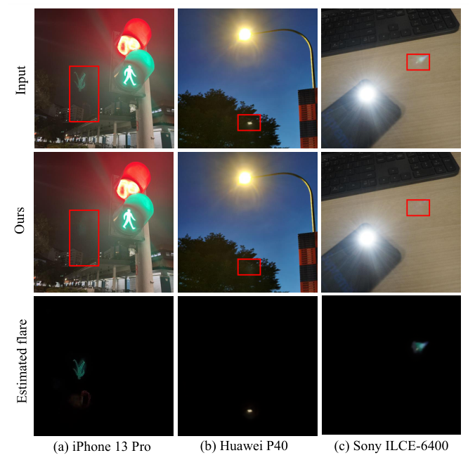
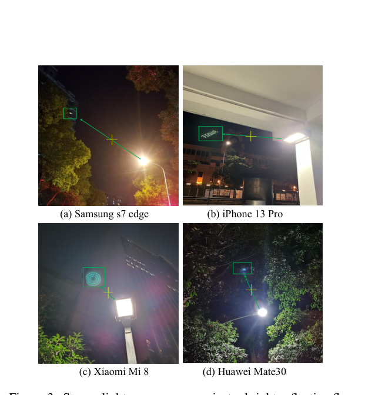
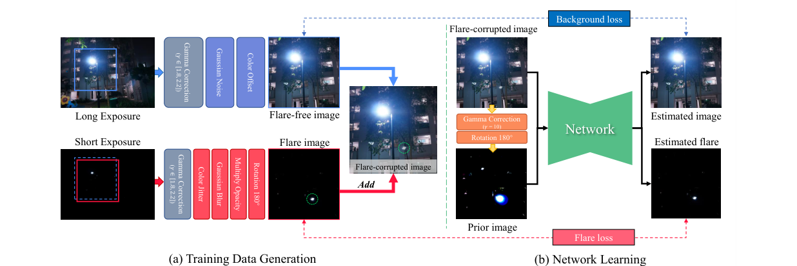
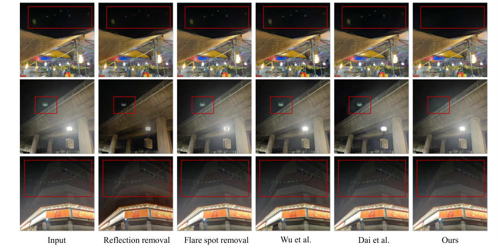

# Nighttime Smartphone Reflective Flare Removal Using Optical Center Symmetry Prior

> **发表**：CVPR 2023　|　**作者**：Yuekun Dai et al.（南洋理工大学 S-Lab）
> **论文**：https://ykdai.github.io/projects/BracketFlare　|　**代码**：https://github.com/ykdai/BracketFlare

## 一、解决的问题

反射 flare（reflective flare / ghosting）是强光在镜组内部多次反射后在照片上形成的亮斑或"鬼影"。与放射状的散射 flare 不同，聚焦良好的反射 flare 表现为一个清晰的亮斑甚至完整复刻光源形状（如 LED 灯珠阵列、霓虹招牌的倒像），夜间多光源场景下尤为泛滥。它的难点在于：反射 flare 长得像远处的路灯或小亮窗，传统 SURF/SIFT 特征检测类方法只能识别特定形状的亮斑，且常把真实光源误删；已有学习式数据集中的反射 flare 子集要么来自单一镜头单一光源（Wu et al.），要么是 10 种合成图案（Flare7K），训练出的网络要么泛化差，要么倾向误删街灯等小亮点。

更根本的困难是：反射 flare 由镜头系统本身产生，物理上不可能拍到同一场景"有 flare/无 flare"的真实成对数据——这使得监督学习的数据问题成为该子任务的第一瓶颈。

## 二、核心创新点

1. **光学中心对称先验（optical center symmetry prior）**：发现并验证了"反射 flare 的主亮斑与光源恒关于镜头光学中心对称"这一规律，且 flare 图案与光源最亮区域形状一致。该先验把反射 flare 的搜索空间从全图坍缩到一个确定点位，适用于绝大多数智能手机主摄。论文用 ABC 传递矩阵推导：聚焦成像时直接像高 h0 与反射像高 h1 均与物高 h 线性相关，比值 k 为镜头设计常数，而手机镜头设计普遍使 k=−1，由此得出中心对称性；并在 Huawei P40、iPhone 13 Pro、ZTE Axon 20 三款手机上各拍 20 张实测，flare 与光源坐标严格呈斜率 1 的线性关系。
2. **BracketFlare 数据集**：首个反射 flare 去除数据集。利用"反射 flare 形状 = 光源最亮区域"的观察，用连续包围曝光（bracketing，±3EV×5 张）拍摄静态场景，取欠曝帧提取光源图案、正常曝光帧作背景，将光源图案绕光学中心旋转 180°、加模糊/颜色增广后叠加合成成对数据。共 440 对 4K 训练图 + 40 对测试图，覆盖路灯、灯管、LED、招牌等 8 类光源、室内外多场景。
3. **先验嵌入网络的端到端 pipeline**：对输入做 γ=10 的 gamma 校正提取近饱和光源区域，旋转 180° 得到"先验图"，与原图 concat 成 6 通道输入；输出也是 6 通道（3 通道背景 + 3 通道 flare），任何现成修复网络（MPRNet/HINet/Uformer/Restormer）都能即插即用。

## 三、模型结构与方案

> 图 1：在 iPhone 13 Pro、Huawei P40、Sony 微单上的反射 flare 分离效果——网络能把 flare 层与干净图像分开（来源：原论文）

> 图 3：四款手机实拍：反射 flare（绿框）与光源恒关于光学中心（黄十字）对称，且形状复刻光源亮区（来源：原论文）

> 图 7：(a) 训练数据在线生成：长曝光帧做背景（加噪声/色偏），短曝光帧经色彩抖动、模糊、不透明度调制并旋转 180° 合成 flare；(b) 网络学习：γ=10 提取光源 + 中心翻转得先验图，6 通道入、6 通道出（来源：原论文）

**数据后处理**：4K 图 resize 至 800×1200，对欠曝光源图加 t∼U(0,15) 像素平移模拟光心偏差，随机裁 512×512，γ∼[1.8,2.2] 线性化后所有合成在线性域完成；flare 加随机颜色因子（模拟不同波长反射率）、随机模糊（模拟离焦）与不透明度；背景加高斯噪声和小色偏模拟真实夜景。

**损失函数**：L = L_rec + L_flare + L_bg。重建损失约束估计的 flare 与背景在线性域相加还原输入；背景损失 = 0.5·L1 + 0.1·L_vgg + 20.0·L_mask，其中 mask 损失用 flare GT（>0.2）的掩码加权，迫使网络聚焦小面积的 flare 区域而不是被全图 L1 平均掉；flare 损失形式同背景损失。

## 四、实验与结果

**合成测试集**（40 对）：输入本身 PSNR 已达 37.30（flare 区域小），反射去除/flare spot 去除/Wu/Dai 等先前方法不仅没提升反而大幅劣化（22.02–38.29），而本文（MPRNet† 基线）达 **PSNR 48.41 / SSIM 0.994 / LPIPS 0.004 / Masked PSNR 32.09**（输入 Masked PSNR 仅 21.68）。

**先验消融**：四个网络加先验图后 Masked PSNR 全部提升 3–4.5 dB（MPRNet 27.64→32.09，Uformer 27.77→31.57），证明对称先验是性能的主要来源，而非网络本身。

**损失消融**：去掉 L_flare 损失 Masked PSNR 跌至 30.63，去掉 L_mask 跌至 31.03，验证双侧监督与区域加权的必要性。

**真实数据与用户研究**：在 10 款不同品牌手机实拍图上做 20 人用户研究，室外 90.5%、室内 85.5% 的参与者偏好本文结果，远超 Wu et al.（0.5%/3.5%）与 Dai et al.（1.5%/2.5%）。

> 图 8：真实夜景上与反射去除、flare spot 去除、Wu et al.、Dai et al. 的视觉对比——已有方法或对鬼影无动于衷，或连真实光源一并误删，本文方法精准去除鬼影并保留场景细节（来源：原论文）

## 五、专家锐评

**价值**：这是反射 flare 子任务的奠基性工作。它的核心贡献排序应当是：物理先验 > 数据集 > 网络（网络完全是现货）。"flare 与光源关于光心对称、形状复刻光源亮区"这一观察同时解决了两个难题——既给出了数据合成的配方（短曝光帧旋转 180° 即得 flare），又给出了推理期的强位置先验（6 通道输入）。用包围曝光绕开"物理上拍不到成对数据"的死结，是数据构造上的巧思，后被 Flare7K++ 直接吸收为反射 flare 子集。从 Masked PSNR +10 dB 的量级看，先验的杠杆作用真实且巨大。

**不足与质疑**：

1. **先验的适用边界比论文呈现的更窄**。k=−1 依赖于手机镜头的特定设计，论文自己也只敢说"大多数智能手机主摄和部分专业相机"；对超广角/潜望长焦/带防抖位移的模组、以及光学中心不在图像中心的裁切场景（电子防抖、数码变焦），对称点会漂移。论文仅用 t∼U(0,15) 像素的平移增广来兜底，但没有量化先验失准到什么程度性能会崩——这对落地恰恰是关键问题。
2. **只处理"聚焦的主反射斑"**，作者在图 2 中明确把非聚焦的 aperture 状鬼影（AR 镀膜可缓解的部分）排除在外。但真实夜拍中聚焦斑与离焦光雾常同时出现，且 lens protector（贴膜）等附加层产生的反射并不保证服从同一 k；方法对"链条状多级鬼影"（一串亮斑）也未验证——这些都是反射 flare 的常见形态。
3. **合成-真实的鸿沟靠用户研究遮掩**。定量评测全部在自家合成测试集上，48.41 dB 的惊人数字很大程度上反映"输入本就只有小区域退化 + 测试分布与训练同源"；真实数据只有视觉对比与 20 人用户研究，且对比对象（Wu、Dai 的模型）本来就不是为反射 flare 训练的，胜之不武。缺一个跨设备的定量基准（哪怕是人工标注 flare mask 的 masked 指标）。
4. **数据规模偏小**：440 对训练图、单一拍摄相机（Sony A7 III），光源多样性靠增广撑起；用 A7 III 采的光源图案去模拟手机镜头的反射特性，光谱响应与镜组反射率的差异被一个"随机颜色因子"粗暴吸收，物理一致性其实远不如论文推导部分给人的印象严格。
