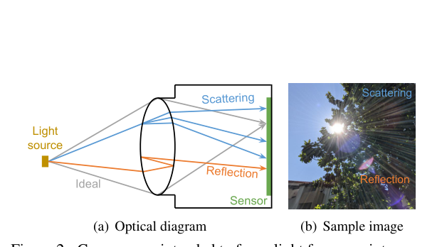
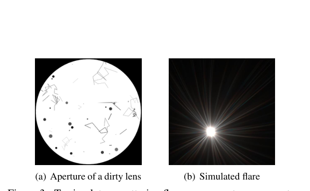
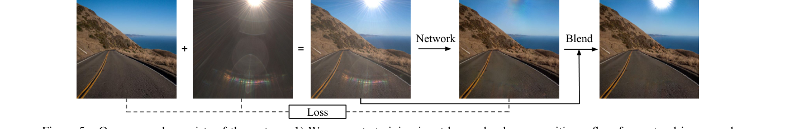
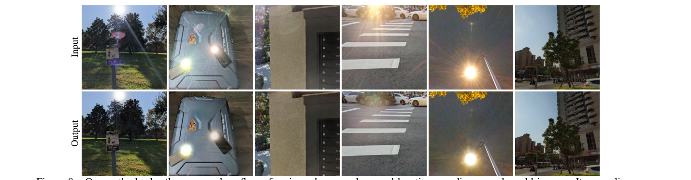

# How to Train Neural Networks for Flare Removal

> **发表**：ICCV 2021　|　**作者**：Yicheng Wu et al.（Rice University / Google Research / Adobe，第一作者在 Google Research 实习期间完成）
> **论文**：https://yichengwu.github.io/flare-removal/　|　**代码**：官方 TensorFlow 实现（google-research/flare_removal）；非官方 PyTorch 实现：https://github.com/budui/flare_removal_pytorch

**领域定位**：本文是**深度学习去眩光（flare removal）方向的开山之作**——首个通用的、基于学习的单图去镜头眩光方法。后续几乎所有学习式去眩光工作（Flare7K、Flare7K++、BracketFlare、DeflareMamba 等）都直接继承了本文提出的"眩光层线性加性合成 + 光源区域保护"范式。

## 一、解决的问题

当相机对准强光源（太阳、夜间灯光）拍摄时，镜头内部的非理想光路会在照片上产生眩光：光晕（halo）、放射状光条（streaks）、彩色光斑、雾状对比度下降（haze）等。其物理成因分两类：一是镜片上灰尘、划痕等缺陷导致的**散射/衍射**（呈放射状光条与雾状泛光），二是镜组各空气-玻璃界面间的**多次内反射**（呈盘状/弧形亮斑，且因 AR 镀膜的波长选择性而常带蓝紫色偏色；n 片镜组有 n(2n−1) 种潜在反射组合）。眩光形态高度依赖光源位置、镜头设计与个体缺陷，外观极其多样，这正是该问题困难的根源。

在本文之前，已有方案要么靠光学设计（AR 镀膜，昂贵且无法对所有波长/入射角优化）、要么靠硬件-软件协同（结构遮挡掩模、光场方法，需特殊硬件）、要么是纯软件的两阶段启发式（按形状/亮度阈值检测饱和光斑再 inpainting），后者只能处理"亮斑"这一种眩光，且把眩光当成二值不透明区域，忽略了眩光实为半透明叠加层的事实。深度学习在去反射、去雨等近邻图像分解任务上早已成功，却从未被成功用于去眩光，**根本瓶颈是没有成对训练数据**：要拍到像素对齐的"有眩光/无眩光"图像对，需要静止场景、静止相机，还要能"开关"眩光而不改变场景光照，规模化采集基本不可能，且遮挡法只适用于光源在视场外的情形。

本文回答的正是标题之问："如何训练去眩光的神经网络"——答案是物理模型驱动的半合成成对数据，加上一套防止网络误删光源的损失与后处理设计。

## 二、核心创新点

1. **首个基于学习的通用单图去眩光方法**：只需一张普通相机拍摄的 RGB 图像，可处理多种形态的眩光，开创了该研究方向。
2. **眩光成因二分法与对应的数据生成策略**：把眩光拆为散射型与反射型分而治之——散射型用**波动光学仿真**（物理上可精确建模），反射型因依赖厂商不公开的镜头设计而改用**实验室实拍**。这是全文最重要的方法论框架。
3. **眩光线性可加性假设**：眩光是"理想图像"之上的加性层（在线性 raw 空间 I_F = I_0 + F + 噪声），使任意自然图像与任意眩光图可自由组合成成对训练数据。
4. **光源保留机制**：眩光-only 图像中光源与眩光物理上不可分，朴素训练会让网络连光源一起抹掉。本文用饱和掩模在损失中忽略光源区域，并引入 **flare loss**（对预测出的眩光残差同样施加监督）防止网络"见亮就删"，推理后再把输入光源羽化混合回输出。
5. **方法与架构解耦**：同一数据与损失方案在两个为其他任务设计的现成网络（Zhang et al. 的去反射网络与朴素 U-Net）上都显著有效，证明贡献核心在数据合成与训练方案而非网络结构。
6. **低成本高分辨率扩展**：利用眩光以低频为主的特性，低分辨率预测眩光层、上采样后从原图相减，2048×2048 输入在 Xeon E5 CPU 上的推理时间从 8s 降到 0.55s。

## 三、模型结构与方案

> 图 2：眩光的光学成因。理想光路（灰）将点光源聚焦于传感器一点；灰尘/划痕引起散射（蓝），形成放射状光条与雾状；镜片界面间内反射（橙）形成盘状/弧状彩色亮斑（来源：原论文）。

**散射眩光的波动光学仿真**：成像系统用复值光瞳函数 P_λ(u,v) = A(u,v)·exp(iφ_λ(u,v)) 刻画。孔径函数 A 在理想圆孔上随机加入不同大小与透明度的点（模拟灰尘）和线（模拟划痕），共生成 125 种"脏孔径"；相位项 φ_λ 由光源入射角决定的线性项与深度 z 决定的离焦项组成。PSF_λ = |F{P_λ}|² 即该点光源经此孔径所成的像。对 380–740nm 以 5nm 间隔采样 73 个波长，再左乘 3×73 的光谱响应矩阵（SRF）得到 RGB 眩光图，并施加桶形/枕形光学畸变增广，共生成 2,000 张散射眩光图。

> 图 3：(a) 随机加入点/线缺陷的合成"脏镜头"孔径；(b) 由波动光学计算出的对应散射眩光像（来源：原论文）。

**反射眩光的实拍采集**：暗室中用强光源 + 程控旋转台 + 固定光圈的 Android 手机摄像头（f=13mm 等效），相机程控旋转使光源沿对角视场从 −75° 扫到 75°，每 0.15° 拍一张 HDR 共 1,000 张，再用视频插帧算法 2 倍插值到 2,000 张。训练时利用反射眩光绕光轴旋转对称的性质做随机旋转增广。依据是"同款镜头设计的内反射路径相似"，故单镜头采集可泛化到同设计的其他个体。

**成对数据合成**：I_F = I_0 + F + N(0, σ²)，在线性空间相加；噪声方差按 σ² ~ 0.01χ² 每图采样一次。干净图 I_0 取自 Zhang et al. 的 24k Flickr 图像（已 gamma 编码，用 γ∈[1.8, 2.2] 均匀采样的逆 gamma 近似线性化），加随机翻转/亮度增广；眩光图 F 从实拍与仿真两个库采样，加随机仿射变换（缩放、平移、旋转、剪切）与白平衡增广。

> 图 5：整体三步流程——随机合成"干净图 + 眩光图"得到训练输入；CNN 预测无眩光图（光源可能被一并移除）；后处理把输入中的光源混合回输出（来源：原论文）。

**损失函数**：总损失 L = L_I + L_F。先按亮度阈值 0.99 + 形态学操作得到饱和掩模 M（小的饱和区被剔除，视为场景或眩光的一部分），掩模内的网络输出用 GT 替换后再计算损失，使光源区域损失为零、网络不必学 inpainting。**图像损失 L_I** = RGB 上的 L1 + 预训练 VGG-19 的 conv1_2 至 conv5_2 五层特征 L1（感知损失）；**眩光损失 L_F** 形式相同，但作用于预测眩光 F̂ = I_F − f(I_F,Θ)⊙(1−M) 与真值 F 之间，约束残差以防网络把非眩光的亮物体也削暗。

**光源混回后处理**：因损失刻意不约束饱和区，网络输出在该处行为未定义（实际倾向于抹平光源）。利用"产生可见眩光的光源在输入中必然饱和"的观察，将掩模 M 边界羽化为 M_f，在线性空间混合 I_B = I_F⊙M_f + f(I_F,Θ)⊙(1−M_f)，得到"去眩光但保光源"的最终结果。

**网络与推理**：输入 512×512 RGB，评估了 Zhang et al. 去反射网络和 U-Net 两种架构（U-Net 更好，作为默认）。高分辨率输入采用"下采样→预测低分辨率眩光→上采样眩光→原图相减"的策略。

## 四、实验与结果

**测试数据三类**：(a) 合成图（有 GT）；(b) 真实图（无 GT）；(c) 真实图（有 GT）——三脚架上拍一对照片，强光源在视场外，其中一张用遮光罩等遮挡物挡住入射的眩光光线作为 GT。

**与已有方法对比**（表 1，计算指标时掩模区域用 GT 像素替换以排除光源影响）：

| 方法 | 合成 PSNR/SSIM | 真实 PSNR/SSIM |
|---|---|---|
| 输入图像 | 21.13 / 0.843 | 18.57 / 0.787 |
| Flare spot removal（Chabert / Vitoria / Asha 三种启发式） | ≈输入（几乎无改动） | ≈输入 |
| Dehaze (He et al.) | 18.32 / 0.829 | 17.47 / 0.745 |
| Dereflection (Zhang et al.) | 20.71 / 0.767 | 22.28 / 0.822 |
| Ours + Zhang 网络 | 28.49 / 0.920 | 24.21 / 0.834 |
| **Ours + U-Net** | **30.37 / 0.944** | **25.55 / 0.850** |

三个传统 flare spot 方法的指标与输入几乎相同，印证它们只能处理极有限的亮斑类型、对一般眩光"没干活"。**用户研究**（20 人、52 张图、3 个数据集：同款镜头 / 五种其他焦距镜头 / Chabert 自带数据）：本文 U-Net 平均以 95% / 92% / 84% 的偏好率胜过全部 5 个 baseline，连在 Chabert 自己的数据集上也以 85% : 15% 获胜。

> 图 8：在多样真实图像上稳健去除不同形状、颜色、位置的眩光；可泛化到多光源场景（第 2 列），无眩光时输入基本保持不变（末列）（来源：原论文）。

**消融**（真实测试集，表 3）：完整模型 25.55 / 0.850；去掉 flare loss 降到 24.84 / 0.841，且夜景中非眩光的亮物体会被误删（图 9）；只用实拍数据（缺散射）23.77 / 0.828，去不掉放射状光条；只用仿真数据（缺反射）24.44 / 0.843，去不掉反射光斑——实拍与仿真两类数据缺一不可。

**跨相机泛化**：训练用的反射眩光全部来自单一 f=13mm 手机镜头，模型仍可有效处理同一手机 27mm / 44mm 镜头及 iPhone 拍摄的图像；但在鱼眼等设计悬殊的镜头上，反射眩光去除明显退化（散射部分尚可），作者坦承这是镜头相关性的固有限制，并把 domain adaptation 留作 future work。

## 五、专家锐评

**价值**：这篇论文的分量不在任何网络结构，而在于它把去眩光从一个被启发式方法垄断、深度学习无从下手的问题，变成了有标准数据合成范式的监督学习问题。"眩光 = 线性空间的加性层"、"散射用波动光学仿真 + 反射靠实拍"、"饱和掩模剔除光源 + 推理后贴回 + flare loss 双侧监督"——这三件套定义了此后整个子领域的方法骨架：Flare7K/Flare7K++ 的数据集构建、各类夜景去眩光网络，本质上都在这个框架内替换组件。论文最聪明之处是承认"网络不重要"：用一个朴素 U-Net 证明数据生成才是瓶颈，这种问题定义层面的贡献远比一个新模块持久。从工程影响看，该方法思想后来进入了 Google Pixel 的产品级影像管线。作为开山之作，它留给后人的改进空间（夜景、多样光源、跨镜头）恰是其影响力的证据。

**不足与质疑**：

1. **反射眩光数据的单一性是结构性缺陷**。2,000 张实拍全部来自一颗 f=13mm 的 Android 手机镜头，"入射角"几乎是唯一变化维度（再加帧插值与旋转增广），光源类型、距离、光谱全固定。论文自己的鱼眼实验（图 11）已暴露泛化边界；要覆盖新镜头设计就得重新搭暗室转台采集，扩展成本不低，而论文对 domain adaptation 只以一句 future work 带过。后续 Flare7K 的出现正是因为这套数据无法覆盖夜间多样光源——本文的弱项被继任者精准接管。
2. **夜间场景系统性偏弱**。训练背景图是日间为主的 Flickr 图像，眩光实拍是暗室单光源；消融（图 9）显示无 flare loss 时夜景立即出现亮物误删，说明模型在夜间多光源分布之外工作。而夜间恰是眩光最严重、用户最常遇到的场景，这一错位直到后续工作才被正面解决。
3. **光源处理是绕过而非解决**。饱和区零损失 + 推理贴回，意味着光源-眩光边界的质量完全依赖阈值 0.99、形态学操作与羽化超参（细节都在补充材料）；对未饱和但仍致眩的光源（薄云后的太阳、灯箱）掩模会漏检，对饱和的非光源亮物（白墙高光）会误保护。论文没有报告掩模失误的失败案例统计。
4. **线性可加假设在强眩光下并不严格**。饱和截断、veiling glare 的乘性对比度损失、真实 ISP 的局部色调映射与 JPEG 压缩都破坏加性模型；用 γ∈[1.8, 2.2] 的逆 gamma 近似 raw 线性化相当粗糙，且各近似项对最终精度的敏感性没有逐项分析，只能由 25.55dB 的真实集总指标间接体现。
5. **基线对比偏弱，胜之不武**。三个 flare spot removal 基线是 2015–2019 年的非学习启发式方法（其一还是斯坦福课程技术报告），在通用眩光上输出几乎等于输入；dehaze/dereflection 则是任务错配的"稻草人"。当时虽无学习式去眩光方法可比，但作者本可在自家数据上重训更多强力图像恢复网络做对照（论文只试了 Zhang et al. 与 U-Net 两个）。此外真实带 GT 测试集只覆盖"光源在画面外"的情形且规模未说明，定量结论的统计强度有限。

总体而言，这是一篇以问题形式化和数据构造取胜的奠基性工作：单点技术都不复杂，但组合起来第一次让"训练去眩光网络"成为可能，其历史地位已被大量后续跟进反复确认。
