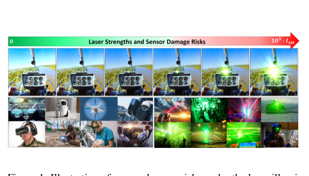
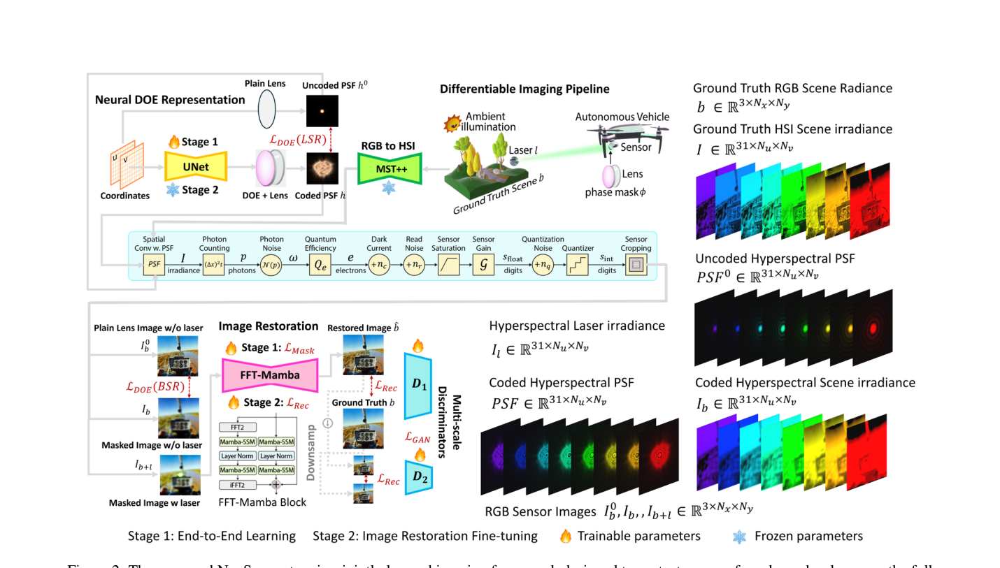
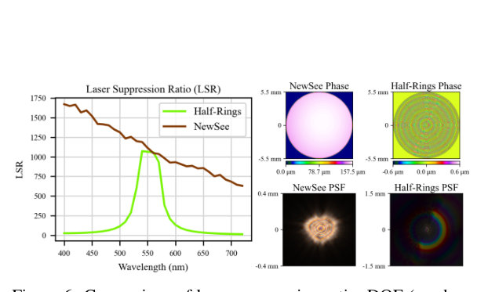
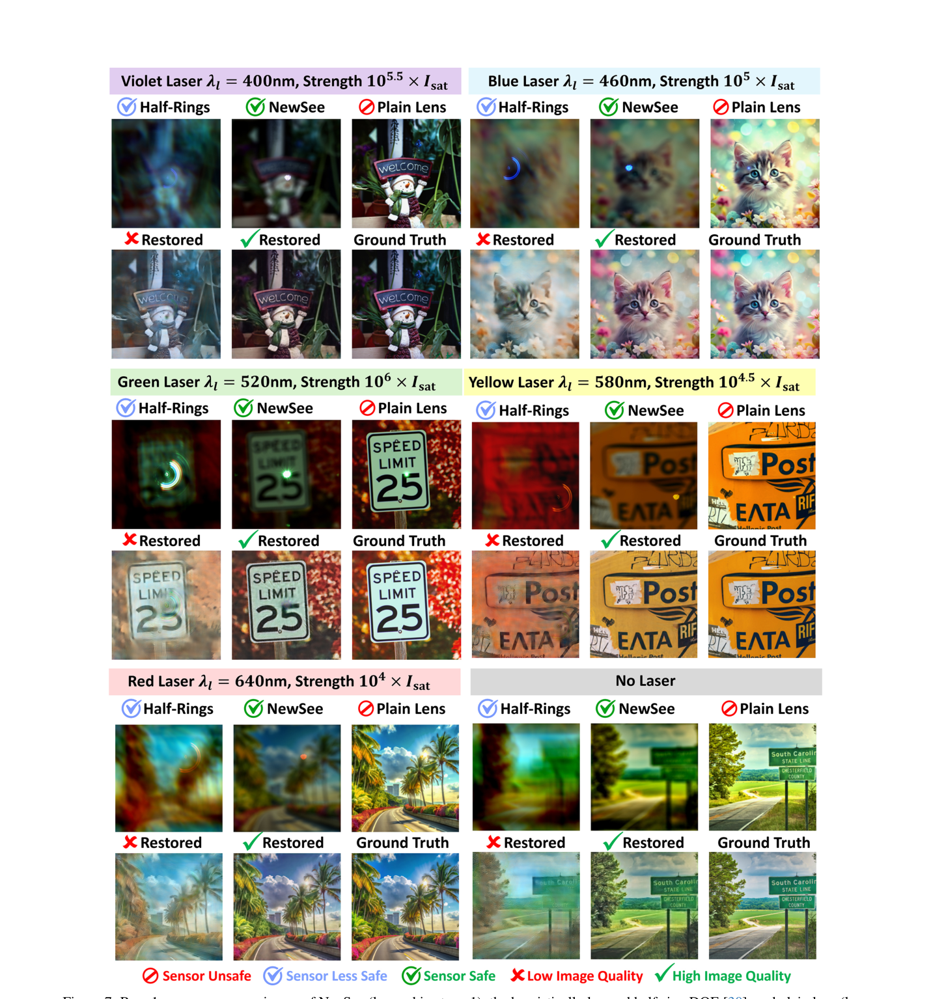

# Learning to See Through Flare

> **发表**：ICCV Workshop (Responsible Imaging) 2025　|　**作者**：Xiaopeng Peng et al.（Rochester Institute of Technology + U.S. Naval Research Laboratory）
> **论文**：CVF Open Access（ICCVW 2025, pp. 7469–7480）　|　**代码**：未开源

## 一、解决的问题

本文处理的不是常规摄影中的太阳/路灯眩光，而是**激光致盲（laser dazzle）下的传感器保护与成像恢复**。低成本大功率激光器日益普及，激光直射相机会造成大面积过饱和、镜头 flare（光晕、条纹、彩色渗漏、雾化），乃至永久性像素损伤——硅基传感器的损伤阈值通常比饱和阈值高 6~9 个数量级，而现实激光强度完全可能达到这一量级。受威胁场景包括：无人机跟踪与自动驾驶感知系统遭受对抗性激光攻击、激光秀损坏消费级相机、以及视频透视式（VST）头显在激光实验室/航空/医疗中的护目应用。

现有光学防护手段——波长复用、非线性光学、全息镀膜、液晶、超材料、缩短积分时间、烟雾遮蔽——没有一种能同时满足谱段带宽、响应时间、动态范围、稳定性和成像质量的要求。已有的学习型衍射光学元件（DOE，如遗传算法优化的 half-ring 相位掩膜）则受限于窄视场或窄光谱，只能在特定设计波长附近抑制激光。更深层的矛盾在于：**抑制激光**与**保持背景光透过率/成像质量**是一对天然冲突的目标，单靠光学或单靠后处理算法都解不了。

本文提出 **NeuSee**，号称是第一个覆盖**全可见光谱（400–700 nm）**的高保真传感器保护计算成像框架：在入瞳处放置一片联合学习的 DOE 在光学层面衰减激光、保持背景透过，再用一个频域 Mamba-GAN 网络善后（饱和区补全、去模糊、去噪），端到端对抗训练，可抑制高达 10⁶ 倍传感器饱和阈值 I_sat 的峰值激光辐照度。

> 图 1：激光照射下的传感器损伤风险（上排）与传感器保护的应用场景（下排）（来源：原论文）

## 二、核心创新点

1. **首个全可见谱"DOE + 复原网络"端到端联合学习的传感器保护框架**：此前的学习型防护 DOE 只针对窄带激光波长，NeuSee 首次实现 400–700 nm 全谱段的激光抑制与成像，在 10 万张图像上对抗训练。
2. **DOE 的神经隐式表示**：不直接优化相位高度图，而用一个 8 层 UNet（G_rep）把瞳面坐标 (u,v) 映射为 DOE 高度 h_DOE(u,v)，再经波长相关折射率 Δn(λ) 得到相位分布，参数化平滑且可与下游网络联合可微训练。
3. **频域 Mamba-GAN 复原网络**：生成器由 8 层 FFT-Mamba block 组成，同时利用图像强度与频域信息，coarse-to-fine 双尺度生成 + 多尺度判别器（WGAN-GP 式梯度惩罚），用 GAN 的生成能力补全饱和区，又避开扩散模型迭代采样的高推理成本。
4. **两阶段训练化解目标冲突**：Stage-1 以 DOE 损失（激光抑制比 LSR 最小化 + 背景抑制比 BSR 趋近 1）+ GAN 损失联合训练 DOE 与复原网络（梯度累积稳定更新）；Stage-2 冻结 DOE，仅以重建损失 + GAN 损失微调复原网络，避免多目标梯度互相干扰。
5. **物理级高光谱仿真管线**：RGB 三通道不足以模拟任意波长激光的 PSF，故用预训练 MST++ 把 RGB 辐射图升维为 31 波段高光谱体，经 Scaled Fresnel 波动光学传播、镜头脏污/划痕/挡风玻璃凹痕等 flare 效应仿真（借鉴 Wu et al. 与 Flare7K），再叠加完整的传感器噪声与量化模型；训练时在 8×A100-80G 上用异构数据+模型并行支撑 2048×2048×31 张量的在线仿真。

## 三、模型结构与方案

> 图 2：NeuSee 系统总览——可微物理成像管线（RGB→HSI→PSF→传感器图像）、UNet 神经 DOE 表示、频域 Mamba-GAN 复原网络与两阶段训练（来源：原论文）

**整体 pipeline**：RGB 真值辐射图 → MST++ 升维为 31 波段 HSI → 与神经 DOE 决定的波长相关 PSF 卷积得到背景光路辐照；激光建模为入瞳平面波/焦面 Dirac 点源（中心波长在 400–700 nm 随机、FWHM 10 nm 高斯谱线）乘上 PSF → 叠加 CIE 日光谱与镜头 flare 效应 → 光子泊松（实践中用高斯近似）采样、量子效率转换、暗电流 + 读出噪声、满阱裁剪、增益与量化 → 得到 16-bit 编码传感器图像 s → Mamba-GAN 生成器 G_res 复原出背景辐射 b̂。

**神经 DOE 与 PSF**：h_DOE(u,v) = G_rep(concat(u,v))，相位 φ = (2π/λ)·Δn(λ)·h_DOE；PSF 用 Scaled Fresnel 方法在瞳面（2160×2160、3.74 µm）与传感器面（2048×2048、2.9 µm）不同像素间距下高效计算；f = 0.11 m，光圈 11 mm，物理参数与实验室相机对齐（Table 1）。

**损失函数**：
- DOE 损失：L_DOE = Σ I_l(λ)/I_l0(λ)（压低激光透过）+ Σ I_b0(λ)/I_b(λ)（保持背景透过）；
- GAN 损失：双尺度判别器 D⁰/D¹，WGAN-GP（λ_ADV = 0.1，λ_GP = 1）；
- 重建损失：双尺度 Charbonnier L1 + FFT 频域幅值 L1（细尺度真值由抗锯齿 bicubic 下采样得到）。

**训练设置**：100K 张 4K（3860×2160）Unsplash 图像在线仿真为训练集，另取 1K 张做测试；随机裁剪至 2048×2048 后将传感器图下采样到 256×256 训练。激光强度 α_l 在 [0, 2×10⁶] 均匀采样，入射角正态采样（3σ = 0.36·[f/Ws, f/Hs]），暗电流/读出噪声/光子噪声系数/曝光时间/背景照度 α_b ∈ [0.3, 0.7] 全部随机化。Adam（权重 lr 2e-4、偏置 4e-4），Stage-1 训练 10,000 次迭代直至 LSR 最低，Stage-2 再训 20,000 次迭代。

## 四、实验与结果

- **对比对象**：遗传算法启发式优化的 half-ring 相位掩膜（Wirth et al. 2020；作者前作 "Learning to See Through Dazzle", arXiv 2024），以及无掩膜的 plain lens。为公平，half-ring 也配同样的 Mamba-GAN 复原。
- **激光抑制**：half-ring 的 LSR 曲线只在 ~550 nm 附近有一个尖峰，NeuSee 则在 400–720 nm 全程保持高抑制；正文称对可见激光平均抑制强 5×，图 6 图注则写约 100×（原文口径不一）。
- **图像质量**：在 1,000 个场景 × 7 档激光强度（α_l = 0 与 10¹…10⁶）共 7K 测试图上，NeuSee 相比 half-ring 的复原图像质量平均提升 **10.1%（L1 指标）**。论文未报告 PSNR/SSIM/LPIPS 等标准指标，也无消融实验。
- **定性结果**：紫/蓝/绿/黄/红五种激光（强度 10⁴~10⁶ I_sat）及无激光场景下，NeuSee 的传感器原始图饱和斑更小、无损伤风险，复原图保真度一致最高；half-ring 在偏离其设计波长的激光下复原失败（明显残余眩光与色偏），plain lens 在 α_l ≥ 10⁶ 时面临传感器损坏。

> 图 6：NeuSee 与 half-ring 在激光抑制比（LSR）、相位掩膜与 PSF 上的对比；half-ring 仅在 550 nm 附近有效，NeuSee 覆盖全可见谱（来源：原论文）

> 图 7：五种波长激光及无激光场景下 half-ring、NeuSee 与 plain lens 的传感器图像（每组上排）与复原图像（每组下排）对比（来源：原论文）

## 五、专家锐评

**价值**：本文与 flare 社区主流的"后处理去 flare"路线正交——它属于计算成像 deep optics 分支，把 flare 问题前移到光学层面，在光线到达传感器之前就用学习到的 DOE 削掉激光能量，复原网络只负责善后。对"flare 强到信息物理性丢失（饱和/损坏）"的极端场景，这是唯一可行解：任何纯软件去 flare 网络在 10⁶×I_sat 的辐照面前都无意义。用预训练 HSI 重建网络绕开高光谱数据稀缺、支撑全谱段任意波长激光的端到端优化，是相对 half-ring 等窄带方案的实质性进步；神经隐式 DOE 表示 + 两阶段训练调和目标冲突、完整的传感器噪声/量化前向模型、分布式异构并行的工程整合，都体现了不低的系统完成度。NRL 背景也说明其防务/安全应用的现实指向。

**不足与质疑**：

1. **全程仿真闭环，零实物验证**。论文反复强调参数"与实验室相机匹配"（Table 1），却没有展示哪怕一组真实加工 DOE + 实拍的结果。衍射元件的制造/对准误差、Δn(λ) 的实测色散偏差、真实激光的散斑效应都可能让仿真结论大打折扣。对一篇主打"传感器保护"的系统论文，sim-to-real 缺位是最致命的短板。
2. **对比基线单薄且陈旧**。唯一对手是 2020 年的 half-ring 掩膜（且是作者同组前作的延续）。相关工作里明确引用了 Zhang et al.（Optics Express 2024）、OpSecureCam（2025）、Meyer et al.（2025）等多个同期学习型激光防护方案，却一个都没比。和一个明知只在 550 nm 有效的窄带掩膜比"全谱抑制"，赢得毫无悬念。
3. **核心设计完全没有消融**。FFT-Mamba block 换成 Restormer/NAFNet 会差多少？两阶段训练相对单阶段联训的增益是多少？GAN 损失、频域损失、神经 DOE 表示（相对直接优化高度图）各贡献几何？全部无数据支撑，"novel Mamba-GAN"的必要性无从判断。
4. **指标含糊且口径不一**。正文说激光抑制"平均强 5×"，图 6 图注与摘要却写"100 倍"，两处相差 20 倍而无任何解释；图像质量只报一个"L1 改善 10.1%"，没有 PSNR/SSIM/LPIPS，也没有按激光强度/波长分档的细分结果，无法判断临界强度（10⁵–10⁶）下的真实表现。
5. **代价问题被轻描淡写**。全谱抑制必然以 PSF 显著弥散为代价（见图 6 的 NeuSee PSF），等于把"激光问题"转化为"全图轻度模糊问题"再靠 GAN 找补；无激光场景下相对 plain lens 的成像质量损失、BSR 实际数值均未给出。GAN 补全饱和区在安全攸关场景（路牌、行人识别）中的幻觉风险只字未提；Mamba-GAN 的推理延迟能否满足自动驾驶/头显实时性也未讨论。训练/测试数据同源（均为 Unsplash），加之代码未开源、8×A100 的训练门槛，可复现性与泛化性都存疑。
