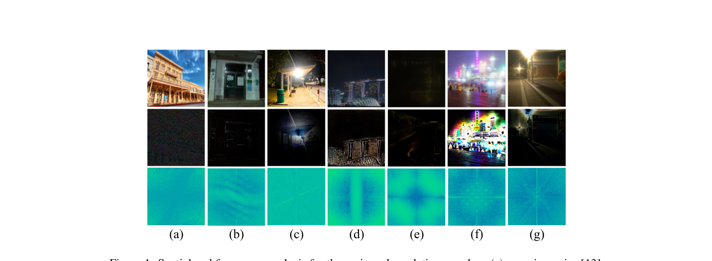
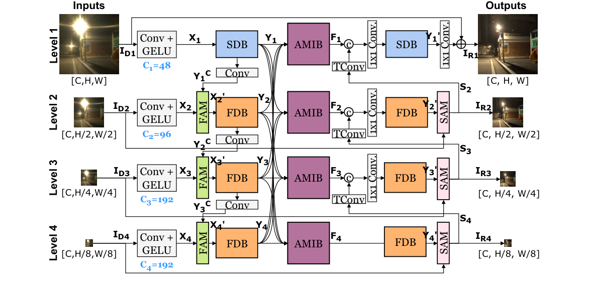
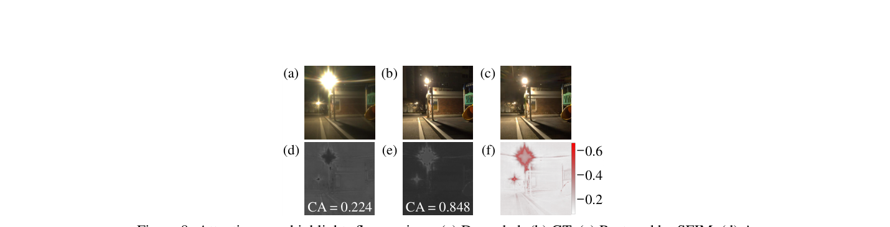
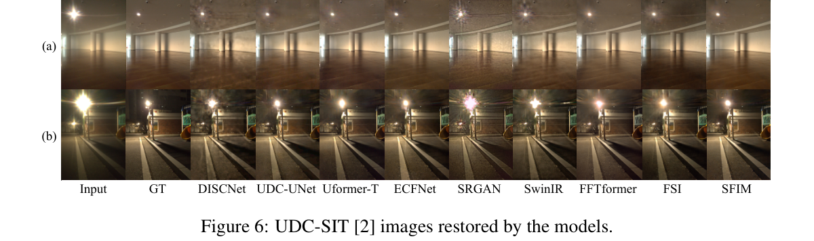

# Integrating Spatial and Frequency Information for Under-Display Camera Image Restoration

> **发表**：arXiv 2025（arXiv:2501.18517，2025-01-30 提交）　|　**作者**：Kyusu Ahn et al.（首尔国立大学 & 三星显示）
> **论文**：https://arxiv.org/abs/2501.18517　|　**代码**：https://github.com/mcrl/SFIM

> **定位说明**：本文属相关任务（屏下摄像头 UDC 图像复原），并非纯粹的去眩光论文。但 UDC 退化中最棘手的成分正是显示像素阵列衍射造成的眩光（flare），形态与频域特征均与镜头眩光高度相似（论文图 1 直接与 Flare7K 的 lens flare 做了频谱对照），其"空间域管局部退化、频域管全局眩光"的思想对去眩光任务有直接借鉴意义，故纳入本系列报告，关联性在第四节末与锐评中专门讨论。

## 一、解决的问题

屏下摄像头（Under-Display Camera, UDC）把相机镜头藏在显示面板下方，实现真全面屏（三星 Galaxy Z-Fold 系列、ZTE Axon 系列均已商用）。但显示像素阵列相当于一组周期性狭缝，会对入射光产生衍射，导致 UDC 图像同时叠加多种退化：低透过率、模糊、噪声，以及最棘手的**衍射眩光**——在强光源周围呈大面积、空间可变的辐射状光斑，在 UHD 分辨率的真实数据集 UDC-SIT 上甚至可以覆盖整幅图像。

作者的核心观察是：噪声、模糊属于**局部退化**，CNN 卷积核（空间域局部算子）即可有效处理；而眩光是**全局退化**，依赖长程依赖建模。已有 UDC 复原工作要么纯空间域（ECFNet、UDC-UNet 等 MIPI 竞赛冠军方案靠多级 CNN 下采样扩感受野，对 UHD 图像上的大面积眩光力不从心），要么虽然引入频域（PDCRN 仅用 DWT 做上下采样、FSI 用空间-频率双流网络），但对"大范围不规则纹理损失"仍然乏力。作者在 Fourier 空间重新审视各类退化（图 1），发现含眩光的数据集（SYNTH、UDC-SIT）与传统镜头眩光（Flare7K）一样，退化图与真值图的**频谱幅度差呈现细长尖峰**——即眩光存在可被利用的内在频率先验，这成为整个方法的出发点。

> 图 1：各类退化的空间/频域分析：(a) 高斯噪声、(b) 模糊、(c) 镜头眩光（Flare7K）、(d) T-OLED、(e) P-OLED、(f) SYNTH、(g) UDC-SIT。第三行为退化图与真值的频谱幅度差，含眩光的 (c)(f)(g) 均呈细长峰。（来源：原论文）

## 二、核心创新点

1. **"按退化类型分配域"的多级架构（SFIM）**：在四级 coarse-to-fine 结构中，第 1 级（高分辨率、富含高频细节）用 CNN 的空间域块（SDB）处理噪声/模糊等局部退化，第 2~4 级（低分辨率、大感受野）用 FFT 的频域块（FDB）处理眩光等全局退化——而非像 ECFNet/UDC-UNet 那样全部用 CNN，或像 FFTformer 那样全部用 FFT。消融证明这一"刻意排布"优于任何同质化配置。
2. **基于注意力的多级融合块 AMIB**：将四个级别的特征插值到统一尺寸后拼接融合（MIB），经 sigmoid 门控交叉相乘，再串联通道注意力 + 空间注意力（CBAM 式），引导网络聚焦眩光相关的通道与空间区域，使每一级都同时吸收空间与频率信息，消融显示累计带来 +1.28 dB。
3. **频域先验的实证分析与频域损失**：从频谱幅度差的细长峰出发，采用 FFT 幅度 + 相位双项损失，在含眩光数据集上分别带来 +1.50 dB（UDC-SIT）/+2.90 dB（SYNTH）的提升，而在无眩光的 T-OLED 上仅 +0.08 dB——反向印证了"频率先验对应眩光"的假设。

## 三、模型结构与方案

**整体 pipeline**：SFIM 采用四级多输入多输出结构（沿袭 MIMO-UNet 的 coarse-to-fine 思想），输入为逐级下采样的退化图 I_Di（C×H/2^(i-1)×W/2^(i-1)），各级先经 Conv+GELU 提取浅层特征（通道数 48/96/192/192），编码-解码后各级输出一幅对应尺度的复原图参与监督。级间用 FAM（特征注意力模块）把上一级特征传给下一级、用 SAM（监督注意力模块）产生注意力图与中间复原图，跨级则由 AMIB 统一融合。

> 图 2：SFIM 整体结构：第 1 级为 SDB（空间域），第 2~4 级为 FDB（频域），AMIB 融合全部四级特征，SAM/FAM 负责级间信息传递。（来源：原论文）

**SDB（空间域块，第 1 级）**：由 8 个残差密集块（RDB）串联，每个 RDB 内 3 层 3×3 卷积 + GELU 做密集连接，1×1 卷积自适应保留累积特征，专注恢复锐利边缘、去噪去模糊。

**FDB（频域块，第 2~4 级）**：直接采用 FFTformer 的 FSAS + DFFN 组合。FSAS 基于卷积定理，对 Q、K 做 patch unfolding 后在频域做逐元素乘积代替空间域相关运算，实现低开销的全局自注意力；DFFN 用一个可学习的 8×8 频率权重矩阵 W 对频谱逐元素加权，自适应决定保留哪些频率成分（即学习眩光对应的频率先验），再经 GEGLU 输出。FFT 模型的频率分量是全图所有像素的集体贡献，天然具备全局感受野，且能应对 CNN 空间不变卷积核难以处理的**空间可变眩光**。

**AMIB**：MIB 将 Y1~Y4 插值/拼接后 1×1 卷积对齐通道，经深度卷积分裂为两支、互为 sigmoid 门控后再拼接，最后串联通道注意力与空间注意力（均用 max+avg 双池化）。可视化（图 8）显示：眩光更亮的特征通道获得更高 CA 分数（0.848 vs 0.224），空间注意力图准确高亮眩光区域。

> 图 8：AMIB 的注意力可视化。(a) 退化图，(b) 真值，(c) SFIM 复原结果；(d) 低 CA 分数（0.224）与 (e) 高 CA 分数（0.848）的特征通道；(f) 空间注意力图准确聚焦眩光区域。（来源：原论文）

**损失函数**：多尺度损失 L = Σ_l (L_Char + λ1·L_SSIM + λ2·L_A + λ3·L_φ)，其中 L_A、L_φ 分别为复原图与真值 FFT 幅度谱和相位谱的 L1 距离，λ1=λ2=λ3=1。训练采用渐进式策略（UDC-SIT：phase 1 用 512 patch 训 1000 epochs，phase 2 用 768 patch 微调 150 epochs），AdamW + 余弦退火，硬件为 10 节点 × 4 张 RTX 3090。

## 四、实验与结果

**数据集**：UDC-SIT（真实拍摄，UHD 分辨率，4 通道，含空间可变真实眩光）、SYNTH（ZTE Axon 20 实测 PSF 卷积 HDR 图合成，含规则眩光）、T-OLED（监视器成像系统采集，无眩光）。对比 8 个方法：DISCNet、UDC-UNet、Uformer-T、ECFNet、SRGAN、SwinIR、FFTformer、FSI。

**主要结果（Table 1 摘录）**：

| 方法 | 参数(M) | UDC-SIT PSNR/SSIM | SYNTH PSNR/SSIM/LPIPS |
|---|---|---|---|
| DISCNet | 3.80 | 26.32 / 0.8457 | 43.06 / 0.9870 / 0.0113 |
| UDC-UNet | 14.00 | 27.44 / 0.8637 | 49.37 / 0.9933 / 0.0065 |
| ECFNet | 38.72/16.85 | 28.26 / 0.8491 | 47.75 / 0.9915 / 0.0085 |
| FFTformer | 16.60 | 26.96 / 0.8606 | 42.30 / 0.9870 / 0.0131 |
| FSI | 5.19 | 21.72 / 0.6674 | 46.14 / 0.9932 / 0.0121 |
| **SFIM (ours)** | 24.89 | **29.61 / 0.8758** | **49.77 / 0.9940 / 0.0053** |

- **UDC-SIT**：SFIM 比此前最优的 ECFNet 高 **+1.35 dB**；全 CNN 的 UDC-UNet（27.44）与全 FFT 的 FFTformer（26.96）均明显落后，支撑"混合配置最优"的主张。
- **SYNTH**：比 UDC-UNet 高 +0.40 dB，比同为空频双流的 FSI 高 3.63 dB。
- **T-OLED（附录 C.1）**：SFIM 仅 37.62 dB，**落后于** FSI（38.60）、BNUDC（38.26）、ECFNet（38.19）——作者承认 SFIM 在无眩光数据上优势消失。
- 缩小嵌入维度的 SFIM-T（6.72M 参数）在 UDC-SIT 上仍达 29.04 dB，优于 ECFNet 与 FFTformer。

**消融**：AMIB 各组件逐项叠加（+MIB 0.48 → +CA 0.78 → +SA 1.28 dB，phase-1 训练下 Base 28.19 → 29.47）；多级配置消融显示"SDB 仅放第 1 级 + FDB 放 2~4 级"最优（29.47 dB），SDB 放得越多参数越涨、性能反而越降（全 SDB 87.07M 仅 28.82，全 FDB 29.10）；FFT 损失消融显示幅度+相位双项最优（29.61），单幅度 29.51、单相位 29.30、无 FFT 损失 28.11。与 ECFNet 逐级对比（Table 5）：两者在 1 级时都搞不定眩光，级数增至 4 时 SFIM 拉开 1.35 dB 差距，定性图显示差距主要来自眩光区域。

> 图 6：UDC-SIT 上各方法复原效果对比，SFIM 对人工光源周围的大面积眩光去除最干净。（来源：原论文）

**与去眩光任务的关联**：UDC 眩光源于显示像素阵列的衍射 PSF，与传统镜头眩光（散射/反射成因）机理不同，但论文图 1 显示二者在频谱幅度差上同样呈细长尖峰，即**频域特征同源**。对去眩光研究的可迁移结论有三：(1) 眩光是全局性退化，FFT 注意力/频域算子比堆叠 CNN 感受野更对症；(2) FFT 幅度+相位双项损失对含眩光数据收益显著（+1.5~2.9 dB），值得在去眩光训练中作为标配正则项；(3) 空间注意力可在无掩码监督下自发定位眩光区域，可为夜间眩光去除（Flare7K 一系）提供眩光定位先验或软掩码。

## 五、专家锐评

**价值**：这篇论文最扎实的贡献不是某个新模块，而是一个被消融实验严格验证的**架构设计原则**——"局部退化交给高分辨率层的 CNN、全局眩光交给低分辨率层的 FFT"。Table 3 的配置消融（全 FDB 29.10 / SDB(1)+FDB(2-4) 29.47 / 全 SDB 28.82，且全 SDB 参数量是最优配置的 3.5 倍）是全文最有说服力的一张表，它把"为什么混合、在哪混合"从直觉变成了证据，对所有多尺度复原网络（包括去眩光网络）都有直接借鉴意义。在目前最接近真机退化的 UDC-SIT 基准上 +1.35 dB 的领先幅度扎实，FFT 损失的幅度/相位拆解消融也做得干净。对去眩光社区而言，图 1 的频谱幅度差分析提供了一个简洁可复用的诊断工具：用频谱差是否出现细长峰来判断退化中是否含眩光成分。

**不足与质疑**：

1. **模块层面的新颖性相当边际**。FDB 整体（FSAS+DFFN）原封不动取自 FFTformer（CVPR 2023），SDB 是 2018 年 RDN 的 RDB 堆叠，多级结构、SAM、FAM 分别来自 MIMO-UNet/MPRNet 一系，连 AMIB 自身也是 MIB 加 CBAM 式双注意力的组合。全文唯一原创的"积木"是 AMIB 的拼装方式与"层级分工"这一配置层决策——重排的价值靠消融撑住了，但作为方法论文技术纵深有限，且缺少 AMIB 与现有跨尺度融合方案（如 HINet 的 CSFF）的直接对照。
2. **"频域先验"的论证停留在看图说话**。图 1 只展示了 7 个样例的频谱幅度差，没有任何数据集级的统计分析（如眩光强度与特定频带能量的相关性、细长峰的方向/位置分布），也没有验证 DFFN 学到的 8×8 频率权重矩阵是否真的对应这些"细长峰"频带。"CNN 管局部、FFT 管全局"的叙事直观，但感受野论证仅在附录定性带过，离"figure out intrinsic frequency priors"的宣称有距离。
3. **T-OLED 上的明显退步暴露了架构的强假设，且无跨域泛化验证**。37.62 dB 不仅低于 FSI（38.60）近 1 dB，连 ECFNet、BNUDC 都不如。作者归因于"T-OLED 无眩光"，这恰恰说明 SFIM 把 3/4 的层都押注在频域处理上、对非眩光退化是有损设计。更关键的是：附录 A 自己指出不同像素排布产生完全不同的眩光形态（SYNTH 对应 ZTE、UDC-SIT 对应 Z-Fold 3），却没有任何跨数据集交叉测试（如 SYNTH 训 → UDC-SIT 测）——学到的究竟是眩光的通用频域结构，还是特定机型像素排布的指纹？
4. **对 FSI 的对比有失公允**。FSI 在 UDC-SIT 上报出 21.72 dB（几乎等于未处理输入的 21.06），是因为其颜色校正模块只支持 3 通道、被强行降通道评测——这个数字放进主表更像在制造差距。同样，SwinIR、FFTformer 因显存不足被削减嵌入维度（96→84、48→24）后再对比，多个基线并非全力状态，领先幅度的含金量需打折扣。
5. **移动端场景却无任何效率评估**。UDC 是手机部件，论文却只报参数量（24.89M，高于 ECFNet 的 16.85M 配置与 FSI 的 5.19M），全文没有 FLOPs、推理延迟或显存占用数据；UHD 分辨率恰恰是 FFT 开销最大的场景，训练还动用 40 张 RTX 3090，部署与复现成本均被回避。SFIM-T 的存在说明作者意识到了这一点，但效率维度的系统对比仍然缺席。
6. 论文使用 NeurIPS 模板但截至 arXiv v1 未注明录用 venue；所有结果均为单次训练报告，无多种子/方差分析，SYNTH 上 49.77 dB 这类高分对随机性的敏感度未知。

总体而言：工程完成度高、消融充分、在含眩光 UDC 基准上确立了新 SOTA，但创新更多在"排布"而非"发明"，且在无眩光退化的泛化与移动端部署两个关键问题上留有明显空白。对去眩光方向的读者，其频域先验观察与"全局退化用频域、局部退化用空间域"的分工原则是最值得借走的两件东西。
