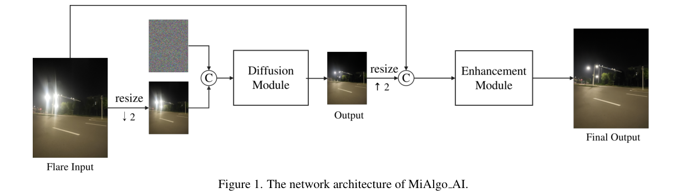
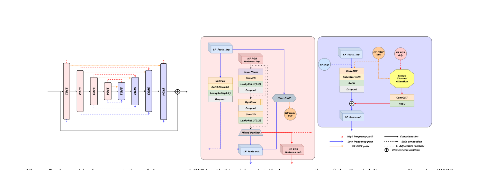
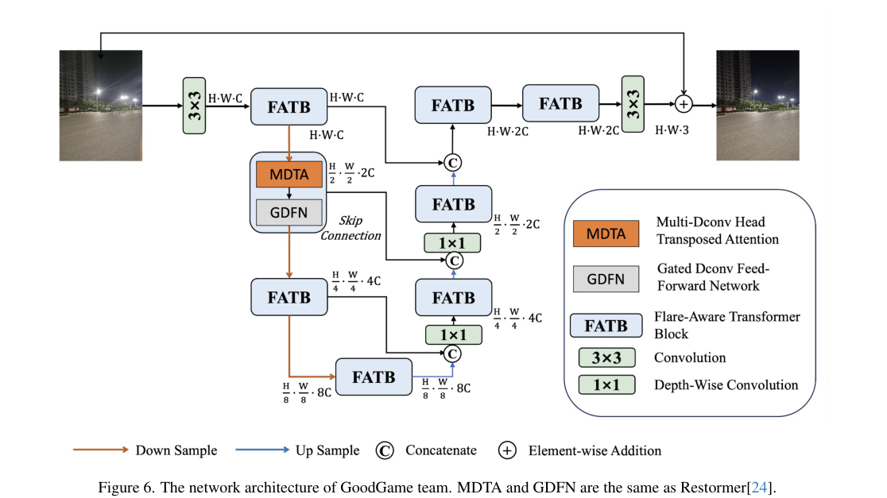

# MIPI 2024 Challenge on Nighttime Flare Removal: Methods and Results

> **发表**：CVPR Workshop (MIPI) 2024　|　**作者**：Yuekun Dai et al.（组织方：NTU S-Lab、Samsung Research China-Beijing 等）
> **论文**：https://arxiv.org/abs/2404.19534　|　**代码**：各队方案未统一开源（基线为 Flare7K++ 官方代码与 checkpoint）
> **挑战赛主页**：https://mipi-challenge.org/MIPI2024/

## 一、解决的问题

夜间散射眩光仍是移动端成像的顽疾：镜头磨损、指纹与灰尘像光栅一样放大强光的散射，夜景中产生大面积 glare 与放射状 streak。在 Flare7K/Flare7K++ 等数据集推动下，通用去眩光已有长足进步，但**不同镜组结构与镜头保护膜差异巨大**，现有数据集难以覆盖所有眩光形态，真实拍摄中时常出现"分布外"眩光。

针对手机与镜头厂商的实际需求，第三届 MIPI（继 ECCV 2022、CVPR 2023 之后）的夜间去眩光赛道转向**特定镜头（lens-specific）的眩光去除**：在 Flare7K++ 之外，组织方为某型号智能手机后置摄像头专门提供 600 对**对齐的真实**眩光/去眩光图像作训练集，且全部训练与测试图像采用 2K 分辨率（1440×1920）以贴近工业实际。共 170 人注册，14 队提交最终结果，其中 12 队贡献了方案描述。与 MIPI 2023 以 PSNR 为主不同，本届以 **LPIPS 为主排名指标**（PSNR/SSIM 仅作参考），将评测重心从像素保真转向感知质量。

## 二、核心创新点

作为挑战赛综述，其贡献体现在基准升级与方案汇总：

1. **首个 lens-specific 真实配对基准**：600 对对齐的 2K 真实手机后摄眩光图像对（验证/测试各 50 对），让模型从"通用合成训练"走向"针对特定镜头的真实域适配"，直面分布外眩光问题。
2. **评测指标从 PSNR 转向 LPIPS 主导**：直接回应 MIPI 2023 暴露的"PSNR 与主观质量脱节"问题（上一届冠军靠 blending 回掺眩光涨分），以感知相似度作为最终排名依据。
3. **2K 全分辨率评测**：推理需处理 1440×1920 输入，迫使各队认真对待感受野、显存与速度，催生了从扩散模型（8 s/张）到实时频域网络（0.017 s/张）的全谱系方案。
4. **首次有扩散模型在去眩光挑战赛夺冠**：MiAlgo 的 Progressive Perception Diffusion Network（基于 IR-SDE），标志生成式方法进入该任务的竞争前沿。

## 三、方法谱系/赛况与代表性方案

**赛况总览**：14 队成绩按 LPIPS 排名，MiAlgo AI 夺冠（LPIPS 0.1435，PSNR 22.15 也是第一），BigGuy 第二（0.1502），SFNet-FR 第三（0.1518，SSIM 0.7188 第一）。方法谱系较 2023 届明显多元化：上届 Uformer 几乎一统天下，本届出现了**扩散模型**（MiAlgo 的 IR-SDE）、**Restormer 系**（BigGuy、GoodGame）、**空-频双域 UNet**（SFNet）、**CVAE**（Hp_zhangGeek）、**分布划分多模型集成**（LVGroup_HFUT）与 **GAN 集成**（CILAB-IITMadras 的 FRUGAN）等多条路线；仅 2 队使用额外真实夜景背景数据。

**冠军 MiAlgo AI——Progressive Perception Diffusion Network（PPDN）**：两阶段渐进式架构。第一阶段在 2 倍下采样分辨率上运行基于 IR-SDE（均值回归 SDE）的扩散模块尽可能去除眩光——选择 IR-SDE 是为了避免去眩光时输出过度平滑；第二阶段以扩散输出为条件，用 AOT Block 构成的增强模块在全分辨率上恢复平坦区细节与眩光纹理处的内容。训练数据 = 自采两种分辨率的高质量夜景图叠加复合眩光（合成）+ 官方 600 对真实数据；并针对验证集观察到的输入/输出亮度差异与雾况，给底图增加灯光和局部雾霾增广。扩散模块训练 40 万迭代后冻结，再训增强模块 30 万迭代；为保全局信息**不使用随机裁剪**。2×A100 训练约 3 天，推理 8.0 s/张（141.61M 参数），是全场最慢但 LPIPS 与 PSNR 双第一。

> 图 1：冠军 MiAlgo AI 的 PPDN：下采样域扩散去眩光 + 全分辨率增强模块（来源：原论文）

**亚军 BigGuy——Restormer 式单阶段 + 差分 mask 加权损失**：采用 Restormer 风格的层级多尺度 Transformer 获得大感受野（指出窗口注意力对可能占满全图的眩光不够用）；用输入与 GT 的差分算法得到眩光区域 mask，使损失聚焦眩光区。损失为 L1 + VGG + mask loss + LPIPS 的混合，lr=1e-5。26.13M 参数，但 self-ensemble 使推理高达 30 s/张。

**季军 SFNet-FR——空域+频域多级分频 UNet（唯一实时方案）**：在 RGB 空域（Avg/Max 混合池化分频）与频域（Haar DWT）双路径做多级频带分解，高频信息走专门的高复杂度模块、低频走轻量模块，解码端用 Stereo Channel Attention 融合多域高频再补偿给低频。L1 + VGG + Sobel 梯度损失。无任何 ensemble、端到端单阶段，383.42M 参数却只需 **0.017 s/张**（3090Ti 上实时），SSIM 全场第一，是性能/速度权衡的标杆。

> 图 2：SFNet 总体结构（左）及空-频编码器 SFE（中）、解码器 SFD（右）：RGB 域与 Haar DWT 域的多级分频与跨域跳连（来源：原论文）

**其余方案要点**：LVGroup_HFUT 按分辨率把训练集划分为两个分布子集、各训一个 NAFNet_light 再按分布路由推理（0.055 s/张，第 4）；CILAB-IITMadras 集成 FRUGAN（Uformer 生成器 + pix2pixHD 式三尺度判别器）与两个分别以 MSE+LPIPS、纯 LPIPS 训练的 Uformer，加权 0.60/0.25/0.15 融合；Xdh-Flare 观察到目标域与源域在光源占比、眩光色调上的差异，从 Flare7K++ 中**按色调分布筛选**眩光叠加到 BracketFlare 背景做目标域增广，并设计了约束 Ig+If≈Iinput 的重组 L1/感知损失；Fromhit 用四尺度 NAFNet + VGG-19 感知损失；UformerPlus 在 LeWin 块后插入基于 FFC 的 ResFFT Block、解码尾部加两个 NAFBlock 精炼，并随训练动态上调感知损失权重；GoodGame 以 Restormer 为基础的 Flare-Aware Transformer Block + 残差学习（只学眩光变化量），渐进式训练（batch 16/patch 128 → batch 2/patch 384），LPIPS 损失占比最大；IIT-RPR 沿用上届 AntIns 的 Night Data Aug 思路训 FADU-Net（2080Ti 训了 6 天 13 小时）；Hp_zhangGeek 用 CVAE + 自适应归一化模块 ANM，仅 2.11M 参数、6.3 ms/图，但需对每图采样 20 次取均值，LPIPS 0.2332 倒数第二；Lehaan 复刻"Uformer 擦除 + AOT-GAN 修补"，以差分阈值生成修补 mask，在笔记本 RTX 4050 上训练，成绩垫底（LPIPS 0.6749）。

> 图 6：GoodGame 的 Flare-Aware Transformer 网络：残差连接使模型只需学习眩光变化量（来源：原论文）

## 四、实验与结果

- **数据**：600 对对齐 2K 真实训练对（特定手机后摄）+ 可选 Flare7K++（5,000 合成眩光 1440×1440、962 真实眩光 756×1008、23,949 背景图）；验证/测试各 50 对，GT 不公开。
- **指标**：LPIPS 为主排名，PSNR/SSIM 参考；推理分辨率 1440×1920。
- **榜单要点**：MiAlgo AI 0.1435 / 22.15 dB / 0.7075（141.61M，8.0 s）；BigGuy 0.1502 / 21.50 / 0.6996（26.13M，30 s 含 self-ensemble）；SFNet-FR 0.1518 / 21.74 / 0.7188（383.42M，0.017 s）；中游 LVGroup_HFUT 0.1620、NativeCV 0.1688、CILAB-IITMadras 0.1697、Xdh-Flare 0.1703（其 PSNR 21.99 全场第二）；尾部 Hp_zhangGeek 0.2332、Lehaan 0.6749。
- **关键观察**：(1) LPIPS 与 PSNR 排名明显解耦——Xdh-Flare PSNR 第二但 LPIPS 仅第七，BigGuy LPIPS 第二而 PSNR 第七，印证换指标确实改变了优化方向；(2) 前三名 LPIPS 仅差 0.008，但推理时间横跨 0.017~30 s 三个数量级；(3) 表中 LSCM-HK 一行存在明显数据异常（PSNR 22.66 却排名(12)，且与 IIT-RPR 的 LPIPS/SSIM/参数量完全相同，疑为编辑错误）。
- 无统一消融实验；各队自述训练配置详尽程度不一。

## 五、专家锐评

**价值**：这届报告最大的意义是完成了去眩光基准的两次"纠偏"：一是把主指标从 PSNR 换成 LPIPS，直接堵上了 MIPI 2023 冠军靠回掺眩光刷分的漏洞；二是引入 lens-specific 的 600 对真实 2K 配对数据，把任务从"在 Flare7K 合成域内卷"拉回到工业界真正关心的真实域、高分辨率场景。方法谱系上，扩散模型（IR-SDE）首次在该任务夺冠、SFNet 证明频域分解可以做到 0.017 s 实时且只比扩散差 0.008 LPIPS，这两个数据点对后续研究的"质量 vs. 延迟"选型有实际参考价值。

**不足与质疑**：
1. **600 对训练 + 50 对测试的统计效力堪忧**：lens-specific 设定固然务实，但测试集只有 50 张，前三名 LPIPS 差距 0.0083，完全可能落在采样噪声内；报告未做任何显著性分析，也没有像上届那样补充用户研究来校验 LPIPS 排名的主观一致性——用一个学习出来的感知指标做唯一裁判，本身就该被审视。
2. **公平性比上届更失控**：MiAlgo 用 2×A100 训 3 天、推理 8 s/张，与笔记本 4050 训练的 Lehaan 同榜竞技；榜单不设运行时间或参数量的任何约束/分赛道，"efficient and high-performance"的口号与规则脱节。BigGuy 的 30 s/张 self-ensemble 更说明排名奖励的是堆算力而非方法。
3. **报告质量控制粗糙**：Table 1 中 LSCM-HK 行的 LPIPS/SSIM/Params 与 IIT-RPR 完全相同、PSNR 22.66 全场最高却排第 12，明显是复制粘贴错误且 arXiv v2 仍未修正；14 队提交却只有 12 队方案入文，缺失的 NativeCV（第 5 名）恰是中游关键数据点，档案完整性受损。
4. **lens-specific 的代价没有被讨论**：为单一型号手机定制数据与模型，泛化到其他镜组的能力如何、600 对数据是否足以覆盖该镜头的眩光形态、跨镜头迁移要付出多少代价——这些恰是该设定最值得回答的科学问题，报告完全没有触及，使"赛题升级"停留在工程层面。
