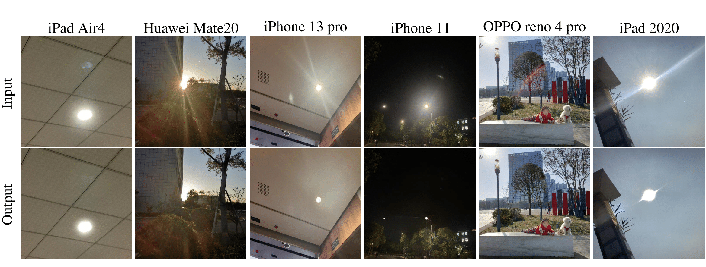
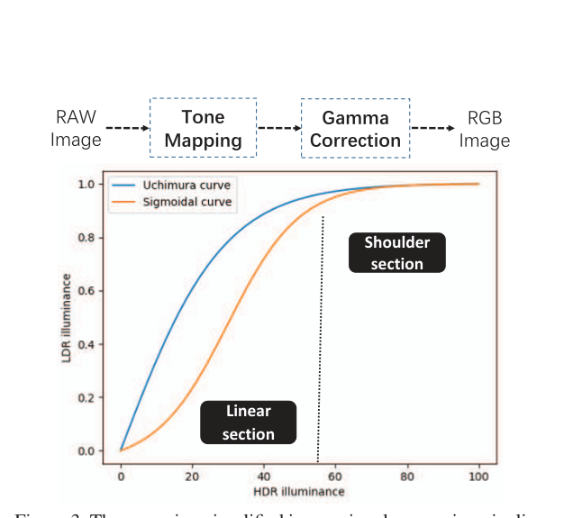
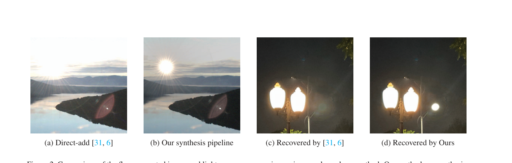
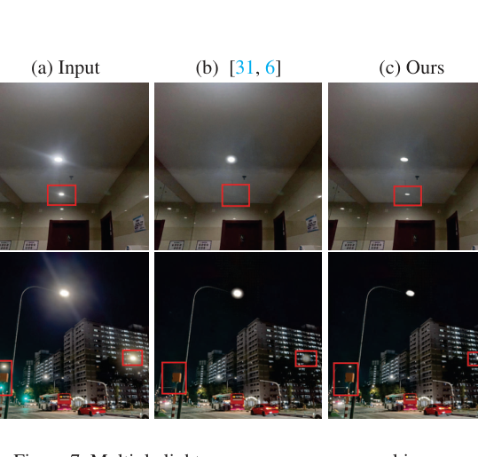

# Image Lens Flare Removal Using Adversarial Curve Learning

> **发表**：IEEE TPAMI 2025（vol. 47, no. 9, pp. 7396–7409，2025-05-06 上线，DOI: 10.1109/TPAMI.2025.3567308）　|　**作者**：Yuyan Zhou, Dong Liang（通讯）, Songcan Chen, Sheng-Jun Huang（南京航空航天大学）
> **论文**：https://ieeexplore.ieee.org/document/10989553　|　**代码**：https://github.com/YuyanZhou1/Improving-Lens-Flare-Removal

> **说明**：TPAMI 原文 PDF 不可公开获取（IEEE 付费墙；arXiv 仅有会议版 v1，无期刊扩展版预印本）。本报告基于 IEEE 官方摘要与元数据、官方代码仓库，以及其会议版前身 ICCV 2023 *"Improving Lens Flare Removal with General-Purpose Pipeline and Multiple Light Sources Recovery"*（本地 PDF `pdfs/22_ImprovingLensFlareRemoval_ICCV2023.pdf`，全文可读）撰写。**期刊扩展身份已核实**：官方 GitHub README 明确声明该仓库同时为 ICCV 2023 与 TPAMI 2025 两文的官方实现；两版摘要高度重合，TPAMI 版作者恰为会议版前四位作者（去掉了 DJI 的 Shuo Yang 与南开的 Chongyi Li）。两版共享的合成管线与光源恢复部分细节可靠（来自会议版原文），**TPAMI 新增的 Adversarial Curve Learning（ACL）仅有摘要级信息，相关机制描述含合理推断，置信度有限，文中已逐处标注**。插图提取自会议版 PDF 与官方仓库，均注明出处。

## 一、解决的问题

镜头眩光（lens flare）源于强光在镜头组内的散射（灰尘、划痕导致的 streak/haze）与多次反射（鬼影、光斑），在镜组简化、镜面易污的手机摄影中尤为严重，既损害视觉质量，也拖累下游任务（论文用 YOLOv5 演示了 flare 导致漏检、以及把反射光斑误检为汽车/红绿灯）。与去反射、去雾一样，该任务最大的瓶颈是配对训练数据几乎无法采集，主流做法（Wu et al. ICCV 2021、Flare7K）是把 flare-only 图与干净场景图在"伪 RAW 空间"（逆 gamma 空间）**直接相加**合成训练对。

本文（会议版）系统指出 direct-add 范式的两个被忽视的物理缺陷：其一，相机 ISP 中 RAW→RGB 要经过**不可逆的色调映射（TMO）**，光源附近像素位于 TMO 的 Shoulder 段，把逆 gamma 图当 RAW 直接相加会造成局部过饱和、对比度被压扁；其二，真实相机的**自动曝光（AE）**对强光场景会缩短快门、收小光圈使背景变暗（作者用 iPhone 13 Pro 实测各 100 张：无/有强光源场景平均快门分别为 9.85×10⁻⁴s 与 7.52×10⁻⁵s），而 direct-add 反而把全图加亮，造成训练数据与真实数据的强度分布偏移，模型泛化必然受损。第二个痛点是**光源保留**：网络往往把光源连同 flare 一起抹掉，现有方法靠"找最亮连通域 + 硬阈值（如 0.99）+ 平滑后处理"回填光源，昼夜光照差异使阈值无法统一，多光源场景全面失效。

TPAMI 扩展版进一步追问第三个痛点：即便合成管线物理上更合理，**不同设备的 ISP（尤其各家私有的 tone mapping 曲线）千差万别**，在某一固定曲线族上训练的模型仍只能泛化到"与采样分布接近"的设备。如何让一个模型跨十几种消费电子设备都工作，是期刊版新增的核心问题，也是 Adversarial Curve Learning 的由来。

## 二、核心创新点

1. **基于 ISP 分析的凸组合合成管线（会议版）**：从 smooth-step TMO 的小量近似推导出"RAW 域相加在 RGB 域近似等价于逐像素凸组合"的结论，用 sigmoid 形权重函数按 flare 图照度逐像素混合场景层与 flare 层，同时避免局部过饱和与全局照度上移，首次把 AE 行为显式建模进 flare 数据合成。
2. **无硬阈值的多光源恢复策略（会议版）**：用强凸的幂函数 x^α（默认 α=15）按照度对网络输入/输出做凸平均，只在 TMO Shoulder 段（光源处）保留输入，自然恢复任意数量、形状、亮度的光源。
3. **Adversarial Curve Learning（ACL，TPAMI 新增）**：把跨设备泛化形式化为**对抗训练问题**，把合成管线中"固定形式 + 随机采样参数"的曲线升级为**对抗学习的可学习曲线**，嵌入数据合成管线，迫使去 flare 网络对多样化 ISP 曲线鲁棒（摘要原文："formulate the generalization problem as an adversarial training problem and embed an adversarial curve learning (ACL) paradigm in the synthesis pipeline"；曲线参数化形式与对抗目标等细节不可考，置信度中等偏低）。
4. **消费电子真实测试集**：覆盖昼/夜、太阳/月亮/路灯/闪光灯等光源与 streak/spot/blob/haze/color bleeding 等形态；会议版含 10 种设备 100 张，**TPAMI 版扩充至 15 种设备**，专用于检验跨设备泛化。
5. 方案是**模型无关的"训练配方"**：不设计新网络，仅改造数据合成与后处理，U-Net、Uformer 等任意骨干即插即用。

## 三、模型结构与方案

> 官方仓库展示图（对应会议版图 1）：本文方案训练的模型在 iPad Air4、华为 Mate20、iPhone 13 Pro、iPhone 11、OPPO Reno4 Pro、iPad 2020 拍摄的真实 flare 图上的去除效果（来源：官方 GitHub 仓库 README）。

**1）重审 ISP（会议版第 3 节）。** RAW→（TMO 把 HDR 压到 LDR）→gamma 校正→RGB。TMO 曲线分为近似线性的 Linear 段与渐近压到 1 的 Shoulder 段：普通场景像素多落在 Linear 段，把 TMO 近似为恒等映射尚可；但 flare 图中光源邻域像素落在 Shoulder 段，恒等近似失效——这正是 direct-add 合成图局部过曝、对比度塌缩的根源。

> 会议版图 3：简化 ISP 流程（上）与 Uchimura、Sigmoid 两种 TMO 曲线（下），标注 Linear/Shoulder 段。"每台相机有自己的 TMO 曲线"这一事实正是 TPAMI 版 ACL 的动机（来源：ICCV 2023 会议版）。

**2）凸组合合成管线（会议版第 4 节）。** 以 smooth-step TMO T(x)=3x²−2x³ 为分析工具、做 ϵ 小量近似可证：在 RAW 域相加再映射回 RGB，效果近似于 RGB 域逐像素凸组合——flare 像素越亮（Shoulder 段）权重越接近 1，越暗权重越接近 0。据此合成分三步：(i) flare 图 RGB 三通道求和归一化得照度矩阵 I_F；(ii) 经 sigmoid 形权重函数 f(x)=1/(1+e^{p(x−q)})（q=0.5，p∼U[4,7] 随机采样以模拟不同相机曲线）得权重矩阵 W；(iii) 合成 I=(1−W)⊙S+W⊙F+N(0,σ²)，σ²∼0.01χ²。该构造同时实现"光源处 flare 占优、背景被压暗"的 AE 效应，合成图强度直方图与真实 flare 照片对齐（会议版图 4 验证）。

> 会议版图 2：(a) direct-add 合成图过饱和、对比度塌缩 vs (b) 本文凸组合合成图更接近真实成像；(c) 旧硬阈值法光源恢复失败 vs (d) 本文自然恢复（来源：ICCV 2023 会议版）。

**3）多光源恢复（会议版第 5 节）。** 推理时对真实输入 C 计算照度并 **min-max 归一化**，过幂函数得 W_r=((I−min)/(max−min))^α，输出 I_final=(1−W_r)⊙N(C)+W_r⊙C。强凸幂函数把 Linear 段权重压向 0、只让 Shoulder 段（光源）保留原图；min-max 归一化保证最亮处权重恒为 1，故无需任何亮度硬阈值，月亮、远处路灯等较暗光源也能恢复。α→+∞ 时只回填光源，α 过小则 flare 也被带回；消融显示 α≥15 后指标稳定，故取 α=15。

> 会议版图 7：真实夜景多光源恢复。Wu/Dai 的阈值法只能恢复最显眼的光源（红框处背景小灯丢失），本文方法全部自然保留（来源：ICCV 2023 会议版）。

**4）Adversarial Curve Learning（TPAMI 扩展，摘要级信息）。** 会议版合成曲线形式固定（sigmoid）、参数 p 随机采样，本质是一种"领域随机化"。TPAMI 版指出由于各设备 ISP 多样，如此训练的模型仍只对特定设备泛化，于是把泛化问题形式化为对抗训练：在合成管线中嵌入可学习曲线（ACL 范式），曲线一端以对抗目标更新（生成对当前去 flare 网络更"难"、且逼近真实多样 ISP 的合成样本），网络一端学习对曲线扰动鲁棒，以覆盖远比随机采样更宽的 ISP 曲线空间。IEEE 索引词中的 "Generative Adversarial Networks / Adversarial Training" 印证了对抗式表述。**需要注意**：截至本报告撰写时，官方仓库的 `synthesis.py` 仍只有会议版固定 sigmoid 凸组合（`weight=1/(1+e^{-a(I-0.5)})`），`train.py` 中亦无任何对抗训练代码，ACL 的具体实现（曲线参数化方式、判别目标、min-max 优化流程）无法核实。

**训练设置（会议版）**：骨干为 U-Net 或 Uformer；flare 素材取自 Wu et al. 数据集（2001 真实 + 3000 仿真 flare-only 图）与 Flare7K（5000 散射 + 2000 反射 flare）；TensorFlow 实现（另提供 MindSpore 版），单卡 RTX 3090。

## 四、实验与结果

以下定量结果均来自**会议版原文**（Flare7K 配对测试集，含昼/夜 GT）；TPAMI 版新增实验（ACL 消融、15 种设备测试）的具体数字因原文不可得而不列：

- **U-Net 骨干**：Wu direct-add 训练 23.6 PSNR / 0.870 SSIM → **本文管线（Wu flare 素材）25.9 / 0.896**，同数据同网络约 **+2.3 dB**，干净归因于合成管线本身；Flare7K direct-add（Dai）25.4 / 0.876 → 本文 25.3 / 0.884（作者归因于 Flare7K flare 素材全为合成）。
- **Uformer 骨干**：Wu 素材 23.7 / 0.863 → **26.3 / 0.884**；Flare7K 素材 25.7 / 0.879 → 25.7 / 0.890，出现 PSNR 持平、SSIM 升的混合结果。
- **迁移基线**：去雾 DCP（He et al.）19.7 PSNR / 0.68 SSIM、去反射 CEILNet 23.3 / 0.872，均明显不足。
- **用户研究**：两两投票全面占优，如 vs Wu direct-add 在 Flare7K 测试集与自建测试集上 100%:0%，在 Wu 自家测试集上 55%:45%；vs 传统 Deflarespot 最高 100%:0%。
- **α 消融**：α=1/5/10/15/20/25 时 PSNR 为 15.94/17.68/17.86/17.88/17.88/17.88，SSIM 0.508→0.528 后稳定，验证免阈值策略对 α 不敏感。
- **下游任务**：去 flare 后 YOLOv5 检出被光条遮蔽的椅子/摩托车，消除将反射光斑误检为汽车/红绿灯的假阳性。
- **泛化对比**：在自建消费电子测试集（会议版 10 种设备 100 张，TPAMI 扩至 15 种）上做视觉对比，本文方法在不同设备、昼夜、多种 flare 形态下均优于 Wu/Dai 管线训练的同骨干模型。期刊版摘要声称借助 ACL 在更多设备上取得更好泛化（"push the frontier toward more general situations"），具体数字待原文核实。

## 五、专家锐评

**价值**：这是 flare removal 领域少有的"从成像物理出发修正数据合成"的工作。它不卷网络结构，而是指出所有人都在用的 direct-add 合成在 tone mapping 与自动曝光两个环节上违背物理，并给出由近似推导支撑、即插即用的凸组合替代——这种"训练配方级"贡献对社区有外溢价值（任意骨干同数据可白拿约 2 dB）。免阈值的 x^α 光源恢复优雅地同时解决了昼夜阈值不统一与多光源失效两个实际痛点。TPAMI 版把"每台设备一条私有 ISP 曲线导致泛化差"上升为对抗学习问题，思路上是从 domain randomization 走向 adversarial domain augmentation，问题意识在该领域是超前的；连同扩到 15 种设备的真实测试集，对推动泛化评测有实际价值。

**不足与质疑**：

1. **期刊版核心增量（ACL）公开信息几乎为零，不可复现**。官方仓库在 TPAMI 接收后只改了 README 标题：`synthesis.py` 仍是会议版固定 sigmoid 凸组合，`train.py` 无任何对抗训练代码，新增 5 种设备的测试数据也无更新说明。"对抗曲线"究竟是参数化 TMO 族还是逐像素查找表、判别信号作用在图像域还是特征域、是否存在训练不稳定问题，全部成谜。一篇以 "Adversarial Curve Learning" 命名的 TPAMI 论文，其命名模块无公开实现，是实打实的硬伤。
2. **理论推导是 motivation 而非证明**。凸组合等价性建立在 smooth-step T(x)=3x²−2x³ 这一特定全局 TMO、"HDR 域为 [0,1]"及 ϵ 一阶/二阶小量近似上，推导中还有诸如 3(1+ϵ₁)²T⁻¹(b)²≈3(1+ϵ₁)³T⁻¹(b)² 的近似跳步；最终权重函数又退化为人工选定的 sigmoid（p∼U[4,7]、q=0.5，未论证选择依据）。真实手机 ISP 是局部色调映射 + 多帧 HDR 合成 + 场景自适应曲线，AE 也远不止"全局压暗"（测光区域、ISO、面部优先），宣称 "approaches realistic imaging" 言过其实。
3. **定量证据面窄、基线陈旧**。全文唯一的配对定量评测只有 Flare7K 测试集一个，且用 Flare7K 训练素材时收益几乎消失（U-Net 上 25.4→25.3 持平略降），Uformer 上还出现 PSNR 升 SSIM 降的不一致；指标只有 PSNR/SSIM，缺 LPIPS 等感知指标。会议版最强对手是 Flare7K baseline（2022），2025 年的期刊版若仍未与 Flare7K++/MFDNet、扩散类方法对比（摘要与仓库均未提及），其 SOTA 主张难以成立——原文不可得，此点无法核实但值得警惕。
4. **光源恢复是"绕过"而非"解决"**。min-max 归一化隐含"画面最亮像素必为光源"假设，对无光源入画的纯雾状 flare、或存在非光源高光（水面反光、过曝白墙）的场景必然错误回填伪光源，文中未讨论失败案例；其消融 PSNR 绝对值仅 17.88 且 α≥10 后纹丝不动，说明该模块贡献主要在视觉观感而非可度量增益。
5. **泛化评测主观性强**。自建消费电子测试集无配对 GT，泛化结论只能依赖视觉对比与用户研究，而用户研究连参与人数都未报告；15 种设备听起来覆盖广，但会议版总量仅 100 张，每类样本统计意义有限。ACL 声称的跨设备泛化提升最终仍落在这种主观评测上自证，逻辑上有循环之嫌。

总体而言：会议版是问题找得准、解法干净的好论文；期刊版的 ACL 方向正确，但在公开证据（代码、可核实的实验数字）补齐之前，其增量贡献应保守看待。
