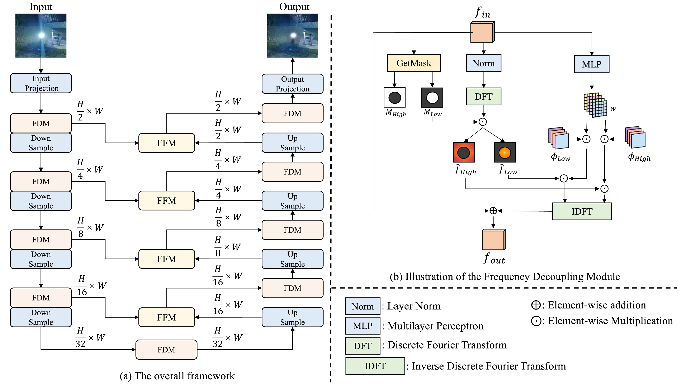
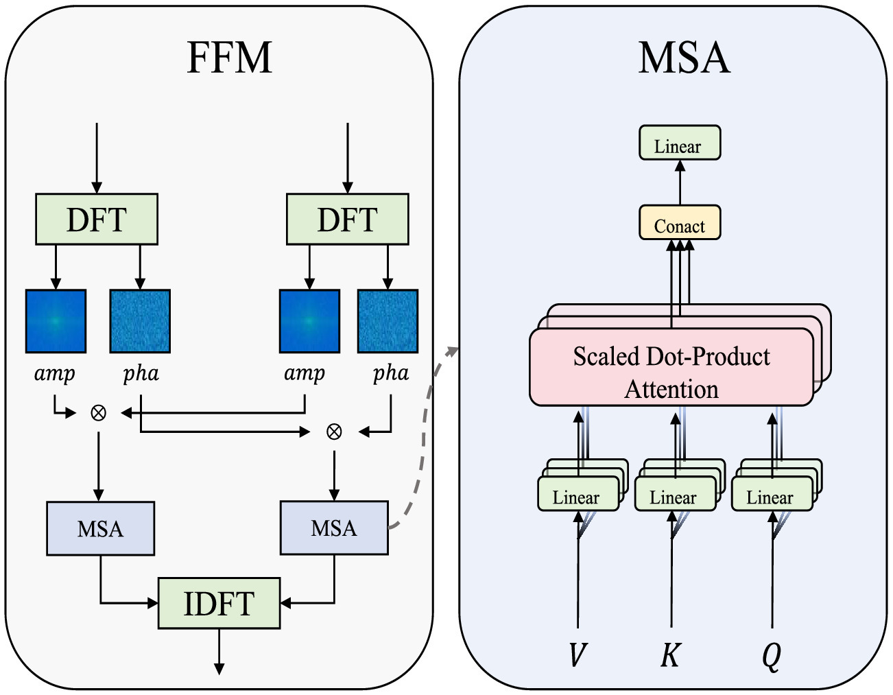
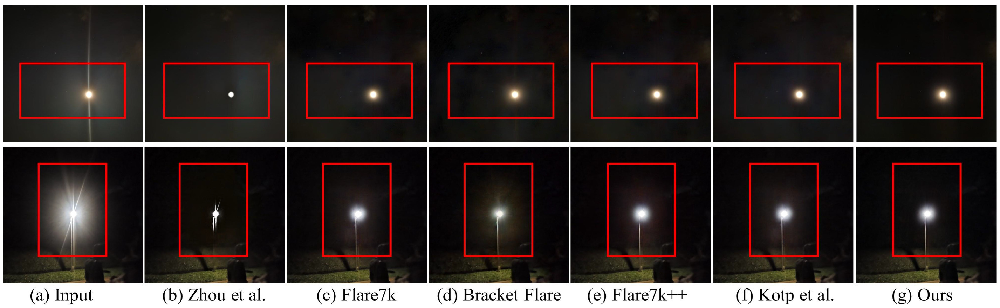

# Nighttime Flare Removal via Frequency Decoupling

> **发表**：Pattern Recognition Letters 2026（Vol. 201, pp. 73–79，DOI: 10.1016/j.patrec.2026.01.012）　|　**作者**：Minglong Xue, Aoxiang Ning, Jinhong He, Shuaibin Fan, Senming Zhong（重庆理工大学团队，依作者主页推断）
> **论文**：https://www.sciencedirect.com/science/article/pii/S0167865526000188　|　**代码**：未开源（作者团队 GitHub 未见对应仓库）

> 说明：原文 PDF 不可公开获取（ScienceDirect 付费墙），本报告基于出版商页面摘要片段、Crossref/Semantic Scholar 元数据、dblp 及作者主页公开信息撰写，**模块内部设计与实验数字的细节置信度有限**，不确定处已注明。配图取自 ScienceDirect 公开的论文插图缩略图（图注以原文为准）。

## 一、解决的问题

夜间拍摄时，强光源经镜头散射/反射产生的 flare（光晕、光条、雾状泛光）会大面积污染图像。与白天场景不同，夜景的背景照度极低、光源亮度极高，flare 与正常图像内容在空间域上严重纠缠：flare 区域往往覆盖了原本就微弱的纹理细节。现有的夜间去 flare 方法（多为在 Flare7K/Flare7K++ 合成对上训练的空间域 CNN/Transformer）的一个共性短板是：**难以把 flare 特征与正常纹理特征有效解耦，去 flare 的同时常常把局部细节一并抹掉**，输出过度平滑、结构丢失。

本文的出发点是一个频域观察：**flare 与光照信息主要集中在低频段，而图像内容的结构/纹理信息主要集中在高频段**。既然两类信息在频域上天然可分，那么在频域中显式地分而治之——对低频做去 flare、对高频做细节保护——比在空间域里用一个网络同时学两件事更干净。这与该团队前作 MFDNet（The Visual Computer 2024，拉普拉斯金字塔分频）和 DFDNet（arXiv 2025，动态频率引导）一脉相承，本文是该思路在"显式频率解耦 + 相位保持融合"方向上的延伸。

## 二、核心创新点

1. **频率解耦去 flare 网络（FDDNet，frequency decoupling de-flare network）**：将"flare 居低频、内容居高频"这一统计先验显式编码进网络结构，把去 flare 任务拆解为频域内的分支处理问题，而非空间域端到端黑盒回归。
2. **频率解耦模块（FDM，Frequency Decoupling Module）**：通过在频域设置掩码（mask）把特征划分为低频与高频两部分（依公开摘要片段，推断为对 FFT 频谱按频率半径设掩码的软/硬划分，置信度中等），从而把 flare 主导的成分与纹理主导的成分分开送入不同处理路径。
3. **频率融合模块（FFM，Frequency Fusion Module）**：在重建阶段对两支频率特征进行融合，**通过抑制相位失真（phase distortion）来保持结构**——即在融合时显式约束/保护相位谱，因为图像结构主要由相位谱承载。这是本文区别于一般"幅度谱滤波"类频域方法的关键设计（机制描述基于摘要，内部实现置信度低）。
4. 训练数据主要来自 **Flare7K++ 配对合成数据**，与主流方法对齐，便于公平比较。

## 三、模型结构与方案

> 图 1：(a) FDDNet 整体 U 形多尺度框架，各级由 FDM 处理、FFM 跨级融合；(b) 频率解耦模块（FDM）——GetMask 生成高/低频掩码 M_High/M_Low，配合 DFT 与 MLP 学得的相位权重 φ 分离处理后经 IDFT 重建（来源：原论文 ScienceDirect 公开插图）

> 图 2：频率融合模块（FFM）对两支特征分别做 DFT 取幅度(amp)/相位(pha)，交叉融合后经 MSA（多头自注意力）再 IDFT 还原，以抑制相位失真、保持结构（来源：原论文 ScienceDirect 公开插图）

基于上图与可获取信息的整体说明：

- **整体 pipeline**：输入夜间 flare 图像 → 特征提取 → FDM 将特征经频域变换分解为低频分量（含 flare、全局光照）与高频分量（含边缘、纹理）→ 两支分别处理：低频支负责估计并去除 flare/抑制泛光，高频支负责保留与增强结构细节 → FFM 在频域/空间域融合两支结果，并通过减少相位失真保证融合后结构不漂移 → 重建去 flare 图像。
- **频域操作**：摘要明确提到"设置掩码划分低/高频"，说明分频是在显式频谱（FFT 或类似变换）上完成的，而不是用池化/小波等隐式手段；FFM 强调相位，暗示网络在频域同时处理幅度与相位两个分量。
- **损失函数与训练细节**：不可考。按该团队前作（MFDNet 用 L1+感知+频域损失的组合）推测大概率包含频域重建损失，但无法证实，不作断言。
- **数据**：Flare7K++（Flare7K 的 5000 散射 + 2000 反射 flare 素材，外加 Flare-R 真实 flare 素材）按标准管线与背景图合成训练对；测试推断使用 Flare7K++ 真实测试集（含配对 GT），未证实。

## 四、实验与结果

> 图 4：真实夜景上与 Zhou et al.、Flare7K、Bracket Flare、Flare7K++、Kotp et al. 的定性对比，本文（Ours）在抑制泛光/星芒的同时较好保留了光源附近结构（来源：原论文 ScienceDirect 公开插图）

原文实验表格的具体数值在付费墙内不可读取。可确认的信息：

- 训练数据主要来自 Flare7K++ 配对数据；
- 出版商页面表述其方法相比现有方法能更有效分离 flare 伪影与图像内容、减少去 flare 后的局部细节丢失；
- 具体 PSNR/SSIM/LPIPS 数字、对比方法清单（推测会含 Uformer、Restormer、MFDNet 等 Flare7K++ 榜单常客）与消融设置均无法核实，**本报告不引用任何无法溯源的数字**。
- Semantic Scholar 显示该文目前引用数为 0（2026 年 6 月查询，发表仅数月，属正常）。

## 五、专家锐评

**价值**：把"flare 是低频现象、细节是高频现象"这一先验做成显式的频率解耦-融合架构，方向本身是对的，而且"用相位保持来对抗结构丢失"是频域去 flare 方法里相对少被强调的一点——多数频域方法只在幅度谱上做文章，而结构信息恰恰主要在相位谱里，FFM 这个设计点有真实的技术含量。作为 PRL 短文（7 页），它在 MFDNet→DFDNet 这条团队内部演进线上提供了一个轻量、自洽的增量。

**不足与质疑**：

1. **新颖性边际化严重**。频域分解去夜间 flare 这条路，该团队自己的 MFDNet（2024）已经用拉普拉斯金字塔做过低/高频分治，DFDNet（2025）又做了动态频率引导；社区里 FF-Former（Fourier）、WGSF-Net（小波）等同类工作密集。本文与自家前作的本质区别——金字塔分频换成频谱掩码分频——属于实现层面的替换，"解耦+融合"的叙事并无范式级变化。作为同团队一年内的第三篇频域去 flare 论文，PRL 审稿对增量的把关值得怀疑。
2. **"flare 在低频"这一前提本身有反例**。夜间 flare 中的衍射光条（streak）和星芒是典型的高频定向结构，玻璃划痕造成的散射纹理也含丰富中高频成分；把 flare 一律归入低频、用掩码一刀切，streak 类伪影很可能漏到高频支里被当作"细节"保护下来。摘要级信息看不到对这类 flare 的处理机制，这是方法逻辑上最可疑的一环。
3. **不开源 + 付费墙 = 不可复现**。作者团队其他论文均有 GitHub 仓库，唯独本文没有；频域掩码的划分半径/软硬、FFM 的相位约束形式这些核心超参数外界完全未知，结果无法独立验证。
4. **依赖 Flare7K++ 合成训练的老问题原样继承**：合成 flare 与真实夜景 flare 的域差距（真实光源的色偏、压缩伪影、多光源交叠）如何影响频谱统计，论文（就可见信息而言）未涉及；频域先验是从合成数据统计出来的，真实场景上该先验是否依然成立，恰恰是这类方法最该回答而最少回答的问题。
5. PRL 篇幅限制下，消融实验大概率只能覆盖 FDM/FFM 的有无，**相位保持收益的单独量化**（如只约束幅度 vs 幅度+相位）这种最能支撑核心主张的实验，很难指望做充分。
