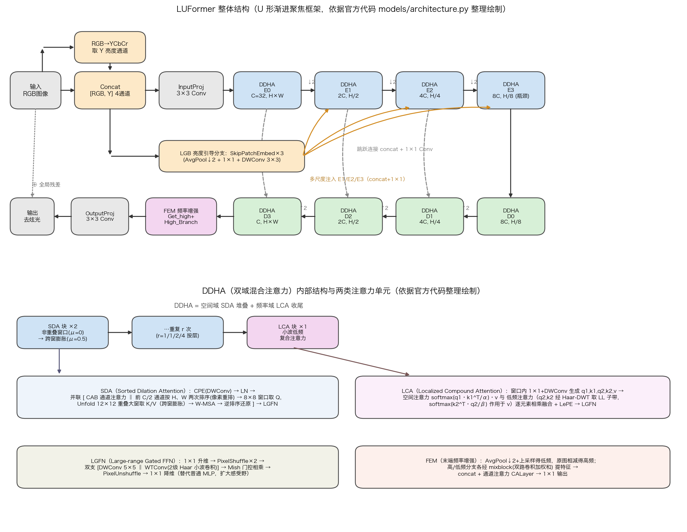

# LUFormer: A Luminance-informed Localized Transformer with Frequency Augmentation for Nighttime Flare Removal

> **发表**：Neural Networks 2025（Vol. 191, 2025 年 10 月刊；DOI: 10.1016/j.neunet.2025.107660）　|　**作者**：Wei Lu, He Zhao, Dubuke Ma, Peiguang Jing（天津大学电气自动化与信息工程学院；合作者单位含 University of Michigan, Ann Arbor）
> **论文**：https://www.sciencedirect.com/science/article/pii/S0893608025005404　|　**代码**：https://github.com/HeZhao0725/LUFormer

> ⚠️ **原文 PDF 不可公开获取（Elsevier 付费墙，无 arXiv 预印本），本报告基于 Semantic Scholar / PubMed 摘要、官方代码仓库（模型与数据合成代码已公开）及公开资料撰写，细节置信度有限。** 文中结构细节均从官方代码逐行核对得出，可信；但损失函数、训练超参与定量指标因训练脚本未释出、原文不可见而无法给出。

## 一、解决的问题

夜间拍摄时，强光源（路灯、车灯等）在镜头内的非预期散射与反射会产生炫光（flare）——光晕、辐条状光纹与雾状泛光，严重破坏图像内容并影响下游视觉任务。自 Flare7K/Flare7K++ 基准建立以来，主流方案是用 U 形网络在合成配对数据上端到端学习去炫光。

作者指出已有工作的两条线索各有缺口：一类方法（如 FF-Former 等）从**频率域**入手，利用炫光能量集中于低频的特性；另一类引入**语义/位置先验**引导网络区分炫光与场景内容。但二者"未能全面整合所有相关信息"——炫光最本质的表观特征其实是它对**亮度（luminance）分布的破坏**：炫光区域亮度异常抬升且呈大尺度低频扩散，而现有方法既没有显式利用亮度先验，窗口注意力的局部感受野也难以覆盖大范围炫光。

LUFormer 的针对点由此确定：把"亮度先验的全局引导"与"空间域 + 频率域的局部增强"统一进一个 Transformer 框架，即摘要所称的"luminance-informed + localized frequency augmentation"。

## 二、核心创新点

1. **亮度引导分支 LGB（Luminance-Guided Branch）**：将输入 RGB 转 YCbCr 并抽取 Y 亮度通道，与 RGB 拼接成 4 通道输入；该亮度图经逐级 AvgPool 下采样嵌入（SkipPatchEmbed），以 concat + 1×1 卷积的方式注入编码器每一尺度，为全网提供"炫光破坏了哪里的亮度分布"的全局语义先验。
2. **双域混合注意力单元 DDHA（Dual Domain Hybrid Attention）**：每个尺度的基本构件 = 空间域 SDA 块堆叠 + 频率域 LCA 块收尾，在空间域与频率域同时强化炫光表征。
3. **空间域 SDA（Sorted Dilation Attention）——像素重排 + 跨窗膨胀**：对一半通道沿 H、W 两个维度做排序（像素重排，把亮度相近的远距像素聚到一起），再以 8×8 窗口取 Q、以 Unfold 出的 12×12 重叠大窗（膨胀率 μ=0.5）取 K/V 做窗口注意力，等效扩大感受野；并联一条通道注意力（CAB）支路。
4. **频率域 LCA（Localized Compound Attention）——低频强调的复合注意力**：窗口内生成 q1,k1,q2,k2,v 五组特征；q2/k2 经 Haar 小波变换仅取 LL 低频子带后做转置（通道式）注意力，与常规空间注意力的输出**逐元素相乘**复合，显式强调并放大与炫光相关的低频成分。
5. **U 形渐进聚焦框架 + 配套组件**：4 级编解码 U-Net 骨架；前馈层全部换成 LGFN（PixelShuffle + 5×5 深度卷积 ‖ 2 级小波卷积 WTConv 的 Mish 门控 FFN）；解码末端再接一个高/低频分解增强模块（FEM）后输出全局残差。

## 三、模型结构与方案

**整体 pipeline**（依据官方 `models/architecture.py` 核对）：输入 RGB 先经 `RGB2YCbCr` 提取 Y 通道并与 RGB 拼为 4 通道，3×3 卷积投影到 C=32；随后是 4 级编码器（通道 32→64→128→256，分辨率逐级减半，DDHA 块数 r=[1,1,2,4]，注意力头数 [1,2,4,8]）、对称 4 级解码器（块数 [4,2,1,1]），编解码间以 concat + 1×1 卷积跳连。LGB 分支用三个 SkipPatchEmbed（AvgPool↓2 + 1×1 conv + 3×3 深度卷积，仅 4 通道的极轻量设计）把含亮度通道的输入逐级下采样，注入 E1/E2/E3 的输入端。解码器最末输出先经 `Get_high`（AvgPool 低通 + 上采样后相减）拆成高/低频两支，进入 `High_Branch`（双支 mixblock 卷积 + 通道注意力融合），再 3×3 投影并与输入逐像素相加形成全局残差输出。

> 图 1：LUFormer 整体结构与 DDHA/SDA/LCA/LGFN/FEM 各模块要点。**注意：原文配图不可公开获取，本图由报告作者依据官方开源代码（models/architecture.py、SDA.py、LCA.py、LGFN.py）整理绘制，非原论文插图。**

**SDA 块细节**：深度卷积条件位置编码（CPE）→ LayerNorm → 双支并联：(a) CAB 通道注意力；(b) 排序注意力——对前 C/2 个通道先沿 H 维 sort、再沿 W 维 sort 实现像素重排，窗口划分（8×8）取 Q，对整图 Unfold 出 12×12 重叠窗（overlap_win = win×(1+μ)，μ=0.5）取 K/V，做多头注意力后按记录的索引 scatter 逆排序还原位置；两支与残差相加后过 LGFN。每个 DDHA 内 SDA 成对堆叠：第一块 μ=0（普通非重叠窗口），第二块 μ=0.5（跨窗膨胀），形成"局部—跨窗"交替。

**LCA 块细节**：1×1 + 3×3 深度卷积一次性生成 5C 通道的 q1,k1,q2,k2,v；q2/k2 经不可学习的 Haar 小波滤波器变换后仅保留 LL 子带（尺寸减半）；空间支路 softmax(q1·k1^T·α)·v 与低频支路 softmax(k2^T·q2·β)（d×d 转置注意力，作用于 v）的输出逐元素相乘融合，加上 v 的深度卷积 LePE 位置项后投影输出。α、β 为可学习温度参数，Q/K/V 先做 L2 归一化。

**训练数据合成**（依据官方 `DataLoader` 代码）：完全沿用 Flare7K++ 范式——背景图取 Flickr24K，炫光取 Flare7K（合成散射炫光 Compound_Flare）与 Flare-R（真实拍摄炫光）；背景图先做逆 gamma 变换（γ~U(1.8,2.2)）回到线性域，炫光图施加随机仿射（旋转 0–360°、缩放 0.8–1.5、平移、剪切 ±20°）后与背景相加，再 gamma 校正回 sRGB，裁剪为 512×512。损失函数与优化器设置：训练脚本未开源、原文不可见，**无法核实，不作陈述**。

## 四、实验与结果

由于付费墙限制，原文实验表格不可获取，以下为可核实的有限信息：

- **基准**：摘要称"在真实世界基准上的大量实验表明 LUFormer 超越了 SOTA 方法"。结合其数据合成代码完全基于 Flare7K++（含 Flare-R 真实炫光），可以推断主实验在 Flare7K++ 真实测试集（100 张真实炫光图）上进行，对比对象大概率包括 Uformer、Restormer、Flare7K++（Dai et al.）等该基准的常见方法。
- **定量指标**：原文 PSNR/SSIM/LPIPS 等具体数字不可公开获取，**本报告不引用、不编造**。
- **第三方旁证**：2026 年的 Semi-LAR（arXiv:2605.18156）在相关工作中将 LUFormer 归入"向 Transformer 骨干注入任务特定线索"的代表作（"leverages luminance-aware localized attention and frequency augmentation"），但未给出其复现数字。截至本报告撰写，Semantic Scholar 收录引用 1 次。
- **消融**：无法获取。从代码看，可消融的轴包括 LGB 注入、SDA 排序操作、跨窗膨胀率 μ、LCA 的低频转置注意力、LGFN 与 FEM，但各自贡献量未知。

## 五、专家锐评

**价值**：这篇论文在 Flare7K++ 范式内做了一次"集大成"式的架构工程：亮度先验、排序注意力、重叠窗膨胀、小波低频注意力、门控小波 FFN、末端频率增强，一套组合拳全部打出。其中真正有任务针对性的想法是**用亮度通道作为先验显式建模"炫光 = 亮度分布破坏"**，以及**在注意力内部用 DWT-LL 子带做低频强调**——这两点与夜间炫光大尺度、低频、高亮度的物理特性是对得上的，方向判断正确。发表于 Neural Networks 也说明其系统完成度获得了认可。

**不足与质疑**：

1. **"亮度引导分支"名实不符，有过度包装之嫌**。从代码看，LGB 的全部内容是：把 Y 通道 concat 到输入，再用三个总共只处理 4 通道特征的 AvgPool+卷积块做输入金字塔注入。这与 MIMO-UNet 式的多尺度输入注入几乎同构，所谓"全局亮度语义先验的引导式精炼"实际是一个参数量可忽略的 concat 操作。Y 本就是 RGB 的线性组合，网络第一层卷积理论上可自行学到；该先验究竟带来多少增益，强烈依赖原文消融数字，而这些数字目前无法核实。
2. **模块新颖性多为边际组合**。SDA 的"8×8 窗口 Q + μ=0.5 重叠大窗 K/V"与 HAT（CVPR 2023）的 OCAB 在结构和超参上几乎一致；CAB 并联支路同样是 HAT 的标志性设计；LCA 的转置通道注意力 + 可学习温度直接承袭 Restormer；LGFN 是 Restormer GDFN 加 PixelShuffle 与 WTConv（ECCV 2024）的拼装；FEM 的 Get_high/mixblock 结构在多篇超分/去雾代码中已见。真正属于本文的原创点收敛到"对一半通道做 H/W 双向排序的像素重排"一处，而这恰恰是最缺乏理论解释、最需要消融支撑的部件。
3. **排序注意力的合理性存疑**。对特征图按值排序会彻底打乱空间邻接关系，仅对一半通道排序又使同一窗口内两半通道的空间语义不一致；排序索引依赖输入、不可微（梯度只经值传播），且 sort/scatter 在 512×512 多尺度特征上的开销不小，还会给 ONNX/TensorRT 部署带来麻烦。这种"以打乱换远距聚合"的做法效果若仅靠端到端指标背书，说服力有限。
4. **计算开销问题真实存在**。LCA 的 QKV 投影一次膨胀到 5C 通道；重叠 Unfold 使 K/V token 数膨胀 2.25 倍；外加每个 DDHA 的排序与逆排序。摘要未提效率指标，公开渠道也查不到 FLOPs/参数量对比，"sophisticated attention 带来显著计算开销、制约实时应用"的质疑（已有公开综述性引用如此评价）很可能成立。
5. **可复现性目前堪忧**。仓库 README 至今写着"More code details are coming soon"：无训练脚本、无损失函数定义、无预训练权重、无结果表格，模型代码的时间戳甚至晚于论文上线时间。第三方既不能复现训练，也无法验证摘要的 SOTA 声明。对一篇以工程组合为主要贡献的论文而言，这种开源完成度显著削弱其实际影响力——发表一年余被引 1 次也侧面印证了这一点。
6. **评测域局限**。训练与测试都困在 Flare7K++ 的合成-配对范式内，对真实夜景中多光源、运动模糊、雨雾耦合等分布外场景的泛化未见讨论；而这恰是后续工作（如半监督的 Semi-LAR）正面攻击的痛点，反衬出本文在数据层面没有增量贡献。
