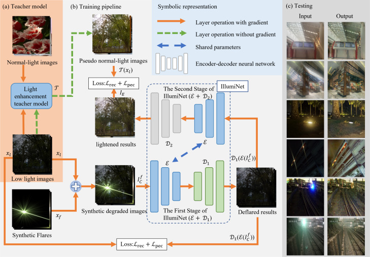
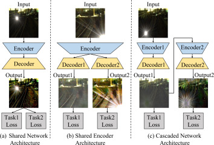
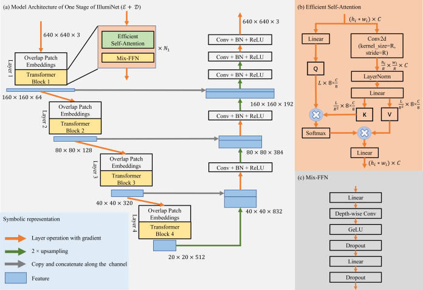
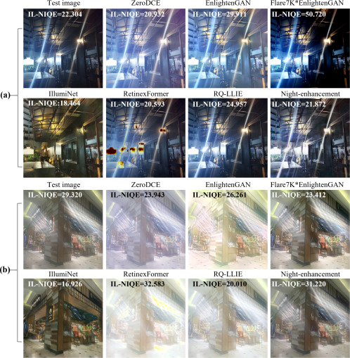

# IllumiNet: A two-stage model for effective flare removal and light enhancement under complex lighting conditions

> **发表**：Expert Systems with Applications (ESWA), Vol. 282, Article 127638, 2025（2025-04-19 在线发表）　|　**作者**：Lizhi Xu, Liqiang Zhu, Yaodong Wang, Yao Wang（北京交通大学）
> **论文**：https://www.sciencedirect.com/science/article/pii/S0957417425012606 （DOI: 10.1016/j.eswa.2025.127638，hybrid OA，CC-BY-NC-ND）　|　**代码**：未检索到公开仓库

> **说明**：原文 PDF 不可公开获取（ScienceDirect 页面有反爬验证），本报告基于 OpenAlex/Semantic Scholar 收录的完整摘要与 highlights、Elsevier CDN 上可公开访问的原文全部配图（gr1–gr10）及公开检索资料撰写。整体框架与实验设置的描述置信度较高（配图信息量大），但损失函数细节、训练超参与完整定量表格无法核实，正文细节置信度有限。

## 一、解决的问题

夜间或复杂光照场景下拍摄的图像往往**同时**存在两类退化：一是整体或局部照度不足（低光照），二是强光源造成的炫光伪影（glare、光条 streak、shimmer 等）。现有方法几乎都只解决其中一个问题——低光增强方法（ZeroDCE、EnlightenGAN、RetinexFormer、RQ-LLIE 等）会把含炫光的亮区进一步过曝、饱和；去炫光方法（如 Flare7K 系列）则默认输入曝光基本正常，对低光区域无能为力。

更糟的是，把两类方法**串联使用**也不行：先增强再去炫光会放大炫光并造成饱和截断，先去炫光再增强则会因为去炫光模型在低光域外工作而失效（论文图 1、图 5、图 6 中 Flare7K*EnlightenGAN 级联的退化结果直观展示了这一点）。此外，"低光+炫光"的真实成对训练数据几乎不可能采集——同一场景既要有退化版本又要有"去炫光且照度正常"的 ground truth。

本文针对的正是这个联合任务的两大痛点：(1) 如何用一个模型同时完成去炫光与光照增强，且两个子任务互不拖累；(2) 如何在**完全没有真实成对数据**的条件下训练这个模型。

## 二、核心创新点

1. **两阶段共享编码器的联合模型**：将去炫光（第一阶段）与光照增强（第二阶段）显式拆为两个级联的 pixel-to-pixel 生成阶段，但两个阶段**共享同一个编码器 E**，各自拥有独立解码器 D1/D2。相比"完全共享网络""共享编码器双解码器并行""完全级联双网络"三种常见多任务结构（原文图 2 对比），该设计同时获得任务间知识交互与模型压缩两个好处。
2. **免成对数据的训练管线**：第一阶段用合成炫光叠加到真实低光图像上构造伪成对数据（合成炫光 → 去炫光监督）；第二阶段用预训练的光照增强 GAN（EnlightenGAN）作为 teacher，对低光图像生成伪正常光照目标，以**知识蒸馏**方式训练学生模型。整条管线不需要任何真实成对采集。
3. **MiT（Mix Vision Transformer）做 U-Net 骨干**：每个阶段是一个以 SegFormer 风格 MiT 为编码器的 U-Net（含 Efficient Self-Attention 的空间缩减注意力与 Mix-FFN），兼顾全局建模能力与计算效率。
4. **共训练的特征对齐证据**：用两阶段特征余弦相似度曲线（原文图 10）证明共享编码器联合训练时两任务表征显著趋同（约 0.7–0.8），而分开训练时仅 0.2–0.3，以此支撑"域知识交互"的设计动机。

## 三、模型结构与方案

**整体管线**（原文图 3）：训练时分三个部分。(a) Teacher 部分：预训练光照增强模型 T（EnlightenGAN）把真实低光图像 x_l 映射为伪正常光照图像 T(x_l)，该过程不回传梯度；(b) 第一阶段：把合成炫光 x_f 与低光图像 x_l 合成为退化图像 I_C^f，经共享编码器 E 与解码器 D1 输出去炫光结果 D1(E(I_C^f))，以原低光图 x_l 为目标计算损失 L_rec + L_pec（重建损失 + 感知损失，符号见图 3 标注）；(c) 第二阶段：去炫光结果再经 E 与 D2 输出提亮结果，以 teacher 的伪标签 T(x_l) 为目标，同样用 L_rec + L_pec 监督。推理时输入依次过两个阶段，得到既无炫光又照度正常的输出。

> 图 3：IllumiNet 整体训练管线：(a) EnlightenGAN teacher 生成伪正常光照标签；(b) 合成炫光构造伪成对数据训练第一阶段、知识蒸馏训练第二阶段，两阶段共享编码器 E；(c) 真实场景测试样例。（来源：原论文）

**多任务结构选择**（原文图 2）：作者对比了三种多任务范式——(a) 单网络双损失（任务相互干扰）、(b) 共享编码器双解码器并行（输出无级联关系）、(c) 完全级联双网络（参数翻倍、无知识共享）。IllumiNet 取折中：级联执行 + 编码器参数共享。

> 图 2：三种多任务网络结构（共享网络 / 共享编码器 / 级联网络）的对比示意。（来源：原论文）

**单阶段网络**（原文图 4）：输入 640×640×3，编码器为 4 层 MiT（Overlap Patch Embedding + Transformer Block），特征尺度依次为 160×160×64、80×80×128、40×40×320、20×20×512（通道配置与 MiT-B1 一致）；Transformer Block 内部为 Efficient Self-Attention（用 stride=R 的卷积做空间缩减以降低注意力开销）+ Mix-FFN（含 depth-wise 卷积）。解码器为轻量的 Conv+BN+ReLU 堆叠，2× 上采样并与编码器特征跳连拼接（160×160×192、80×80×384、40×40×832）。

> 图 4：单个阶段（E+D）的 U-Net 结构：MiT 编码器 + Efficient Self-Attention + Mix-FFN，卷积解码器跳连融合。（来源：原论文）

**训练数据**：低光图像来自真实低光数据（无需配对），炫光来自合成炫光素材（Flare7K 风格的加性合成）；伪标签由 EnlightenGAN 在线生成。消融实验（原文图 9 的行标签）覆盖了骨干（ResNet18 vs MiT）、重建损失（L1 / L2 / Cosine）、teacher 选择（ZeroDCE vs EnlightenGAN）与是否共享编码器（SE），最终配置为 MiT + L2 损失 + EnlightenGAN teacher + 共享编码器。

## 四、实验与结果

由于真实"低光+炫光"场景没有 ground truth，论文的定量评估主要依赖**无参考指标 IL-NIQE**（越低越好）并辅以大量真实场景定性对比。对比方法包括低光增强方向的 ZeroDCE、EnlightenGAN、RetinexFormer、RQ-LLIE、Night-enhancement（Jin et al.），去炫光方向的 Flare7K baseline，以及 Flare7K 与 EnlightenGAN 的级联组合。

原文图 6 给出的两个含炫光真实场景中（图内标注的 IL-NIQE 数值）：场景 (a) 输入 22.304，IllumiNet 取得最优的 **18.464**，优于 ZeroDCE 20.932、RetinexFormer 20.593、Night-enhancement 21.872、RQ-LLIE 24.957、EnlightenGAN 29.311，级联方案 Flare7K*EnlightenGAN 反而恶化到 50.720；场景 (b) 输入 29.320，IllumiNet 同样最优（**16.926**），明显好于 RQ-LLIE 20.010、Flare7K*EnlightenGAN 23.412、ZeroDCE 23.943、RetinexFormer 32.583。可见单任务方法在炫光区域普遍过曝/留伪影，而级联两个单任务模型很不稳定。

> 图 6：含炫光真实场景的对比（图内标注各方法 IL-NIQE，越低越好），IllumiNet 在两个场景均取得最低值（18.464 / 16.926）。（来源：原论文）

其余实验：图 5 在室内商场与室外夜街的"有/无炫光"四组对照中展示了 IllumiNet 同时压制炫光与提亮暗区的能力；图 7 覆盖普通夜景、夜间驾驶与铁路场景三组真实图像的泛化测试；图 8 单独测试了高强度 glare 图像；图 10 的特征余弦相似度曲线（共训练约 0.7–0.8 vs 分开训练约 0.2–0.3）支撑共享编码器的设计。消融（图 9）表明：MiT 骨干优于 ResNet18，L2 重建损失优于 L1 与 Cosine（后者出现明显泛白），EnlightenGAN teacher 优于 ZeroDCE，去掉共享编码器会损害一致性。完整定量表格因原文不可获取无法在此核实。

## 五、专家锐评

**价值**：这篇论文的真实贡献在"问题定义 + 训练管线"而非网络本身——它明确指出低光增强与去炫光在真实夜景中是耦合问题，串联现成模型必然失败（图 6 中级联方案 IL-NIQE 从 22.3 恶化到 50.7 是很有说服力的反例），并给出了一条完全不依赖真实成对数据的训练路径（合成炫光 + GAN teacher 蒸馏）。在 Flare7K/Flare7K++ 把去炫光限定在"正常曝光夜景"的脉络里，把任务推广到低光域是有实际意义的增量，对铁路巡检、夜间驾驶等工程场景（作者团队背景）有直接应用价值。

**不足与质疑**：

1. **评估体系单薄，定量证据几乎全押在 IL-NIQE 上**。真实场景无 GT 可以理解，但论文完全可以在 Flare7K++ 合成测试集上报 PSNR/SSIM/LPIPS 与去炫光 SOTA（Flare7K++、MFDNet、Uformer 系）直接对标，而对比的去炫光方法只有 2022 年的 Flare7K baseline 一个，去炫光侧的比较明显过时且不充分。IL-NIQE 这类无参考指标偏好平滑、低噪的"自然"输出，对蒸馏类方法天然友好，单靠它说服力有限，也缺少 user study 佐证。
2. **性能上限被 teacher 锁死**。第二阶段是对 EnlightenGAN（2019 年的无监督 GAN）的知识蒸馏，学生输出必然继承 teacher 的色偏、噪声放大与过增强倾向，理论上不可能超越 teacher 的光照映射质量。消融只比较了 ZeroDCE 与 EnlightenGAN 两个弱 teacher，却没有尝试用对比中表现更强的 RetinexFormer/RQ-LLIE 做 teacher——这是一个显而易见却缺失的实验，令人怀疑换强 teacher 后两阶段框架的优势是否还成立。
3. **新颖性偏工程组合**。MiT U-Net 是 SegFormer 的直接搬用，合成炫光管线沿袭 Flare7K，蒸馏与共享编码器多任务都是成熟技术；图 10 的余弦相似度只证明了共训练让两任务表征"变像了"，并不能因果地证明这种相似性提升了输出质量（相关不等于因果），用它做核心设计依据论证强度不够。
4. **合成炫光到真实炫光的域差未被正面处理**。加性合成无法模拟真实炫光的饱和截断与场景相关散射，图 8 高 glare 测试里光源周围大面积饱和区域的"恢复"实质上是网络的幻觉式补全，输出整体偏暗，论文（就可见材料而言）未讨论这类失败模式与可信度问题。
5. **级联误差传播缺乏分析**：第一阶段残留的炫光会被第二阶段当作光源继续提亮，两阶段共用一个编码器也意味着两个分布差异很大的输入（含炫光低光图 vs 去炫光低光图）要挤同一套表征，容量瓶颈与误差放大都没有量化分析。

总体而言：问题选得好、管线务实，但在 ESWA 这个偏应用的载体上，实验对标的"对手"和"裁判"都偏弱，方法层面的可迁移结论有限（截至 2026-06，Semantic Scholar 被引 4 次）。
