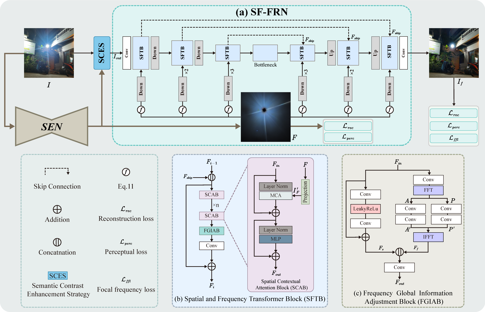
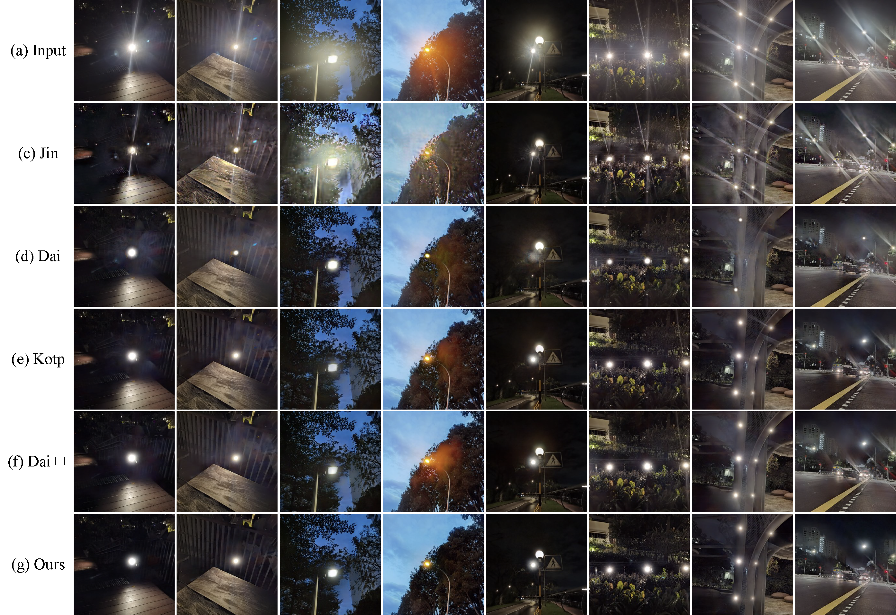

# Self-prior Guided Spatial and Fourier Transformer for Nighttime Flare Removal

> **发表**：IEEE Transactions on Automation Science and Engineering (TASE) 2025　|　**作者**：Tianlei Ma, Zhiqiang Kai, Xikui Miao, Jing Liang, Jinzhu Peng, Yaonan Wang, Hao Wang, Xinhao Liu
> **论文**：https://ieeexplore.ieee.org/abstract/document/10877847 （DOI: 10.1109/TASE.2025.3539632）　|　**代码**：https://github.com/cranbs/SGSFT

> 说明：原文 PDF 不可公开获取（IEEE 付费墙），本报告基于 Semantic Scholar 提供的完整摘要与"Note to Practitioners"、官方代码仓库 README 及仓库内提供的网络结构图与定性对比图撰写。论文中的具体定量指标（PSNR/SSIM/LPIPS 等数字）未能在公开渠道核实，故本报告不给出未经溯源的数字，相关结论的置信度有限。

## 一、解决的问题

夜间拍摄强光源（路灯、车灯、霓虹）时，镜头杂散光会在画面中形成大面积的眩光/光晕（flare）伪影，遮挡背景并显著降低成像质量。更关键的是，这类伪影会向下游高级视觉任务传导——摘要在"Note to Practitioners"中明确指出，眩光会影响自动驾驶场景中的语义分割、深度估计等任务性能，因此夜间去眩光不只是一个画质修复问题，更是自动化/机器人成像链路里的前置可靠性问题（这也是该工作发表在 TASE 这一自动化期刊的动机所在）。

作者点出现有方法的核心痛点：大多数去眩光方法把"被眩光污染的整张图像"直接当作优化目标，从整幅图无差别地抽取上下文信息，导致模型对眩光本身缺乏理解、在复杂真实场景下泛化能力受限。换言之，模型并不"知道"哪里是眩光、哪里是应当保留的真实光源，于是容易出现两类错误：要么把光源也一并抹掉（过度去除），要么残留眩光（去除不彻底）。

由此，作者提出的目标是：让网络先从被污染图像中提取出"自先验（self-prior）"，据此有选择地聚合上下文信息来推断被眩光覆盖区域的合理内容，同时在频域上维持全局亮度一致性，并通过对比策略显式区分"眩光"与"真实光源"，从而在去除眩光的同时保住光源。

## 二、核心创新点

1. **自先验提取网络（Self-prior Extraction Network, SEN）**：从眩光受损图像中提取场景固有先验，用于指示"哪些区域可信、应作为推断依据"，引导后续去除网络做非局部信息聚合，而非对整图无差别处理。

2. **语义对比增强策略（Semantic Contrast Enhancement Strategy, SCES）**：显式强化"眩光"与"光源"之间的语义无关性，让网络学到二者的模式差异，从而在去眩光时保留真实光源——这是针对"误删光源"这一常见失败模式的针对性设计。

3. **空间-频率去眩光网络（SF-FRN）中的两类模块**：
   - **空间上下文注意力块（SCAB）**：在自先验引导的区域内感知丰富上下文并推断语义上合理的填充内容；
   - **频率全局信息调整块（FGIAB）**：在频域（FFT/IFFT）建模全局亮度表征，维持被推断区域与无眩光区域之间的全局亮度一致性。

## 三、模型结构与方案

整体流程为三阶段：输入眩光图像 I → SEN 提取自先验 → SCES 增强眩光/光源语义对比 → SF-FRN（基于空间与频率 Transformer 块）输出无眩光图像 I_f。

> 图 1：(a) SF-FRN 整体结构——输入 I 经 SEN 与 SCES 得到自先验，再进入由若干 SFTB（Spatial and Frequency Transformer Block）构成的 U 形编解码网络（含 Down/Up 采样与 Bottleneck、跳跃连接），输出 I_f；(b) SFTB 内部由 SCAB（含 MCA 多头上下文注意力）与 FGIAB 串联组成；(c) FGIAB 通过 FFT→频域处理→IFFT 调整全局亮度信息。训练损失含重建损失 L_rec、感知损失 L_perc 与焦点频率损失 L_ffl。（来源：官方代码仓库结构图）

从图 1 可见几点设计要点：
- **U 形多尺度骨干**：SF-FRN 采用编码-瓶颈-解码的 U 形结构，由多个 SFTB 堆叠，配合下采样/上采样与跳跃连接，兼顾局部细节与多尺度上下文。
- **空间分支（SCAB）**：以 Layer Norm + 多头上下文注意力（图中标注 MCA）+ MLP 的 Transformer 形式，在自先验引导下做非局部内容推断；图中 SCAB 还与 FGIAB（频率块）以残差方式串接。
- **频率分支（FGIAB）**：将特征经 Conv 后做 FFT 进入频域，分幅度/相位（图中 A、P 等分支）做卷积调整，再经 IFFT 回到空域，专门负责全局亮度一致性——这是该方法区别于纯空域 Transformer 的关键。
- **损失设计**：重建损失 L_rec 保证像素级保真，感知损失 L_perc 保证语义/纹理质量，焦点频率损失 L_ffl（focal frequency loss）与频域分支呼应，约束频谱层面的差异。

**训练数据**：据仓库 README，方法基于 Flare7K++ 体系训练——合成与真实眩光样式共约 7,962 张（Flare7K++），背景干净图约 23,949 张（来自 CVPR 2018 反射去除工作），并提供 645 张无标注的真实困难样本与 100+ 张消费电子设备拍摄的真实眩光图用于泛化评估。摘要在局限性部分坦言：训练需要成对的眩光图与无眩光图，而真实成对数据难以获得，故未来计划探索无监督去眩光。

## 四、实验与结果

公开摘要给出的结论性表述为：在真实夜间场景上取得"最优性能"，并在不同电子设备拍摄的多种眩光场景中表现出稳健的泛化能力。具体的 PSNR/SSIM/LPIPS/G-PSNR/S-PSNR 等数字未能在公开渠道（摘要、README、ResearchGate 检索结果）中核实，本报告不臆造，留待获取全文后补充。

可确认的是定性对比（图 2）：作者与 Jin、Dai、Kotp、Dai++ 等代表性方法在多组真实夜间样本上做了视觉对比。从图中第二、三、五等列可见，SGSFT（Ours）在抹除条纹状眩光与光晕的同时，较好地保留了路灯/光源主体的形态，背景纹理（如木地板、树丛、路面标线）的恢复也较为干净；相比之下若干 baseline 存在残留眩光或光源被削弱的情况。

> 图 2：在真实夜间眩光图像上的定性对比，从上到下依次为 (a) 输入、(c) Jin、(d) Dai、(e) Kotp、(f) Dai++、(g) Ours。（来源：官方代码仓库定性结果图）

消融方面，摘要与图 1 暗示了三处可拆解的贡献（SEN/自先验、SCES、FGIAB 频域分支），但具体消融数字同样无法在公开渠道核实。

## 五、专家锐评

**价值**：该工作把"自先验引导 + 空间-频率双分支 Transformer"组合用于夜间去眩光，思路连贯且针对性强。两个真正有意义的设计：一是 SCES 显式建模"眩光 vs 光源"的语义对比，正面回应了去眩光领域长期存在的"误删光源/过度去除"痛点；二是 FGIAB 在频域维持全局亮度一致性，这对夜间大面积光晕导致的局部-全局亮度失衡是合理且对症的处理。能进 TASE 并被关联到自动驾驶下游任务，定位（去眩光作为高级视觉的前置可靠性环节）也讲得通，发表一年内被引 7 次（Semantic Scholar，截至检索时）说明有一定关注度。

**不足与质疑**（资深审稿人视角，至少三条具体质疑）：

1. **架构新颖性偏边际、与同源工作高度重叠**。"Fourier/频域 + Swin/Transformer 去夜间眩光"并非首创——同检索结果中就有 FF-Former（Swin Fourier Transformer for Nighttime Flare Removal）这一极为相近的命名与思路。本文 SF-FRN 的 U 形 Transformer 骨干 + FFT 频域分支在结构上与该类工作差别不大，真正的差异点集中在 SEN/自先验与 SCES，论文需要非常充分的消融才能证明这两点而非频域骨干在贡献主要增益，而该消融在公开材料中不可见。

2. **"自先验"的定义与可靠性存疑，存在循环依赖风险**。自先验是从"被眩光污染的图像本身"提取的——当眩光面积大、强度高时，受污染图像所能提供的可信先验恰恰最稀缺，此时"以自先验引导非局部聚合"可能退化为用不可靠区域指导推断，反而引入幻觉内容。摘要未说明 SEN 如何避免把眩光区域误判为可信先验，这是方法逻辑上的关键空白。

3. **评测与泛化主张缺乏可核实的强基线对比**。摘要宣称"最优性能"与"跨设备稳健泛化"，但图 2 的对比方法（Jin、Dai、Kotp、Dai++）是否包含 Flare7K++ 体系下最新最强的 baseline（如更晚近的扩散/Mamba 类去眩光方法）无从判断；且仅凭精选的定性样例难以支撑泛化结论，公开渠道又拿不到定量表，存在"挑样本"的展示风险。

4. **方法自承的硬约束限制落地价值**。作者自己在 Note to Practitioners 中承认：训练依赖成对的眩光/无眩光图像，而真实成对数据极难获取——这意味着真实场景训练仍高度依赖 Flare7K++ 式的合成数据，所谓"真实场景泛化"本质上是"合成训练 + 真实测试"的泛化，存在合成-真实域差导致的过拟合隐忧；这也是作者把无监督列为未来工作的根本原因。
