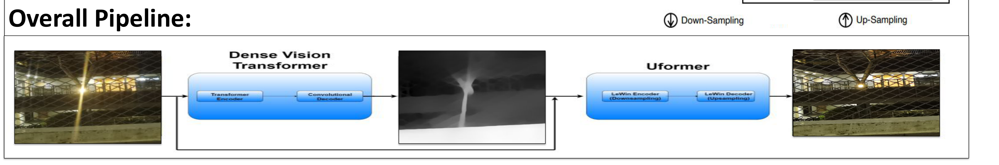
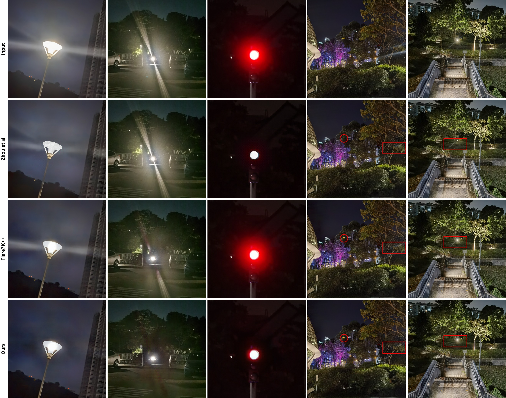

# Flare-Free Vision: Empowering Uformer with Depth Insights

> **发表**：ICASSP 2024（IEEE International Conference on Acoustics, Speech and Signal Processing，韩国首尔）　|　**作者**：Yousef Kotp, Marwan Torki（Alexandria University, Egypt）
> **论文**：https://ieeexplore.ieee.org/document/10446006/　|　**代码**：https://github.com/yousefkotp/Flare-Free-Vision-Empowering-Uformer-with-Depth-Insights

> 说明：原文 PDF 不可公开获取（IEEE 付费墙），本报告基于 Semantic Scholar / R Discovery 摘要、官方代码仓库 README、海报配图及 Flare7K++ 公开论文交叉核对撰写，部分实现细节与提出方法的精确指标置信度有限，文中已逐处标注来源。

## 一、解决的问题

镜头炫光（lens flare）是相机镜头对准强光源时常见的成像缺陷。强光在镜头组内部发生散射与多次反射，会在画面中产生鬼影（ghosting）、光晕（blooming）、放射状光条（streak）等伪影，严重降低图像质量。在夜间场景中尤为突出：路灯、车灯、霓虹灯等点光源会在画面里拖出长条光带与雾状光斑，既破坏观感，也干扰下游的检测、识别等视觉任务。

近年来以 Flare7K / Flare7K++ 为代表的工作建立了"散射炫光 + 反射炫光"的合成与真实混合数据集，并把炫光去除当作图像复原（image restoration）问题，用 U-Net、HINet、MPRNet、Restormer、Uformer 等通用复原网络去拟合"含炫光图 → 干净图"的映射。这些方法基本只利用 RGB 像素信息。

本文的出发点是：炫光是一种与场景几何（光源到相机的距离、物体的远近层次）强相关的物理现象，但现有复原网络完全忽略了深度线索。作者提出一个直接的假设——把场景的深度信息显式地喂给复原网络，能帮助网络更好地区分"真实场景内容"与"叠加在其上的炫光层"，从而提升去炫光效果。这就是论文标题 "Empowering Uformer with Depth Insights" 的含义。（来源：论文摘要）

## 二、核心创新点

1. **引入深度先验做炫光去除**：据作者表述，这是较早把单目深度估计结果作为辅助输入引入夜间炫光去除任务的尝试，主张深度信息可为图像复原提供新的可用线索。（来源：摘要"opens up new possibilities for using depth information for image restoration"）
2. **两阶段串联 pipeline**：用 Dense Vision Transformer（DPT）估计场景深度，将深度图与输入 RGB 图在通道维拼接（concatenate），再送入 Uformer 复原网络。（来源：摘要 + README）
3. **深度归一化的设计选择**：消融实验显示，直接拼接原始深度反而掉点，必须对深度做归一化后拼接才带来增益（详见第四节）。（来源：检索到的结果摘要，置信度中等）

需要指出，从方法描述看，本文的两个核心组件 DPT 与 Uformer 都是现成模型，真正的"新意"集中在"深度作为额外输入通道"这一组合策略上。

## 三、模型结构与方案

整体方案为一个串联的两阶段流水线：

> 图 1：整体 pipeline——含炫光图先经 Dense Vision Transformer（Transformer Encoder + Convolutional Decoder）估计深度图，深度图与原图拼接后送入 Uformer（LeWin Encoder 下采样 / LeWin Decoder 上采样）输出去炫光结果（来源：官方代码仓库海报）

- **深度估计模块（Dense Vision Transformer, DPT）**：以 ViT 风格的 Transformer Encoder 提取特征，再由卷积解码器逐级还原出稠密深度图。该模块对夜间含炫光图给出一张深度估计（图 1 中间的灰度深度图）。
- **特征融合**：深度图与输入 RGB 图在通道维拼接，形成增广输入（原 3 通道 + 深度通道）。
- **复原模块（Uformer）**：采用 U 形 Transformer 结构，其编解码器由 LeWin（Locally-enhanced Window）Transformer block 构成，逐级下采样/上采样并跳连，最终输出去炫光后的干净图。Uformer 也正是 Flare7K/Flare7K++ 官方 baseline 所用的复原骨干。

**训练数据**：使用 Flare7K++ 数据集，其中 Flare7K 提供散射炫光、复合炫光与光源样本，Flare-R 提供真实拍摄的复合炫光与光源；干净背景图来自 Flickr24K。训练时按 Flare7K++ 的合成范式，把炫光层叠加到干净背景上构造配对样本。（来源：README）

**损失与评测脚本**：仓库的评测脚本计算 PSNR、SSIM、LPIPS，以及针对光晕区域的 Glare-PSNR（G-PSNR）和针对光条的 Streak-PSNR（S-PSNR）。README 未公开具体损失函数权重与训练超参（仅指向配置文件 `options/uformer_flare7kpp_baseline_option.yml`），故损失设计细节置信度有限。（来源：README）

## 四、实验与结果

**数据集与指标**：在 Flare7K++ 测试集（含合成与真实两套）上评测，指标为 PSNR / SSIM / LPIPS（部分含 G-PSNR、S-PSNR）。

**对比 baseline 的量级参照**（以下 baseline 数字来自 Flare7K++ 原论文 Table 2，在 Flare7K++ benchmark 上的复原网络对比，已交叉核对）：U-Net PSNR 27.189、HINet 27.548、MPRNet 27.036、Restormer 27.597、Uformer 27.633。（来源：Flare7K++，arXiv:2306.04236 Table 2，已核对）

**本文方法结果**：据检索到的结果摘要，本文 Uformer+归一化深度方案达到 PSNR 27.662、SSIM 0.897、LPIPS 0.0422，略优于纯 Uformer baseline（27.633 / 0.894 / 0.0428）。（来源：网络检索摘要，未能在 IEEE 原文独立核实，置信度中等）

**消融结论（关键）**：检索摘要给出的三组对比为——纯 Uformer：27.633 / 0.894 / 0.0428；Uformer + 原始深度：27.282 / 0.895 / 0.0447（PSNR 反而下降）；Uformer + 归一化深度：27.662 / 0.897 / 0.0422。这说明朴素拼接深度会损害性能，必须归一化后才有微弱增益。（来源：网络检索摘要，置信度中等）

定性上，论文/海报给出与 Zhou et al. 和 Flare7K++ 等方法的视觉对比（图 2），在路灯光晕、红绿灯光源、复杂夜景等场景下展示去炫光效果。

> 图 2：与 Zhou et al.、Flare7K++ 的定性对比（行序：输入 / Zhou et al. / Flare7K++ / Ours），红框标注局部细节差异（来源：官方代码仓库）

## 五、专家锐评

**价值**：本文最大的价值在于提出并实证了一个有启发性的问题——"几何/深度先验能否帮助炫光去除"。把深度作为额外通道的想法直观、易复现，作者也开源了完整代码与权重，对后续研究有参考意义。在 Flare7K++ 这个已被反复刷榜的 benchmark 上，能多挤出一点指标且方法简洁，作为一篇 ICASSP 短文是合格的。

**不足与质疑**（以资深审稿人视角）：

1. **增益微弱到接近噪声水平，结论说服力不足**。按检索到的数字，提出方法 PSNR 27.662 相比纯 Uformer baseline 27.633 仅提升 0.029 dB，SSIM 0.897 vs 0.894、LPIPS 0.0422 vs 0.0428 同样是小数点后第三位的差异。这种量级的提升完全可能来自训练随机性或评测波动，论文若没有多次运行的均值±方差或显著性检验，"state-of-the-art"的措辞过强；而且 Restormer（27.597）与 Uformer（27.633）本就在同一梯队，所谓 SOTA 的领先优势其实可忽略。

2. **方法的内在逻辑被自己的消融证伪了一半**。消融显示直接拼接原始深度会让 PSNR 从 27.633 掉到 27.282，只有归一化深度才"勉强"回正到 27.662。这说明网络并非真正"理解并利用"了几何信息，更像是对输入数值分布敏感——若深度先验真的携带有效几何线索，不该出现"加了反而更差"的现象。这把"深度有助于去炫光"的核心论点削弱成"经过精心数值处理的额外通道偶尔不掉点"。

3. **深度来源与可靠性存疑，却未做分析**。DPT 是在自然光照图像上预训练的单目深度模型，而输入恰恰是被强炫光严重污染的夜间图——炫光区域本身就是深度估计最容易失败的地方（强光晕会让深度图在光源处完全失真，见图 1 中间深度图光源处的异常亮斑）。论文没有评估这种"被污染的深度"质量如何，也没有讨论错误深度对复原的负面影响，等于把一个不可靠的先验当作可靠输入。

4. **计算开销与收益严重不匹配，且缺失代价分析**。为了 0.03 dB 的提升，pipeline 额外串联了一整个 Dense Vision Transformer 做深度估计，推理时间、显存、参数量都显著增加，但论文未报告任何 FLOPs/参数量/推理速度对比。对一个实用导向的复原任务，这种"重计算换微弱指标"的取舍很难自圆其说。

5. **baseline 与新数据缺失**。对比仅围绕 Flare7K++ 自带的几个通用复原网络，未与同期专门的炫光去除方法（如基于光源分解或频域的方法）较量；也未在 Flare7K++ 之外的数据集上验证泛化，"robustness and generalization"的主张主要靠少量定性图支撑，缺乏定量证据。
