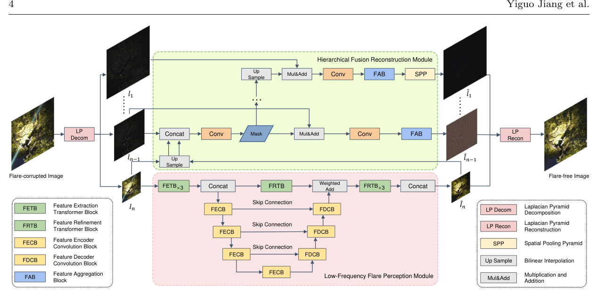
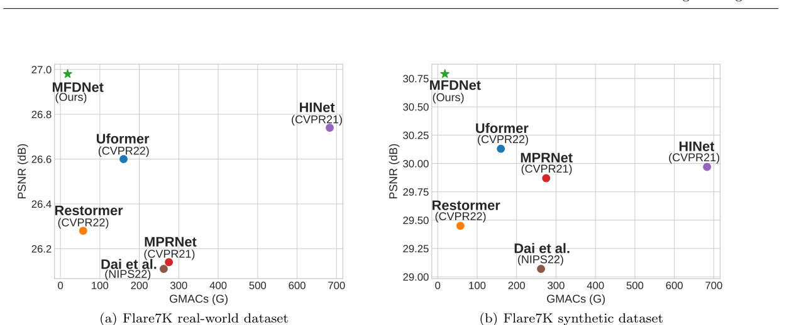
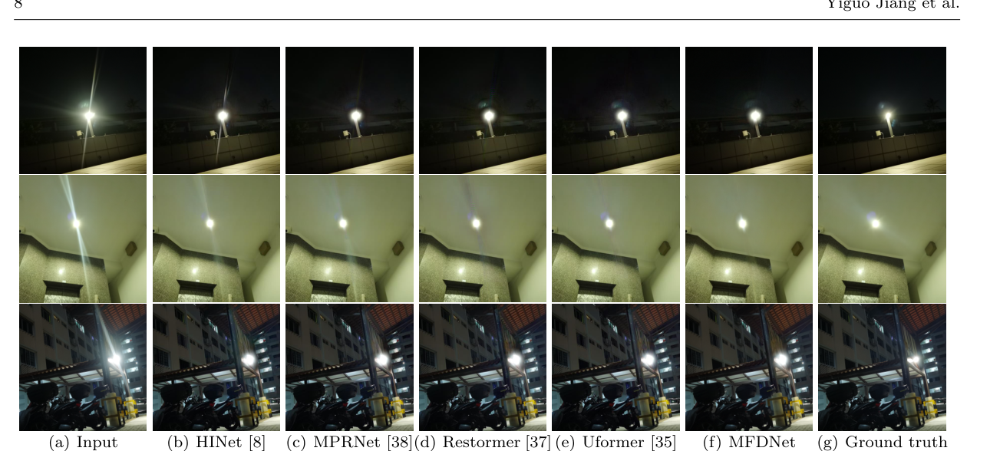

# MFDNet: Multi-Frequency Deflare Network for Efficient Nighttime Flare Removal

> **发表**：The Visual Computer 2024（CGI 2024）　|　**作者**：Yiguo Jiang, Xuhang Chen, Chi-Man Pun (通讯), Shuqiang Wang, Wei Feng
> **论文**：https://link.springer.com/article/10.1007/s00371-024-03540-x （arXiv:2406.18079）　|　**代码**：https://github.com/Jiang-maomao/flare-removal

## 一、解决的问题

夜间拍摄强光源场景时，镜头内部的意外散射与反射会在照片上留下耀斑（flare）伪影：眩光（glare）、光条（streak）、彩色亮线、微光（shimmer）、饱和光斑等。这些伪影既破坏照片美感，也遮蔽细节内容，给图像理解带来困难。耀斑的形状、位置、颜色受镜头光学设计、制造瑕疵、镜面污渍、光源相对镜头的角度等多重因素影响而高度多样，尤其当单张图内同时存在多种耀斑时，要在彻底去除耀斑的同时保留原始内容十分困难。

传统方法分硬件类（更优光学设计、抗反射镀膜、中性密度滤镜）和软件类（去卷积、按特征检测耀斑后修复）。硬件法成本高、只对特定波长/角度有效，且无法处理已经拍出的含耀斑照片；软件法常把亮区误判为耀斑，对复杂场景的多样耀斑泛化差。近年深度学习方法兴起，但本文指出其两大共性缺陷：其一，大多把去耀斑当作通用图像复原任务，没有有效解耦图像的"光照信息"与"内容信息"，结果要么去不干净，要么去除时损伤了原始内容；其二，直接在全分辨率输入图上用深网络全局处理，计算量随分辨率指数级上升，难以应用到高分辨率图像，限制了实用性。

本文要解决的核心痛点正是"既要去耀斑、又要保内容、还要算得快"这一三难。作者借助拉普拉斯金字塔（Laplacian Pyramid, LP）把图像可逆地分解为低频带（主要承载光照信息）与高频带（主要承载纹理等内容信息），只在分辨率较低的低频部分做去耀斑，再逐层与高频融合重建，从而在去除耀斑的同时显著降低计算复杂度。

## 二、核心创新点

1. **基于拉普拉斯金字塔的多频去耀斑框架（MFDNet）**：把"光照"与"内容"解耦到不同频带，只在低频做去耀斑、在高频保细节，整体可逆重建。这是把 LP 频带分解思想迁移到夜间去耀斑任务的主要卖点。
2. **低频耀斑感知模块（LFFPM）**：在低频部分以 Transformer（FETB/FRTB，采用 axis-based self-attention 把自注意力复杂度从二次降为线性 + gated feed-forward）捕捉全局长程依赖以准确定位大范围耀斑，同时用卷积 U 形编解码（FECB/FDCB，含 Gate 与 Channel Attention）补足局部细节，二者经可学习加权求和融合。
3. **分层融合重建模块（HFRM）**：从最低频去耀斑结果 Î_n 出发，逐层学习掩膜 Mask 引导与高频分量融合，配合膨胀卷积、特征聚合块（FAB，SE 风格通道加权）和空间池化金字塔（SPP）重混多尺度上下文，重建最终无耀斑图像。
4. **可扩展、低开销**：LP 分解层数 n 可随输入尺寸调整（实验取 n=3），使模型能处理 512×512 直到 4K 的任意尺寸图像，且推理代价远低于现有 SOTA。

## 三、模型结构与方案

整体 pipeline（图 2）：给定夜间含耀斑图像 I∈R^{H×W×3}，MFDNet 先用 LP 分解出一组高频分量 L=[l₁,…,l_{n-1}]（分辨率从 H×W 递减到 H/2^{n-1}×W/2^{n-1}）与最低频图像 I_n（尺寸 H/2ⁿ×W/2ⁿ）。I_n 送入 LFFPM 去耀斑得到低频无耀斑图 Î_n；随后 I_n、Î_n 与各层高频送入 HFRM，逐层融合得到 L̂=[l̂₁,…,l̂_{n-1}]，因 L 与 L̂ 一一镜像，最终用 Î_n 与 L̂ 可逆重建出无耀斑图 Î。

> 图 2：MFDNet 整体结构。左侧 LP Decom 分解高/低频，下方红框为 LFFPM（FETB×3→拼接→FRTB×3，配 FECB/FDCB 的 U 形卷积分支与跳连），上方绿框为 HFRM（Up Sample / Concat / Conv / Mask / Mul&Add / FAB / SPP 逐层融合），右侧 LP Recon 重建（来源：原论文）。

**LFFPM 细节**：FETB 与 FRTB 共享结构（图 3）：F′=ASA(LN(F))+F，F̂=GFFN(LN(F′))+F′。ASA（axis-based self-attention）沿高、宽轴在通道维顺序计算注意力得到线性复杂度；GFFN 用 GELU 与逐元素乘在两条并行路径上抑制无关特征再求和。卷积分支 FECB/FDCB（图 4）含 LayerNorm、卷积、Gate（沿通道分两半逐元素相乘 Gate(X,Y)=X⊙Y）与 Channel Attention（CA(X)=X∗W·Pool(X)）。全局长程特征与卷积输出做可学习加权求和。

**HFRM 细节**：将上采样后的 I_n、Î_n 与 l_{n-1} 拼接，经小网络学到掩膜 M_{n-1} 引导融合：l′_{n-1}=l_{n-1}⊗M_{n-1}+l_{n-1}；再对 l′ 做膨胀卷积，用 FAB（图 5，SE 风格 squeeze-and-excitation 通道加权 + 卷积压缩通道）重加权；掩膜线性插值上采样后逐层重复，最后一层 FAB 后接 SPP 重混多上下文特征。

**损失函数**：总损失 L_total=λ_m·L_M+λ_s·L_S+λ_p·L_P，其中 L_M 为 MSE、L_S 为 SSIM 损失、L_P 为基于预训练 AlexNet 特征的感知损失；经验取 λ_m=1、λ_s=0.3、λ_p=0.7。

**训练数据与策略**：基于 Flare7K 数据集（5,000 散射 + 2,000 反射耀斑，含 25 类散射与 10 类反射），与从 24K Flickr 采样的 23,949 张无耀斑图合成配对训练数据。PyTorch 实现，Adam，学习率 1e-4；数据增强含随机旋转、平移、错切、缩放、翻转；后处理沿用 Dai 等 [13]，提取输入饱和区叠回去耀斑结果以恢复光源。测试用 Flare7K 提供的 100 张真实 + 100 张合成含耀斑图。

## 四、实验与结果

**对比方法**：夜间去雾法 Zhang [41]、夜间增强法 Sharma [30]、两种 U-Net 去耀斑法 Wu [36] 与 Dai [13]，以及通用复原 SOTA：HINet [8]、MPRNet [38]、Restormer [37]、Uformer [35]。指标用 PSNR、SSIM、LPIPS，并以 GMACs、参数量、推理时间衡量实用性。

**定量结果（表 1）**：真实集 MFDNet PSNR=26.98 dB / SSIM=0.895 / LPIPS=0.051，PSNR 高于 HINet 的 26.74、Uformer 的 26.60；合成集 PSNR=30.79 / SSIM=0.966 / LPIPS=0.019，作者称合成集 PSNR 至少比所有其他方法高 0.66 dB（次优 Uformer 30.13）。

**效率（表 2，512×512，2080Ti）**：MFDNet GMACs=18.25G、参数 6.32M、时间 0.034s；次优 Restormer 为 57.61G，次快 Dai 为 0.052s。MFDNet 可处理 512×512 至 4K 任意尺寸，而 MPRNet/Uformer 仅能处理到 1024×1024，其余方法在高分辨率出现 N.A. 或 OOM。

> 图 1：在 Flare7K 真实集 (a) 与合成集 (b) 上 PSNR-GMACs 权衡，MFDNet（绿星）位于左上角，低算量高 PSNR（来源：原论文）。

> 图 7：Flare7K 真实夜间含耀斑图视觉对比，列依次为 Input、HINet、MPRNet、Restormer、Uformer、MFDNet、Ground truth（来源：原论文）。

**消融（表 3）**：去掉 FECB+FDCB 掉点最严重（真实 PSNR 26.98→24.94，合成 30.79→25.95），说明卷积分支对捕捉细节、复原内容至关重要；去掉 FETB+FRTB（→26.36/30.32）与去掉 FAB（→26.70/30.61）也均有下降。作者另指出局限：光源细小昏暗且伴眩光时对比度不足、可能无法恢复光源（需手动选最优亮度阈值，图 11）；对极高亮度、大范围的微光耀斑也可能去不干净。

## 五、专家锐评

**价值**：本文最实在的贡献是"用拉普拉斯金字塔做频带解耦、只在低频去耀斑"这一工程取舍带来的效率优势。表 2 的数字相当有说服力：512×512 下 18.25G GMACs / 0.034s，约为次优 Restormer 算量的三分之一，且唯一能跑通 4K 而不 OOM——在去耀斑这个长期被"通用复原大模型直接套用"主导的子领域，把实用性（可处理任意分辨率）摆上台面是有意义的。同时精度并未牺牲，真实集与合成集 PSNR 均为最高。对追求落地的移动端去耀斑而言，这是一个值得参考的轻量基线。

**不足与质疑**：
1. **新颖性偏边际**。"拉普拉斯金字塔 + 低频处理 + 高频细节融合"几乎是作者团队自家工作的迁移：文中第 766、786 行明确引用 [20,21,23]（高分辨率文档阴影去除、film enhancement、LPTN）来论证 n 的取舍，方法骨架与这些"multi-frequency driven"前作高度同构，本文更像把同一范式换到去耀斑任务，模块（ASA 引自 [33]、NAFNet 风格 FECB 引自 [7]、SE/FAB 引自 [12,16]）多为现成拼装，原创设计成分有限。
2. **精度增益与"SOTA"叙述不够诚实**。真实集 PSNR 仅 26.98 vs HINet 26.74，差距 0.24 dB，且 LPIPS 0.051 并非最优（HINet 0.048 更低），但作者只强调合成集"至少高 0.66 dB"。更关键的是表 2 的算量对比把 HINet（88.67M 参数、682.86G）这种重模型当陪衬，却回避了 Restormer 仅 2.98M 参数、MPRNet 仅 1.93M 参数——MFDNet 6.32M 参数其实比这两者都大，"轻量"主要体现在 GMACs 而非参数量，文中对此一笔带过。
3. **对比 baseline 缺位**。同属夜间去耀斑且专门解决感受野问题的 FF-Former [40]（CVPRW2023）在相关工作里被点名讨论，却未纳入表 1/表 2 的定量对比；这是与本文最直接可比的近期专用方法，缺席使"state-of-the-art"主张大打折扣。
4. **完全依赖 Flare7K 合成训练，泛化存疑且自相矛盾**。训练/测试均在 512×512 合成数据上，4K 结果（图 9）也是把耀斑合成贴到真实 4K 图得到，并无真实 4K 配对验证；既然方法被宣称能跑 4K，却用 512 训练再"声称"能泛化到 4K，缺少定量支撑（表中 4K 行只有 MFDNet 自己有数，无任何对比与质量指标）。此外作者自承光源细小时需"手动选最优亮度阈值"（图 11），这把一部分恢复质量外包给了人工调参，削弱了端到端去耀斑的完整性主张。
5. **消融不充分**。表 3 只做了三组"去模块"实验，未对核心超参 n（LP 层数）、损失权重 λ、ASA 相比标准注意力的实际收益做定量消融，"n=3 是 trade-off"仅以引文佐证而非本任务的曲线证据。
