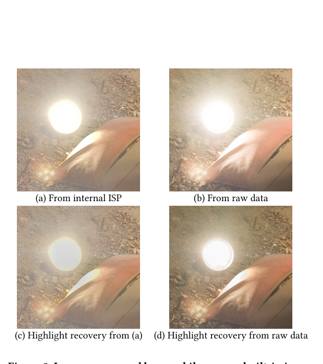
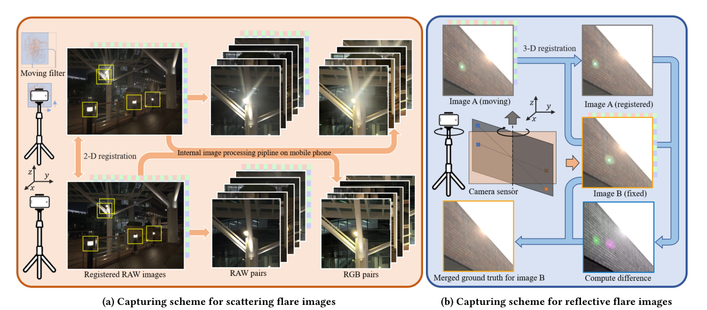
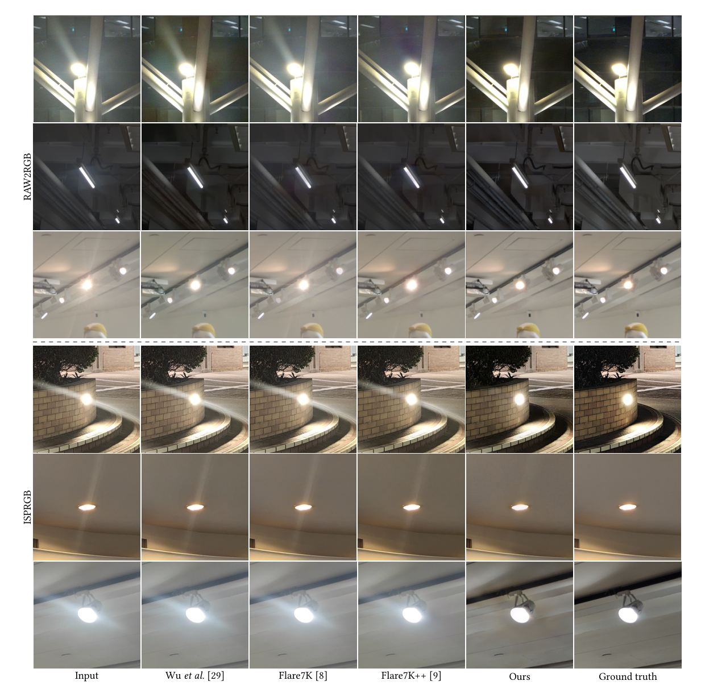

# Understanding and Tackling Scattering and Reflective Flare for Mobile Camera Systems

> **发表**：ACM MM 2024（pp. 8768–8776）　|　**作者**：Fengbo Lan, Chang Wen Chen（香港理工大学）
> **论文**：https://dl.acm.org/doi/10.1145/3664647.3681306　|　**代码/数据集**：论文中未给出公开链接（未见开源）

**版本说明**：本仓库本地文件 `pdfs/16_RawFlareDataset_arXiv2023.pdf` 实为 **arXiv:2307.14180v2**（2024-11-04 上传，acmart 模板排版，9 页）。经核对，其标题、作者与 ACM MM 2024 正式版完全一致，Crossref 记录确认正式版发表于 MM '24（pp. 8768–8776，恰好 9 页），故 v2 即 camera-ready 版本；v1 为 2023 年 7 月的早期版本（即文件名所称的 "Raw Flare Dataset" 预印本）。本报告基于 v2 全文撰写，配图均取自 arXiv v2 版 PDF。ACM 官方页面（403 反爬）的摘要经由 Crossref/检索摘要比对，与 v2 摘要一致。

## 一、解决的问题

手机摄影中炫光（flare）问题尤为突出：手机普遍使用塑料镜片、且出于成本考虑往往省去高价的抗反射（AR）镀膜，导致散射炫光（scattering flare，由镜头上灰尘/划痕等微观缺陷散射造成）和反射炫光（reflective flare，由多镜组内部反射造成）频繁出现。

已有研究注意到手机内部 ISP（图像信号处理管线）对炫光去除有负面影响，但**究竟是哪些 ISP 操作在"帮倒忙"一直没有被系统地界定**——此前工作基本只盯着 tone-mapping 这一个非线性环节（如 Zhou et al. ICCV 2023 用像素亮度加权来模拟 tone-mapping），而忽视了去噪、锐化、JPEG 压缩等同样不可逆的操作。根本原因是：**领域内缺少成对的 RAW 域炫光数据集**，研究者无法把 ISP 拆开逐步分析，只能在 gamma 校正后的 sRGB 图像上做模拟。

此外，作者指出现有方法多在局部炫光（localized flare）上训练，对真实世界中大范围、全局性的炫光退化（global flare，如整体对比度被雾化）泛化很差；反射炫光中的"离焦"（out-of-focus）形态也缺数据（BracketFlare 只覆盖在焦反射炫光）。

## 二、核心创新点

1. **首个同时覆盖散射与反射炫光的 RAW 图像成对数据集**：2,027 对散射炫光 + 1,248 对反射炫光的全分辨率 RAW 图像对，每对同时提供 RAW 和机内 ISP 处理结果，覆盖 4 款手机（iPhone 13 / Pixel 7 / iQOO Neo 7 / OPPO Find X6 Pro）、室内外、白天黑夜多场景。
2. **两套巧妙的真值采集方案**：散射炫光用"污渍滤镜 + 亚像素 SURF 配准"获得成对数据；反射炫光利用其与光源关于光学中心对称的先验，通过旋转相机两次拍摄 + 3D 配准 + 图像相减定位炫光、互补合成无炫光真值，一次拍摄得到两对数据。
3. **首次系统量化 ISP 各不可逆操作（去噪/锐化/压缩）对炫光去除的影响**：通过在 RAW2RGB 管线中可控地插入各操作，发现去噪有益（+1.4 dB 左右）、锐化与压缩有害（反射炫光最多 -2.93 dB），并给出炫光去除模块在 ISP 中的最优插入位置（去噪之后、锐化压缩之前）。
4. **数据层面扩展泛化性**：数据集同时包含局部/全局散射退化与在焦/离焦反射炫光，用其训练可显著改善现有方法对全局炫光和离焦反射炫光的处理能力。

## 三、模型结构与方案

需要先说明：**这篇论文的主体贡献是数据集与 ISP 分析，并没有提出新的网络结构**。文中的 "Ours" 是指在所提数据集（含局部+全局、在焦+离焦退化）上按既有网络设置训练得到的模型，其优势来自数据而非架构。

> 图 1：数据集中的反射炫光（上排）与散射炫光（下排）示例（来源：arXiv v2 版原文）

**RAW vs ISP 的动机实验**：机内 ISP 输出的图像相比 RAW 直出损失了大量高光细节——对高光区域做恢复时，ISP 图几乎恢复不出内容，而 RAW 处理图可以（图 2）。这正是用 RAW 数据研究炫光的根本理由。

> 图 2：机内 ISP 处理（a）相比 RAW 数据处理（b）损失大量细节；从二者分别做高光恢复（c）（d），差距一目了然（来源：arXiv v2 版原文）

**数据采集管线**（图 4）：
- **散射炫光**：在镜头前加装带不同程度污渍的滤镜模拟镜头缺陷，三脚架固定拍摄有/无滤镜对；用 SURF 特征做亚像素平移配准（先在 ISP 图上配准，再换算到 RAW 的整数像素网格）；检测光源位置后裁出以光源为中心的 512×512 图块，RAW 经外部管线转成高质量 RGB 对，再按预设指标过滤低质量对。
- **反射炫光**：利用反射炫光与光源的对称性，旋转相机改变光源位置使炫光移位，两张图经 3D 配准对齐后相减定位炫光区域，用另一张图的对应区域补全，得到无炫光真值；角色互换可从一次采集得到两对数据，成对分辨率 1024×1024。为避免对 RAW 插值引入色彩混叠、破坏噪声模型，配准只在 RGB 域进行，RAW 保留原始数据。

> 图 4：散射（左）与反射（右）炫光成对数据采集方案（来源：arXiv v2 版原文）

**ISP 操作影响分析**：构造 RAW2RGB 外部管线（黑电平校正、白平衡、去马赛克、色彩空间转换，不含去噪/锐化/压缩），在其上可控插入：NAFNet（SIDD 预训练）去噪、USM 锐化（动态权重模拟各厂商风格）、DiffJPEG 压缩（中等质量因子），并比较 4 种"炫光去除环节摆放位置"的管线配置。

## 四、实验与结果

**基准对比**（表 3，PSNR/SSIM/LPIPS）：对比 Wu et al.（ICCV 2021）、Flare7K（Uformer 预训练）、Flare7K++、BracketFlare。
- RAW2RGB 反射炫光：Ours 35.742 / 0.950 / 0.035，优于 BracketFlare（34.172 / 0.924 / 0.136）与 Flare7K（30.356）；注意输入本身即有 34.034 dB，Wu et al. 反而降到 25.810（把云误判成炫光等错误修复）。
- RAW2RGB 散射炫光：Ours 26.678 / 0.749 / 0.145，大幅领先 Flare7K++（22.881 / 0.701 / 0.190）。
- ISPRGB 散射炫光：Ours 20.556 vs Flare7K++ 17.224，且所有方法在 ISPRGB 上的指标全面低于 RAW2RGB，印证 ISP 处理拉低了可恢复上限。
- 定性结果：BracketFlare 因缺离焦数据，对半透明离焦反射区无能为力；现有方法能去局部散射斑，但对改变全图对比度的全局炫光基本失效（图 6 第一、最后行）。

> 图 6：散射炫光去除定性对比（上半 RAW2RGB、下半 ISPRGB；来源：arXiv v2 版原文）

**ISP 操作消融**（表 4/5）：
- 去噪开头：反射 +1.388 dB、散射 +1.433 dB，LPIPS 同步改善——去噪是炫光去除的有益前置。
- 加入锐化：反射 -1.228 dB；再加压缩：-1.701 dB；最差组合下反射炫光累计退化达 2.93 dB，散射 1.75 dB。
- 结论：炫光去除应放在**去噪之后、锐化与压缩之前**（配置 1 最优）；现行"在 ISP 完整输出后做炫光去除"（配置 3，即绝大多数现有方法的实际使用方式）明显次优。

## 五、专家锐评

**价值**：这篇论文的真正分量在"测量"而不在"方法"——它第一次用真实成对 RAW 数据把 ISP 拆开，定量回答了"去噪助攻、锐化压缩拖后腿、炫光去除该插在哪"这一工程上极具操作价值的问题，对厂商把 deflare 模块嵌入 ISP 有直接指导意义。反射炫光的"旋转-对称-互补"真值采集方案也颇为巧妙，且同时覆盖离焦反射与全局散射两类长期缺数据的退化形态，填补了 Flare7K/BracketFlare 系列的明显空白。作为 ACM MM 的数据集+分析型论文，定位是成立的。

**不足与质疑**：
1. **"Ours" 是数据红利而非方法贡献，对比有失公允**。表 3 中 "Ours" 只是用既有网络在自家数据上训练的结果，而对照组（Flare7K/Flare7K++ 的预训练 Uformer 等）用的是各自原始训练分布——在自家测试集上"自家数据训练的模型赢了"，这更多证明了分布一致性，而非数据集带来的"泛化性提升"。真正该做的交叉实验（自家数据训练 → 在 Flare7K++ 真实测试集上测）全文缺失，"enhance generalizability" 的核心主张其实没有被对称地验证。
2. **散射炫光的"污渍滤镜"代理存疑且数据有结构性空洞**。外置滤镜上的污渍与真实镜组内部的灰尘、镀膜磨损在光路位置上完全不同，散射核形态未必一致；更扎眼的是表 2 显示散射炫光的"室外白天"样本为 0 张，而逆光白天恰是散射雾化最常见的场景之一，数据覆盖与论文"wide spectrum of conditions"的宣称不符。
3. **ISP 分析用的是"模拟 ISP"而非真机 ISP**。去噪用 NAFNet、锐化用 USM、压缩用 DiffJPEG，都是学术代理；真机 ISP 的多帧融合、局部 tone-mapping、厂商私有锐化与这些代理差异很大，且实验还把多帧融合刻意关闭。由此得出的"最优插入位置"对真实 ISP 的可迁移性只能算合理猜想，论文没有在任何真机管线内做端到端验证。
4. **反射炫光基线提升幅度有限、真值可靠性未量化**。RAW2RGB 反射任务输入即 34.03 dB，最佳方法 35.74 dB，净增益约 1.7 dB，而多个基线反而把图修坏；同时旋转相机两次拍摄之间的光照变化、配准残差对"相减定位炫光"真值的污染程度，文中没有给出任何误差分析。
5. **复现性堪忧**：论文未提供数据集与代码的任何下载链接，截至撰写本报告也未检索到公开仓库。一篇以数据集为核心贡献的论文不放出数据，其社区价值要大打折扣。
