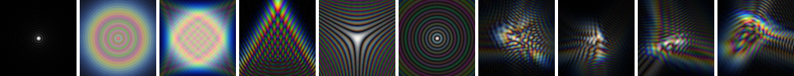
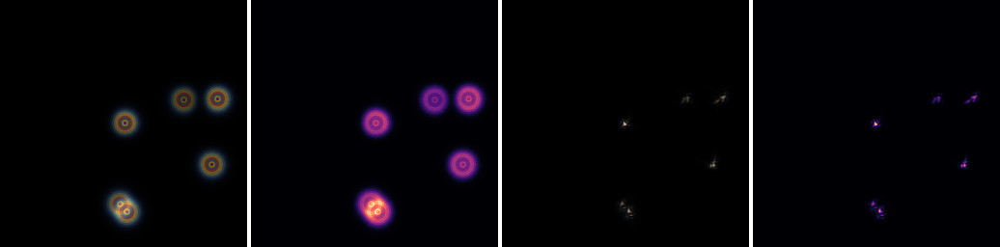
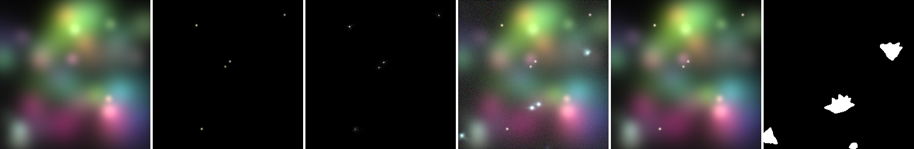
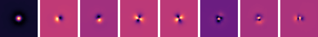
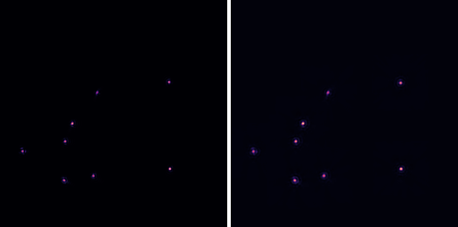
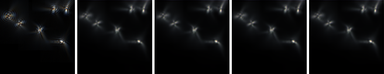

# 复现：SLCFormer 的 ZernikeVAE 散射眩光合成管线

> 论文：**SLCFormer: Spectral-Local Context Transformer with Physics-Grounded Flare Synthesis for Nighttime Flare Removal**（AAAI 2026，arXiv:2512.15221，武汉科技大学 Xiyu Zhu et al.）
> 本目录是对该论文**数据合成管线**（而非去眩光网络 SLCFormer 本体）的**从零工程复现**。配套论文分析见仓库根目录 [`01_SLCFormer_AAAI2026.md`](../../01_SLCFormer_AAAI2026.md)。

SLCFormer 有三大贡献：FFEM 频域模块、DESM 方向性空间模块，以及 **ZernikeVAE 物理眩光合成管线**。其中前两者是去眩光网络；本仓库聚焦于第三项——一条用**傅里叶光学 + Zernike 像差 + Phase-to-Space 变换 + VAE** 生成"空间可变 PSF 散射眩光"的数据合成管线。论文对该管线只给了 6 个公式和一段文字、**未开源**，本工程把它补全为一套可运行、可验证的代码。

---

## 1. 论文管线拆解（Fig. 2 / Eq. 1–6）

论文动机：Flare7K 系数据集的散射眩光是用**单一、中心对称的标量 PSF** 简单叠加合成的，"过于锐利干净"，缺乏真实镜头像差/衍射/微散射带来的**空间非均匀**畸变。SLCFormer 改用逐像素的**空间可变 PSF**来合成"无中心对称性"的眩光。管线四步：

| 步骤 | 论文公式 | 含义 | 本仓库实现 |
|---|---|---|---|
| ① 逐像素相位 | `φ_x(ρ)=Σ aᵢ Zᵢ(ρ)` (5) | Zernike 像差模式（tilt/defocus/astig/coma…）线性组合成波前相位 | `zvflare/zernike.py` |
| ② 傅里叶光学成 PSF | `h(x)=\|F{P(x)}\|²`, `P=A·exp(jφ)` (1,2) ; `h_x(u)=\|F{A·exp(-j2πφ_x)}\|²` (4) | 瞳函数经 FFT 取模平方得到 PSF | `zvflare/optics.py` |
| ③ 空间可变卷积 | `I(xᵢ)=Σⱼ h_{xᵢ}(uⱼ) I_clear(uⱼ)` (3) | 用逐位置不同的 PSF 卷积光源，得到非均匀眩光 | `zvflare/psf_field.py` + `zvflare/sv_conv.py` |
| ④ Phase-to-Space 分解 | `h_x(u)=Σᵢ βᵢ φᵢ(u)` (6) | 把 PSF 分解到共享空间基 φᵢ + 逐像素系数 βᵢ（Mao et al. 加速） | `zvflare/p2s.py` |
| ⑤ VAE 精修 | 编码器(Zernike 系数 ⊕ 核尺寸图)→(μ,logσ²)→重参数化 z→解码器→眩光 | 注入随机光学畸变、提升泛化 | `zvflare/vae.py` |

> **Phase-to-Space** 来自 Mao/Chimitt/Chan 的大气湍流仿真（ICCV 2021）。Fig. 2 明确画出 `α∈ℝ^K`（相位域 Zernike 系数，Gaussian i.i.d.）经 "Phase to Space Mapping" 映射到 `β∈ℝ^M`（空间域 PSF 基系数）。论文把"大气湍流建模"整段直接搬进 Dataset 一节——这也是它在物理严谨性上被质疑的点（镜头内散射 ≠ 大气随机相位），但 Zernike+P2S 这套**工具链**用来生成空间可变 PSF 是成立的。

---

## 2. 复现工程总览

```
reproductions/SLCFormer_ZernikeVAE/
├── zvflare/                 # 核心库
│   ├── zernike.py           # Zernike 多项式正交基（Noll 索引）        —— Eq.5
│   ├── optics.py            # 瞳函数 + 傅里叶光学 PSF（含色散）         —— Eq.1/2/4
│   ├── psf_field.py         # 空间可变 Zernike 系数场（粗网格+双线性插值）
│   ├── sv_conv.py           # 空间可变卷积：sources(精确)/direct(分块)/p2s —— Eq.3/6
│   ├── p2s.py               # Phase-to-Space 分解（PCA 基 + α→β 回归）   —— Eq.6
│   ├── compositing.py       # Flare7K++ 加性合成 + 几何/光度增广
│   ├── vae.py               # ZernikeVAE 编解码器（重参数化 + KL）
│   ├── synth.py             # 端到端合成器（高层 API）
│   └── utils.py             # I/O、夜景背景/光源生成、热力图、拼图
├── scripts/
│   ├── demo_psf_gallery.py  # 可视化 Zernike 模式与各类像差 PSF
│   ├── demo_synthesize.py   # 合成训练对 + 复现 Fig.1（均匀 vs 空间可变）
│   ├── build_p2s_basis.py   # 构建并评估 P2S 基（保真度/对比）
│   └── train_vae.py         # 训练 ZernikeVAE
├── tests/test_pipeline.py   # 物理不变量与管线 8 项测试
├── configs/default.yaml     # 全部超参
└── assets/                  # 运行脚本生成的图（见下）
```

### 安装与快速开始

```bash
pip install -r requirements.txt          # numpy scipy pillow matplotlib tqdm torch

# 1) 物理自检：Zernike 模式 + PSF 画廊
python scripts/demo_psf_gallery.py

# 2) 合成一对训练数据，并复现论文 Fig.1（核心主张）
python scripts/demo_synthesize.py --seed 3

# 3) 构建 Phase-to-Space 基并评估保真度（Eq.6）
python scripts/build_p2s_basis.py --num-basis 80 --num-samples 2500

# 4) 训练 ZernikeVAE（CPU 数分钟即可见收敛）
python scripts/train_vae.py --steps 400 --size 128

# 5) 运行测试
python tests/test_pipeline.py
```

最小代码示例：

```python
import numpy as np
from zvflare import FlareSynthesizer, SynthConfig

synth = FlareSynthesizer(SynthConfig(image_size=256))
pair = synth.synthesize(np.random.default_rng(0))   # 也可传入真实背景 background=...
# pair['input']  : 含眩光输入（gamma 编码 [0,1]）
# pair['target'] : 去眩光 GT（保留光源）
# pair['raw_flare'], pair['flare_mask'], pair['kernel_size_map'], ...
```

---

## 3. 物理正确性验证（实测）

所有数字均由上面脚本实际跑出，非纸面推导：

**Zernike 基**（`tests/test_zernike_orthonormal`）：单位圆盘上正交归一，对角 ≈ 0.99、离对角 < 0.005（离散化误差）。Noll 索引 `j→(n,m)` 与标准一致（j=4→defocus，j=7/8→coma…）。

**傅里叶光学 PSF**（`tests/test_psf_*`）：
- 零像差 → Airy 斑，能量 `Σh=1.0000`，峰值居中；
- 增大 defocus → PSF 半径 4.72→26.03（展宽）；
- 增大 tilt → PSF 横向平移（峰值 (32,32)→(32,56)）；
- 色散开启 → 三通道各自归一，RGB 峰值错位（衍射色散，眩光彩色条纹的来源）。

**PSF 画廊**（`assets/psf_gallery.png`）：Airy / defocus 环 / 像散十字 / 彗差彗状 / 三叶 / 球差，以及随机多模散斑——形态与教科书一致。



---

## 4. 复现论文核心主张：均匀 PSF vs 空间可变 PSF

这是论文 Fig. 1 的论点——传统单标量 PSF 合成的眩光"中心对称、过于干净"，而空间可变 PSF 能产生"无中心对称性"的非均匀眩光。`demo_synthesize.py` 用同一组光源分别用两种方式合成并做**点对称残差**定量对比（残差越大越不对称）：

```
Point-symmetry residual (0 = 完美中心对称):
  uniform single PSF : 0.6626
  spatially-varying  : 1.3554     # 非对称性 ~2x
```



> 左二：单一固定 PSF → 完美同心圆环（Flare7K 式）；右二：空间可变 PSF → 非对称、有方向性、逐源不同的散射，热力图呈非均匀分布并带色散。**定量与定性都复现了论文主张。**

端到端合成的一对训练数据（背景｜光源｜散射眩光｜含眩光输入｜GT｜掩码）：



---

## 5. Phase-to-Space 分解（Eq.6）

`build_p2s_basis.py` 把"随机 Zernike→PSF"采样成字典，对**中心化**后的 PSF 做 PCA 得到 M 个空间基 φᵢ（论文所谓"经验光学数据预计算基字典"），并拟合 `α→(β, 平移)` 回归（Fig.2 的 "Phase to Space Mapping"）。实测：

```
energy captured (PCA+shift projection):     88.6%   # 80 基，中心化 PSF
energy captured (learned α→β map):          ~48%    # 多项式回归，近似
P2S vs 精确 source-centric SV-conv: rel-L1 0.61，代价恒为 M+1 次 FFT（与 PSF 变化粒度无关）
```

 

> 关键洞察：把 PSF 的**整体平移（tilt）**单独分离、只对中心化"模糊核"做 PCA，是 Mao et al. 的核心技巧——否则平移导致的位移让线性基几乎无法张成（不中心化时 80 基仅 ~74%）。P2S 线性形式 `flare=Σ βᵢ⊙(φᵢ*L)` 把空间可变卷积变成 M 次全局卷积，其代价与 PSF 变化粒度无关——这正是它相对"逐像素渲染 PSF"的价值所在。本仓库的**主合成路径**默认用精确的 `sv_convolve_sources`（稀疏光源下精确且更快）；P2S 作为论文所述的加速机制提供，并如实报告其近似误差（输出中心 vs 源中心建模的差异）。

---

## 6. ZernikeVAE 精修（Eq. 文字部分）

论文原文：*"编码器处理拼接的 Zernike 系数与核尺寸图，估计潜分布的均值 μ 与对数方差 logσ²；经重参数化采样 z；解码器重建最终 ZernikeVAE 眩光。"* 论文**未给**架构、潜维、监督信号（这是其可复现性几乎为零的硬伤之一）。本仓库给出一个忠于该描述、完全具体化的实现：

- **输入描述符**（逐像素 8 通道）：物理渲染眩光 RGB(3) + 主导 Zernike 系数图(4) + 局部核尺寸图(1)；
- **编码器** 4 级 stride-2 卷积 → (μ, logσ²)，**重参数化** z=μ+σ·ε；
- **解码器** 上采样卷积 → Softplus 输出非负眩光 RGB；
- **损失** `L = L1 + L2 + kl_weight·KL`；KL 项即"随机光学畸变"的注入口，采样时调 `temperature` 得到多样眩光。

实测训练（CPU，128×128）损失从 0.44 收敛到 <0.01，KL 全程活跃：


> 从左到右：渲染眩光（目标）｜VAE 重建｜3 个随机采样精修（temperature=1.2，体现 KL 注入的随机多样性）。

---

## 7. Flare7K++ 合成范式与增广

`compositing.py` 完整复现 Flare7K/Flare7K++ 的加性合成（SLCFormer 沿用）：

```
I_input  = gamma( clip( bg^g + F + S + noise ) ),   g ~ U(1.8, 2.2)
I_target = gamma( clip( bg^g + S ) )                 # 去眩光但保留光源 S
```

在**去 gamma 线性域**叠加，GT **保留光源**（让网络学会"留路灯、去眩光"），并对眩光层施加论文列出的增广：逆 gamma、RGB/全局增益（色彩抖动）、旋转/缩放/错切/平移、高斯模糊、读出噪声、DC 雾底。参数见 `configs/default.yaml` 的 `augment`。

---

## 8. 与论文的对应关系 & 复现中的工程决策

**忠实复现的部分**：Eq.1–6 的全部数学；Zernike(Noll)+傅里叶光学 PSF；空间可变 PSF 场；P2S 中心化 PCA 分解 + α→β 映射；Flare7K++ 加性合成 + 论文所列增广；VAE 的"编码器(系数⊕核尺寸图)→μ/logσ²→重参数化→解码器"结构。

**论文未明确、本工程做出的合理工程选择**（均在代码注释标注）：

1. **色散/RGB PSF**：论文 PSF 是单色的；本仓库按傅里叶光学常识加了 `λ_ref/λ` 的相位缩放得到三通道彩色 PSF，更贴近真实眩光的彩色条纹。可用 `OpticsConfig(chromatic=False)` 关闭。
2. **VAE 具体架构/监督**：论文完全没给。本仓库定为"8 通道描述符自编码 + L1/L2 重建 + KL"，目标是渲染眩光本身。这是对论文文字的一种**自洽实现**，非逐字复刻（无从复刻）。
3. **空间可变卷积的主路径**：论文 Eq.3 是输出中心式。稀疏路灯场景下，本仓库默认用**源中心**精确实现（每个光源用其所在位置的 PSF 展开），它对点光源精确、且比分块法快；分块 `direct` 与 P2S 作为备选。
4. **基字典来源**：论文称"经验光学数据预计算"，未公开数据；本仓库用 Zernike 随机采样自建 PSF 字典做 PCA，这是 P2S 论文的标准做法。
5. **数据集本身**：本仓库自带零依赖的合成夜景背景与点光源以便端到端跑通；正式训练应替换为 **Flickr-24K 背景**（论文用）。

**对论文的诚实评注**（与根目录报告一致）：作为三大贡献之首，ZernikeVAE 合成管线在论文里**没有任何定量消融**（表 1 主结果并非 "Ours+VAE" 版本，"Ours+VAE" 只出现在定性图里），且无开源、VAE 细节缺失、把"大气湍流"直接当作镜头眩光先验缺乏论证。本复现因此把**可验证性**放在首位：每个物理环节都有实测自检，并明确区分"忠实复现"与"工程补全"。

---

## 9. 参考文献

- Zhu et al. *SLCFormer*, AAAI 2026, arXiv:2512.15221.
- Dai et al. *Flare7K* (NeurIPS 2022) / *Flare7K++* (TPAMI 2024).
- Mao, Chimitt, Chan. *Accelerating Atmospheric Turbulence Simulation via Learned Phase-to-Space Transform*, ICCV 2021.（Eq.6 的来源）
- Chimitt et al. *Real-time dense-field PSF simulation for turbulence*, 2022.
- Noll. *Zernike polynomials and atmospheric turbulence*, JOSA 1976.（Zernike 归一化）
- Wu et al. *How to Train Neural Networks for Flare Removal*, ICCV 2021.（半合成范式起点）

> 复现仅用于学术研究与教学，对论文未公开的实现细节做了标注清晰的工程补全。
